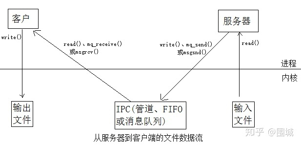
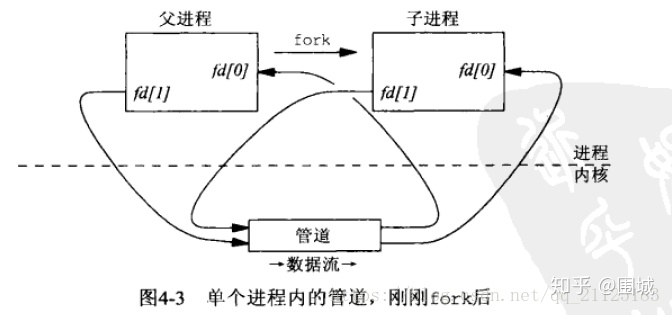
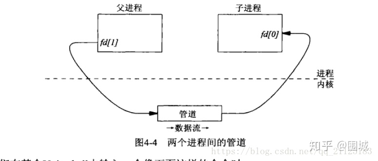

# 管道 pipe 和命名管道 FIFO

管道的特点：

1. 只能用于具有共同祖先的进程（具有亲缘关系的进程）之间通信，当然除了命名管道，命名管道有一个路径名与之关联，命名管道允许无亲缘关系的进程访问同一个 FIFO ；通常，一个管道由一个进程创建，然后该进程调用 fork，此后，父子进程之间就可应用该管道

2. 管道的进程间通信是基于字节流的

3. 管道是基于文件形式的，自带同步互斥机制，并且只能进行单向传输

4. 一般而言，进程退出，管道释放，所以管道的生命周期是随进程的



所有样式的 Unix 提供管道。它由pipe函数创建，提供一个单路（单向）数据流。


​		调用 pipe 函数时在内核中开辟一块缓冲区(称为管道)用于通信。

​		它有一个读端一个写端,然后通过 pipefd 参数传出给用户程序两个文件描述符 , pipefd[0] 指向管道的读端 , fpipefd[1] 指向管道的写端。所以管道在用户程序看起来就像一个打开的文件,通过 read(filedes[0]);或者write(filedes[1]);向这个文件读写数据其实是在读写内核缓冲区。


​		管道的经典用途是以下方式为两个不同进程（一个是父进程一个是子进程）提供进程间通信手段。首先，由一个进程）（它将成为父进程）创建一个管道后调用fork派生一个自身的副本，如下图所示：



​		父进程fork出子进程，⼦进程也有两个⽂件描述符指向同⼀管道。那么这样在父进程和子进程中都有两个文件描述符分别指向管道的写端和读端。父进程和子进程都能对管道进行读写操作。

​		父进程关闭在这个管道的读出端 fd[0] ，子进程关闭这个管道的写入端 fd[1] 。这就在父进程和子进程之间提供了一个单向数据流。父进程可以向管道中写入数据，子进程将管道中的数据读出。由于管道是利用环形队列实现的，数据从写端流入管道，从读端流出，这样就实现了进程间通信。




代码实现：

```c++
#include <stdio.h>
#include <unistd.h>
#include <string.h>

int main() {
    int fd[2];
    if (pipe(fd)) {
        perror("pipe");
        return 1;
    }
    // 实现父进程写，子进程读
    pid_t id = fork();
    if (id < 0) {
        perror("fork");
        return 2;
    } else if (id == 0) {// child
        close(fd[1]);

        char buf[128];
        int cnt = 0;
        while (cnt++ < 5) {
            ssize_t _s = read(fd[0], buf, sizeof(buf));
            if (_s > 0) {
                buf[_s] = '\0';
                ;
                printf("father say to child: %s\n", buf);
            } else if (_s == 0) {
                printf("father close write");
                break;
            } else {
                perror("read");
                break;
            }
        }
        close(fd[0]);
    } else {// father
        close(fd[0]);

        char *msg = "hello world";
        int cnt = 0;
        while (cnt++ < 5) {
            write(fd[1], msg, strlen(msg));
            sleep(1);
        }

        close(fd[1]);
    }

    return 0;
}
```


# 命名管道（FIFO）

​		管道没有名字，因此它们的最大的劣势就是只能用于有一个共同祖先进程的各个进程之间的通信。我们无法在无亲缘关系的两个进程之间创建一个管道并将它作为IPC通道（不考虑描述符的传递）。管道的缺点就是只能在有亲缘关系的进程间进行通信，针对这个缺陷，又提出来了命名管道（FIFO）的概念。

​		FIFO 不同于管道之处在于它提供一个路径名与之关联,以 FIFO 的**<u>文件形式存储于文件系统中</u>**。**命名管道是一个设备文件,因此,即使进程与创建 FIFO 的进程不存在亲缘关系,只要可以访问该路径,就能够通过 FIFO 相互通信。**

​		他是一个单向（半双工）的数据流。不同于管道的是，每个FIFO有一个路径与之相连，从而允许无亲缘关系之间的进程访问同一个FIFO。FIFO也称为有名管道（named pipe）。

代码实现：

server 向命令管道中发送数据：

```c++
#include <stdio.h>
#include <sys/types.h>
#include <sys/stat.h>
#include <fcntl.h>
#include <unistd.h>
#include <string.h>

int main()
{
    // 创建管道时需要在mode参数位置传S_IFIFO,表明创建的是命名管道
    int ret = mkfifo("./.fifo", S_IFIFO | 0644);
    if (ret < 0) {
        perror("mkfifo");
        return 1;
    }

    int fd = open("./.fifo", O_WRONLY);
    if (fd < 0) {
        perror("open");
        return 2;
    }

    int cnt = 0;
    char *msg = "hello world";
    while (cnt++ < 5) {
        write(fd, msg, strlen(msg));
        sleep(1);
    }

    close(fd);
    return 0;
}
```

client 向命令管道中接收数据

```c++
#include <stdio.h>
#include <sys/types.h>
#include <sys/stat.h>
#include <fcntl.h>
#include <unistd.h>
#include <string.h>

int main() {
    int fd = open("./.fifo", O_RDONLY);
    if (fd < 0) {
        perror("open");
        return 2;
    }

    int cnt = 0;
    char buf[128];
    while (cnt++ < 5) {
        ssize_t _s = read(fd, buf, sizeof(buf) - 1);
        if (_s > 0) {
            buf[_s] = '\0';
            ;
            printf("server say to client: %s\n", buf);
        } else if (_s == 0) {
            printf("server close write\n");
            break;
        } else {
            perror("read");
        }
        sleep(1);
    }

    close(fd);
    return 0;
}
```


