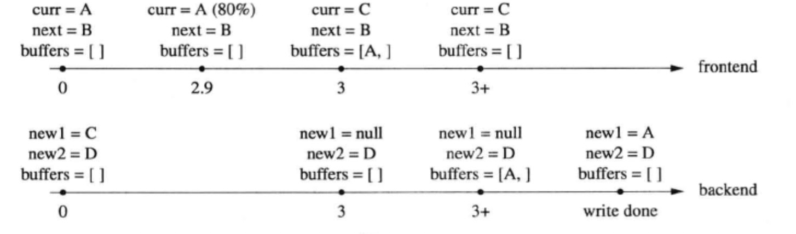
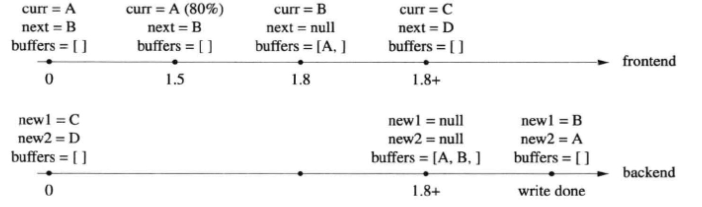
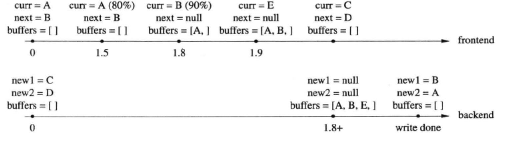
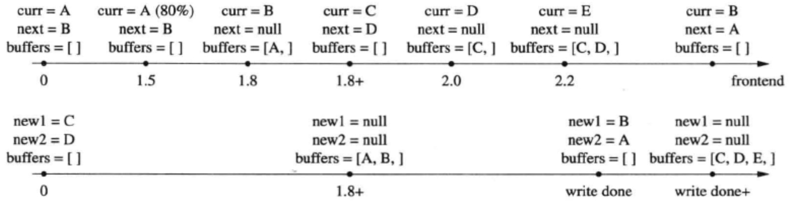
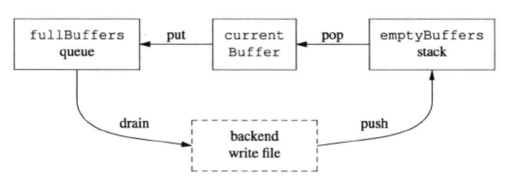

# 多线程异步日志

​		

[TOC]

​		多线程程序对日志库提出了新的需求 : 线程安全，即多个线程可以并发写日志,两个线程的日志消息不会出现交织。

​		线程安全不难办到，简单的办法是用一个全局 mutex 保护 IO , 或者每个线程单独写一个日志文件 ,  但这两种做法的高效性就堪忧了。前者会造成全部线程抢一个锁， 后者有可能让业务线程阻塞在写磁盘操作上。

​		解决办法不难想到，用一个背景线程负责收集日志消息，并写入日志文件 ， 其他业务线程只管往这个 “ 日志线程 ” 发送日志消息，这称为 “ 异步日志 " 。

​		我们需要一个 “ 队列 ” 来将日志前端的数据传送到后端(日志线程)，但这个 “ 队列 ” 不必是现成的 BlockingQueue< std::string >，因为不用每次产生一条日志消
息都通知 ( notify() ) 接收方。

​		<u>muduo 日志采用的**双缓冲 ( double buffering )** 技术，基本思路是准备两块 buffer ：A 和 B，前端负责往 buffer A 填数据(日志消息)，后端负责将 buffer B 的数据写入文件。当 buffer A 写满之后，交换 A 和 B，让后端将 buffer A 的数据写入文件，而前端则往 buffer B 填入新的日志消息，如此往复。</u>

​		用连个 buffer 的好处是新建日志消息的时候不必等待磁盘文件操作，也避免每条日志消息都触发（唤醒）后端日志线程。


## 关键代码

​		实际实现采用了四个缓冲区，这样可以进一步减少或避免日志前端的等待。数据结构如下：

```c++
typedef  boost::ptr_vector<LargeBuffer>  BufferVector ;
typedef  BufferVector::auto_type         BufferPtr ;

muduo::MutexLock    mutex_ ;
muduo::Condition    cond_ ;
BufferPtr           currentBuffer_ ; // 当前缓冲
BufferPtr           nextBuffer_ ;    // 预备缓冲
BufferVector        buffers_ ;       // 待写入文件的已填满的缓冲
```

​		其中 ,  LargeBuffer 类型是 FixedBuffer class template 的一份具体实现 ( instantiation ) , 其大小为 4 MB , 可以存至少 1000 条日志消息。

​		boost::ptr_vector< T > :: auto_type 类型类似 C++11 中的 std::unique_ptr , 具备移动语意 ( move semantics ) ,  而且能自动管理对象生命期。

​		mutex_  用于保护后面的四个数据成员。buffers_ 存放的是供后端写入的 buffer。

​		先来看发送方代码，即回调函数 output() 的实现。

```c++
28  void AsyncLogging::append(const char* logline, int len)
29	{
30		muduo::MutexLockGuard  lock(mutex_);
31		if (currentBuffer_ -> avail() -> len)
32		{ // 最常见的情况：缓冲区未满，在此处复制数据
33				currentBuffer_->append(logline, len);
34		}
35		else // 缓冲区已满，推送它，并找到下一个空闲缓冲区
36		{
37				buffers_.push_back(currentBuffer_.release());
38
39				if (nextBuffer_) // is there is one already, use it
40				{
41					currentBuffer_ = 
  							boost::ptr_container::move(nextBuffer_); 
  							// 移动，而非复制
42				}
43				else // allocate a new one
44				{	
45					currentBuffer_.reset (new LargeBuffer); // Rarely happens
46				}
47				currentBuffer_ ->append(logline, len);
48				cond_.notify();
49		}
50 }
```

​	前端在生成一条日志消息的时候会调用 AsyncLogging :: append() 。在这个函数中 ,  如果当前缓冲( currentBuffer_ )剩余的空间足够大 ( 31 行) , 则会直接把日志消息拷贝 ( 追加 ) 到当前缓冲中 ( 33行 )  , 这是最常见的情况。这里拷贝一条日志消息并不会带来多大开销。前后端代码的其余部分都没有拷贝，而是简单的指针交换。

​		否则，说明当前缓冲已经写满，就把它送入 ( 移入 )  buffers_  ( 37 行 ) , 并试图把预备好的另一块缓冲 ( nextBuffer_ ) 移用 ( move ) 为当前缓冲 ( 39行 ~ 42行 ) ，然后追加日志消息并通知 ( 唤醒 ) 后端开始写入日志数据 ( 47行 ~ 48行 )。以上两种情况在临界区之内都没有耗时的操作，运行时间为常数。

​		如果前端写入速度太快，一下子把两块缓冲都用完了，那么只好分配一块新的buffer，作为当前缓冲 ( 43行 ~ 46行 ) ,  这是极少发生的情况。

​		再来看接收方 ( 后端 ) 实现，这里只给出了最关键的临界区内的代码 ( 59行 ~ 72行 ) ，其他琐事请见源文件。

```c++
51	void AsyncLogging::threadFunc()
52	{
53		BufferPtr newBuffer1 (new LargeBuffer);
54		BufferPtr newBuffer2 (new LargeBuffer);
55		BufferVector buffersToWrite; // reserve() 从略
56		while (running_ )
57		{
58				// swap out what need to be written， keep CS short
59				{
60						muduo::MutexLockGuard  lock(mutex_ );
61						if (buffers.empty()) // unusual usage!
62						{
63								cond_.waitForSeconds(flushInterval_);
64						}
65						buffers_.push_back(currentBuffer_.release()); 								// 移动，而非复制
66						currentBuffer_ = 
  									boost::ptr_container::move(newBuffer1); 
  						// 移动，而非复制
67						buffersToWrite.swap(buffers_ ); 
  						// 内部指针交换，而非复制
68						if (!nextBuffer_)
69						{
70								nextBuffer_ = 
  										boost::ptr_container::move (newBuffer2);
											//移动，而非复制
71						}
72				}
73				// output buffersToWrite to file
74				// re-fill newBuffer1 and newBuffer2
75		}
76		// flush output
77	}
```

​		首先准备好两块空闲的 buffer , 以备在临界区内交换 ( 53行、54行)。 在临界区内，等待条件触发( 61行 ~ 64行)，这里的条件有两个：其一是超时，其二是前端写满了一个或多个 buffer 。注意这里是非常规的 **condition variable** 用法，它没有使用 while 循环，而且等待时间有上限。

​		当 “ 条件 ” 满足时，先将当前缓冲 ( currentBuffer_ ) 移入 buffers_ ( 65行 )， 并立刻将空闲的 newBuffer1 移为当前缓冲 ( 66行 )。注意这整段代码位于临界区之内，因此不会有任何 race condition 。接下来将 buffers_ 与 buffersToWrite 交换 ( 67行 )，后面的代码可以在临界区之外安全地访问 buffersToWrite，将其中的日志数据写入文件 (  73行 )。

​		临界区里最后干的一件事情是用 newBuffer2 替换 nextBuffer_ ( 68行~71行)， 这样前端始终有一个预备 buffer 可供调配。nextBuffer_ 可以减少前端临界区分配内存的概率，缩短前端临界区长度。注意到后端临界区内也没有耗时的操作，运行时间为常数。

​		74 行会将 buffersToWrite 内的 buffer 重新填充 newBuffer1 和 newBuffer2 ，这样下一次执行的时候还有两个空闲 buffer 可用于替换前端的当前缓冲和预备缓冲。最后，这四个缓冲在程序启动的时候会全部填充为 0，这样可以避免程序热身时 pagefault 引发性能不稳定。


## 运行图示

​		以下再用图表展示前端和后端的具体交互情况。一开始先分配好四个缓冲区A、B、C、D,前端和后端各持有其中两个。前端和后端各有一个缓冲区数组，初始时都是空的。

#### 第一种情况

​		第一种情况是前端写日志的频度不高，后端 3 秒超时后将 “ 当前缓冲 currentBuffer_ ” 写入文件，见下图(图中变量名为简写，下同)。



​		在第 2.9 秒的时候，currentBuffer_ 使用了 80% ，在第 3 秒的时候后端线程醒过来，先把 currentBuffer_ 送入 buffers_ ( 65行 )，再把 newBuffer1 移用为currentBuffer_ ( 66行 )。 随后第 3+ 秒，交换 buffers_ 和 buffersToWrite ( 67行 )，离开临界区，后端开始将 buffer A 写入文件。写完 ( write done ) 之后再把 newBuffer1 重新填上，等待下次 cond_.waitForSeconds() 返回。

​		后面在画图时将有所简化，不再画出 buffers_ 和 buffersToWrite 交换的步骤。


#### 第二种情况

​		第二种情况，在 3 秒超时之前已经写满了当前缓冲，于是唤醒后端线程开始写入文件，见下图。



​		在第 1.5 秒的时候，currentBuffer_ 使用了 80% ；第 1.8 秒， currentBuffer_ 写满，于是将当前缓冲送入 buffers_ ( 37行 )，并将 nextBuffe_ 移用为当前缓冲 ( 39行 ~ 42行 ) ，然后唤醒后端线程开始写入。

​		当后端线程唤醒之后 ( 第 1.8+ 秒)，先将 currentBuffer_ 送入 buffers_ ( 65行 ),再把 newBuffer1 移用为 currentBuffer_ ( 66行 )，然后交换 buffers_ 和 buffersToWrite ( 67行 )，最后用 newBuffer2 替换 nextBuffer_ ( 68行 ~ 71行 )，即保证前端有两个空缓冲可用。离开临界区之后，将 buffersToWrite 中的缓冲区 A 和 B 写入文件，写完之后重新填充 newBuffer1 和 newBuffer2 ，完成一次循环。


再来看看前端需要分配新 buffer 的两种情况。


#### 第三种情况

​		第三种情况，前端在短时间内密集写入日志消息，用完了两个缓冲，并重新分配了一块新的缓冲，见下图。



​		在第 1.8 秒的时候，缓冲 A 已经写满，缓冲 B 也接近写满，并且已经 notify() 了后端线程，但是出于种种原因，后端线程并没有立刻开始工作。到了第 1.9 秒，缓冲 B 也已经写满，前端线程新分配了缓冲 E 。

​		到了第 1.8+ 秒，后端线程终于获得控制权，将 C、D 两块缓冲交给前端，并开始将 A、B、E 依次写入文件。一段时间之后，完成写入操作，用 A、B 重新填充那两块空闲缓冲。注意这里有意用 A 和 B 来填充 newBuffer1/2，而释放了缓冲 E，这是因为使用 A 和 B 不会造成 page fault。


#### 第四种情况

​		第四种情况，文件写入速度较慢，导致前端耗尽了两个缓冲，并分配了新缓冲，见下图。



​		前 1.8+ 秒的场景和前面 “ 第二种情况 ” 相同，前端写满了一个缓冲，唤醒后端线程开始写入文件。之后，后端花了较长时间 ( 大半秒 ) 才将数据写完。这期间前端又用完了两个缓冲，并分配了一个新的缓冲，这期间前端的 notify() 已经丢失。

​		当后端写完 ( write done ) 后，发现 buffers_ 不为空 ( 61行 )，立刻进入下一循环。即替换前端的两个缓冲，并开始一次写入 C、D、E。假定前端在此期间产生的日志较少，请读者补全后续的情况。


## 改进措施

​		前面我们一共准备了四块缓冲，应该足以应付日常的需求。如果需要进一步增加 buffer 数目，可以改用下面的数据结构。

```c++
BufferPtr		    currentBuffer_;	 // 当前缓冲
BufferVector    emptyBuffers_;   // 空闲缓冲
BufferVector    fullBuffers_;    // 已写满的缓冲
```

​		初始化时在 emptyBuffers_ 中放入足够多空闲 buffer，这样前端几乎不会遇到需要在临界区内新分配 buffer 的情况，这是一种空间换时间的做法。为了避免短时突发写大量日志造成新分配的 buffer 占用过多内存，后端代码应该保证emptyBuffers_ 和 fullBuffers_ 的长度之和不超过某个定值。buffer 在前端和后端之间流动，形成一个循环，如下图所示。




## 如果日志消息堆积怎么办

​		万一前端陷入死循环，拼命发送日志消息，超过后端的处理 ( 输出 ) 能力，会导致什么后果 ? 对于同步日志来说，这不是问题，因为阻塞 IO 自然就限制了前端的写入速度，起到了节流阀 ( throttling ) 的作用。但是对于异步日志来说，这就是典型的生产速度高于消费速度问题，会造成数据在内存中堆积，严重时引发性能问题 ( 可用内存不足 ) 或程序崩溃 ( 分配内存失败 ) 。 

​		muduo 日志库处理日志堆积的方法很简单：直接丢掉多余的日志 buffer ，以腾出内存，见 muduo/base/AsyncLogging.c 第 87 ~ 96 行代码。这样可以防止日志库本身引起程序故障，是一种自我保护措施。将来或许可以加上网络报警功能，通知人工介入，以尽快修复故障。