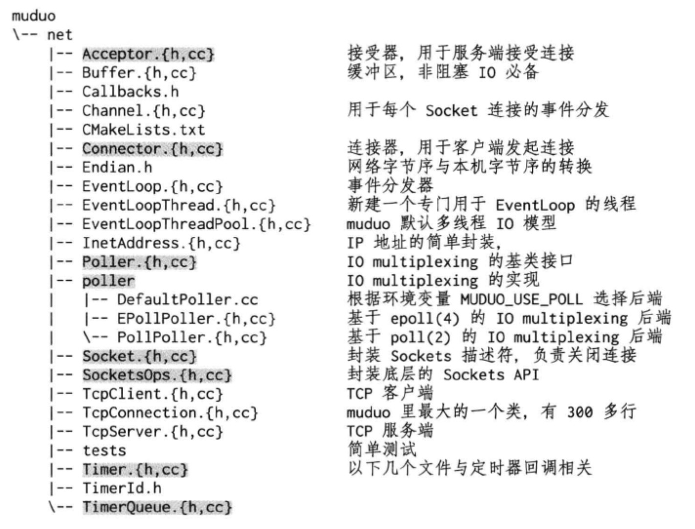

# muduo 库简介

[TOC]

## 目录结构

​		muduo 的目录结构如下。

### 基础库

​		muduo/base 目录是一些基础库， 都是用户可见的类，内容包括 :

### 网络核心库

​				muduo 是基于 Reactor 模式的网络库，其核心是个事件循环 EventLoop，用于响应计时器和 IO 事件。muduo 采用基于对象 ( object-based ) 而非面向对象 (  object-oriented ) 的设计风格，其事件回调接口多以 boost: : function + boost::bind 表达，用户在使用 muduo 的时候不需要继承其中的 class 。

### 网络附属库

​		网络库有一些附属模块，它们不是核心内容，在使用的时候需要链接相应的库，例如  -1muduo_http、-1muduo_inspect 等等。HttpServer 和 Inspector 暴露出一个 http 界面，用于监控进程的状态，类似于 Java JMX (S9.5)。

​		附属模块位于muduo/net/{http,inspect,protorpc}等处。

​		muduo 简化类图：

## 线程模型

​		muduo 的线程模型符合 one loop per thread + thread pool 模型。每个线程最多有一个 EventLoop，每个 TcpConnection 必须归某个 EventLoop 管理，所有的 IO 会转移到这个线程。换句话说，一个 file descriptor 只能由一个线程读写。TcpConnection 所在的线程由其所属的 EventLoop 决定，这样我们可以很方便地把不同的 TCP 连接放到不同的线程去，也可以把一些 TCP 连接放到一个线程里。TcpConnection 和 EventLoop 是线程安全的，可以跨线程调用。

​		TcpServer 直接支持多线程，它有两种模式:

- 单线程，accept(2) 与 TcpConnection 用同一个线程做 IO 。
- 多线程，accept(2) 与 EventLoop 在同一个线程，另外创建一个 EventLoop-ThreadPool，新到的连接会按 round -robin 方式分配到线程池中。

后面还会以sudoku服务器为例再次介绍 muduo 的多线程模型。

