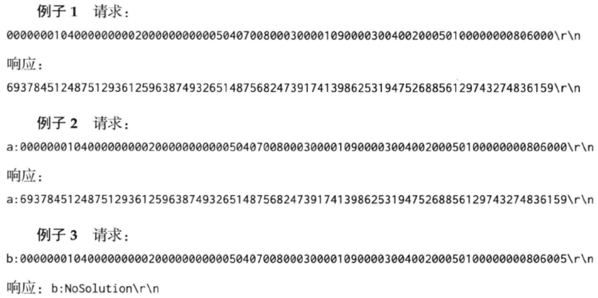

# 详解 muduo 多线程模型

​	

[TOC]

​		本节以一个 Sudoku  Solver 为例，回顾了并发网络服务程序的多种设计方案，并介绍了使用 muduo 网络库编写多线程服务器的两种最常用手法。本节代码参见: examples/sudoku/。

## 数独求解服务器

​		假设有这么一个网络编程任务：写一个求解数独的程序( Sudoku Solver)，并把它做成一个网络服务。


### 协议

​		一个简单的以 \r\n 分隔的文本行协议，使用 TCP 长连接，客户端在不需要服务时主动断开连接。

请求：[id:]<81digits>lrn
响应：[id:]<81digits>Irln
或者：[id:]NoSolutionlrln

​		其中 **[id:]** 表示可选的 id。用于区分先后的请求，以支持 Parallel Pipelining，响应中会回显请求中的 id。

​		<81digits> 是 Sudoku 的棋盘，9x9 个数字，从左上角到右下角按行扫描，未知数字以 0 表示。如果 Sudoku 有解，那么响应是填满数字的棋盘；如果无解，则返回 NoSolution。



​		基于这个文本协议，我们可以用 telnet 模拟客户端来测试 Sudoku Solver，不需要单独编写 Sudoku Client 。Sudoku Solver 的默认端口号是 9981，因为它有9x9 = 81个格子。

### 基本实现

​		假设我们已经有了一个数独求解函数，它原型如下：

```c++
string solveSudoku(const string& puzzle);
```

​		函数的输入是上文的 “ <81digits> ”， 输出是 “ <81digits> " 或 “ NoSolution ”。这个函数是个 pure function，同时也是线程安全的。

​		有了这个函数，我们以上节 “ echo 服务的实现 ” 中出现的 EchoServer 为蓝本，稍加修改就能得到 SudokuServer 。这里只列出最关键的 onMessage() 函数，完整的代码见 examples/sudoku/server basicc。

​		onMessage() 的主要功能是处理协议格式，并调用 solveSudoku() 求解问题。这个函数应该能正确处理 TCP 分包。

```c++
const int KCELLS = 81; // 81个格子
void onMessage(const TcpConnectionPtr &conn, 
               Buffer *buf, Timestamp)
{
  LOG_DEBUG << conn->name();
  size_t len = buf->readableBytes();
  while (len >= KCELLS + 2) { // 反复读取数据，2为回车换行字符
      const char *crlf = buf->findCRLF();

      if (cr1f) { // 如果找到了一条完整的请求
          string request(buf->peek(), crlf); // 取出请求
          string id;
          buf->retrieveUntil(crlf + 2); // retrieve 已读取的数据
          string::iterator colon = 
            				find(request.begin(), request.end()，':');
          if (colon != request.end()) { // 如果找到了id部分
              id.assign(request.begin()，colon);
              request.erase(request.begin(), colon + 1);
          }
        
					// 请求的长度合法
          if (request.size() == 
              		implicit_cast<size_t>(KCELLS)) { 
            	// 求解数独，然后发回响应
              string result = solveSudoku(request); 
            
              if (id.empty()) {
                  conn->send(result + "\r\n");
              } else {
                  conn->send(id + ":" + result + "\r\n");
              }
           } else { // 非法请求，断开连接
              conn->send("Bad Request!\r\n");
              conn->shutdown();
          }
      } else {//请求不完整，退出消息处理函数
          break;
      }
  }
}
```

​		应该是一个并发服务器，可以同时服务多个客户连接。但是它是单线程的，无法发挥多核硬件的能力。

​		sudoku应该是一个计算密集型的任务，其瓶颈在 CPU。为了充分利用 CPU 资源，一个**<u>简单的方法就是在一台机器上部署多个进程，每个进程占用不同的端口</u>**。

​		能不能在一个端口上提供服务，并且又能发挥多核处理器的计算能力呢？当然可以办法不止一种！


## 常见的并发网络服务程序设计方案


