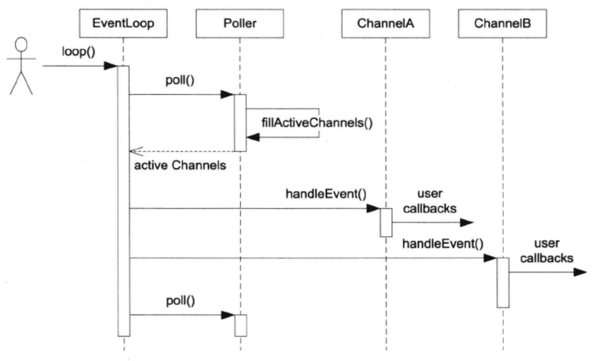

# Reactor 的关键结构

[TOC]

​		本节讲 Reactor 最核心的事件分发机制，即将 IO multiplexing 拿到的 IO 事件分发给各个文件描述符( fd)的事件处理函数。

## Channel class

​		**Channel class** 的功能有一点类似 Java NIO 的 SelectableChannel 和SelectionKey 的组合。每个 Channel 对象自始至终只属于一个 EventLoop，因此每个 Channel 对象都只属于某一个 IO 线程。

​		**<u>每个 Channel 对象自始至终只负责一个文件描述符( fd ) 的 IO 事件分发</u>**，但它并不拥有这个 fd，也不会在析构的时候关闭这个 fd 。

​		Channel 会把不同的 IO 事件分发为不同的回调，例如 ReadCallback、WriteCallback 等， 而且 “ 回调 ” 用 boost::function 表示，用户无须继承 Channel，Channel 不是基类。

​		muduo 用户一般不直接使用 Channel，而会使用更上层的封装，如 TcpConnectionChannel 的生命期由其 ownerclass 负责管理，它一般是其他 class 的直接或间接成员。以下是 Channel 的 public interface:

```c++
class EventLoop;
///
/// A selectable I/0 channel .
///
/// This class doesn't own the file descriptor .
/// The file descriptor could be a socket ,
/// an eventfd , a timerfd, or a si gnalfd

class Channel : boost::noncopyable
{
public:
	typedef boost::function<void()> EventCallback;
  
	Channel (EventLoop* loop, int fd) ;
  
	void handleEvent();
	void setReadCallback( const EventCallback& cb)
  { readCallback_ = cb; }
	void setWri teCallback( const EventCallback& cb)
  { writeCallback_ = cb; }
	void setErrorCallback(const EventCallback& cb)
  { errorCallback_ = cb; }
  
	int fd() const { return fd_; }
	int events() const { return events_ ; }
	void set_revents(int revt) { revents_ = revt; }
	bool isNoneEvent() const { return events_ == kNoneEvent; }
  
	void enableReading() { events_ |= kReadEvent; update(); }
	// void enableWriting() { events_ |= kWriteEvent; update(); }
	// void disableWriting() { events_ &= ~kWriteEvent; update(); }
	// void disableAll() { events_ = kNoneEvent; update(); }
  
		// for Poller
	int index() { return index_ ; }
	void set_index(int idx) { index_ = idx; }
                            
	EventLoop* ownerLoop() { return 1oop_; }

```

​		有些成员函数是内部使用的，用户一般只用 set*Callback() 和 enableReading() 这几个函数。其中有些函数目前还用不到，因此暂时注释起来。Channel 的成员函数都只能在 IO 线程调用，因此更新数据成员都不必加锁。

​		以下是 Channel class 的数据成员。其中 events_ 是它关心的 IO 事件，由用户设置；revents_ 是目前活动的事件，由 EventLoop/Poller 设置；这两个字段都是bit pattern，它们的名字来自 pol1(2) 的 struct pollfd。

```c++
private :
	void update();
	
	static const int kNoneEvent ;
	static const int kReadEvent ;
	static const int kWriteEvent;
	
	EventLoop* 	loop_ ;
	const int 	fd_;
	int					events_ ;
	int					revents_ ;
	int					index_ ; // used by Poller.
	
	EventCallback readCallback_ ;
	EventCallback writeCallback_ ;
	EventCallback errorCallback_ ;
];
```

​		Channel::update() 会调用 EventLoop::updateChannel()，后者会转而调用 Poller: : updateChannel()。由于 Channel.h 没有包含 EventLoop.h， 因此 Channel::update() 必须定义在 Channel.cc 中。

​		Channel: : handleEvent() 是 Channel 的核心， 它由 EventLoop::loop() 调用， 它的功能是根据 revents_ 的值分别调用不同的用户回调。这个函数以后还会扩充。

```c++
void Channel::handleEvent()
{
	if (revents_ & POLLNVAL) {
		LOG_WARN << "Channel::handle_event() POLLNVAL";
  }
  
	if (revents_ & (POLLERRI | POLLNVAL)) {
		if (errorCallback_) errorCallback_();
  }
	if (revents_ & (POLLINI | POLLPRII | POLLRDHUP)) {
		if (readCallback_ .) readCallback_ .() ;
  }
	if (revents_ & POLLOUT) {
		if (writeCallback_) writeCallback_();
  }
}
```

## Poller class

​		Poller class 是 IO multiplexing(复用) 的封装。它现在是个具体类，而在 muduo 中是个抽象基类，因为 muduo 同时支持 pol1(2) 和 epoll(4) 两种 IO multiplexing 机制。Poller 是 EventLoop 的间接成员，只供其 owner EventLoop 在 IO 线程调用，因此无须加锁。其生命期与 EventLoop 相等。Poller 并不拥有 Channel， Channel 在析构之前必须自已 unregister ( EventLoop: :removeChannel() )，避免空悬指针。

```c++
struct pollfd;

namespace muduo
{
class Channel ;
  
///
/// IO Multiplexing with poll(2).
///
/// This class doesn't own the Channel objects.

class Poller : boost::noncopyable
{
public :
	typedef std::vector <Channel*> 	 Channellist;
  	
	Poller(EventLoop* loop);
	~Poller();
  
	/// 轮询 I/O 事件。
	/// 必须在 loop 线程中调用。
	Timestamp poll(int timeoutMs, Channellist* activeChannels);
  
	/// 更改感兴趣的 I/O 事件。
	/// 必须在 loop 线程中调用。
	void updateChannel (Channel* channel);
  
	void assertInLoopThread() {
  	ownerLoop_->assertInLoopThread(); 
  }
```

​		Poller 供 EventLoop 调用的函数目前有两个，poll() 和 updateChannel() ，Poller 暂时没有定义 removeChannel() 成员函数，因为前几节还用不到它。

​		以下是 Poller class 的数据成员。其中 ChannelMap 是从 fd 到 Channel* 的映射。Poller::poll() 不会在每次调用 poll(2) 之前临时构造 pollfd 数组，而是把它缓存起来( pollfds_  )。

```c++
private :
	void fillActiveChannels(int numEvents,
						ChannelList* activeChannels) const ;
	
	typedef std::vector<struct pollfd> PollFdList;
	typedef std::map<int, Channel*> ChannelMap;

	EventLoop* ownerLoop_ ;
	PollFdList pollfds_ ;
	ChannelMap channels_ ;
};
```

​		Poller 的构造函数和析构函数都很简单，因其成员都是标准库容器。

```c++
Poller: :Poller (EventLoop* loop)
		:ownerLoop_ (loop)
{
}

Poller: :~Poller( )
{
}
```

​		Poller::poll() 是 Poller 的核心功能，它调用 pol1(2) 获得当前活动的 IO 事件，然后填充调用方传入的 activeChannels，并返回 poll(2) return 的时刻。这里我们直接把 vector<struct pollfd> pollfds_ 作为参数传给 poll(2) ，因为 C++ 标准保证 std: :vector 的元素排列跟数组一样。

​		& * pollfds_ .begin() 是获得元素的首地址，这个表达式的类型为 pollfds_ * ，符合 poll(2) 的要求。

```c++
Timestamp Poller::poll(int timeoutMs, ChannelList activeChannels)
{
	// XXX pollfds_ shouldn't change
	int numEvents = ::poll(&*pollfds_.begin(), 
                         pollfds_.size(), timeoutMs);
	Timestamp now(Timestamp::now());
  
	if (numEvents > 0) {
		LOG_TRACE << numEvents << "events happended";
		fillActiveChannels(numEvents, activeChannels);
  } else if (numEvents == 0) {
		LOG_TRACE << "nothing happended";
  } else {
		LOG_ SYSERR << "Poller: :poll()";
  }
	return now;
}
```


## EventLoop 的改动

​		EventLoop::1oop() 有了真正的工作内容，它调用 Poller::poll() 获得当前活动事件的 Channel 列表，然后依次调用每个 Channel 的 handleEvent() 函数。

```c++
void EventLoop::loop()
{
	assert(!looping_);
	assertInLoopThread() ;
	looping_ = true ;
	quit_ = false;
  
	while (!quit_) {
		activeChannels_.clear();
		poller_ ->poll (kPol1TimeMs, &activeChannels_) ;
		for(ChannelList::iterator it = activeChannels_.begin() ;
        		it != activeChannels_.end(); ++it)
    {
      	(*it)->handleEvent() ;
    }
  }
  LOG_TRACE << "EventLoop " << this << " stop looping";
	looping_ = false;
}
```

​		以上几个 class 尽管简陋，却构成了 Reactor 模式的核心内容。时序图见下图。



​		我们现在可以终止事件循环，只要将 quit_ 设为 true 即可，但是 quit() 不是立刻发生的，它会在 EventLoop::1oop() 下一次检查 while (!quit_) 的时候起效

​		如果在非当前 IO 线程调用 quit()，延迟可以长达数秒，将来我们可以唤醒EventLoop 以缩小延时。但是 quit() 不是中断或 signal，而是设标志，如果EventLoop::1oop() 正阻塞在某个调用中，quit() 不会立刻生效。

```c++
void EventLoop::quit()
{
	quit_ = true ;
	// wakeup();
}
```

​		EventLoop::updateChannel() 在检查断言之后调用 Poller: : updateChannel()，EventLoop 不关心 Poller 是如何管理 Channel 列表的。

```c++
void EventLoop::updateChannel (Channel* channel )
{
	assert (channel->ownerLoop() == this);
	assertInLoopThread() ;
	poller_->updateChannel(channel) ;
}
```

​				有了以上的 EventLoop、Poller、 Channel， 我们写个小程序简单地测试一下功能。s01/test3.cc 用 timerfd 实现了一个单次触发的定时器，为S8.2的内容打下基础。这个程序利用 Channel 将 timerfd 的 readable 事件转发给 timerout() 函数。

```c++
#include <sys/timerfd.h>

muduo::EventLoop* g_loop;

void timeout()
{
	printf("Timeout!\n");
	g_loop->quit();
}

int main()
{
  muduo::EventLoop loop;
	g_loop = &loop; 
  
	int timerfd = ::timerfd_create(CLOCK_MONOTONIC, 
                                 TFD_ NONBLOCK | TFD_CLOEXEC);
	muduo::Channel channel(&loop, timerfd) ;
	channel.setReadCallback(timeout) ;
	channel.enableReading();
  
	struct itimerspec howlong;
	bzero(&howlong, sizeof howlong) ;
	howlong.it_value.tv_sec = 5;
	::timerfd_settime(timerfd, 0, &howlong, NULL);
  
	loop.loop();
	::close(timerfd) ;
}
```

​		由于 poll(2) 是 level trigger，在 timeout() 中应该 read()  timefd，否则下次会立刻触发。在现阶段采用 level trigger 的好处之一是可以通过 strace 命令直观地看到每次 pol1(2) 的参数列表，容易检查程序的行为。


