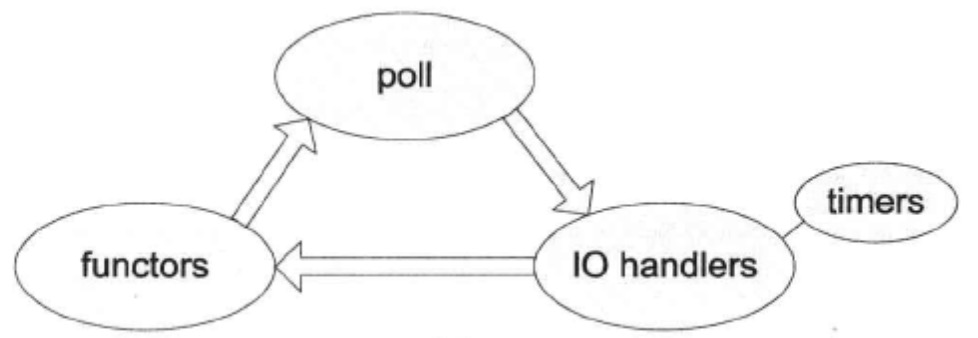

# 实现 tcp 网络库

​		

[TOC]

​		从本节开始我们用刚刚实现的 Reactor 事件逐步实现一个非阻塞的 TCP 网络编程库。

​		从 poll(2) 返回到再次调用 poll(2) 阻塞称为一次事件循环。

​		下图有助于理解一次事件循环中各种回调发生的顺序。



​		传统的 Reactor 实现一般会把 timers 做成循环中单独的一步， 而 muduo 把它和 IO handlers 等同视之，这是使用 timerfd 的附带效应。将来有必要时也可以在调用 IO handlers 之前或之后处理 timers 。


## Acceptor class

​		先定义 Acceptor class，用于 accept(2) 新 TCP 连接，并通过回调通知使用者。它是内部 class，供 TcpServer 使用，生命期由后者控制。Acceptor 的接口如下:

```c++
class Acceptor : boost::noncopyable
{
public:
	typedef boost::function<void (int sockfd ,
									const InetAddress&)> NewConnectionCallback;
	Acceptor (EventLoop* loop, const InetAddress& listenAddr);
  void setNewConnectionCallback(const NewConnectionCallback& cb)
  { newConnectionCallback_ = cb; }
  
	bool listenning() const { return listenning_; ]
	void listen();
```

​		Acceptor 的数据成员包括 Socket、Channel 等。其中 Socket 是一个 RAII handle，封装了 socket 文件描述符的生命期。Acceptor 的 socket 是 listening socket，即 server socket。Channel 用于观察此 socket 上的 readable 事件，并回调 Acceptor::handleRead()，后者会调用 accept(2) 来接受新连接，并回调用户 callback。

```c++
private :
	void handleRead() ;
	EventLoop* loop_ ;
	Socket acceptSocket_ ;
	Channel acceptChannel_ ;
	NewConnectionCallback newConnectionCallback_ ;
	bool listenning_ ;
};
```

​		Acceptor 的构造函数和 Acceptor::listen() 成员函数执行创建 TCP 服务端的传统步骤，即调用 socket(2)、bind(2)、 listen(2)  等 Sockets API，其中任何一个步骤出错都会造成程序终止，因此这里看不到错误处理。

```c++
Acceptor::Acceptor(EventLoop* loop, 
                    const InetAddress& listenAddr)
		:loop_(loop),
		 acceptSocket_(sockets::createNonblockingOrDie()),
		 acceptChannel_(loop, acceptSocket_.fd()),
		 listenning_(false)
{
		 acceptSocket_.setReuseAddr(true);
		 acceptSocket_.bindAddress(listenAddr);
		 acceptChannel_.setReadCallback(
					boost::bind(&Acceptor::handleRead, this));
}

void Acceptor::listen()
{
	loop_->assertInLoopThread();
	listenning_ = true;
	acceptSocket_.listen() ;
	acceptChannel_.enableReading() ;
}
```

​		Acceptor 的接口中用到了 InetAddress class，这是对 struct sockaddr_in 的简单封装，能自动转换字节序，代码从略。InetAddress 具备值语义，是可以拷贝的。

​		Acceptor 的构造函数用到 createNonblockingOrDie() 来创建非阻塞的 socket，现在的 Linux 可以一步完成，代码如下。

```c++
int sockets::createNonblockingOrDie()
{
	int sockfd = ::socket(AF_INET,
								SOCK_STREAM | SOCK_NONBLOCKI | SOCK_CLOEXEC,
								IPPROTO_TCP);
	if (sockfd < 0) {
		LOG_SYSFATAL << "sockets::createNonblockingOrDie" ;
  }
	return sockfd;
}
```

​		Acceptor::listen() 的最后一步让 acceptChannel_ 在 socket 可读的时候调用 Acceptor: :handleRead()，后者会接受( accept(2) )并回调 newConnectionCallback_。这里直接把 socket fd 传给 callback，这种传递 int 句柄的做法不够理想，在 C++11 中可以先创建 Socket 对象，再用移动语义把 Socket 对象 std: :move() 给回调函数，确保资源的安全释放。

```c++
void Acceptor::handleRead()
{
	loop_->assertInLoopThread() ;
	InetAddress peerAddr(0) ;
	//FIXME loop until no more
	int connfd = acceptSocket_.accept (&peerAddr) ;
	if (connfd >= 0) {
		if (newConnectionCallback_) {
			newConnectionCallback_(connfd, peerAddr);
    } else {
			sockets::close(connfd) ;
		}
  }
  
}
```

​		还有一个改进措施，在拿到大于或等于 0 的 connfd 之后，非阻塞地 poll(2) 一下，看看 fd 是否可读写。正常情况下 poll(2) 会返回 writable，表明 connfd 可用。如果 poll(2) 返回错误，表明 connfd 有问题，应该立刻关闭连接。

​		Acceptor::handleRead() 的策略很简单，每次 accept(2) 一个 socket 。另外还有两种实现策略，一是每次循环 accept(2) ，直至没有新的连接到达；二是每次尝试 accept(2) N 个新连接，N 的值一般是 10 。后面这两种做法适合短连接服务，而 muduo 是为长连接服务优化的，因此这里用了最简单的办法。这三种策略的对比见论文《accept ()able Strategies for Improving Web Server Performance》。

​		利用 Linux 新增的系统调用可以直接 accept(2) 一步得到非阻塞的 socket 。

```c++
int sockets::accept(int sockfd, struct sockaddr_ in* addr )
{
	socklen_t addrlen = sizeof *addr;
#if VALGRIND
	int connfd = ::accept(sockfd, sockaddr_cast(addr), 
                        &addrlen) ;
	setNonBlockAndCloseOnExec(connfd) ;
#else
	int connfd = ::accept4(sockfd, sockaddr_cast(addr) ,
										&addrlen, SOCK_NONBLOCKI | SOCK_CLOEXEC);
#endif
	if (connfd < 0)
  {
		int savedErrno = errno;
		LOG_ SYSERR << "Socket: : accept";
		switch ( savedErrno)
    {
```

​		对于暂时错误，如 EAGAIN、EINTR等等，可以先忽略。对于致命错误，只能终止程序。

```c++
		}
	}
	return connfd;
}
```


