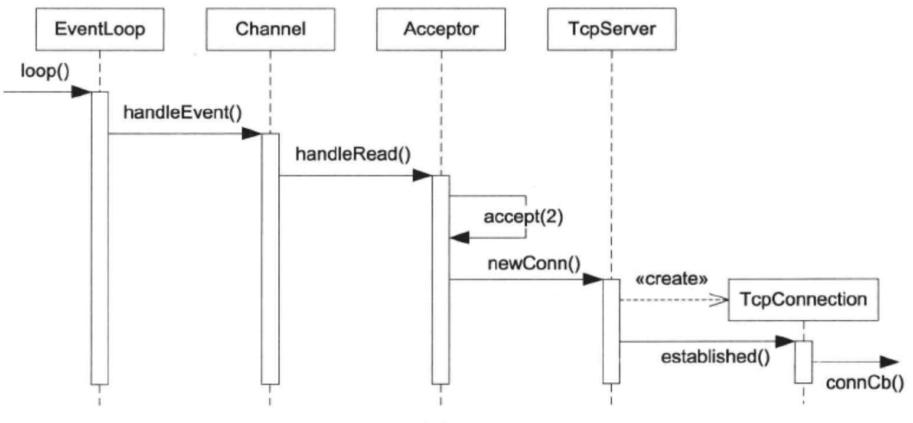

[TOC]

## TcpServer 接受新连接

​		TcpServer 新建连接的相关函数调用顺序见下图(有的函数名只是简写，省略了poll调用)。

​		其中 Channel::handleEvent() 的触发条件是 listening socket 可读，表明有新的连接到达。TcpServer 会为新链接创建对应的 TcpConnevtion 对象。




### TcpServer class

​		**<u>TcpServer class 的功能是管理 accept(2) 获得的 TcpConnection</u>** 。TcpServer  是供用户直接使用的，生命期由用户控制。TcpServer 的接口如下，用户只需要设置好 callback，再调用 start() 即可。


​		TcpServer 内部使用 Acceptor 来获得新连接的 socket fd。它保存用户提供的ConnectionCallback 和 MessageCallback，在新建 TcpConnection 的时候会原样传给后者。

​		TcpServer 持有目前存活的 TcpConnection 的 shared_ ptr (定义为TcpConnectionPtr )，因为 TcpConnection 对象的生命期是模糊的，用户也可以持有 TcpConnectionPtr。


​		每个 TcpConnection 对象有一个名字，这个名字是由其所属的 TcpServer 在创建 TcpConnection 对象时生成，名字是 ConnectionMap 的 key 。

​		在新连接到达时，Acceptor 会回调 newConnection()，后者会创建TcpConnection 对象 conn，把它加入 ConnectionMap，设置好 callback，再调用conn->connectEstablished() ，其中会回调用户提供的 ConnectionCallback 。代码如下。


​		注意 muduo 尽量让依赖是单向的，TcpServer 会用到 Acceptor，但 Acceptor 并并不知道 TcpServer 的存在 。 TcpServer 会创建 TcpConnection，但TcpConnection 并不知道 TcpServer 的存在。


### TcpConnection class

​		TcpConnection 是 muduo 里唯一默认使用 shared_ptr 来管理的 class ，也是唯一继承 enable_shared_from_this 的 class，这源于其模糊的生命期。

```c++
class TcpConnection;
typedef boost::shared_ptr<TcpConnection> TcpConnectionPtr ;

class TcpConnection : boost::noncopyable,
					public boost::enable_shared_from_this<TcpConnection>
{
public:
            
private:
	enum StateE { kConnecting, kConnected, };
            
	void setState(StateE s) { state_ = s; }
	void handleRead();
            
	EventLoop* loop_ ;
	std::string name_ ;
	StateE state_ ; // FIXME: use atomic variable
	// we don't expose those classes to client.
	boost::scoped_ptr<Socket> socket_ ;
	boost::scoped_ptr<Channel> channel_ ;
	InetAddress localAddr_ ;
	InetAddress peerAddr_ ;
	ConnectionCallback connectionCallback_ ;
	MessageCallback messageCallback_ ;
};
```

​		首先看数据成员：
​				目前 TcpConnection 的状态只有两个，kConnecting 和 kConnected，后面会逐渐丰富其状态。
​				TcpConnection 使用 Channel 来获得 socket 上的 IO 事件，它会自己处理 writable 事件，而吧 readable 事件通过 MessageCallback 传达给客户。
​				TCPConnection 拥有 TCP socket，他的析构函数会 close(fd) (在 Socket 的析构函数中发生)。

​		注意 TcpConnection 表示的是 “ 一次 TCP 连接 ”，它是不可再生的，一旦连接断开，这个 TcpConnection 对象就没啥用了。另外 TcpConnection 没有发起连接的功能，其构造函数的参数是已经建立好连接的 socket fd ( 无论是 TcpServer 被动接受还是 TcpClient 主动发起)，因此其初始状态是 kConnecting。

​		本节的 MessageCallback 定义很原始，没有使用 Buffer class，而只是把 (const char*  buf, int len) 传给用户，这种接口用起来无疑是很不方便的。

```c++
void TcpConnection::handleRead()
{
	char buf[65536] ;
	ssize_t n = ::read(channel_->fd(), buf, sizeof buf);
	messageCallback_ (shared_from_this(), buf, n);
	// FIXME: close connection if n == 0
}
```

​		本节的 TcpConnection 只处理了建立连接，没有处理断开连接(例如handleRead() 中的 read(2) 返回 0 )，接收数据的功能很简陋，也不支持发送数据，这些都会逐步得到完善。


​		下面的用法试验了目前实现的功能，它实际上是个discard服务。但目前它永远不会关闭 socket，即永远走不到 else 分支 (L14)，在遇到对方断开连接的时候会陷入 busy loop。后面会处理连接的断开。


## TcpConnection 断开连接

​		muduo 只有一种关闭连接的方式：**被动关闭**。即对方先关闭连接，本地 read(2) 返回 0，触发关闭逻辑。将来如果有必要也可以给TcpConnection 新增 forceClose() 成员函数，用于主动关闭连接，实现很简单，调用 handleClose( )即可。函数调用的流程见下图，其中的 “ X ” 表示 TcpConnection 通常会在此时析构。


### Channel 的改动

​		Channel class 新增了 CloseCallback 事件回调，并且断言 ( assert() ) 在事件处理期间本 Channel 对象不会析构。


### TcpConnection 的改动

​			TcpConnection class 也新增了 CloseCallback 事件回调， 但是这个回调是给 TcpServer 和 TcpClient 用的，用于通知它们一处所持有的 TcpConnectionPtr，这不是给普通用户用的，普通用户继续使用 ConnectionCallback。


​		TcpConnection::handleRead() 会检查 read(2) 的返回值。


​		TcpConnection::handleClose() 的主要功能是调用 closeCallback_，这个回调绑定到 TcpServer::removeConnection。


​		TcpConnection::handleError() 并没有进一步的行动，只是在日志中输出错误消息，这不影响连接的正常关闭。


​		TcpConnection::connectDestroyed() 是 TcpConnection 析构前最后调用的一个成员函数，它通知用户连接已断开。其中的 L68 与上面的 L97 重复，这是因为在某些情况下可以不经由 handleClose() 而直接调用 connectDestroyed()。


### TcpServer 的改动

​		TcpServer 向 TcpConnection 注册 CloseCallback，用于接收连接断开的消息。


​		通常 TcpServer 的生命期长于它建立的 TcpConnection，因此不用担心TcpServer 对象失效。在 muduo 中，TcpServer 的析构函数会关闭连接，因此也是安全的。

​		TcpServer: : removeConnection()把conn从ConnectionMap中移除。这时 TcpConnection 已经是命悬一线：如果用户不持有 TcpConnectionPtr 的话，conn 的引用计数已降到1。

​		注意这里一定要用 EventLoop: : queueInLoop()，否则就会出现前面讲的的对象生命期管理问题。另外注意这里用 boost: : bind 让 TcpConnection 的生命期长到调用 connectDestroyed() 的时刻。


### EventLoop 和 Poller 的改动

​		本节 TcpConnection 不再是只生不灭，因此要求 EventLoop 也提供 unregister 功能。EventLoop 新增了 removeChannel() 成员函数，它会调用Poller::removeChannel()，后者定义如下，复杂度为O(log N)。


​		注意其中从数组 pollfds_ 中删除元素是 O(1) 复杂度，办法是将待删除的元素与最后一个元素交换，再 pollfds. pop_ back()。这需要相应地修改p.286的代码:


