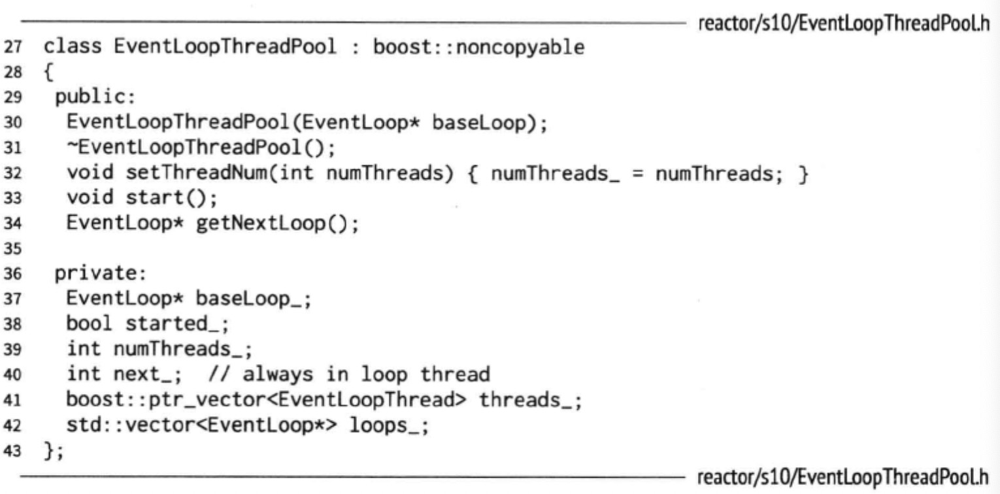

# 多线程 TcpServer

[TOC]

## EventLoopThreadPool

​			用 one  loop  per  thread 的思想实现多线程 TcpServer 的关键步骤是在新建 TcpConnection 时从 event  loop  pool 里挑选一个 **loop** 给 TcpConnection 用。也就是说多线程 TcpServer 自己的 EventLoop 只用来接受新连接，而新连接会用其他 EventLoop 来执行 IO 。( 单线程 TcpServer 的 EventLoop 是与 TcpConnection 共享的。) muduo 的 event loop pool 由 EventLoopThreadPool class 表示，接口如下，实现从略。

​			<u>TcpServer 每次新建一个 TcpConnection 就会调用 **getNextLoop()** 来取得 EventLoop，如果是单线程服务，每次返回的都是 baseLoop_ ，即 TcpServer 自己用的那个 loop</u>。其中 setThreadNum() 的参数的意义见 TcpServer 代码注释。

