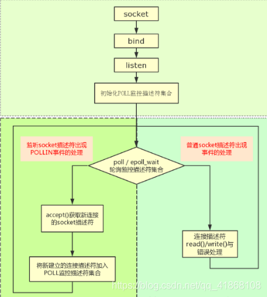
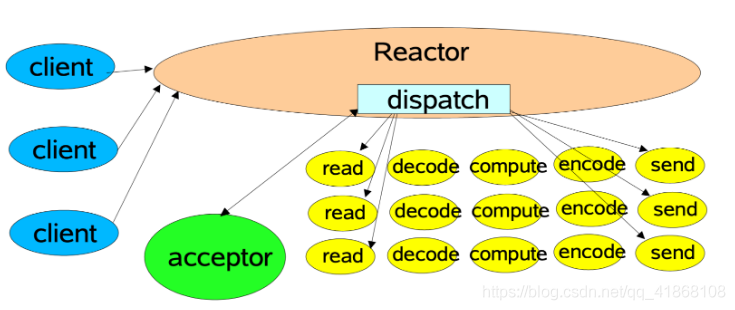
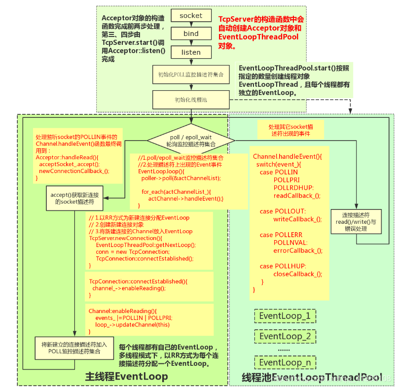
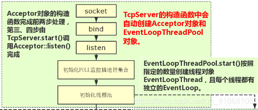
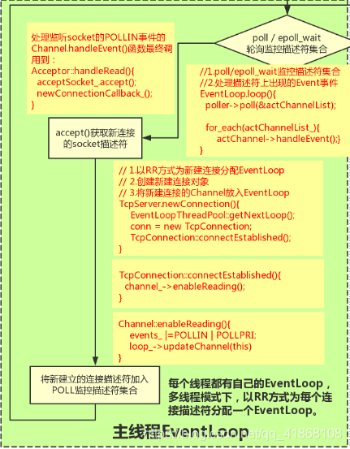
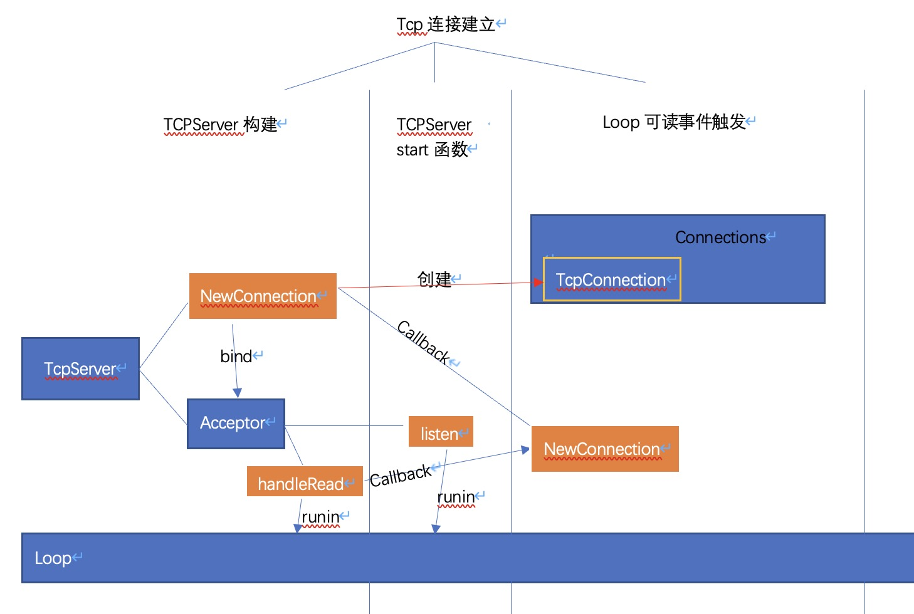
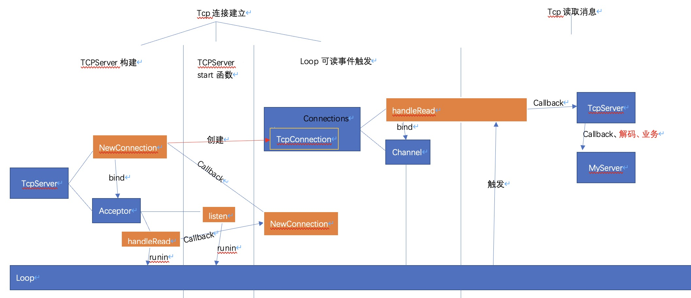
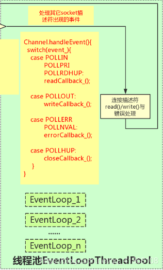

# muduo-net 库总览

[TOC]


## 经典的服务器设计模式 Reactor 模式

​		大多数人学习 Linux 网络编程的起点可能都是从《UNP》开始的，书中描述的服务端程序架构基本上是一个大的 while 循环，程序阻塞在 accept 或 poll 函数上，<u>等待</u>被监控的 socket 描述符上出现预期的事件。事件到达后，accept 或 poll 函数的<u>阻塞解除</u>，程序向下执行，根据 socket 描述符上出现的事件，执行 read、write 或错误处理。 

整体架构如下图所示：



而 muduo 的整体风格受到 netty 的影响，整个架构依照 Reactor 模式，基本与如下图所示相符：





​		**<u>所谓 Reactor 模式，是有一个循环的过程，监听对应事件是否触发，触发时调用对应的 callback 进行处理。</u>**

​		这里的事件在 muduo 中包括 Socket 可读写事件、定时器事件。在其他网络库中如 libevent *也包括了* signal、用户自定义事件等。

​		负责事件循环的部分在 muduo 命名为 EventLoop ，其他库如 netty 、libevent 也都有对应的组件。

​		负责监听事件是否触发的部分，在 muduo 中叫做 Poller 。muduo 提供了 epoll 和 poll 两种来实现，默认是 epoll 实现。

​		通过环境变量 MUDUO_USE_POLL 来决定是否使用 poll :

```c++
Poller* Poller::newDefaultPoller(EventLoop* loop)
{
  // 通过此环境变量来决定使用poll还是epoll
  if (::getenv("MUDUO_USE_POLL")) {
    return new PollPoller(loop);
  } else {
    return new EPollPoller(loop);
  }
}
```

​		此外，图中的 acceptor 负责 accept 新连接，并将新连接分发到 subReactor 。这个组件在 muduo 中也叫做 `Acceptor`。

## 连接的建立

​		在我们单纯使用 linux 的 API，编写一个简单的 Tcp 服务器时，建立一个新的连接通常需要四步：

```c++
步骤1. socket() // 调用 socket 函数建立监听 socket
步骤2. bind()   // 绑定地址和端口
步骤3. listen() // 开始监听端口
步骤4. accept() // 返回新建立连接的 fd
```

我们接下来分析下，这四个步骤在 muduo 中都是何时进行的：

首先在 TcpServer 对象构建时，TcpServer 的属性 acceptor 同时也被建立。

在 Acceptor 的构造函数中分别调用了socket 函数和 bind 函数完成了步骤 1 和步骤2。

即，当 `TcpServer server(&loop, listenAddr);` 执行结束时，监听 socket 已经建立好，并已绑定到对应地址和端口了。

而当执行 server.start() 时，主要做了两个工作：

```c++
1、在监听 socket 上启动 listen 函数，也就是步骤 3；
2、将监听 socket 的可读事件注册到 EventLoop 中。
```



此时，程序已完成对地址的监听，但还不够，因为此时程序的主角 EventLoop 尚未启动。

当调用 loop.loop() 时，程序开始监听该 socket 的可读事件。

当新连接请求建立时，可读事件触发，此时该事件对应的 callback 在EventLoop::loop() 中被调用。

该事件的 callback 实际上就是 Acceptor::handleRead() 方法。

在 Acceptor::handleRead() 方法中，做了三件事：

```c++
1、调用了 accept 函数，完成了步骤 4 ，实现了连接的建立。得到一个已连接socket 的 fd
2、创建 TcpConnection 对象
3、将已连接 socket 的可读事件注册到 EventLoop 中。
```

​		这里还有一个需要注意的点，创建的 TcpConnnection 对象是个 shared_ptr ，该对象会被保存在 TcpServer 的 connections 中。这样才能保证引用计数大于 0 ，对象不被释放。

​		至此，一个新的连接已完全建立好，其可读事件也已注册到 EventLoop 中了。





## 消息的读取

​		在新连接建立的时候，会将新连接的 socket 的可读事件注册到 EventLoop 中。

​		假如客户端发送消息，导致已连接 socket 的可读事件触发，该事件对应的callback 同样也会在 EventLoop::loop() 中被调用。

​		该事件的 callback 实际上就是 TcpConnection::handleRead 方法。

​		在 TcpConnection::handleRead 方法中，主要做了两件事：

```c++
1、从 socket 中读取数据，并将其放入 inputbuffer 中
2、调用 messageCallback，执行业务逻辑。
```

```c++
ssize_t n = inputBuffer_.readFd(channel_->fd(), &savedErrno);
if (n > 0) {
    messageCallback_(shared_from_this(), &inputBuffer_, receiveTime);
}
```

​		messageCallback 是在建立新连接时，将 TcpServer::messageCallback 方法bind 到了 TcpConnection::messageCallback 的方法。

​		TcpServer::messageCallback 就是业务逻辑的主要实现函数。通常情况下，我们可以在里面实现消息的编解码、消息的分发等工作，这里就不再深入探讨了。

​		在我们上面给出的示例代码中，echo-server 的 messageCallback 非常简单，就是直接将得到的数据，重新send回去。在实际的业务处理中，一般都会调用TcpConnection::send() 方法，给客户端回复消息。

​		这里需要注意的是，在 messageCallback 中，用户会有可能会把任务抛给自定义的 Worker 线程池处理。

***\*<u>但是这个在Worker线程池中任务，切忌直接对Buffer的操作。因为Buffer并不是线程安全的。</u>\****

我们需要记住一个准则:

```
所有对 IO 和 buffer 的读写，都应该在 IO 线程中完成。
```

​		<u>一般情况下，先在交给 Worker 线程池之前，应该现在 IO 线程中把 Buffer 进行切分解包等动作。将解包后的消息交由线程池处理，避免多个线程操作同一个资源。</u>



## 消息的发送

​		用户通过调用 TcpConnection::send() 向客户端回复消息。由于 muduo 中使用了OutputBuffer，因此消息的发送过程比较复杂。

​		首先需要注意的是线程安全问题， 对于消息的读写必须都在 EventLoop 的同一个线程(通常称为IO线程)中进行：

​		因此，TcpConnection::send 保证了线程安全性，它是这么做的：

```c++
void TcpConnection::send(const StringPiece& message)
{
  if (state_ == kConnected)
  {
//检测send的时候，是否在当前IO线程，如果是的话，直接进行写相关操作sendInLoop。
    if (loop_->isInLoopThread())
    {
      sendInLoop(message);
    }
//如果不在一个线程的话，需要将该任务抛给IO线程执行runInloop, 以保证write动作是在IO线程中执行的
    else
    {
      loop_->runInLoop(
          boost::bind(&TcpConnection::sendInLoop,
                      this,     // FIXME
                      message.as_string()));
    }
  }
}
```

​		检测 send 的时候，是否在当前 IO 线程，如果是的话，直接进行写相关操作sendInLoop。

​		如果不在一个线程的话，需要将该任务抛给 IO 线程执行 runInloop， 以保证write 动作是在 IO 线程中执行的。我们后面会讲解 runInloop 的具体实现。

​		在 sendInloop 中，做了下面几件事：

```c++
1、假如 OutputBuffer 为空，则直接向 socket 写数据
2、如果向 socket 写数据没有写完，则统计剩余的字节个数，并进行下一步。没有写完可能是因为此时socket的TCP缓冲区已满了。
3、如果此时OutputBuffer中的旧数据的个数和未写完字节个数之和大于highWaterMark，则将highWaterMarkCallback放入待执行队列中
4、将对应socket的可写事件注册到EventLoop中
```

注意，直到发送的时候，才把socket的可写事件注册到了EventLoop中。之前只注册了可读事件。

连接socket的可写事件对应的 callback 是 TcpConnection::handleWrite()

当某个socket的可写事件触发时，TcpConnection::handleWrite会做两个工作：

1. 尽可能将数据从 OutputBuffer 中向 socket 中 write 数据
2. 如果 OutputBuffer 没有剩余的，则将该 socket 的**<u>可写事件移除</u>**，并调用writeCompleteCallback

## 为什么要移除可写事件

因为当OutputBuffer中没数据时，我们不需要向socket中写入数据。但是此时socket一直是处于可写状态的， 这将会导致TcpConnection::handleWrite()一直被触发。然而这个触发毫无意义，因为并没有什么可以写的。

所以muduo的处理方式是，当OutputBuffer还有数据时，socket可写事件是注册状态。当OutputBuffer为空时，则将socket的可写事件移除。


# runInLoop 的实现

​		在讲解消息的发送过程时候，我们讲到为了保证对buffer和socket的写动作是在io线程中进行，使用了一个`runInLoop`函数，将该写任务抛给了io线程处理。

​		我们接下来看下`runInLoop`的实现：

```c++
void EventLoop::runInLoop(const Functor& cb)
{
//如果调用时是此EventLoop的运行线程，则直接执行此函数。
  if (isInLoopThread()) {
    cb();
  } else {
    queueInLoop(cb);
  }
}
```

​		这里可以看到，做了一层判断。如果调用时是此 EventLoop 的运行线程，则直接执行此函数。

​	否则调用 `queueInLoop` 函数。我们看下 `queueInLoop `的实现。

```c++
void EventLoop::queueInLoop(const Functor& cb) {
  {
  	MutexLockGuard lock(mutex_);
  	pendingFunctors_.push_back(cb);
  }
 
  if (!isInLoopThread() || callingPendingFunctors_) {
    wakeup();
  }
}
```

​		这里有两个动作：

1. 加锁，然后将该函数放到该 EventLoop 的 pendingFunctors_ 队列中。
2. 判断是否要唤醒 EventLoop，如果是则调用 wakeup() 唤醒该 EventLoop。

这里有几个问题：

- 为什么要唤醒 EventLoop ？
- wakeup 是怎么实现的?
- pendingFunctors_ 是如何被消费的?

### 为什么要唤醒 EventLoop

​		我们首先调用了 `pendingFunctors_ .push_back(cb);`，将该函数放在pendingFunctors_ 中。EventLoop 的每一轮循环最后会调用 doPendingFunctors 依次执行这些函数。

​		而 EventLoop 的唤醒是通过 epoll_wait 实现的，如果此时该 EventLoop 中迟迟没有事件触发，那么 epoll_wait 一直就会阻塞。

​		这样会导致，pendingFunctors_ 迟迟不能被执行了。

​		所以对 EventLoop 的唤醒是必要的。

### wakeup 是怎么实现的

​		muduo这里采用了对 eventfd 的读写来实现对 EventLoop 的唤醒。

​		在 EventLoop 建立之后，就创建一个 eventfd ，并将其可读事件注册到EventLoop 中。

​		wakeup() 的过程本质上是对这个 eventfd 进行写操作，以触发该 eventfd 的可读事件。这样就起到了唤醒 EventLoop 的作用。

```c++
void EventLoop::wakeup() {
  uint64_t one = 1;
  sockets::write(wakeupFd_, &one, sizeof one);
}
```

​		很多库为了兼容macos，往往使用pipe来实现这个功能。muduo采用了eventfd，性能更好些，但代价是不能支持macos了。不过muduo似乎从一开始的定位就不打算支持？

### doPendingFunctors 的实现

​		本部分讲下`doPendingFunctors`的实现，muduo 是如何处理这些待处理的函数的，以及中间用了哪些优化操作。

```c++
void EventLoop::doPendingFunctors()
{
  std::vector<Functor> functors;

  callingPendingFunctors_ = true;
 
  {
  	MutexLockGuard lock(mutex_);
  	functors.swap(pendingFunctors_);
  }
 
  for (size_t i = 0; i < functors.size(); ++i) {
    functors[i]();
  }
  callingPendingFunctors_ = false;
}
```

#### callingPendingFunctors_ 的作用

​		从代码可以看出，如果 callingPendingFunctors_ 为 false ，则说明此时尚未开始执行 doPendingFunctors 函数。

​		这个有什么作用呢，我们需要结合下 queueInLoop 中，对是否执行 wakeup() 的判断

```c++
if (!isInLoopThread() || callingPendingFunctors_) {
  wakeup();
}
```

​		这里还需要结合下 EventLoop 循环的实现，其中 doPendingFunctors() 是每轮循环的最后一步处理。

​		如果调用 queueInLoop 和 EventLoop 在同一个线程，且callingPendingFunctors_ 为 false 时，则说明：此时尚未执行到doPendingFunctors()。

那么此时即使不用 wakeup，也可以在之后照旧执行 doPendingFunctors()了 。

这么做的好处非常明显，可以减少对 eventfd 的 io 读写。

#### **锁范围的减少**

在此函数中，有一段特别的代码：

```c++
std::vector<Functor> functors;
{
  MutexLockGuard lock(mutex_);
  functors.swap(pendingFunctors_);
}
```

​		这个作用是 pendingFunctors_ 和 functors 的内容进行交换，实际上就是此时functors 持有了 pendingFunctors_ 的内容，而 pendingFunctors_ 被清空了。

这个好处是什么呢？

​		如果不这么做，直接遍历  pendingFunctors_ ，然后处理对应的函数。这样的话，锁会一直等到所有函数处理完才会被释放。在此期间，queueInLoop 将不可用。

​		而以上的写法，可以极大减小锁范围，整个锁的持有时间就是 swap 那一下的时间。待处理函数执行的时候，其他线程还是可以继续调用 queueInLoop 。


# muduo的线程模型

​		muduo默认是单线程模型的，即只有一个线程，里面对应一个EventLoop。这样整体对于线程安全的考虑可能就比较简单了，

​		但是muduo也可以支持以下几种线程模型：

## 业务线程池

​		对于一些阻塞型或者耗时型的任务，例如SQL操作等。这些显然是不能放在IO线程（即EventLoop所在的线程）中运行的，因为会严重影响EventLoop的正常运行。

​		对于这类耗时型的任务，一般做法是可以放在另外单独线程池中运行，这样就不会阻塞IO线程的运行了。我们一般把这种处理耗时任务的线程叫做Worker线程。

​		muduo本身没有提供一套直接使用Worker线程池的方式，但是muduo本身提供了线程池的相关类ThreadPool。

​		muduo官方的推荐做法是，在OnMessage中，自行进行包的切分，然后将数据和对应的处理函数打包成Task的方式提交给线程池。




