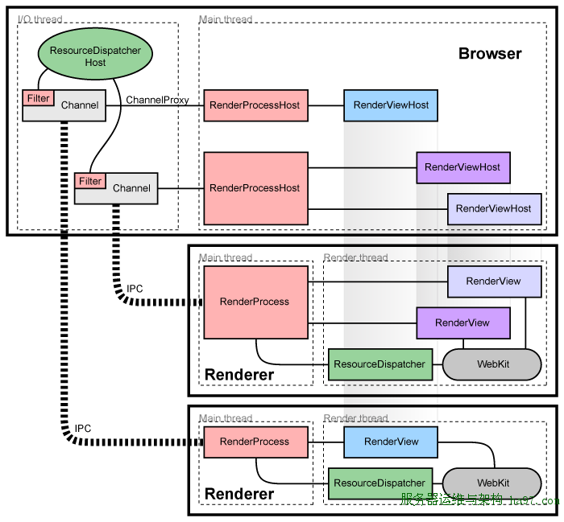

主要看这里：https://chromium.googlesource.com/chromium/src/+/refs/heads/main/docs/threading_and_tasks.md#prefer-sequences-to-physical-threads

## chromium 进程模型（必须理解）

简单概述：Chrome 有一个主进程，称为Browser进程，它是老大，管理 Chrome 大部分的日常事务；其次，会有很多 Renderer 进程，它们圈地而治，各管理一组站点的显示和通信（ Chrome 在宣传中一直宣称一个 tab 对应一个进程，其实是很不确切的…），它们彼此互不搭理，只和老大说话，由老大负责权衡各方利益。它们和老大说话的渠道，称做 IPC（Inter-Process Communication），这是Google搭的一套进程间通信的机制，基本的实现后面自会分解。。。

​		不论是 Browser 进程还是 Renderer 进程，都不只是光杆司令，它们都有一系列的线程为自己打理各种业务。对于Renderer进程，它们通常有两个线程，一个是Main thread，它负责与老大进行联系，有一些幕后黑手的意思；另一个是Render thread，它们负责页面的渲染和交互，一看就知道是这个帮派的门脸级人物。

​		相比之下，Browser进程既然是老大，小弟自然要多一些，除了大脑般的 Main thread，和负责与各Renderer帮派通信的IO thread，其实还包括负责管文件的file thread，负责管数据库的db thread等等（一个更详细的列表，参见[这里](http://sites.google.com/a/chromium.org/dev/developers/design-documents/threading)），它们各尽其责，齐心协力为老大打拼。它们和各Renderer进程的之间的关系不一样，同一个进程内的线程，往往需要很多的协同工作，这一坨线程间的并发管理，是Chrome最出彩的地方之一了。。。

### 线程

每个 Chrome 进程都有

- 一个主线程
  - 在浏览器进程中 (BrowserThread::UI)：更新 UI
  - 在渲染器进程中（Blink 主线程）：运行大部分 Blink
- 一个 IO 线程
  - 在浏览器进程中 (BrowserThread::IO)：处理 IPC 和网络请求
  - 在渲染器进程中：处理 IPC
- 一些特殊用途的线程
- 和一个通用线程池

大多数线程都有一个从队列中获取任务并运行它们的循环（队列可能在多个线程之间共享）。

**Chrome的进程模型**

Google在宣传的时候一直都说，Chrome 是 one tab one process 的模式，其实，这只是为了宣传起来方便如是说而已，基本等同广告，实际疗效，还要从代码中来看。实际上，Chrome支持的进程模型远比宣传丰富，你可以参考一下[这里](http://sites.google.com/a/chromium.org/dev/developers/design-documents/process-models) ，简单的说，Chrome支持以下几种进程模型：

1. **Process-per-site-instance**：就是你打开一个网站，然后从这个网站链开的一系列网站都属于一个进程。这是Chrome的默认模式。

2. **Process-per-site**： 同域名范畴的网站放在一个进程，比如www.google.com和www.google.com/bookmarks就属于一个域名内（google有 自己的判定机制），不论有没有互相打开的关系，都算作是一个进程中。用命令行–process-per-site开启。

3. **Process-per-tab**：这个简单，一个tab一个process，不论各个tab的站点有无联系，就和宣传的那样。用–process-per-tab开启。

4. **Single Process**：这个很熟悉了吧，传统浏览器的模式，没有多进程只有多线程，用–single-process开启。