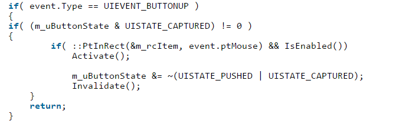
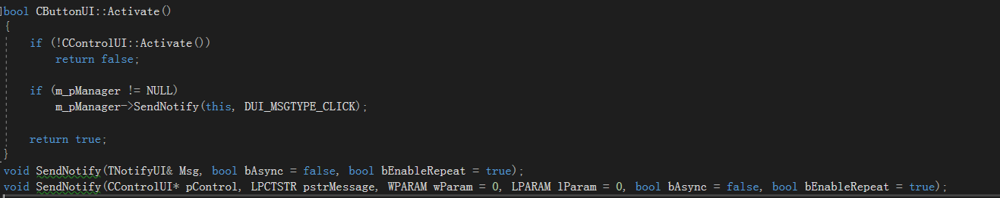

### MESSAGE LOOP

​		上面讲完了*WinMain*()中的pFrame->Create()函数。接下来就是设置窗体居中pFrame->CenterWindow();和显示窗体pFrame->ShowWindow(true);都是调用的常规的API函数，最后一行执行消息循环CPaintManagerUI::MessageLoop();。

下面是消息循环代码，只比win32SDK的消息循环多了一层CPaintManagerUI::TranslateMessage(&msg)。

```c++
int CPaintManagerUI::MessageLoop()
{
    MSG msg = { 0 };
    while( ::GetMessage(&msg, NULL, 0, 0) ) {
        if( !CPaintManagerUI::TranslateMessage(&msg) ) {//这里
            ::TranslateMessage(&msg);
			::DispatchMessage(&msg);
        }
    }
    return msg.wParam;
}
```

### 键盘消息处理

​		所有键盘消息处理都在CPaintManagerUI::TranslateMessage(&msg)中，函数按键处理分为两部分。子窗口按键消息处理和非子窗口消息处理。

```c++
//得到当前窗体风格
UINT uStyle = GetWindowStyle(pMsg->hwnd);
//是否包含"子窗体"风格
UINT uChildRes = uStyle & WS_CHILD;
LRESULT lRes = 0;
if (uChildRes != 0)
{
    //进入条件则当前窗体是子窗体。
}
else
{
    //当前窗体不是子窗体
}
```

子窗体按键消息处理:

```c++
		//得到当前窗体的父窗体
		HWND hWndParent = ::GetParent(pMsg->hwnd);
		//code by redrain 2014.12.3,解决edit和webbrowser按tab无法切换焦点的bug
		//		for( int i = 0; i < m_aPreMessages.GetSize(); i++ ) 
		//循环所有按键消息过滤ary ↓
		for( int i = m_aPreMessages.GetSize() - 1; i >= 0 ; --i ) 
		{
			CPaintManagerUI* pT = static_cast<CPaintManagerUI*>(m_aPreMessages[i]);        
			HWND hTempParent = hWndParent;
			while(hTempParent)
			{

				if(pMsg->hwnd == pT->GetPaintWindow() || hTempParent == pT->GetPaintWindow()) //判断是否是父窗口消息
				{
					if (pT->TranslateAccelerator(pMsg))//先处理加速键
						return true;
					pT->PreMessageHandler(pMsg->message, pMsg->wParam, pMsg->lParam, lRes); //在处理按键消息
				}
				hTempParent = GetParent(hTempParent); //继续获取父窗体的父窗体......
			}

		}
```

非子窗口消息处理:

```c++
for( int i = 0; i < m_aPreMessages.GetSize(); i++ ) {
    int size = m_aPreMessages.GetSize();
    CPaintManagerUI* pT = static_cast<CPaintManagerUI*>(m_aPreMessages[i]);
    if(pMsg->hwnd == pT->GetPaintWindow())//判断消息是否是当前窗体的消息
    {
        if (pT->TranslateAccelerator(pMsg))//处理加速键
            return true;

        if( pT->PreMessageHandler(pMsg->message, pMsg->wParam, pMsg->lParam, lRes) ) //处理按键消息
            return true;

        return false;
    }
}
```

​		不管是否处理的是子窗口还是非子窗口负责TranslateAccelerator()处理加速键的函数，PreMessageHandler()处理按键消息函数。

##### 加速键处理

​		想要处理加速键需要继承ITranslateAccelerator类，它只有一个接口函数就是需要实现TranslateAccelerator();即可。

​         所有加速键的回调全部存储在CPaintManagerUI::m_aTranslateAccelerator中。CPaintManagerUI::TranslateAccelerator()函数就是遍历m_aTranslateAccelerator保存的数据强转成ITranslateAccelerator调用TranslateAccelerator接口。

​         除了继承ITranslateAccelerator接口还需调用AddTranslateAccelerator()将自己添加到m_aTranslateAccelerator中

```C++
bool CPaintManagerUI::TranslateAccelerator(LPMSG pMsg)
{
	for (int i = 0; i < m_aTranslateAccelerator.GetSize(); i++)
	{
		LRESULT lResult = static_cast<ITranslateAccelerator *>(m_aTranslateAccelerator[i])->TranslateAccelerator(pMsg);
		if( lResult == S_OK ) return true;
	}
	return false;
}
```

##### 按键消息处理

​		按键消息处理在CPaintManagerUI::PreMessageHandler()。按键消息处理会先提供一个按键预处理回调函数。按键预处理存储在CPaintManagerUI::m_aPreMessageFilters。如果需要预先处理按键消息那么需要继承IMessageFilterUI并且实现MessageHandler接口。并且调用CPaintManagerUI::AddPreMessageFilter()来将自己添加到CPaintManagerUI::m_aPreMessageFilters中。

```C++
bool CPaintManagerUI::PreMessageHandler(UINT uMsg, WPARAM wParam, LPARAM lParam, LRESULT& /*lRes*/)
{
    for( int i = 0; i < m_aPreMessageFilters.GetSize(); i++ ) 
    {
        bool bHandled = false;
        LRESULT lResult = static_cast<IMessageFilterUI*>(m_aPreMessageFilters[i])->MessageHandler(uMsg, wParam, lParam, bHandled);
        if( bHandled ) {
            return true;
        }
    }
    switch( uMsg ) {
    case WM_KEYDOWN://--太长了省略
        break;
    case WM_SYSCHAR://--太长了省略
        break;
    case WM_SYSKEYDOWN://--太长了省略
        break;
    }
    return false;
}
```

如果有没做预处理那么CPaintManagerUI::PreMessageHandler()将会处理*WM_KEYDOWN**（键盘按下）、WM_SYSCHAR（atl + 按键）、WM_SYSKEYDOWN（atl）*。


# Notify消息过程

​		Notify的消息过程很好调试只需要在Notify内下一个断点，点下按钮就能得到完整的调用过程，最先是从CWndShadow::ParentProc()开始到CFrameWindowWnd::Notify()结束这一条线。

##### 为什么从CWndShadow开始？

​		我们在(2-Create函数的流程.md)中看到 

```
  但是m_pWndShadow->Create(m_hWnd);中却修改了CFrameWindowWnd设置的消息循环回调函数，先指向了CWndShadow的ParentProc()在通过函数指针调用CWindowWnd::__WndProc。
```

​		如果将CWndShadow代码注释那么则开始处为CWindowWnd::__WndProc()。

##### CWindowWnd::__WndProc()

​		消息从CWindowWnd::__WndProc()看,虽然是从这里开始。但是过程并没有处理什么东西，转向了CFrameWindowWnd::HandleMessage()。

##### CPaintManagerUI::MessageHandler()

​		CPaintManagerUI::MessageHandler()是主要的消息处理函数，处理了各种事件消息函数也挺长的，不可能全部都写一遍太耗时间了。简单记录下CButtonUI按钮的事件过程即可。

##### CButtonUI按钮事件过程

​		对界面按一次鼠标会产生两条消息事件*WM_LBUTTONDOWN*和*WM_LBUTTONUP*。在两个消息中下断点，对界面任意CButtonUI按钮按下将先会断点在*WM_LBUTTONDOWN*中。

##### WM_LBUTTONDOWN做了什么

```C++
POINT pt = { GET_X_LPARAM(lParam), GET_Y_LPARAM(lParam) };
m_ptLastMousePos = pt;
CControlUI* pControl = FindControl(pt);
if( pControl == NULL )
break; 
```

​		函数开头将参数lParam转换成POINT位置坐标得到的是出表点击窗口的坐标，而后调用FindControl()函数来搜索控件指针。

##### FindControl()

```C++
CControlUI* CPaintManagerUI::FindControl(POINT pt) const
{
    ASSERT(m_pRoot);
    return m_pRoot->FindControl(
        __FindControlFromPoint
        , &pt
        , UIFIND_VISIBLE | UIFIND_HITTEST | UIFIND_TOP_FIRST);
}
```

​		  FindControl()函数从控件根节点调用控件中的FindControl()，并且提供了一个回调函数__FindControlFromPoint()。用于判断鼠标点击是否在当前控件范围内。成功返回控件指针，否则返回空。

```C++
CControlUI* CALLBACK CPaintManagerUI::__FindControlFromPoint(CControlUI* pThis, LPVOID pData)
{
    LPPOINT pPoint = static_cast<LPPOINT>(pData);
    //判断point这个点是否命中了当前矩形范围
    return ::PtInRect(&pThis->GetPos(), *pPoint) ? pThis : NULL;
}
```

##### CContainerUI::FindControl()控件搜索方式

```C++
for( int it = m_items.GetSize() - 1; it >= 0; it-- )
{
    pResult = static_cast<CControlUI*>(m_items[it])->FindControl(Proc, pData, uFlags);
    if( pResult != NULL )
    {
        if( (uFlags & UIFIND_HITTEST) != 0
            && !pResult->IsFloat()
            && !::PtInRect(&rc, *(static_cast<LPPOINT>(pData))) )
            continue;
        else
            return pResult;
    }
}
```

​		控件搜索的核心就是从根节点开始倒叙遍历子控件节点并且子节点继续调用FindControl()。

​        可能调试的时候发现进入FindControl()。函数有些不对，有时候进入的是CContainerUI::FindControl()但是又有可能进入CControlUI::FindControl()。到底是哪个？其实进入哪个FindControl()函数看你点的是什么控件。


​		搜索到控件之后交给m_pEventClick保存，接下来对Find到的控件设置焦点和对窗口进行设置鼠标捕获以及封装了一个TEventUI结构体

```C++
typedef struct DUILIB_API tagTEventUI
{
    //消息类型
    int Type;
    //控件指针
    CControlUI* pSender;
    //当前点击时间
    DWORD dwTimestamp;
    //鼠标点击位置
    POINT ptMouse;
    TCHAR chKey;
    //当前键盘状态（是否使用了SHIFT之类的按键）
    WORD wKeyState;
    //消息事件参数
    WPARAM wParam;
    LPARAM lParam;
} TEventUI;
```

​		封装后调用控件的Event()。交给控件处理。

##### 总结

​       对于鼠标点击产生的*WM_LBUTTONDOWN*首先会查找控件，是否点击的位置存在控件。如果存在控件那么将会封装一个TEventUI事件并且调用CControlUI::Event()来转给控件由控件自己判断如何处理*WM_LBUTTONDOWN*事件。

###### WM_LBUTTONUP做了什么

​       事件不长，开始判断是否m_pEventClick为空因为鼠标点击中控件后会将控件指针保存在m_pEventClick中。接下来还是封装了一个TEventUI事件并且调用CControlUI::Event()来转给控件由控件自己判断如何处理。对于CButtonUI对于*WM_LBUTTONUP*事件会调用Activate()函数。



​       Activate()函数中，如果控件可见和启动并且m_pManager指向了CPaintManagerUI将调用CPaintManagerUI::SendNotify()。



​      SendNotify()是一个重载函数通过观察参数，通过观察Activate()调用的SendNotify()和单步调试得知进入的是第二个SendNotify().

​       第二个SendNotify()只做了一件事情封装了一个新的结构体TNotifyUI并调用第一个SendNotify()


​        在第二个SendNotify()可以看出控件是可以传递异步消息的，但是怎么使用目前还不知道只关注同步传递消息。

​		 在第二个SendNotify()中就是遍历m_aNotifiers队列调用队列中所有INotifyUI:: Notify()函数。

​		当继续跟进Notify()就能看到最终进入了CFrameWindowWnd::Notify()。


