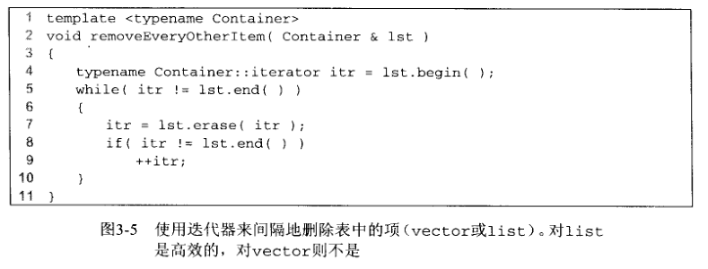
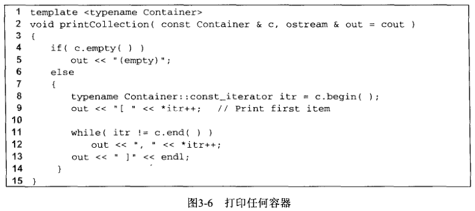

## STL中的向量和表

​		在 C++ 语言的库中包含有公共数据结构的实现。C++ 中的这部分内容就是众所周知**的标准模板库（Standard Template Library，STL)**。表ADT就是在STL中实现的数据结构之一。其他的数据结构我们将在第 4 章中介绍。一般来说，这些数据结构称为**集合（collection)**或**容器（container)**。 

​		表ADT有两个流行的实现。vector 给出了表 ADT 的可增长的数组实现。使用 vector 的优点在于其在常量的时间里是可索引的。缺点是插入新项或删除己有项的代价是昂贵的，除非是这些操作发生在 vector 的末尾。list 提供了表 ADT 的双向链表实现。使用 list 的优点是，如果变化发生的位置已知的话，插入新项和删除已有项的代价是很小的。缺点是 list 不容易索引。vector 和 list 两者在查找时效率都很低。在本讨论中，list 总是指 STL 中的双向链表，而 “ 表 ” 则是指更一般的 ADT 表。

​		vector 和 list 两者都是用其包含的项的类型来例示的类模板。两者都有几个公共的方法。 所示的前三个方法事实上对所有的 STL 容器都适用：

* int size () const : 返回容器内的元素个数。

* void clear () : 删除容器中所有的元素。

* bool empty() : 如果容器没有元素，返回 true，否则返回 false。

​       vector 和 list 两者都支持在常量的时间内在表的末尾添加或删除项。vector 和 list 两者都支持在常量的时间内访问表的前端的项。这些操作如下： 

* void push_back( const Object & x ):在表的末尾添加 x。

* void pop_back() : 删除表的末尾的对象。

* const Object & back() const : 返回表的末尾的对象（也提供返回引用的修改函数）。

* const Object & front () const : 返回表的前端的对象（也提供返回引用的修改函数）。

​        因为双向链表允许在表的前端进行高效的改变，但是 vector 不支持，所以，下面的两个方法仅对 list 有效：

* void push_front( const Object & x):在list的前端添加X。

* void pop_front():在list的前端删除对象。

​        vector 也有 list 所不具有的特有的方法。有两个方法可以进行高效的索引。另外两个方法允许程序员观察和改变 vector 的内部容量。这些方法是：

* Object & operator [] (int idx) : 返回 vector 中 idx 索引位置的对象，不包含边界检测（也提供返回常量引用的访问函数）。

* Object & at ( int idx) : 返回 vector 中 idx 索引位置的对象，包含边界检测（也提供返回常量引用的访问函数）。

* int: capacity() const : 返回 vector 的内部容量（详细信息参见3*4节）。

* void reserve ( int new Capacity ) : 设定 vector 的新容量。如果己有良好的估计的话，这可以避免对 vector 进行扩展（详细信息见3.4节）。


### 1.迭代器

​		一些表的操作，例如那些在表的中部进行插入和删除的操作，需要位置标记。在 STL 中，通过内置类型 iterator 来给出位置。特别地，对 list < string >，位置通过类型 list < string > :: iterator 给出；对 vector < int >，位置由类vector < int > :: iterator 给出；依此类推。在描述某些方法的时候，为简明起见，我们使用 iterator 。但是，在编写代码的时候还是使用实际的嵌套类名称。

​		在开始的时候，需要处理三个问题：第一，如何得到迭代器；第二，迭代器可以执行什么操作；第三，哪些表ADT方法需要迭代器作为形参。

##### 1.获得迭代器

​		对第一个问题，STL 表（包括其他 STL 容器）定义了一对方法：

* iterator begin() : 返回指向容器的第一项的一个适当的迭代器。

* iterator end() : 返回指向容器的终止标志（容器中最后一项的后面的位置）的一个适当的迭代器。

​         end 方法看起来有点不寻常，因为它返回的迭代器指向容器的 “ 边界之外 ” 。为研究这个问题， 考察下面典型的用于打印 vector v 的项的代码：

```c
for ( int i=0; i! = v.size(); ++i) 
	cout << v[i] << endl;
```

​		如果使用迭代器重写代码，那么自然就有对应的使用 begin 和 end 方法的代码。

```c
for( vector<int>::iterator itr = v.begin () ; itr != v.end () ; itr.???) 
    cout << itr.??? << endl;
```

​		在循环终止检测中，i != v.size() 和 itr != v.end() 两者都试图检测循环计数器是否已经 “ 超出边界 ” 。这段代码引出了第二个问题，迭代器必须有关联的方法（这里未知的方法由？？？代替）。

##### 2.迭代器方法

​		由上述的代码片段，可以很明显地看到，迭代器可以使用 != 和 == 进行比较，很可能也有复制构造函数和 operator= 的定义。因此，迭代器有许多方法，并且许多方法都使用操作符重载。除了复制以外，迭代器的最常见的操作如下：

* itr++ 和 ++itr : 推进迭代器 itr 至下一个位置。前缀和后缀两种形式都是允许的。

* *itr : 返回存储在迭代器 itr 指定位置的对象的引用。返回的引用或许能、或许不能被修改（后面我们将讨论这些细节）。

* itr1 == itr2 : 如果 itr1 和 itr2 都指向同一个位置就返回 true，否则，返回 false 。

* itr1 != itr2 : 如果 itr1 和 itr2 都指向不同位置就返回 true，否则，返回 false 。

​        使用这些操作符，打印程序代码将为：

```c
for ( vector<int>: :iterator itr = v.begin() ; itr != v.end () ; ++itr) 
    cout << *itr << endl;
```

​		使用操作符重载可以允许迭代器访问当前项，然后使用 *itr ++ 推进到下一项。于是，上述代码片段也可以改写如下：

```c
vector<int> :: iterator itr = v.begin(); 

while(itr != v. end())
	cout << *itr++ << endl;
```


##### 3.需要迭代器的容器操作

​		对于最后一个问题，需要使用迭代器的三个流行的方法，如下所示，这些方法在表中（vector 或 list 表）的特定位置添加或删除项。

* iterator insert ( iterator pos, const Object & x)：添加 x 到表中迭代器 pos 所指向的位置之前的位置。这对 list 是常量时间操作，但是对 vector 则不是。返回值是一个指向插入项位置的迭代器。

* iterator erase ( iterator pos) : 删除迭代器所给出位置的对象。这对 list 来说是常量时间操作，但对 vector 则不是。返回值是调用之前 pos 所指向元素的下一个元素的位置。 这个操作使 pos 失效。pos 不再有用，因为它所指向的容器变量已经被删除了。

* iterator erase ( iterator start, iterator end)：删除所有的从位置 start 开始、 直到位置 end ( 但是不包括 end ) 的所有元素。注意，整个表的删除可以调用 c.erase(c.begin (), c.end ())。


### 2.示例：对表使用 erase

​		作为一个示例，这里给出一个例程，从表的起始项开始间隔地删除项。这样，如果表包含 6 、5 、1 、4 和 2 , 那么，调用该方法后，表将只包含 5 和 4 。这是通过遍历表，并对每个第二项使用 erase 方法实现的。对于 list，这是一个线性时间例程，因为每次调用 erase 都消耗常量的时间。但是

​		整个例程将消耗平方级的时间，因为每次调用 erase 都是低效的，花费 O(N) 时间。因此，正常情况下我们只为 list 编写代码。为实验的目的，我们编写一个可以同时用于 list 和 vector 的通用函数模板，并且提供消耗时间的信息。图3-5所示是该函数模板。之所以在第 4 行使用 typename，是因为一些编译器需要声明 Container: : iterator 是一个类型而不是一个数据字段或者方法。如果运行代码并传递 list < int >，那么，对 400 000 项的 list，程序将花费 0.062s 的时间；对800 000 项的 list，程序将花费 0.125s 的时间。很明显，这是线性时间例程，因为程序的运行时间与数据的输入量按相同的速率增长。当传递 vector < int > 时，对 400 000 项的 vector 将花费差不多两分半钟的时间；对 800 000 项的 vector，例程将花费超过十分钟的时间。当输入量以两倍的速率增长时，运行时间以四倍的速率增长。这是二次算法的表征。




### 3.const—iterator

​		*itr 的结果不只是迭代器指向的项的值，也是该项本身。这个区别使得迭代器的功能很强， 但也使其更复杂。为研究其优点，假设我们需要将一个集合里的所有项都改为一个特殊的值。下面的例程工作于 vector 和 list , 并且按线性时间运行。这是编写类型无关的泛型代码的一个极好的例子。

```c
	template < typename Container, typename Object > 
    void change ( Container & c, const Object & newValue){
        
		typename Container :：iterator itr = c.begin();
        
        while ( itr != c.end() )
			*itr++ = newValue:
	}
```

​		为研究潜在的问题，假设 Container c 通过常量引用传递至例程。这意味着我们不期望对 c 有任何的改变，同时编译器要通过禁止调用 c 的任何修改函数来确保这一点。考察下面打印的整数 list 的代码。该代码试图暗中修改 list :

```c
void print{ const list<int> & 1st, ostream & out = cout)
{
	typename Container :: iterator itr = 1st.begin (); 
    while( itr != 1st.end() ){
		out << *itr <<endl;
		*itr = 0;	// This is fishy !!!
		itr++;	
    }
}
```

​		如果这段代码是合法的话，那么 list 的定常性就完全没有任何意义了，因为改变起来太容易了。 这段代码是非法的，并且不会被编译。STL 提供的解决方案是每一个集合不仅包含嵌套的 iterator 类型，也包含嵌套的 const_iterator 类型。 iterator 和 const_iterator 之间的主要区别是：const_iterator 的 operator* 返回常量引用，这样 const_iterator 的 *itr 就不能出现在赋值语句的左边。

​		更进一步地，编译器还会要求必须使用 Const_iterator 类遍历常量集合。如下所示，有两个版本的 begin 和两个版本的 end 来实现这个功能：

* iterator begin() ;

* const_iterator begin () const

* iterator end ()

* const_iterator end () const

​        两个版本的 begin 可以在同一个类里面，因为方法（例如，无论是访问函数还是修改函数） 的定常性被认为是标号的一部分。我们曾遇到过这个窍门，在3.4节还将看到这个窍门。 两者都是出现在重载 operator [] 的情况下。

​		如果对非常量容器调用 begin，那么返回 iterator 的 “ 修改函数 ” 版本就将被调用。然而， 如果对返回 const_iterator 的常量容器调用 begin，那么返回值就可能没有被赋值为 iterator 。 如果尝试这么做的话，编译错误就会产生。一旦 itr 是const_iterator，*itr = 0 很容易就会被确定是非法的。

​		图3-6的代码为使用 const_iterator 打印任意集合的例子。集合中的项打印在括号中，并用逗号隔开。

