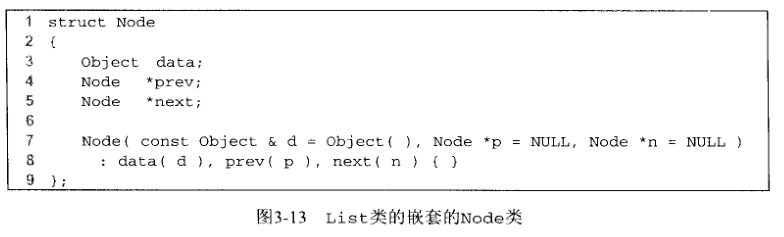
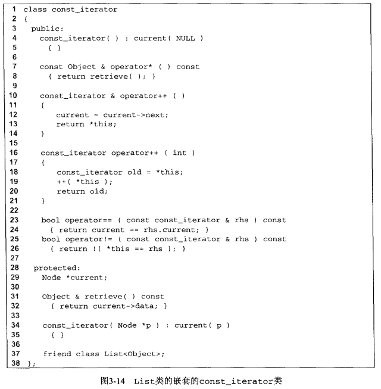
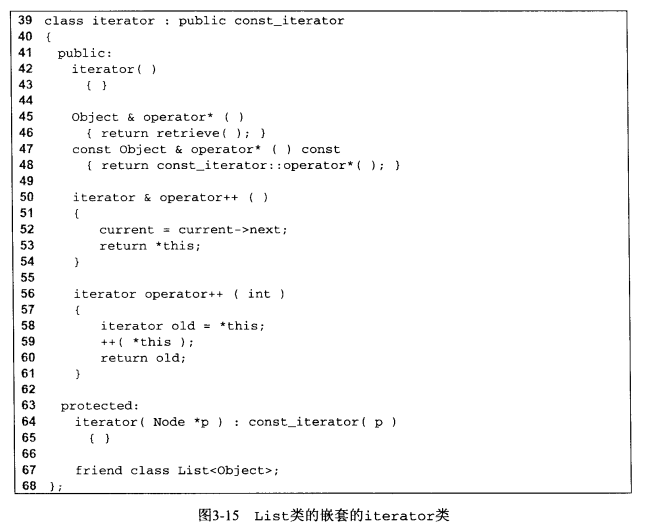
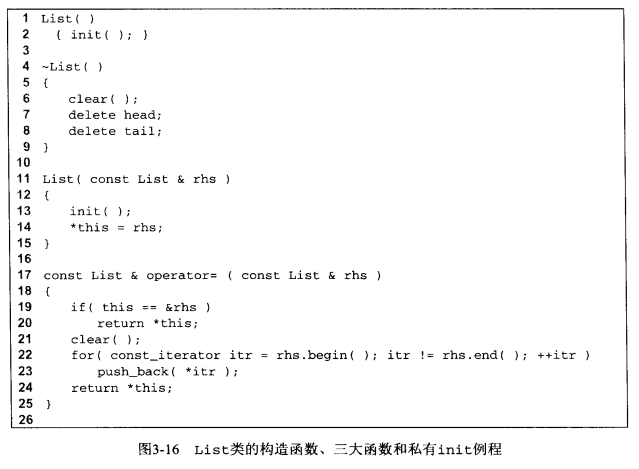
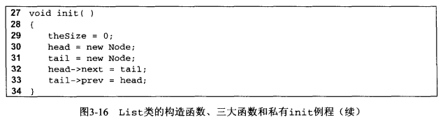
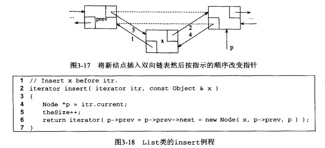
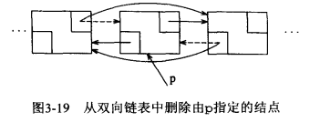
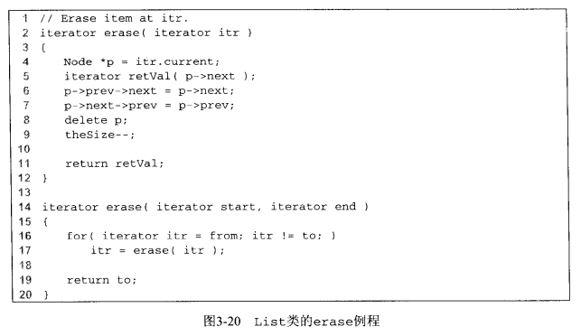
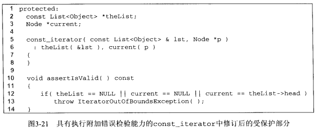
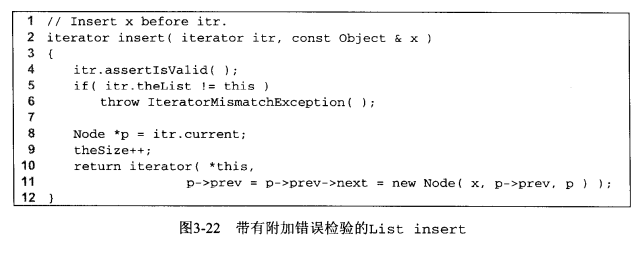

## 表的实现

​		在本节中，提供了一个可用的 list 类模板的实现。和 vector 类中的情况一样，我们的表类还是命名为 XList 以避免与库类的混淆。

​		回顾一下，前面提到的 XList 类将要作为双向链表来实现，并且我们需要修改指向表两端的指针。只要操作是发生在已知位置，这样做就可以保证每个操作的时间消耗为常量。这个已知位置可以是末尾，也可以是迭代器指定的位置。

​		考虑到设计需要，我们需要提供下面的 4 个类：

1. List 类本身。包含连接到表两端的链接、表的大小以及一系列的方法。

2. Node 类。该类看起来像是私有的嵌套类。一个结点包含数据和用来指向其前和其后的结点的指针，以及适当的构造函数。

3. const_iterator 类。该类抽象了位置的概念，是一个公有的嵌套类。const_iterator 存储指向当前结点的指针，并且提供基本迭代器操作的实现，以及所有的重载操作符，例如 =、==、！=和++。

4. iterator 类。该类抽象了位置的概念，是一个公有的嵌套类。除了 operator* 操作返回所指向项的引用，而不是该项的常量引用的功能外，iterator 具有与 const_iterator 相同的功能。一个重要的技术点是 iterator 可以用于任何需要使用 const_iterator 的例程里，反之则不是。换句话说，iterator 就是 const_iterator。

​        因为迭代器类存储指向 “ 当前结点 ” 的指针，并且尾部标志是一个有效的位置，这使得在表的末尾添加一个额外的结点来作为尾部标志成为可能。进一步地，也可以在表的前端生成一个额外的结点，从而逻辑上作为开始标志。这些额外的结点有时被称为**哨兵结点**；特别地，在头部的结点有时候称为**表头结点（header node)**，而在末端的结点称为**尾结点（tail node)**。

​		使用这些额外结点的好处是可以去掉很多特例，这极大地简化了程序代码。例如，如果我们不使用表头结点，那么删除第一个结点将成为一个特例，因为我们必须在删除过程中重新设置表的链接到第一个结点上，而且删除算法一般来说也需要访问被删除结点前面的结点（没有表头结点，第一个结点前面就没有结点了）。图3-9是带有表头结点和尾结点的双向链表。图3-10是空双向链表。


图3-11和图3-12是List类的概要和部分实现。


​		观察第 5 行私有嵌套的 Node 类的声明的开始部分，可以看到这里使用了 struct 而不是使用 class 关键字。在 C++ 中 ，struct 是 C 编程语言遗留下来的产物。C++ 中的 struct 在本质上来说就是其成员默认为公有的class。回顾一下，在 class 中，其成员都是私有的。很明显，struct 关键字不是必需的，然而，还是经常可以看到程序员在声明一个大部分数据需要直接访问而不是使用方法来访问的类型时使用 struct 。在我们的例子中，令Node 类中的成员为 public 并不会成为什么问题，因为 Node 类本身是私有的并且不允许来自 List 类之外的访问。


​		观察第 9 行的公有嵌套的 const_iterator 类的声明的开始部分和第 12 行公有嵌套的 iterator 类的声明的开始部分，可以看到这里有一个不常见的语法 inheritance (这是一个功 能强大的结构，在本书的其他部分则没有用到）。继承语法是说，iterator具有与 const_iterator 完全相同（有可能会多一些）的功能，并且 iterator 与const_iterator 的数据类型是完全兼容的。所有需要使用 const_iterator 的地方都可使用 iterator 。在以后遇到实 际的实现的时候我们再讨论这些细节。

​		第70 〜 72 行是 List 的数据成员，命名了指向表头结点和尾结点的指针。我们也将记录数据成员的大小，这样一来 size 方法就可以在常量的时间内实现。

​		List 类的其他部分包括构造函数、三大函数和一些方法。许多的方法都是一行的。begin 和 end 返回适当的迭代器；第 26 行的调用是一个典型的实现，在实现中返回一个已构造的迭代器 ( 这样 iterator 和 const_iterator 类每一个都有自己的构造函数，该构造函数使用指向 Node 的指针作为参数）。

​		第 39~43 行的 clear 方法执行的时候重复地执行删除操作来删除每一项，直到 List 变为空的为止。使用这种策略可以避免 clear 染指结点空间的回收。现在结点空间的回收已经归入 pop_front 来执行。第 44〜59 行的方法都是通过巧妙地包含和使用恰当的迭代器来工作的。回顾一下，insert 方法在某个位置之前插入，因此，在需要的时候，push_back 在末尾标记之前插入。 对于 pop_back ，注意 erase(--end()) 生成了一个对应末尾标记的临时迭代器，后移这个临时迭代器，然后使用这个迭代器来执行 erase 。back 也使用相似的工作原理。注意，在 pop_front 和  pop_back 操作时，我们再一次避免使用结点回收。

​		图3-13是 Node 类。该类包括所存储的项、指向 Node 之前及之后的指针和一个构造函数。所有的数据成员都是公有的。



​		



​		图3-14是 cons t_iterator 类；图3-15是 iterator 类。正如我们早前提到过的，图3-15中第 39 行的语法即是称为**继承性**的高级特性。这也就意味着 iterator 就是 const_iterator 。当 iterator 类使用这样的方式来编写时，该类就从const_iterator继承了所有的数据和方法。然后就可以对 iterator 类添加新的数据或添加新的方法，以及覆盖（例如重新定义）已有的方法。 在最一般的情况下，将会产生显著的语法包袱（常常致使关键字 virtual 出现在代码中）。

​		然而，在本例中，这许多的语法包衹是可以避免的，因为我们既不添加新的数据，又不试图改变已有方法的运作。但是，我们添加一些新的方法到 iterator 类中（用与 const_iterator 类中已有的方法非常相似的符号）。这样一来就避免了使用 virtual。虽然如此，在 const_iterator 中还是有相当数量的语法技巧。

​		在第 28 和 29 行，const_iterator 像存储它的单一数据成员一样存储指向 “ 当前 ” 结点的指针。一般地，这个指针都是私有的，但是如果是私有的，那么 iterator 将不能访问这个指针。 令 const_iterator 的成员为 protected 的，将允许从 const_iterator 继承的类具有访问这些成员的权限，但是不允许其他的类访问。

​		在第 34 和 35 行是 const_iterator 的构造函数。该构造函数在 List 类的 begin 和 end 的实现中用到。我们不希望所有的类都能访问这个构造函数（假定迭代器不能从指针变量显式构造），因此该构造函数不可以是公有的，但是我们又希望 iterator 类可以访问它，因此，逻辑上说，这个构造函数是被保护的。然而，这个保护没有提供List 类访问这个构造函数的权限。解决的方案是第 37 行的**友元声明（friend declaration)**。该声明允许 List 类访问 const_iterator 的非公有成员。

​		const_iterator 的公有方法都使用操作符重载。operator==、 operator!= 和 operator* 是最直接的。在第10〜21行，可以看到 operator++ 的实现。回想在语法上前缀和后缀版本的 operator++ 是完全不同的。因此，需要对不同的形式分别来编写例程。它们拥有相同的名字， 因此必须用不同的符号来区分。C++ 需要通过给前缀形式指定空参数表，给后缀形式指定一个（匿名的）int 参数来赋予如缀和后缀形式以不同的标识。然后，++itr 调用零参数 operator++ ; 而 itr++ 调用单参数 operator++ 。这个 int 参数永远也不使用，其存在的意义仅仅在于给出一个不同的标识。实现指出在许多可以选择使用前缀或使用后缀 operator++ 的情况下，使用前缀形式要快于使用后缀形式。

​		在 iterator 类中，受保护的构造函数（在第 64 行）使用一个初始化表来初始化继承来的当前的结点。我们的确不需要重新实现 operator== 和 operator != 。，因为它们都是未经任何改变就继承下来的。我们提供了一对新的 operator++ 的实现（因为改变了返回类型），该新的实现隐藏 了 const_interator 的原始实现，同时也提供了 operator* 的一个访问函数/修改函数对。第 47~48 行显示的访问函数 operator* 简单地使用了与 const_iterator完全相同的实现。在 iterator 中，修改函数必须显式实现，因为不这样的话原始的实现就会被新加的修改函数隐藏。

​		图3-16是构造函数和三大函数。因为零参数构造函数和复制构造函数两者都必须分配表头结点和尾结点，我们给出了一个私有的 init 例程。init 生成了一个空 List 。析构函数回收表头结点和尾结点；所有的其他结点在析构函数调用 clear 时回收。相似地，operator= 是通过调用公有方法来实现的，而没有试图使用低级的指针操作。





​		图 3-17 例举了一个包含 x 的新结点是如何与通过 p 和 p.prev 指向的结点结合的。结点指针的赋值可以按下面的方式编写：

```c++
Node *newNode = new Node ( x, p->prev, p);	// Steps 1 and 2
p->prev->next = newNode; 					// Step 3
p->prev = newNode;							// Step 4
```

​		第3步和第4步可以合并，于是仅得到两行:

```c++
Node *newNode = new Node( x, p->prev, p) ;	// Steps 1 and 2
p->prev = p->prev->next = newNode;			// Steps 3 and 4
```

​		但是这两行还是可以合并，得到：

```c++
p->prev = p->prev->next = new Node ( x, p->prev, p);
```

这使得图3-18的insert例程更为简短。



​		图3-19是删除结点的逻辑。如果 p 指向要被删除的结点，那么在该结点被回收前，只有两个指针需要改变：

```c++
	p->prev->next = p->next; 
	p->next->prev = p->prev;
	delete p;
```



​		图3-20给出的是一对 erase 例程。第一个版本的 erase 例程包含上述的二行代码，并且返回一个指向删除元素后面的项的 iterator。和 insert —样，erase 必须更新 theSize 。第二个版本的 erase 仅仅简单使用 iterator 来调用第一个版本的 erase 。注意，在第 16 行的 for 循环中不可以简单地使用 itr++，也不能忽略第 17 行中 erase 的返回值。itr 的值在调用 erase 后立刻就失效了， 这也是 erase 返回一个 iterator 的原因。



​		在分析代码的过程中，我们注意到可能会发生的许多错误，而且没有针对这些可能的错误的检测。例如，传递给 erase 和 insert 的迭代器可能没有初始化或者这个迭代器是错误的表的。当迭代器已经指向末尾标记或没有初始化的时候，还可以执行和 * 的操作。

​		一个没有初始化的迭代器将指向 NULL , 因此，这种情况是很容易检测的。末尾标记的 next 指针指向 NULL，因此，为进行 ++ 和 * 操作，检测末尾标记的情况也容易做到。但是为了确定传递给 erase 和 insert 的迭代器是否属于正确的表，迭代器就必须存储一个附加的数据成员来提供一个指针用以指向 List 。整个附加的成员函数就是通过 List 构造的。		



​		我们将仅勾勒基本的思想，而将具体的实现留做练习。在 const_iterator类，添加一个指向 List 的指针，并且修改受保护的构造函数，使其以 List 作为一个参数。我们也添加方法，使得当某个预想的情况没达到时就抛出一个异常。修订的受保护的代码看起来有点像图3-21的代码。现在，所有的对 iterator 和 const_iterator 构造函数的调用将由先前的使用一个参数变为现在的使用两个参数。正如在 List 中的 begin 方法一样：

```c++
const_iterator begin () const {
	const_iterator itr( *this, head );
    return ++itr;
}
```

​		然后，insert 也可以被修订为看起来有些像如图3-22所示那样的代码。我们将这些修订的细节留做练习。



