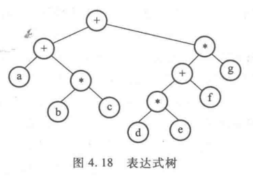
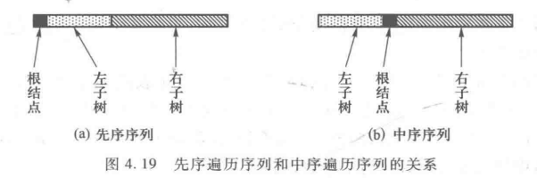

### 表达式树及其遍历

​		**表达式树（表达式由一系列运算符号和运算数组成的）**。现只考虑二元运算，故可以用二叉树很好的表示。

例如： a + b * c + ( d * e + f ) * g                  树表示为下图

对该树进行中序、前序、后序遍历的结果分别为：

| 中序 | a + b * c + d * e + f * g | 中缀表达式 |
| ---- | ------------------------- | ---------- |
| 前序 | + + a * b c * + * d e f g | 前缀表达式 |
| 后序 | a b c * + d e * f + g * + | 后缀表达式 |

注：由于优先级不同，中序遍历不一定代表中缀表达式。

### 两种遍历序列确定二叉树	

​		任意一颗二叉树节点的先序遍历序列和中序遍历序列都是唯一的。反过来，知道两种遍历也能确定唯一一颗二叉树。

##### 已知先序遍历和中序遍历：

​		先序遍历：总是先访问自己节点再访问左子树、右子树，故先序遍历的头一定是根节点；

​		中序遍历：先访问左子树，再访问根节点和右子树，故根节点在中间。

所以，很容易找出根节点、左子树头结点、右子树头结点。然后对左子树进行相同的递归，便可确定唯一二叉树。

##### 已知遍历和中序遍历：

​		后序遍历：最后一个是根节点。

​		中序遍历：如上。

也是可以快速找出三个节点，然后递归下去

