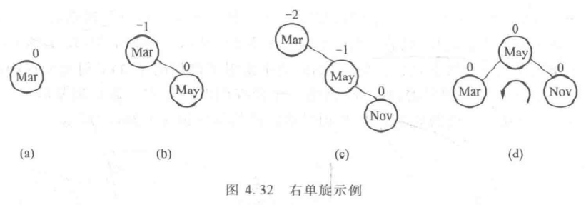
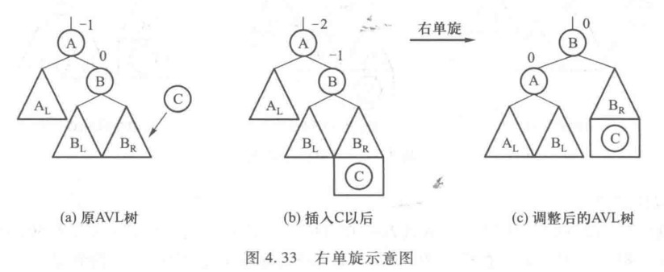
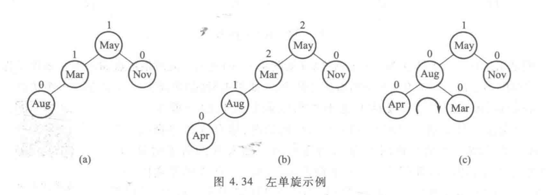
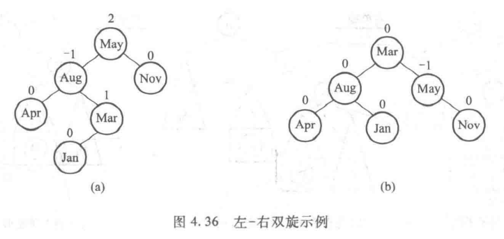
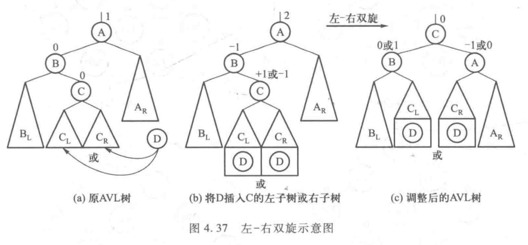
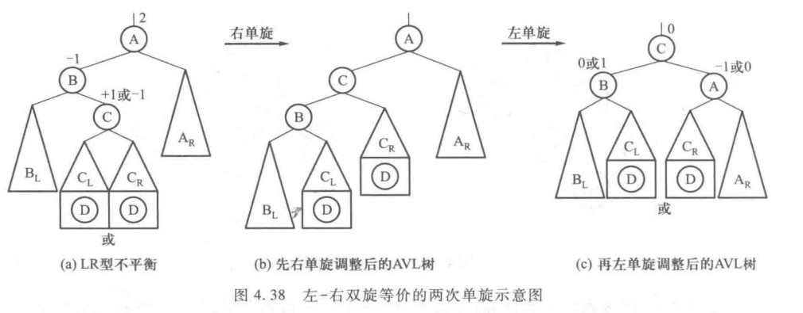
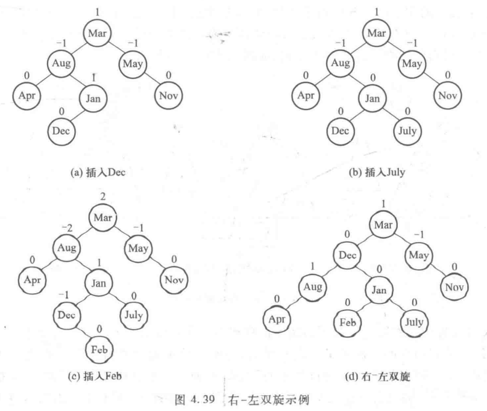

# 平衡二叉树

​		**平衡二叉树（Balanced Binary Tree）**又称**AVL树**，是最早被提出的自平衡二叉搜索树。AVL树的插入、删除、查找操作均可在 O（logN）时间内完成。

#### 定义：

1 任一节点的左、右字数均为AVL树；

2.根节点左、右子树高度差的绝对值不超过1.

3.对于二叉树中任一节点T，其**平衡因子（Balance Factor，BF）**定义为   BF（T）= h（L）- h（R）, h（L）、h（R）为左、右子树高度。

有了平衡因子的定义，AVL树 “ 任一节点左右子树高度差的绝对值不超过 1 ” 这一性质可以表述为 “ 一颗 AVL 树种任一节点的平衡因子只能在集合 **{ -1 , 0 , 1 }** 中取值 ”。这就是平衡的量化标准。

## 平衡二叉树的调整

​		当向一颗AVL树中插入新节点时，该节点的平衡因子可能不是 **{ -1 , 0 , 1 }**，这样就破坏了AVL的平衡，这是就需要做 “ 平衡化 ”的操作，即相应的局部 “ 旋转 ”，使调整后的树达到平衡。

### 1.单旋平衡

以12月为例，   依次插入Mar、May、Nov

​		当 Nov 插入后，Mar的平衡因子为 -2 ，  解决方法是将树做逆时针旋转，如图 4.32(d)中箭头所示，达到了平衡状态。

​		那么不平衡调整的一般规律是什么呢？

​		如上图 ， 
​		在（a）中，T（A）= -1 ，T(B) = 0 ；
​		在（b）中，T（A）= -2 ，T(B) = -1；此时可以看到被插入节点C、发现问题的节点A以及他们之间路径上的节点B三个节点向右排成一线，我们成这种右子树的不平衡状态为 RR （向右倾斜）型不平衡。

​		**RR 型不平衡的调整策略是通过逆时针旋转相关节点**，将 B 置于 A 的位置，A 置为 B 的左子节点，C 所在的子树认为 B 的右子树。若 B 以前有左子树，则将其左子树置为 A 的右子树。这个调整过程称为 “ **右单旋** ”，如图（c）。

​		类似的，我们可以判断与 RR 型相对称的 LL 型不平衡，并用 “ **左单旋** ” 处理产生这种向左倾斜的不平衡。

### 2.双旋调整

​		继续向上图 4.34 中插入节点 Jan，并自底向上计算平衡因子，得到下图（a）所示的结构。

​		与上述单旋调整的 LL 型 和 RR 型不平衡不同的是，三个相关节点的倾斜是 “ 先左后右 ” 的排列心事，我们称其为 **LR 型不平衡**。解决 LR 型不平衡问题的办法是  “ 左-右双旋 ”，如4.36（b）所示。 

​		以下图为例说明调整 LR 型不平衡的规律。 一般情况下，若产生问题的节点 D 在发现问题的节点 A 的左子节点 B 的右子树（以C为根节点）中，称为 LR 型不平衡， 如下图（b）所示。调整是将 C 置于 A 的位置， A 及其右子树调整为 C 的右子树。原 C 的左子树将作为 B 的右子树，而原 C 的右子树则作为 A 的左子树，如下图（c）所示。

​		之所以称为 “ 左右单旋 ”，是因为调整过程相当于先对以 B 为根节点的子树做了一次右单旋，再对以 A 为根节点的子树做了一次左单旋，是两次单旋的合成结果。

​		同理，用完全对称的方式可以用 **“ 右-左双旋 ” 来处理 RL 型不平衡**。

​		下图4.39是4.36（b）插入dec，july和feb三个节点的调整过程。

