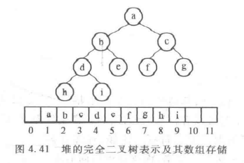
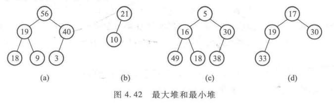

# 堆

​		队列的基本特征是 “ 先进先出 ”，在队列中没有哪个是有特权的，前面的没处理完后面的只能等待。 而堆（Heap）正是考虑了另一种需要特权的数据结构，因此，堆也通常被称为 **“ 优先队列 ”（Priority Queue）**。

#### 定义

​		堆是特殊的队列，从堆中取出的元素是按照元素的优先级大小，而不是进入的先后顺序。

#### 表示

​		1.如果使用数组表示，可以把新元素直接放末尾，复杂度O（1）；但插入删除优先级最高的元素必须遍历全部元素，并从数组中删除一个元素还涉及其他元素的位置移动问题，复杂度O（ N）。

​		2.如果使用有序数组，可以按优先级排序，这样删除只用删除最后一个元素即可，复杂度O（1）；问题是插入会变得很麻烦，需要保持有序，复杂度O（log N）,最坏情况下O（ N）

​		3.当使用链表时，新元素可插入在链头处，复杂度为O（1）；但删除元素必须遍历全部才能找到优先级最高的那个。

​		4.若使用有序链表，删除O(1)，插入O（N）。

​		综上，在最坏情况下复杂度都会达到O(N)。而我们知道，二叉搜索树的插入和删除都是O（log N）。

注意：1.树是层序存储在数组中的；2.数组的起始位为 1 ，为了方便计算。

​		用数组表示完全二叉树是堆的第一个特性，称为堆的结构特性。堆的另一特性是其部分有序性，即指任意节点元素的数值与其子节点的值有关。即：**最大堆（MaxHeap）**和**最小堆（MinHeap）**。

​		在最大堆中，任一节点的值大于或等于其子节点的值。所以根节点肯定是最大值。
​		在最小堆中，任一节点的值小于或等于其子节点的值。所以根节点肯定是最小值。

​		注：跟兄弟节点没有任何关系。

​		

​		当需要小键值优先时，可以使用最小堆；反之，当大键优先时，则要使用最大堆。

#### 操作（以最大堆为例，实现见code）

