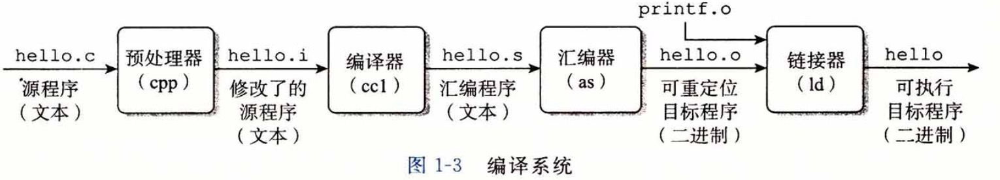

# 文件编译流程梳理

现有如下 hello.c：

```c++
#include <stdio.h>
int main() {
	printf ("hello, world\n") ;
	return 0;
}
```

​		在这里，GCC 编译器驱动程序读取源程序文件 hello.c ，并把它翻译成一个可执行目标文件 hello 。这个翻译过程可分为四个阶段完成，如下图所示。执行这四个阶段的程序(预处理器、编译器、汇编器和链接器)一起构成了编译系统(compilation system)。



- **预处理阶段。**<u>预处理器</u>把包含的头文件的内容直接<u>插入</u>到 **hello.c** 中。变成 **hello.i** 程序。
- **编译阶段。**<u>编译器</u>将文本文件 **hello.i** <u>翻译</u>成文本文件 **hello.s** ( 汇编程序 )。
- **汇编阶段。**<u>汇编器</u>将 **hello.s** 翻译成机器语言指令，并把这些指令打包成一个<u>可重定位目标程序</u>  **hello.o** 中。
- **链接阶段。**将 hello 程序中调用的其他库函数 (比如 printf ) 合并到 hello.o 程序中。最终得到可执行文件！


