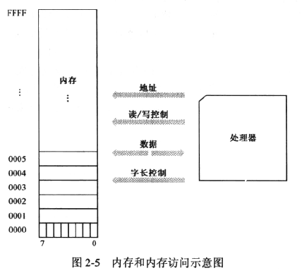
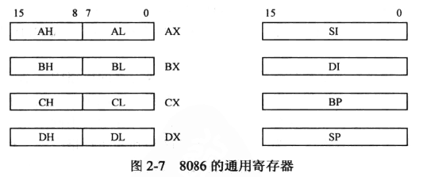
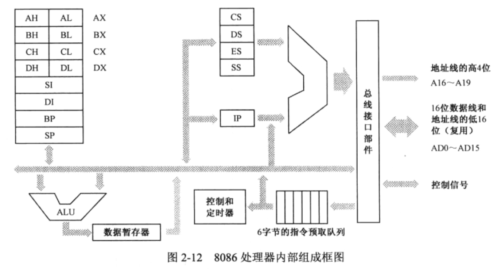

一、基础知识

寄存器：8位、16位、32位.....

**<u>32 位（bit） = 4 字节 = 2 字 = 1 双字</u>**

内存条：单次访问最小单位为 1 字节。

### 二、8086 处理器简介

​		8086 有 8 个 16 位通用寄存器，分别命名为：AX、BX、CX、DX、SI、DI、BP、SP。其中前四个可以拆分成两个 8 位寄存器来使用。

### 处理器内部组成：

​		**<u>ALU（算术逻辑部件）</u>**，计算后会将结果先存储到**<u>数据暂存器</u>**，**<u>控制器</u>**处理调度，6字节的**<u>指令预取队列</u>**排队。

​		8086 内部有 4 个**<u>段寄存器</u>**。**<u>CS 是代码段寄存器</u>**，**<u>DS 是数据段寄存区</u>**，**<u>SS 是栈段寄存器</u>**，**<u>ES 是附加段寄存器</u>**：附加段的意思是，它是额外赠送的礼物，当需要在程序中同时使用两个数据段时，DS指向一个，ES指向另一个。

​		**<u>IP 是指令指针计算器</u>**，它只和 CS 一起使用，而且只有处理器才能改变它的内容。当一段代码开始执行时，CS 指向代码段的起始地址，IP 则指向段内偏移。

