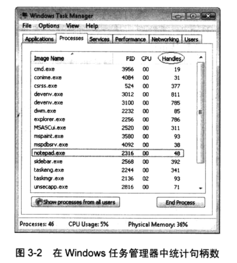

## 进程内核对象句柄表

​		一个进程在初始化时，系统将为它分配一个**句柄表 ( handle table ) **。这个句柄表仅供内核对象使用，不适用于用户对象或 GDI 对象。句柄表的结构如何？如何管理句柄表？这些细节尚无文档可以参考。一般情况下，我会避免讨论操作系统中没有编档的主题。但这里要破例一下，因为我认为作为一名优秀的 Windows 程序员，必须理解如何管理进程的句柄表。由于这些信息还没有正式编入文档，所以我不敢保证这里所讨论的细节都是准确无误的，而且不同 Windows 版本的内部实现肯定有所区别。所以，下面的讨论只是帮助我们增强理解, 而不是让我们正式地学习系统的运行机制。

​		表 3-1 显示了一个进程的句柄表。可以看出，它只是一个由数据结构组成的数组。每个结构都包含指向一个内核对象的指针、一个**访问掩码(access mask)**和一些标志。


### 1.创建一个内核对象

​		一个进程首次初始化的时候，其句柄表为空。当进程内的一个线程调用一个会创建内核对象的函数时 ( 比如**CreateFileMapping** ) , 内核将为这个对象分配并初始化一个内存块。然后, 内核扫描进程的句柄表，查找一个**空白的记录项 ( empty entry )** 。由于表3-1展示的是一个空白句柄表，所以内核在索引 1 位置找到空白的记录项，并对其进行初始化。具体地说，指针成员会被设置成内核对象的数据结构的内部内存地址，访问掩码将被设置成拥有完全访问权限，标志也会设置 ( 我将在3.3.1节“使用对象句柄继承”讨论标志的问题 ) 。

​		下面列出了一些用创建内核对象的函数 ( 当然并不完整 )：

```C++
HANDLE CreateThread(
	PSECURITY_ATTRIBUTES psa, 
    size_t dwStackSize,
	LPTHREAD_START_ROUTINE pfnStartAddress,
	PVOID pvParam,
	DWORD dwCreationFlags,
	PDWORD pdwThreadld
);

HANDLE CreateFile(
	PCTSTR pszFileName,
	DWORD dwDesiredAccess,
	DWORD dwShareMode,
	PSECURITY_ATTRIBUTES psa, 
    DWORD dwCreationDisposition, 
    DWORD dwFlagsAndAttributes, 
    HANDLE hTemplateFile
);

HANDLE CreateFileMapping( 
    HANDLE hFile, 
    PSECURITY_ATTRIBUTES psa, 
    DWORD flProtect,
	DWORD dwMaximumSizeHigh, 
    DWORD dwMaximumSizeLow, 
    PCTSTR pszName
);

HANDLE CreateSemaphore(
	PSECURITY_ATTRIBUTES psa,
	LONG UnitialCount,
	LONG lMaxiraumCount,
	PCTSTR pszName
);
```

​		用于创建内核对象的任何函数都会返回一个与进程相关的句柄，这个句柄可由同一个进程中运行的所有线程使用。系统用索引来表示内核对象的信息保存在进程句柄表中的具体位置，要得到实际的索引值，句柄值实际应该除以 4 ( 或右移两位，以忽略 Windows 操作系统内部使用的最后两位)。所以，在调试应用程序时查看内核对象句柄的实际值时，会看到 4 、 8 之类的很小的值。记住，句柄的含义尚未公开，将来可能发生变化。

​		调用一个函数时，如果它接受一个内核对象句柄作为参数，就必须把 Create* 函数返回的值传给它。在内部，这个函数会查找进程的句柄表，获得目标内核对象的地然后以一种恰当的方式来操纵对象的数据结构。

​		如果传入一个无效的句柄，函数就会失败，**GetLastError** 会返回 **6 (ERROR_INVALID_HANDLE)**。由于句柄值卖际是作为进程句柄表的索引来使用的，所以这些句柄是与当前这个进程相关的，无法供其他进程使用。如果我们真的在其他进程中使用它，那么<u>实际引用的只是那个进程的句柄表中位于同一个索引的内核对象——只是索引值相同而已</u>，我们根本不知道它会指向什么对象。

​		调用函数来创建一个内核对象时，如果调用失败，那么返回的句柄值通常为 0 ( **NULL** )，这就是为什么第一个有效的句柄值为 4 的原因。之所以失败，可能是由于系统内存不足，或者遇到了一个安全问题。遗憾的是，有几个函数在调用失败时会返回句柄值 1 ( 也就是在 WinBase.h 中定义的 **INVALID_HANDLE_VALUE** ) 。例如，如果 **CreateFile** 无法打开指定 文件，它会返回 **INVALID_HANDLE_VALUE** , 而不是 **NULL** 。凡是用于创建内核对象的函数，在检查它们的返回的值时，务必相当仔细。具体说来，以当前这个例子为例，只有在调用 **CreateFile** 时，才能将它的返回值与 INVALID_HANDLE_VALUE 进行比较。以下代码是不正确的：

```c++
	HANDLE hMutex = CreateMutex (...);

    if {hMutex == INVALID_HANDLE_VALUE) {
		// We will never execute this code because 
    	// CreatMutex returns NULL if it fails.
	}
```

类似地，以下代码也是不正确的：

```c++
	HANDLE hFile = CreateFile(...);

	if (hFile == NULL) {
		// We will never execute this code because CreateFile 
    	//returns INVALXD_HANDLE_VALUE {-1) if it Jails.
	}
```


### 2.关闭内核对象

​		无论以什么方式创建内核对象，我们都要调用 **CloseHandle** 向系统表明我们己经结束使用对象，如下所示：

```c++
	BOOL CloseHandle(HANDLE hobject);
```

​		在内部，该函数首先检查主调进程的句柄表，验证 “ 传给函数的句柄值 ” 标识的是 “ 进程确实有权访问的一个对象 ” 。如果句柄是有效的，系统就将获得内核对象的数据结构的地址，并将结构中的 “ 使用计数 ” 成员递减。如果使用计数变成 0 , 内核对象将被销毁，并从内存中去除。

​		如果传给**CloseHandle**函数的是一个无效的句柄，那么可能发生以下两种情况之一：如果进程是正常运行的，**CloseHandle**将返回**FALSE**，而**GetLastError**返回 **ERROR_INVALID_HANDLE**。如果进程正在被调试，那么系统将抛出 OxC0000008 异常 ( “ 指定了无效的句柄 ”），便于我们调试这个错误。

​		就在 **CloseHandle** 函数返回之前，它会清除进程句柄表中对应的记录项 —— 这个句柄现在对我们的进程来说是无效的，不要再试图用它。无论内核对象当前是否销毁，这个清除过程都会发生！ 一旦调用 **CloseHandle** ,我们的进程就不能访问那个内核对象；但是，如果对象的使用计数还没有递减至 0 , 它就不会被销毁。这是完全正常的；它表明另外还有一个或多个进程在使用该对象。当其他进程 ( 通过调用 **CloseHandle** ) 全部停止使用这个对象后，对象就会被销毁。

——————————————————————————————————————————————————		**说明**
		通常，在创建一个内核对象时，我们会将相应的句柄保存到一个变量中。将此变量作为参数调用 CloseHandle 函数后，还应同时将这个变量设为 NULL 。如果不小心用这个变量来调用了一个 Win32 函数，可能会发生两种意外情况。第一种可能的情况是，由于此变量所引用的句柄表记录项已被清除，所以 Windows 会接收到一个无效的参数并报告错误。另外，还可能发生另一种更难调试的情况。创建一个新的内核对象时，Windows 会在句柄表中查找空白记录项，所以，如果应用程序已经创建好一些新的内核对象，那么该变量所引用的句柄表肯定包含某个新建的内核对象。因此，要函数调用时，一旦错误地用这个尚未设为 NULL 的变量，就可能会定位到 一个错误类型的内核对象 ( 这种情况会报错 )，更糟的情况是，可能会定位到一个类型 ( 和已经关闭的内核对象 ) 相同的内核对象 ( 这种情况不会报错 ) 。在第二种情况下， 应用程序的状态将损坏，没有任何办法可以恢复。——————————————————————————————————————————————————

​		假定忘记调用 **CloseHandle** , 会发生对象泄漏的情况吗？嗯，不一定。在进程运行期间， 进程可能发生资源 ( 比如内核对象 ) 泄漏的情况。但是，当进程终止运行，操作系统会确保此进程所使用的所有资源都被释放——这是可以保证的！对于内核对象，操作系统执行的是以下操作：进程终止时，系统动扫描该进程的句柄表。如果这个表中有任何有效的记录项 ( 即进程终止前没有关闭的对象 ) ，操作系统会为我们关闭这些对象句柄。只要这些对象中有一个的使用计数递减至 0 , 内核就会销毁对象。

​		所以，在应用程序运行时，它可能会泄漏内核对象：但当进程终止运行，系统能保证一切都被正确清除。顺便说一下，这适用于所有内核对象、资源 ( 包括 GDI 对象在内 ) 以及内存块。进程终止运行时，系统会确保我们的进程不会留下任何东西。要在应用程序运行期间检测内核对象泄漏，一个简单的办法是使用 Windows 任务管理器。首先，如图 3-1 所示， 需要选择 View ( 查看）| Select Columns ( 选择列 ) 菜单，然后在 **Select Process Page Columns ( 选择进程页列 )** 对话框中，指定在Processes ( 进程 ) 选项卡中显示 Handles ( 句柄数 ) 列。


​		然后就可以监视任何一个应用程序使用的内核对象数了，如图 3-2 所示。



​		如果 Handles 列显示的数字持续增长，下一步我们就要确定哪些内核对象尚未关闭。

