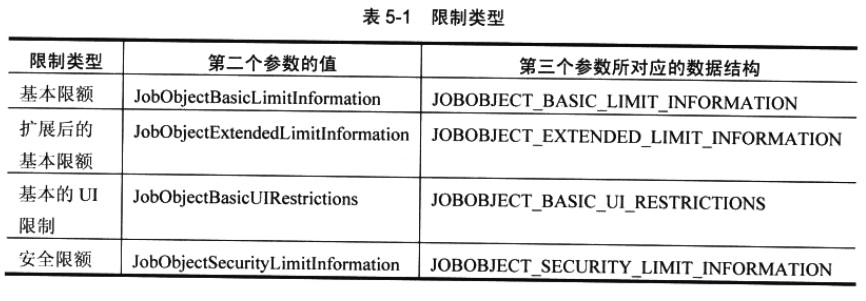
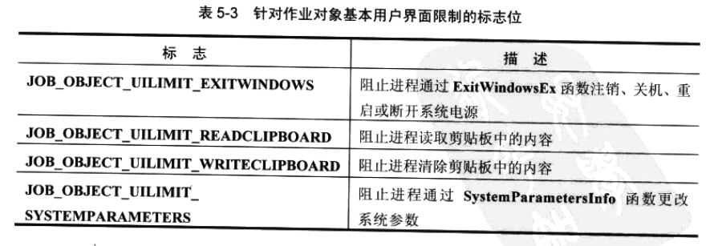
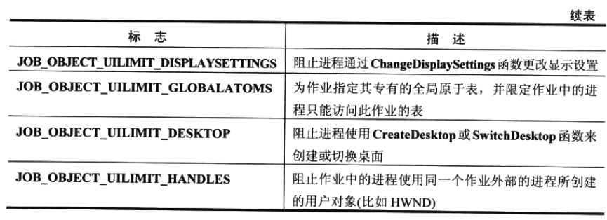

## 对作业中的进程施加限制

​		创建好一个作业之后，接着一般会根据作业中的进程能够执行哪些操作来建立一个沙箱 ( 即施加限制 )。可以向作业应用以下几种类型的限制：

* **基本限额和扩展基本限额，用于防止作业中的进程独占系统资源。**

* **基本的 UI 限制，用于防止作业内的进程吏改用户界面。**

* **安全限额，用于防止作业内的进程访问安全资源(文件、注册表子项等)。**

可以通过调用以下函数向作业施加限制：

```c
BOOL SetlnformationJobObject(
    HANDLE hJob,
    JOBOBJECTINFOCLASS JobObjectlnformationClass,
    PVOID pJobObjectlnformation,
	DWORD cbJobObjectinformacionSize
);
```

​		第一个参数指定要限制的作业。第二个参数是一个枚举类型，指定了要施加的限制的类型。 第三个参数是一个数据结构的地址，该数据结构中包含具体的限制设置。第四个参数指出此数据结构的大小(用于版本控制)。表5-1总结了如何设置这些限制。



​		在**StartRestrictedProcess**函数中，只对作业设置了一些基本的限制。分配了一 个**JOBOBJECT_BASIC_LIMIT_INFORMATION**结构，对它进行初始化，然后调用 **SetlnformationJobObjec**。**JOBOBJECT_BASIC_LIMIT_INFORMATION** 结构如下所示：

```c
typedef struct _JOBOBJECT_BASIC_LIMIT_INFORMATION {
    LARGE_INTEGER PerProcessUserTimeLimit；
    LARGE_INTEGER PerJobUserTimeLimit；
    DWORD	LimitFlags；
    DWORD	MinimumWorkingSetSize；
    DWORD	MaximumWorkingSetSize;
    DWORD	ActiveProcessLimit;
    DWORD_PTR Affinity；
    DWORD	PriorityClass；
    DWORD	SchedulingClass;
} JOBOBJECT_BASIC_LIMIT_INFORMATION, *PJOBOBJECT_BASIC_LIMIT_INFORMATION;
```

表5-2简要描述了这些成员。


​		关于这个结构，Platform SDK文档中解释得不够清楚，所以这里要稍微多说几句。在 **LimitFlags**成员中，可以设置标志位来指定希望应用于此作业的限制条件。例如，在 **StartRestrictedProcess** 函数中，设置了 **JOB_OBJECT_LIMIT_PRIORITY_CLASS** 和**JOB_OBJECT_LIMlT_JOB_TIME**这两个标志位。这意味着我只对作业施加了两个限制。 至于CPU Affinity(CPU关联性，即限制进程能用什么CPU来运行)、工作集大小、每个进程的 CPU 时间等，没有进行任何限制。	

​		作业运行过程中，它会维护一些统计信息，比如作业中的进程使用了多少CPU时间。每次 使用**JOB_OBJECT_LIMIT_JOB_TIME**标志来设置基本限额的时候，作业都会扣除已终止运行的进程的CPU时间统计信从而显示当前活动的进程使用了多少CPU时间。但是，假如我们想改变作业的 CPU 关联性，同时不想重置 CPU 时间统计信息，又该怎么办呢？为此，我们必须使用**JOB_OBJECT_LIMIT_AFFINITY**标志设置一个新的基本限额, 同时必须取消设置**JOB_OBJECT_LIMIT_JOB_TIME**标志。但是，这样做相当于告诉作业我们不再希望对CPU时间施加限制。而这并不是我们希望的。

​		现在，我们希望既更改关联性限制，又保留现有的CPU时间限制；只是不希望扣除己终止进程的 CPU 时间统计信息。为了解决这个问题，请使用一个特殊的标志，即 **JOB_OBJECT_LIMIT_PRESERVE_JOB_TIME**。这个标志和 **JOB_OBJECT_LIMIT_JOB_TIME** 标志是互斥的。**JOB_OBJECT_LIMIT_PRESERVE_JOB_TIME** 标志指出我们希望在改变限制条件的同时，不扣除已终止运行的那些进程的CPU时间统计 信息。

​		接下来研究一下 **JOBOBJECT_BASIC_LIMIT_INFORMATION** 结构的 **ScheduHngClass** 成员。设想现在有两个作业正在运行，而且我们将这两个作业的优先级类(priority class)都设为**NORMAL_PRIORITY_CLASS**。但是，我们还希望一个作业中的进程能够比另一个 作业中的进程获得更多的CPU时间。为此，可以使用**ScheduUngClass**成员来更改“优先级类 ” 相同的各个作业的相对调度优先级(relative scheduling of job)。我们可以设置 0〜9 (含 0和9)的任何一个值，默认值是 5 。在Windows Vista中，这个值越大，表明系统要为特定 作业中的进程中的线程分配一个更长的时间量(timequantum);值越小，表明线程的时间量越小。

​		例如，假定现在有两个 Normal 优先级类的作业。每个作业都有一个进程，而且每个进程都只有一个(Normal优先级)线程。正常情况下，这两个线程以轮询(round-robin)方式调度，各自获得相同的时间量。但是，如果将第一个作业的**ScbedulingClass**成员设置为 3 , 那么为这个作业中的线程调度 CPU 时间时，它们的时间量将少于第二个作业中的线程。

​		使用**SchedulingClass**成员时，应避免使用很大的数字 ( 进而造成很大的时间量 ) 。这是由于时间童变得越大，系统中的其他作业、进程以及线程的反应会变得越来越迟钝。

​		值得注意的最后一个限额是 **JOB_OBJECT_LIMIT_DIE_ON_UNHANDLED_EXCEPTION** 限额标志。这个限额会导致系统关闭与作业关联的每一个进程的 “ 未处理的异常 ” 对话框。为此，系统会为作业中的每个进程调用**SetErrorMode**函数，并向它传递 **SEM_NOGPFAULTERRORBOX**标志。作业中的一个进程在引发一个未处理的异常后，会立即终止运行，不会显示任何用户界面。对于服务和其他面向批处理任务的作业，这是相当有价值的一个限额标志。如果不设置这个标志，作业中的进程就能抛出异常，而目永远不会终止运行，从而造成系统资源的浪费。

​		除了基本限额外，还可以使用**JOBOBJECT_EXTENDED_LIMIT_INFORMATION**结构对作业应用扩展限额：

```c
typedef struct _JOBOBJECT_EXTENDED_LIMIT_INFORMATION {
    JOBOBJECT_BASIC_LIMIT_INFORMATION BasicLimitInformation;
    IO_COUNTERS Ioinfo；
    SIZE_T ProcessMemoryLimit;
    SIZE_T JobMemoryLimit;
    SIZE_T PeakProcessMemoryUsed；
    SIZE_T PeakJobMemoryUsed;
} JOBOBJECT_EXTENDED—LIMIT—INFORMATION, *PJOBOBJECT_EXTENDED_LIMIT一INFORMATION;
```

​		可以看出，该结构包含一个**JOBOBJECT_BASIC_LIMIT_INFORMATION**结构，这就使它成为基本限制的一个超集。该结构有点诡异，因为它包含了与限制作业无关的成员。首先，**IoInfo**是保留成员，不应以任何方式访问它。本章稍后将讨论如何查询 I/O 计数器信息。此外，**PeakProcessMemoryUsed**和**PeakJobMemoryUsed**成员是只读的，分别告诉我们己调拨给作业中的任何一个进程所需的存储空间的峰值，以及己调拨给作业中全部进程所需的存储空间的峰值。

​		其余两个成员**ProcessMemoryLimit**和**JobMemoryLimit**分别限制着作业中的任何一个进程或全部进程所使用的己调拨的存储空间。为了设置这样的限制，需要在**LimitFlags**成员中分别指定 **JOB_OBJECT_LIMIT_JOB_MEMORY** 和 **JOB_OBJECT_LIMIT_PROCESS_MEMORY**

​		再来看看能对作业施加的其他限制。**JOBOBJECT_BASIC_UI_RESTRICTIONS**结构如下所示：

```c
typedef struct _JOBOBJECT_BASIC_UI_RESTRICTIONS {
	DWORD UIRestrictionsClass;
} JOBOBJECT_BASIC_UI_RESTRICTI0NS, *PJOBOBJECT_BASIC_UI_RESTRICTIONS;
```

​		该结构只有一个数据成员，即**UIRestrictionsClass**，它容纳着表5-3 所示的标志位集合。





​		最后一个标志**JOB_OBJECT_UILIMIT_HANDLES**特别有意思。该限制意味着作业中的任何一个进程都不能访问作业外部的进程所创建的用户对象。所以，如果试图在一个作业内运行Microsoft Spy++,就只能看到Spy++自己创建的窗口，看不到其他任何窗口。阁5-1 展示了已打开两个MDI子窗口的Spy++程序。