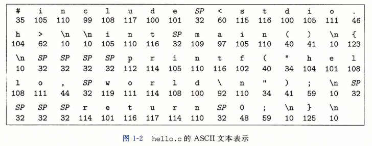
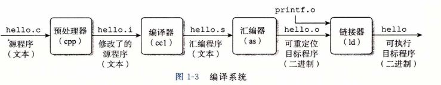

### 信息就是位+上下文

​		我们从一个hello程序开始

```c
#include <stdio.h>

int main()
{
	printf("hello world\n");
	return 0;
}
```

​		大部分的现代计算机系统都使用ASCII标准来表示文本字符，这种方式实际上就是用 —个唯一的单字节大小的整数值0来表示每个字符。比如，图1-2中给出了 hello.c程序 的ASCII码表示。



​		hello.c程序是以字节序列的方式储存在文件中的。每个字节都有一个整数值，对应于某些字符。例如，第一个字节的整数值是35,它对应的就是字符“# ”。第二个字 整数值为105,它对应的字符是‘i’，依此类推。注意，每个文本行都是以一个看不见的换行符'\n'来结束的，它所对应的整数值为10。像hello.c这样只由ASCII字符构成 的文件称为文本文件，所有其他文件都称为<u>二进制文件</u>。

​		hello.c的表示方法说明了一个基本思想：系统中所有的信息——括磁盘文件、内存中的程序、内存中存放的用户数据以及网络上传送的数据，都是由一串比特表示的。<u>区分不同数据对象的唯一方法是我们读到这些数据对象时的上下文</u>。比如，在不同的上下文中，一个同样的字节序列可能表示一个整数、浮点数、字符串或者机器指令。

​		作为程序员，我们需要了解数字的机器表示方式，因为它们与实际的整数和实数是不同的。它们是对真值的有限近似值，有时候会有意想不到的行为表现。这方面的基本原理将在第2章中详细描述。

### 程序被其他程序翻译成不同的格式

​		hello程序的生命周期是从一个高级C语言程序开始的，因为这种形式能够被人读懂。然而，为了在系统上运行hello.c程序，每条C语句都必须被其他程序转化为一系 列的低级机器语言指令。然后这些指令按照一种称为可执行目标程序的格式打好包，并以二进制磁盘文件的形式存放起来。目标程序也称为可执行目标文件。

​		在Unix系统上，从源文件到目标文件的转化是由编译器驱动程序完成的：

​									 linux> gcc -o hello hello.c

​		在这里，GCC编译器驱动程序读取源程序文件hello.c，并把它翻译成一个可执行目标文件hello。这个翻译过程可分为四个阶段完成，如图1-3所示。执行这四个阶段的 程序（预处理器、编译器、汇编器和链接器）一起构成了**编译系统（compilation system)**。



- <u>预处理阶段。</u> 预处理器（cpp)根据以字符#开头的命令，修改原始的C程序。比如 hello.c中第1行的#include < stdio.h>命令告诉预处理器读取系统头文件 stdio.h的内容，并把它直接插人程序文本中。结果就得到了另一个C程序，通常是以.i作为文件扩展名。

- <u>编译阶段。</u> 编译器(ccl)将文本文件hello.i翻译成文本文件hello.s，它包含一个汇编语言程序。该程序包含函数main的定义，如下所示：
  `1 main:`
  `2	subq	$8, %rsp`
  `3	movl	$.LCO, %edi`
  `4	call	puts`
  `5	movl	$0, %eax`
  `6	addq	$8, %rsp`
  `7	ret	`

   定义中2〜7行的每条语句都以一种文本格式描述了一条低级机器语言指令。 汇编语言是非常有用的，因为它为不同高级语言的不同编译器提供了通用的输出语言。例如，C编译器和Fortran编译器产生的输出文件用的都是一样的汇编语言。

- <u>汇编阶段</u>。接下来，汇编器(as)将hello.s翻译成机器语言指令，把这些指令打包成 一种叫做**可重定位目标程序（relocatable object program)**的格式，并将结果保存在目标文件hello.o中。hello.o文件是一个二进制文件，它包含的17个字节是函数main的指令编码。如果我们在文本编辑器中打开hello.o文件，将看到一堆乱码。

- <u>链接阶段</u>。请注意，hello程序调用了 printf函数，它是每个C编译器都提供的标准C库中的一个函数。printf函数存在于一个名为printf .o的单独的预编译好了的目标文件中，而这个文件必须以某种方式合并到我们的hello.o程序中。链接器（Id)就负责处理这种合并。结果就得到hello文件，它是一个可执行目标文件 (或者简称为可执行文件），可以被加载到内存中，由系统执行。

### 了解编译系统如何工作

​		对于像hello.c这样简单的程序，我们可以依靠编译系统生成正确有效的机器代码。但是，有一些重要的原因促使程序员必须知道编译系统是如何工作的。

- **优化程序性能**。现代编译器都是成熟的工具，通常可以生成很好的代码。作为程序员，我们无须为了写出高效代码而去了解编译器的内部工作。但是，为了在C程序中做出好的编码选择，我们确实需要了解一些机器代码以及编译器将不同的C语句转化 为机器代码的方式。比如，一个switch语句是否总是比一系列的if-else语句高效得多？一个函数调用的开销有多大？ while循环比for循环更有效吗？指针引用比数组索引更有效吗？为什么将循环求和的结果放到一个本地变量中，会比将其放到一个通过引用传递过来的参数中，运行起来快很多呢？为什么我们只是简单地重新排列一下算术表达式中的括号就能让函数运行得更快？
        在第3章中，我们将介绍x86-64,最近几代Linux、Macintosh和Windows计算机的机器语言。我们会讲述编译器是怎样把不同的C语言结构翻译成这种机器语言的。在第5章中，你将学习如何通过简单转换C语言代码，帮助编译器更好地完成工作，从而调整C程序的性能。，在第6章中，你将学习存储器系统的层次结构特性，C语言编译器如何将数组存放在内存中，以及C程序又是如何能够利用这些知识从而更高效地运行。

- **理解链接时出现的错误**。根据我们的经验，一些最令人困扰的程序错误往往都与链接器操作有关，尤其是当你试图构建大型的软件系统时。比如，链接器报告说它无法解析一个引用，这是什么意思？静态变量和全局变量的区别是什么？如果你在不同的C文件中定义了名字相同的两个全局变量会发生什么？静态库和动态库的区别 是什么？我们在命令行上排列库的顺序有什么影响？最严重的是，为什么有些链接错误直到运行时才会出现？在第7章中，你将得到这些问题的答案。
- **避免安全漏洞**。多年来，缓冲区溢出错误是造成大多数网络和Internet服务器上安全漏洞的主要原因。存在这些错误是因为很少有程序员能够理解需要限制从不受信任的源接收数据的数量和格式。学习安全编程的第一步就是理解数据和控制信息存储在程序栈上的方式会引起的后果。作为学习汇编语言的一部分，我们将在第3章 中描述堆栈原理和缓冲区溢出错误。我们还将学习程序员、编译器和操作系统可以用来降低攻击威胁的方法。