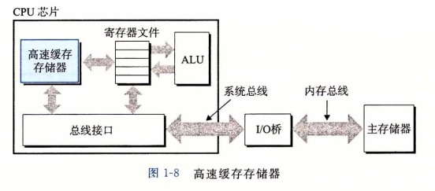
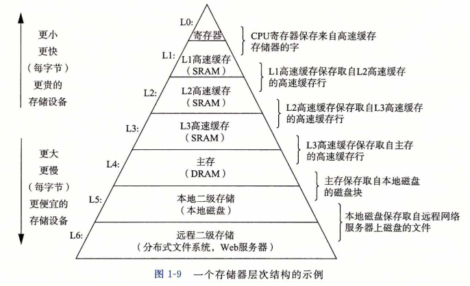
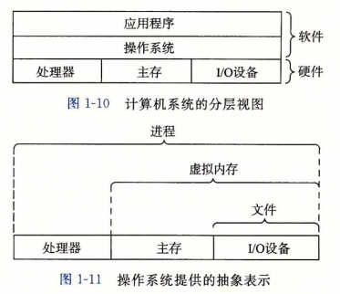

### 高速缓存

​		这个简单的示例揭示了一个重要的问题，即系统花费了大量的时间把信息从一个地方挪到另一个地方。hello程序的机器指令最初是存放在磁盘上，当程序加载时，它们被复制到主存；当处理器运行程序时，指令又从主存复制到处理器。相似地，数据串“hello, world/n” 开始时在磁盘上，然后被复制到主存，最后从主存上复制到显示设备。从程序员的角度来看，这些复制就是开销，减慢了程序“真正”的工作。因此，系统设计者的一个主要目标就是使这些复制操作尽可能快地完成。

​		根据机械原理，较大的存储设备要比较小的存储设备运行得慢，而快速设备的造价远高于同类的低速设备。比如说，一个典型系统上的磁盘驱动器可能比主存大1000倍，但是对处理器而言，从磁盘驱动器上读取一个字的时间开销要比从主存中读取的开销大1000万倍。

​		类似地，一个典型的寄存器文件只存储几百字节的信息，而主存里可存放几十亿字节。然而，处理器从寄存器文件中读数据比从主存中读取几乎要快100倍。更麻烦的是， 随着这些年半导体技术的进步，这种处理器与主存之间的差距还在持续增大。加快处理器的运行速度比加快主存的运行速度要容易和便宜得多。

​		针对这种处理器与主存之间的差异，系统设计者釆用了更小更快的存储设备，称为**高速缓存存储器（cache memory，简称为cache或高速缓存）**，作为暂时的集结区域，存放处理器近期可能会需要的信息。图1-8展示了一个典型系统中的高速缓存存储器。位于处理器芯片上的L1高速缓存的容量可以达到数万字节，访问速度几乎和访问寄存器文件一样快。一个容量为数十万到数百万字节的更大的L2高速缓存通过一条特殊的总线连接到处理器。进程访问L2高速缓存的时间要比访问L1高速缓存的时间长5倍，但是这仍然比访问主存的时间快5〜10倍。L1和L2高速缓存是用一种叫做**静态随机访问存储器（SRAM)** 的硬件技术实现的。比较新的、处理能力更强大的系统甚至有三级高速缓存：LI、L2和 L3。系统可以获得一个很大的存储器，同时访问速度也很快，原因是利用了高速缓存的局部性原理，即程序具有访问局部区域里的数据和代码的趋势。通过让高速缓存里存放可能经常访问的数据，大部分的内存操作都能在快速的高速缓存中完成。

​		本书得出的重要结论之一就是，意识到高速缓存存储器存在的应用程序员能够利用高速缓存将程序的性能提高一个数量级。你将在第6章里学习这些重要的设备以及如何利用它们。

#### 存储设备形成层次结构

​		在处理器和一个较大较慢的设备（例如主存）之间插入一个更小更快的存储设备（例如 高速缓存）的想法已经成为一个普遍的观念。实际上，每个计算机系统中的存储设备都被组织成了一个存储器层次结构，如图1-9所示。在这个层次结构中，从上至下，设备的访问速度越来越慢、容量越来越大，并且每字节的造价也越来越便宜。寄存器文件在层次结构中位于最顶部，也就是第0级或记为L0。这里我们展示的是三层高速缓存L1到L3, 占据存储器层次结构的第1层到第3层。主存在第4层，以此类推。

​		存储器层次结构的主要思想是上一层的存储器作为低一层存储器的高速缓存。因此， 寄存器文件就是L1的高速缓存，L1是L2的高速缓存，L2是L3的高速缓存，L3是主存的高速缓存，而主存又是磁盘的高速缓存。在某些具有分布式文件系统的网络系统中，本地磁盘就是存储在其他系统中磁盘上的数据的高速缓存。

​		正如可以运用不同的高速缓存的知识来提高程序性能一样，程序员同样可以利用对整个存储器层次结构的理解来提高程序性能。第6章将更详细地讨论这个问题。

#### 操作系统管理硬件

​		让我们回到hello程序的例子。当shell加载和运行hello程序时，以及hello程序输出自己的消息时，shell和hello程序都没有直接访问键盘、显示器、磁盘或者主存。取而代之的是，它们依靠操作系统提供的服务。我们可以把操作系统看成是应用程序和硬件之间插人的一层软件，如图1-10所示。所有应用程序对硬件的操作尝试都必须通过操作系统。

​		操作系统有两个基本功能：（1)防止硬件被失控的应用程序滥用；（2)向应用程序提供简单一致的机制来控制复杂而又通常大不相同的低级硬件设备。操作系统通过几个基本的抽象概念（进程、虚拟内存和文件）来实现这两个功能。如图1-11所示，文件是对I/O设备的抽象表示，虚拟内存是对主存和磁盘I/O设备的抽象表示，进程则是对处理器、主存和I/O设备的抽象表示。我们将依次讨论每种抽象表示。

