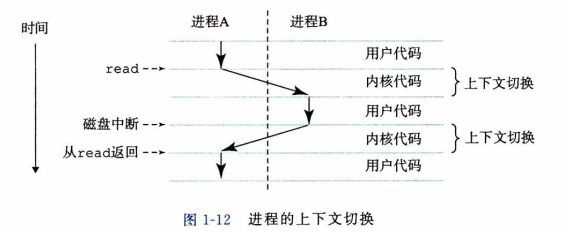
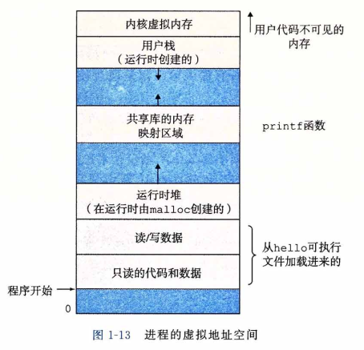

### 进程

​		像hello这样的程序在现代系统上运行时，操作系统会提供一种假象，就好像系统上只有这个程序在运行。程序看上去是独占地使用处理器、主存和I/O设备。处理器看上去就像在不间断地一条接一条地执行程序中的指令，即该程序的代码和数据是系统内存中唯一的对象。这些假象是通过进程的概念来实现的，进程是计算机科学中最重要和最成功的概念之一。

​		进程是操作系统对一个正在运行的程序的一种抽象。在一个系统上可以同时运行多个进程，而每个进程都好像在独占地使用硬件。而并发运行，则是说一个进程的指令和另一个进程的指令是交错执行的。在大多数系统中，需要运行的进程数是多于可以运行它们的CPU个数的。传统系统在一个时刻只能执行一个程序，而先进的多核处理器同时能够执行多个程序。无论是在单核还是多核系统中，一个CPU看上去都像是在并发地执行多个进程，这是通过处理器在进程间切换来实现的。操作系统实现这种交错执行的机制称为上下文切换。为了简化讨论，我们只考虑包含一个CPU的单处理器系统的情况。

​		操作系统保持跟踪进程运行所需的所有状态信息。这种状态，也就是上下文，包括许多信息，比如PC和寄存器文件的当前值，以及主存的内容。在任何一个时刻，单处理器系统都只能执行一个进程的代码。当操作系统决定要把控制权从当前进程转移到某个新进程时，就会进行上下文切换，即保存当前进程的上下文、恢复新进程的上下文，然后将控制权传递到新进程。新进程就会从它上次停止的地方开始。图1-12展示了示例hello程序运行场景的基本理念。

​		示例场景中有两个并发的进程：shell进程和hello进程。最开始，只有shell进程在运行，即等待命令行上的输人。当我们让它运行hello程序时，shell通过调用一个专门的函数，即系统调用，来执行我们的请求，系统调用会将控制权传递给操作系统。操作系统保存shell进程的上下文，创建一个新的hello进程及其上下文，然后将控制权传给新的hello进程。hello进程终止后，操作系统恢复shell进程的上下文，并将控制权传回给它，shell进程会继续等待下一个命令行输人。

​		如图1-12所示，从一个进程到另一个进程的转换是由**操作系统内核（kernel)**管理的。 内核是操作系统代码常驻主存的部分。当应用程序需要操作系统的某些操作时，比如读写文件，它就执行一条特殊的系**统调用（system call)指令**，将控制权传递给内核。然后内核执行被请求的操作并返回应用程序。注意，<u>内核不是一个独立的进程。相反，它是系统管理全部进程所用代码和数据结构的集合。</u>

​		实现进程这个抽象概念需要低级硬件和操作系统软件之间的紧密合作。我们将在第8 章中揭示这项工作的原理，以及应用程序是如何创建和控制它们的进程的。

#### 线程

​		尽管通常我们认为一个进程只有单一的控制流，但是在现代系统中，一个进程实际上可以由多个称为线程的执行单元组成，每个线程都运行在进程的上下文中，并共享同样的代码和全局数据。由于网络服务器中对并行处理的需求，线程成为越来越重要的编程模型，因为多线程之间比多进程之间更容易共享数据，也因为线程一般来说都比进程更高效。当有多处理器可用的时候，多线程也是一种使得程序可以运行得更快的方法，我们将 在1.9.2节中讨论这个问题。在第12章中，你将学习并发的基本概念，包括如何写线程化的程序。

#### 虚拟内存

​		虚拟内存是一个抽象概念，它为每个进程提供了一个假象，即每个进程都在独占地使用主存。每个进程看到的内存都是一致的，称为虚拟地址空间。图1-13所示的是Linux进程的虚拟地址空间(其他Unix系统的设计也与此类似）。在Linux中，地址空间最上面的区域是保留给操作系统中的代码和数据的，这对所有进程来说都是一样。地址空间的底部区域存放用户进程定义的代码和数据。请注意，图中的地址是从下往上增大的。

​		每个进程看到的虚拟地址空间由大量准确定义的区构成，每个区都有专门的功能。在 本书的后续章节你将学到更多有关这些区的知识，但是先简单了解每一个区是非常有益 的。我们从最低的地址开始，逐步向上介绍。

- **程序代码和数据**。对所有的进程来说，代码是从同一固定地址开始，紧接着的是和 •C全局变量相对应的数据位置代码和数据区是直接按照可执行目标文件的内容初始化的，在示例中就是可执行文件hello。在第7章我们研究链接和加载时，你会学习更多有关地址空间的内容。
- **堆**。代码和数据区后紧随着的是运行时堆。代码和数据区在进程一开始运行时就被指定了大小，与此不同，当调用像malloc和free这样的C标准库函数时，堆可以在运行时动态地扩展和收缩。在第9章学习管理虚拟内存时，我们将更详细地研究堆。
- **共享库**。大约在地址空间的中间部分是一块用来存放像C标准库和数学库这样的共享库的代码和数据的区域。共享库的概念非常强大，也相当难懂。在第7章介绍动态链接时，将学习共享库是如何工作的。
- **栈**。位于用户虚拟地址空间顶部的是用户栈，编译器用它来实现函数调用。和堆一 样，用户栈在程序执行期间可以动态地扩展和收缩。特别地，每次我们调用一个函数时，栈就会增长；从一个函数返回时，栈就会收缩。在第3章中将学习编译器是如何使用栈的。
- **内核虚拟内存**。地址空间顶部的区域是为内核保留的。不允许应用程序读写这个区 域的内容或者直接调用内核代码定义的函数。相反，它们必须调用内核来执行这些操作。

​         虚拟内存的运作需要硬件和操作系统软件之间精密复杂的交互，包括对处理器生成的每 个地址的硬件翻译。基本思想是把一个进程虚拟内存的内容存储在磁盘上，然后用主存作为 磁盘的高速缓存。第9章将解释它如何工作，以及为什么对现代系统的运行如此重要。

#### 文件

​		文件就是字节序列，仅此而已。每个I/O设备，包括磁盘、键盘、显示器，甚至网 络，都可以看成是文件。系统中的所有输入输出都是通过使用一小组称为Unix I/O的系 统函数调用读写文件来实现的。

​		文件这个简单而精致的概念是非常强大的，因为它向应用程序提供了一个统一的视图，来看待系统中可能含有的所有各式各样的I/O设备。例如，处理磁盘文件内容的应用程序员可以非常幸福，因为他们无须了解具体的磁盘技术。进一步说，同一个程序可以在使用不同磁盘技术的不同系统上运行。你将在第10章中学习Unix I/O。

