### 整数表示

​		在本节中，我们描述用位来编码整数的两种不同的方式：一种只能表示非负数，而另一个能够表示负数、零和正数。后面我们将会看到他们在数学属性和机器级实现方面密切相关。我们还会扩展或者收缩一个已编码整数以适应不同长度表示的效果。

​		图2-8 列出了我们引入的数学术语，用于精确定义和描述计算机如何编码和操作整数。这些术语将在描述的过程中接收，图在此列出作为参考。

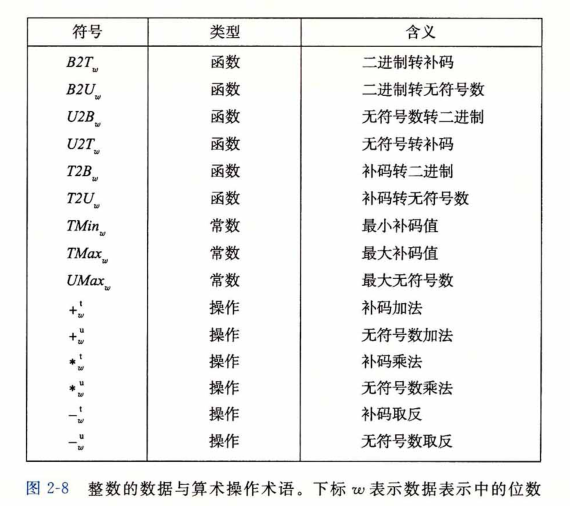

#### 整数数据类型		

​		C语言支持多种整型数据类型——表示有限范围的整数。这些类型如图2-9和图2-10 所示，其中还给出了 “典型” 32位和64位机器的取值范围。每种类型都能用关键字来指定大小，这些关键字包括char、short、long，同时还可以指示被表示的数字是非负数 (声明为unsigned)，或者可能是负数（默认）。如图2-3所示，为这些不同的大小分配的字节数根据程序编译为32位还是64位而有所不同。根据字节分配，不同的大小所能表示的值的范围是不同的。这里给出来的唯一一个与机器相关的取值范围是大小指示符long 的。大多数64位机器使用8个字节的表示，比32位机器上使用的4个字节的表示的取值范围大很多。

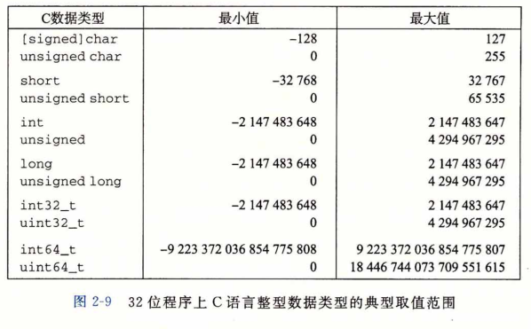

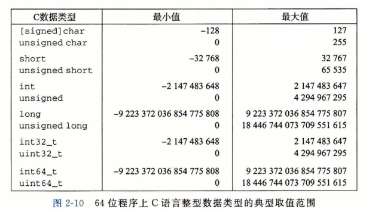

​		图2-9和图2-10中一个很值得注意的特点是取值范围不是对称的——负数的范围比整 数的范围大1。当我们考虑如何表示负数的时候，会看到为什么会这样。

​		C语言标准定义了每种数据类型必须能够表示的最小的取值范围。如图2-11所示，它们的取值范围与图2-9和图2-10所示的典型实现一样或者小一些。特别地，除了固定大小 的数据类型是例外，我们看到它们只要求正数和负数的取值范围是对称的。此外，数据类型int可以用2个字节的数字来实现，而这几乎回退到了16位机器的时代。还可以看到， long的大小可以用4个字节的数字来实现，对32位程序来说这是很典型的。固定大小的数据类型保证数值的范围与图2-9给出的典型数值一致，包括负数与正数的不对称性。

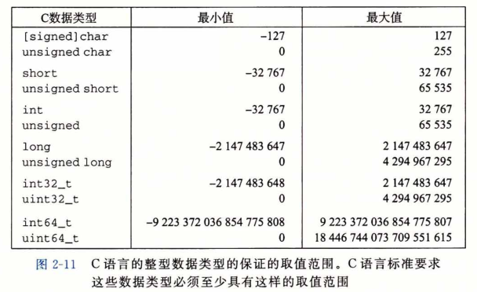

#### 无符号数的编码

​		假设有一个整数数据类型有w位。我们可以将位向量写成表示整个向量，或者写成[x(w-1)，x(w-2)，…，x(0)]，表示向量中的每一位。把x→看做一个二进制表示的数，就获得了x→的无符号表示。在这个编码中，每个位 x(i) 都取值为 0 或 1，后一种取值意味着数值 2^i 应 为数字值的一部分。我们用一个函数B2U(w)(Binary to Unsigned的缩写，长度为w)来表示：

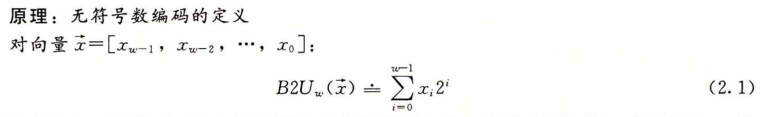

​		在这个等式中，符号“=”（=号上面一个点）表示左边被定义为等于右边。函数将一个长度为 w 的 0、1串映射到非负整数。举一个示例，图2-11展示的是下面几种情况下 B2U 给出的从位 向量到整数的映射：

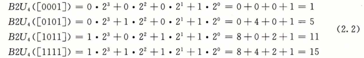

​		在图中，我们用长度为 2^i 的指向右侧箭头的条表示每个位的位置 i 。每个位向量对应的数值就等于所有值为 1 的位对应的条的长度之和。

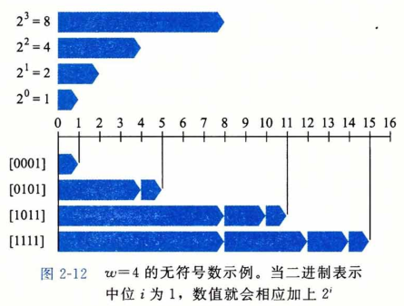

​		让我们来考虑一下w位所能表示的值的范围。最小值是用位向量[00•••0]表示，也就是整数值0, 而最大值是用位向量[11•••1]表示，也就是整数值

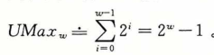

以4位情况i=0为例，

​																UMax(4)=B2U(4) ([1111]) = 2^4 -1 = 15。

因此，函数 B2U(w) 能够被定义为一个映射 B2U(w) : {0，1}^w→{0，…，2^w — 1}。

​		无符号数的二进制表示有一个很重要的属性，也就是每个介于0〜2^w— 1之间的数都有唯一一个 w 位的值编码。例如，十进制值11作为无符号数，只有一个4位的表示，即 [1011]。我们用数学原理来重点讲述它，先表述原理再解释。

​		**原理：** *无符号数编码的唯一性*

​		函数B2U(w)是一个双射。

​		数学术语**双射**是指一个函数f有两面：它将数值 x 映射为数值 y，即 y=f(x)，但它也可以反向操作，因为对每一个 y 而言，都有唯一一个数值 x 使得 f(x)=y 。这可以用反函数f^(-1)(x)来表示，在本例中，即 x=f^(-1)(y) 。函数将每一个长度为w的位向量都映射为 0〜2^w— 1之间的一个唯一值；反过来，我们称其为U2B（w）(即“无符号数到二进制”）， 在0〜2^w — 1之间的每一个整数都可以映射为一个唯一的长度为w的位模式。

#### 补码编码

​		对于许多应用，我们还希望表示负数值。最常见的有符号数的计算机表示方式就是**补码（two's-complement)**形式。在这个定义中，将字的最高有效位解释为**负权（negative weight）**。我们用函数说了如（Binary to Two’s-complement的缩写，长度为w）来表7K :

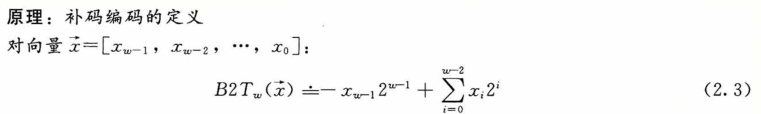

​		最高有效位也称为符号位，它的“权重”为一2^(w-1)、是无符号表示中权重的负数。符号位被设置为1时，表示值为负，而当设置为0时，值为非负。这里来看一个示 例，图2-13展示的是下面几种情况下 B2T 给出的从位向量到整数的映射。

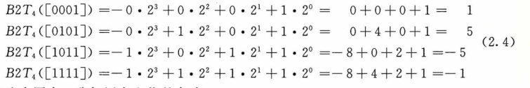

​		在这个图中，我们用向左指的条表 示符号位具有负权重。于是，与一个位 向量相关联的数值是由可能的向左指的条和向右指的条加起来决定的。

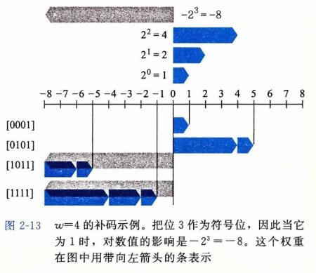

​		我们可以看到，图2-12和图2-13 中的位模式都是一样的，对等式 (2, 2) 和等式 (2.,4) 来说也是一样，但是当最 高有效位是1时，数值是不同的，这是因为在一种情况中，最高有效位的权重是 +8 ,而在另一种情况中，它的权重 是一8。

​		让我们来考虑一下w位补码所能表示的值的范围。它能表示的最小值是位向量[10•••0]（也就是设置这个位为负权，但是清除其他所有的位），其整数值为

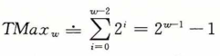
而最大值是位向量[01••• 1]（清除具有负权的位，而设置其他所有的位），其整数值为

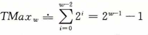

​		以长度为 4 为例，我们有 TMin(4) = B2T(4)([1000]) = —2^3 = —8，而TMin(4) = B2T(4)([0111]) = 2^2+2^1+2^0 = 7.

​		我们可以看出B2T(w)是一个从长度为w的位模式到TMin(w)和TMax(w)之间数字的映射，写作B2T(w):{0, 1}^w→{TMin(w),...,TMax(w)}。同无符号表示一样，在可表示的取值范围内的每个数字都有一个唯一的w位的补码编码。这就导出了与无符号数相似的补码数原理：

​		**原理**：*补码编码的唯一性*
​		函数是B2T(w)一个**双射**。

​		我们定义函数 T2B(w) (即"补码到二进制")作为 T2B(w) 的反函数。也就是说，对于每个数x，满足TMin(w)<=x<=TMax(w) , 则T2B2(w)(x)是x的（唯一的）w位模式。

### 有符号数和无符号数之间的转换

​		C语言允许在各种不同的数字数据类型之间做强制类型转换。例如，假设变量 x 声明 为int，u 声明为unsigned。表达式（unsigned） x会将x的值转换成一个无符号数值，而 (int)u 将 u 的值转换成一个有符号整数。将有符号数强制类型转换成无符号数，或者反过来，会得到什么结果呢？从数学的角度来说，可以想象到几种不同的规则。很明显，对 于在两种形式中都能表示的值，我们是想要保持不变的。另一方面，将负数转换成无符号数可能会得到0。如果转换的无符号数太大以至于超出了补码能够表示的范围，可能会得到TMax。不过，对于大多数C语言的实现来说，对这个问题的回答都是从位级角度来看的，而不是数的角度。

​		比如说，考虑下面的代码：

```c
1	short	int v = -12345;
2	unsigned short uv = (unsigned short) v;
3	printfC'v = %d, uv = %u/n", v, uv);
```

在一台采用补码的机器上，上述代码会产生如下输出：

​															 v = -12345, uv = 53191

​		我们看到，<u>强制类型转换的结果保持位值不变，只是改变了解释这些位的方式</u>。  在图2-15 中我们看到过，    -12 345的16位补码表示与53 191的16位无符号表示是完全一样的。将 short强制类型转换为unsigned short改变数值，但是不改变位表示。

​		类似地，考虑下面的代码：

```c
1	unsigned u = 4294967295u;	/* UMax */
2	int tu = (int) u;
3	printf('u = %u, tu = %d/u', u, tu);
```


在一台采用补码的机器上，上述代码会产生如下输出： 

​														u = 4294967295, tu = -1

​		从图2-14我们可以看到，对于32位字长来说，无符号形式的4 294 967 295(UMax(32)) 和补码形式的 -1 的位模式是完全一样的。将unsigned强制类型转换成int，底层的位表示保持不变。

​		对于大多数C语言的实现，处理同样字长的有符号数和无符号数之间相互转换的一般规 则是：数值可能会改变，但是位模式不变。让我们用更数学化的形式来描述这个规则。我们定义函数U2B（w）和T2B（w），它们将数值映射为无符号数和补码形式的位表示。也就是说，给定  0 <= x <= UMax（w）范围内的一个整数 x，函数U2B（w）（x）会给出 x 的唯一的 w 位无符号表示。 相似地，当 x 满足TMin(w) <= x <= TMax（w）,函数 T2B(w)(x) 会给出t的唯一的扣位补码表示。 

​		现在，将函数：T2U(w) ,定义为：

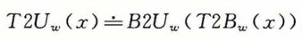

这个函数的输人是一个 TMin(w)~TMax(w) 的数，结果得到一个0〜UMax(w) 的值，这里两个数有相同的位模式，除了参数是无符号的，而结果是以补码表示的。类似地，对于0〜UMax(w) 之间的值 x ，定义函 数U2T（w）为

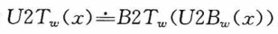

生成一个数的无符号表示和x的补码表示相同。

​		继续我们前面的例子，从图2-15中，我们看到T2U（16）( — 12 345) = 53 191，并且 U2T（16）(53 191) = — 12 345。也就是说，十六进制表示写作0xCFC7的16位位模式既是 一 12 345的补码表示，又是53 191的无符号表示。同时请注意12 345 + 53 191 = 65 536 = 2^16。这个属性可以推广到给定位模式的两个数值（补码和无符号数）之间的关系。类似地， 从图 2-14 我们看到：T2U（32）( —1) = 4 294 967 295,并且 U2T（32）（4294 967 295） = —1。也就是说，无符号表示中的UMax有着和补码表示的一 1相同的位模式。我们在这两个数之间也能看到这种关系：1+UMax(w) = 2^w。

​		接下来，我们看到函数 U2T 描述了从无符号数到补码的转换，而 T2U 描述的是补码到无符号的转换。这两个函数描述了在大多数C语言实现中这两种数据类型之间的强制类型转换效果。

​		通过上述这些例子，我们可以看到给定位模式的补码与无符号数之间的关系可以表示 为函数T2U的一个属性：
**原理**：*补码转换为无符号数*

 对满足 TMin(w) <= x <= TMax(w) 的 x 有 ：

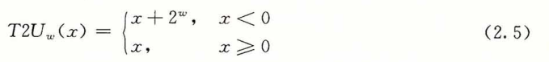

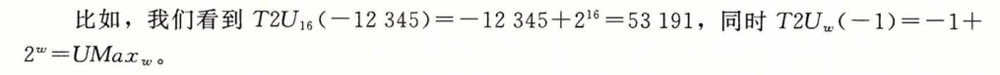
		该属性可以通过比较公式（2. 1)和公式（2. 3)推导出来。
		**推导**：补码转换为无符号数
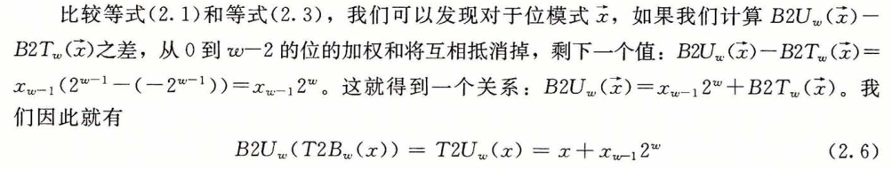
		根据公式(2.5)的两种情况，在 x 的补码表示中，位 x(w-1) 决定了 x 是否为负。
		比如说，图2-16比较了当 w=4 时函数 B2U 和 B2T 是如何将数值变成位模式的。对补码来说，最高有效位是符号位，我们用带向左箭头的条来表示。对于无符号数来说，最高有效位是正权重，我们用带向右的箭头的条来表示。从补码变为无符号数，最高有效位的权重从一8变为+ 8。因此，补码表示的负数如果看成无符号数，值会增加2^4 = 16。因 而，-5变成了+ 11，而-1变成了+ 15。

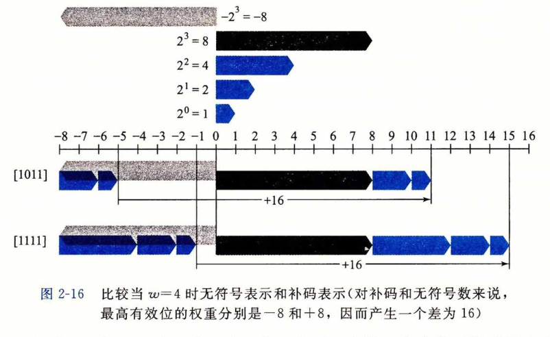

​		图2-17说明了函数T2U的一般行为。如图所示，当将一个有符号数映射为它相应的 无符号数时，负数就被转换成了大的正数，而非负数会保持不变。
@练习题2. 20 请说明等式(2. 5)是如何应用到解答练习题2.19时生成的表格中的各项的。 反过来看，我们希望推导出一个无符号数《和与之对应的有符号数U2rwu)之间的关系： 

**原理**：*无符号数转换为补码* 

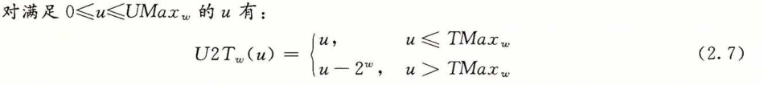
该原理证明如下：
**推导**：*无符号数转换为补码*

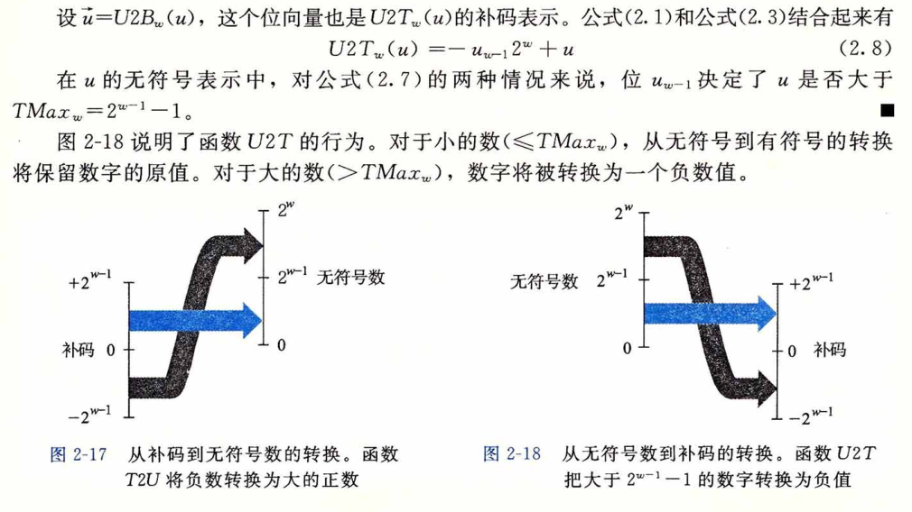

​		总结一下，我们考虑无符号与补码表示之间互相转换的结果。对于在范围 TMa〜之内的值工而言，我们得到：T2Uw(x) = x和也就是说，在这个范 围内的数字有相同的无符号和补码表示。对于这个范围以外的数值，转换需要加上或者减 去2'例如，我们有(一 1) = 一l + 2w=t/Max~——最靠近0的负数映射为最大的无 符号数。在另一个极端，我们可以看到：T2^(TM〇 = —2^1+211( = 2^1=丁]也〜+ 1——最小的负数映射为一个刚好在补码的正数范围之外的无符号数。使用图2-15的示 例，我们能看到了2LT1S( —12 345) = 65 563 + —12 345 = 53 191。

#### C语言中的有符号数与无符号数

​		如图 2-9 和图 2-10 所示，C语言支持所有整型数据类型的有符号和无符号运算。尽管 C语言标准没有指定有符号数要采用某种表示，但是几乎所有的机器都使用补码。通常， 大多数数字都默认为是有符号的。例如，当声明一个像12345或者0X1A2B这样的常量时， 这个值就被认为是有符号的。要创建一个无符号常量，必须加上后缀字符‘U’或者‘u’， 例如，12345U 或者 Qx1A2Bu。

​		C语言允许无符号数和有符号数之间的转换。虽然C标准没有精确规定应如何进行这 种转换，但大多数系统遵循的原则是底层的位表示保持不变。因此，在一台采用补码的机 器上，当从无符号数转换为有符号数时，效果就是应用函数C/2T~,而从有符号数转换为 无符号数时，就是应用函数其中如表示数据类型的位数。
显式的强制类型转换就会导致转换发生，就像下面的代码：

```c
1	int tx, ty;
2	unsigned ux, uy;
3
4	tx	=	(int) ux;
5	uy	=	(unsigned) ty;
```

​		另外，当一种类型的表达式被赋值给另外一种类型的变量时，转换是隐式发生的，就像下面的代码：

```c
1	int tx, ty;
2	unsigned ux, uy;
3
4	tx	=	ux; /* Cast	to	signed	 */
5	uy	=	ty; /* Cast	to	unsigned */
```

​		当用 printf 输出数值时，分别用指示符 %d、％u 和 ％x 以有符号十进制、无符号十进制 和十六进制格式输出一个数字。注意 printf 没有使用任何类型信息，所以它可以用指示符如来输出类型为int的数值，也可以用指示 符 ％d 输出类型为 unsigned 的数值。例如， 考虑下面的代码：

```c
1	int x = -1;
2	unsigned u = 2147483648; /* 2 to the 31st */
3
4	printf("x = %u =	%d/n"J	x,	x);
5	printf("u = %u =	%d/n"，	u，	u);
```

当在一个32位机器上运行时，它的输出如下： 

​		x   =   4294967295   =   -1 

​		u   =   2147483648   =   -2147483648

​		在这两种情况下，printf 首先将这个字当作一个无符号数输出，然后把它当作一个有符号数输出。以下是实际运行中的转换函数：T2U(32)(-1)=UMax(32) =2^32 — 1和U2T(32)(2^31) = 231 -232 = —2^31 = TMin(32)。

​		由于C语言对同时包含有符号和无符号数表达式的这种处理方式，出现了一些奇特的行为。当执行一个运算时，如果它的一个运算数是有符号的而另一个是无符号的，那么C 语言会隐式地将有符号参数强制类型转换为无符号数，并假设这两个数都是非负的，来执行这个运算。就像我们将要看到的，这种方法对于标准的算术运算来说并无多大差异，但是对于像 < 和 > 这样的关系运算符来说，它会导致非直观的结果。

​		图2-19展示了一些关系表达式的示例以及它们得到的求值结果，这里假设数据类型int表示为32位补码。考 虑比较式- 1 < 0U。因为第二个运算数是无符号的，第一个运算数就会被隐式地转换为无符号数，因此表达式就等价于 4294967295U < 0U (回想 T2U(W)(-1) = UMax(w) , 这个答案显然是错的。其他那些示例也可以通过相似的分析来理解。

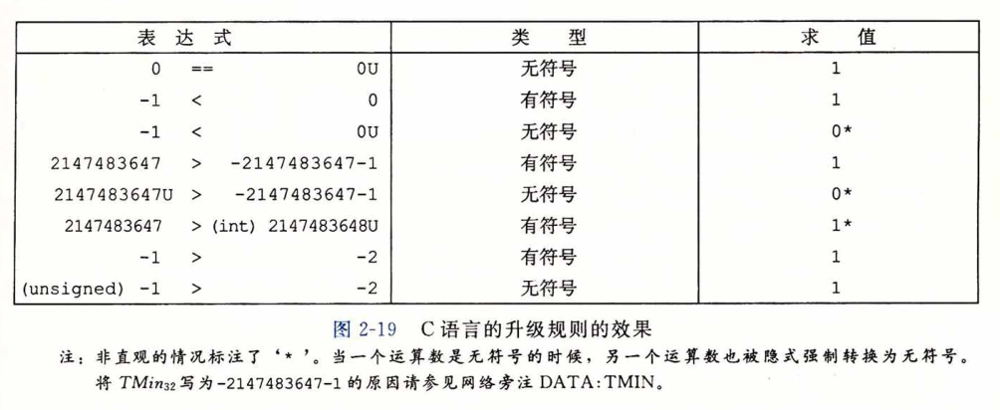

### 扩展一个数字的位表示

​		一个常见的运算是在不同字长的整数之间转换，同时又保持数值不变。当然，当目标数据类型太小以至于不能表示想要的值时，这根本就是不可能的。然而，从一个较小的数 据类型转换到一个较大的类型，应该总是可能的。

​		要将一个无符号数转换为一个更大的数据类型，我们只要简单地在表示的开头添加0。 这种运算被称为**零扩展（zero extension）**,表示原理如下：

**原理**：*无符号数的零扩展*

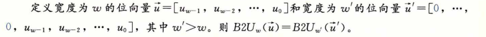

​		按照公式（2.1），该原理可以看作是直接遵循了无符号数编码的定义。	

​		要将一个补码数字转换为一个更大的数据类型，可以执行一个**符号扩展（sign extension）**， 在表示中添加最高有效位的值，表示为如下原理。我们用蓝色标出符号位 x(w-1) 来突出它在符号扩展中的角色。

**原理**：*补码数的符号扩展*

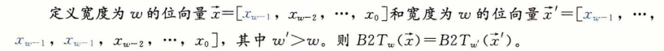

例如，	考虑下面的代码：

```c
1	short           sx = -12345;	        /* -12345	*/
2	unsigned short usx = sx;	            /*  53191	*/
3	int              x = sx;	            /* -12345	*/
4 	unsigned        ux = usx;	            /*  53191	*/
5
6	printf("sx: = %d:/t"，sx);		
7	show_bytes((byte_pointer)	&sx,  sizeof(short));	
8	printf("_usx = %u:/t"，usx);		
9	show_bytes((byte_pointer)   &usx, sizeof(unsigned short));	
10	printf("x = %d:/t", x);		
n	show_bytes((byte_pointer)	&x,   sizeof(int));	
12	printf("ux = %u:/t", ux);		
13	show_bytes((byte_pointer)	&ux,  sizeof(unsigned));	
```

在采用补码表示的32位大端法机器上运行这段代码时，打印出如下输出： 

```c
sx	 =	-12345 :	cf	c7
usx	 =	 53191 :	cf	c7
x	 =	-12345 :	ff	ff	cf	c7
ux	 =	 53191 :	00	00	cf	c7
```

​		我们看到，尽管 -12 345 的补码表示和 53 191 的无符号表示在16位字长时是相同的，但是 在32位字长时却是不同的。特别地， -12 345 的十六进制表示为0XFFFFCFC7,而  53 191  的十六进制表示为 0x0000CFC7。前者使用的是符号扩展——最开头加了 16位，都是最高有效位1， 表示为十六进制就是 0xFFFF。后者开头使用16个0来扩展，表示为十六进制就是0x0000。

​		图2-20给出了从字长到w=4的符号扩展的结果。位向量[101]表示值 -4 + 1 = -3 。对它应用符号扩展，得到位向量[1101]，表示的值 -8 + 4 + 1 = - 3。我们可以看到， 对于 w=4，最高两位的组合值是 -8 + 4 =-4，与 w = 3 时符号位的值相同。类似地，位 向量[111]和[1111]都表示值 -1。

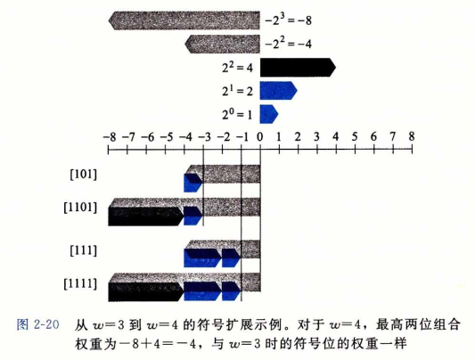

​		有了这个直觉，我们现在可以展示保持补码值的符号扩展。
推导：补码数值的符号扩展 

令w' = w+k ，我们想要证明的是

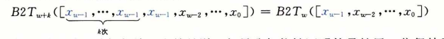

​		下面的证明是对 k 进行归纳。也就是说，如果我们能够证明符号扩展一位保持了数值不变，那么符号扩展任意位都能保持这种属性。因此，证明的任务就变为了：

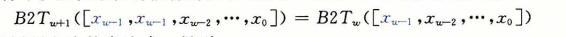

用等式（2. 3）展开左边的表达式，得到：

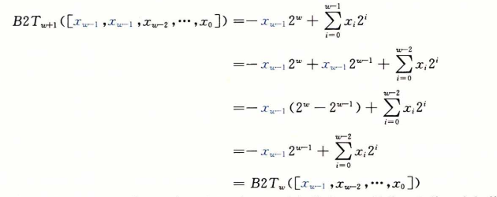

​		我们使用的关键属性是 2^w - 2 ^( w-1 ) = 2 ^(w-1)。因此，加上一个权值为一2^w 的位，和将一个权值为 -2 ^ (w-1) 的位转换为一个权值为2^(w-1)的位，这两项运算的综合效果就会保持原始的数值。

### 截断数字

​		假设我们不用额外的位来扩展一个数值，而是减少表示一个数字的位数。例如下面代码中这种情况：

```c
1	int x = 53191;
2	short sx = (short) x; /* -12345 */
3	int y = sx;	/* -12345 */
```

​		当我们把x强制类型转换为short时，我们就将32位的int截断为了 16位的short int。就像前面所看到的，这个16位的位模式就是 -12 345的补码表示。当我们把它强制类型转换回int时，符号扩展把高16位设置为1，从而生成-12 345的32位补码表示。

​		当将一个w位的数x = [x(w-1),x(w-2)，…，x(0)]截断为一个 k 位数字时，我们会丢弃高 w-k 位，得到一个位向量 x' = [x(k - 1)，x(k - 2)，…，x(0)]。截断一个数字可能会改变它的值——溢出的一种形式。对于一个无符号数，我们可以很容易得出其数值结果。