## 控制

​		到目前为止，我们只考虑了直线代码的行为，也就是指令一条接着一条顺序地执行。 c语言中的某些结构，比如条件语句、循环语句和分支语句，要求有条件的执行，根据数据测试的结果来决定操作执行的顺序。机器代码提供两种基本的低级机制来实现有条件的行为：<u>测试数据值，然后根据测试的结果来改变控制流或者数据流。</u>

​		与数据相关的控制流是实现有条件行为的更一般和更常见的方法，所以我们先来介绍它。通常，C 语言中的语句和机器代码中的指令都是按照它们在程序中出现的次序，顺序执行的。用 jump 指令可以改变一组机器代码指令的执行顺序，jump 指令指定控制应该被传递到程序的某个其他部分，可能是依赖于某个测试的结果。编译器必须产生构建在这种低级机制基础之上的指令序列，来实现 C 语言的控制结构。

​		本文会先涉及实现条件操作的两种方式，然后描述表达循环和 switch 语句的方法。

### 条件码

​		除了整数寄存器，CPU还维护着一组单个位的**条件码（condition code)**寄存器，它们描述了最近的算术或逻辑操作的属性。可以检测这些寄存器来执行条件分支指令。最常用的条件码有：
​		**CF: 进位标志**。最近的操作使最高位产生了进位。可用来检查无符号操作的溢出。
​		**ZF: 零标志**。最近的操作得出的结果为0。
​		**SF: 符号标志**。最近的操作得到的结果为负数。
​		**OF: 溢出标志**。最近的操作导致一个补码溢出一正溢出或负溢出。

​		比如说，假设我们用一条 ADD 指令完成等价于 C 表达式 t = a+b 的功能，这里变量 b 和 t 都是整型的。然后，根据下面的 C 表达式来设置条件码：
​		CF		(unsigned) t < (unsigned) a				 无符号溢出
​		ZF		(t ==0)										   		  零
​		SF		(t < 0)										  		    负数
​		OF		(a < 0 == b < 0) && (t < 0 ! = a < 0)	 有符号溢出

​		leaq 指令不改变任何条件码，因为它是用来进行地址计算的。除此之外，图3-10中列出的所有指令都会设置条件码。对于逻辑操作，例如 XOR，进位标志和溢出标志会设置成0。对于移位操作，进位标志将设置为最后一个被移出的位，而溢出标志设置为 0 。 INC 和 DEC 指令会设置溢出和零标志，但是不会改变进位标志，至于原因，我们就不在这里深入探讨了。

​		除了图3-10中的指令会设置条件码，还有两类指令（有8、16、32和64位形式），它们只设置条件码而不改变任何其他寄存器；如图3-13所示。CMP 指令根据两个操作数之差来设置条件码。除了只设置条件码而不更新目的寄存器之外，CMP 指令与 SUB 指令的行为是—样的。在 ATT 格式中，列出操作数的顺序是相反的，这使代码有点难读。如果两个操作数相等，这些指令会将零标志设置为 1，而其他的标志可以用来确定两个操作数之间的大小关系。TEST 指令的行为与 and 指令一样，除了它们只设置条件码而不改变目的寄存器的值。典型的用法是，两个操作数是一样的（例如，testq   %rax,%rax 用来检查 ％rax 是负数、 零，还是正数），或其中的一个操作数是一个掩码，用来指示哪些位应该被测试。

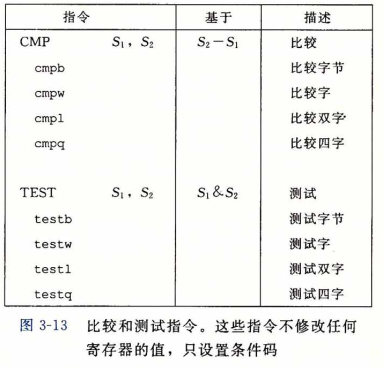

### 访问条件码

​		条件码通常不会直接读取，常用的使用方法有三种：

- 可以根据条件码的某种组合， 将一个字节设置为 0 或者 1 ，
- 可以条件跳转到程序的某个其他的部分，
- 可以有条件地传送数据。

​        对于第一种情况，图3-14中描述的指令根据条件码的某种组合，将一个字节设置为 0 或者 1 。我们将这一整类指令称为SET指令；它们之间的区别就在于它们考虑的条件码的组合是什么，送些指令名字的不同后缀指明了它们所考虑的条件码的组合。这些指令的后缀表示不同的条件而不是操作数大小，了解这一点很重要。例如，<u>指令setl 和 setb 表示“小于时设置（set less)”和“低于时设置（set below)”，而不是“设置长字（set long word)” 和“设置字节（set byte)”。</u>

​		一条SET指令的目的操作数是低位单字节寄存器元素（图3-2)之一，或是一个字节的内存位置，指令会将这个字节设置成 0 或者 1 。为了得到一个 32 位或 64 位结果，我们必须对高位清零。一个计算 C 语言表达式 a < b 的典型指令序列如下所示，这里 a 和 b 都是 long 类型：

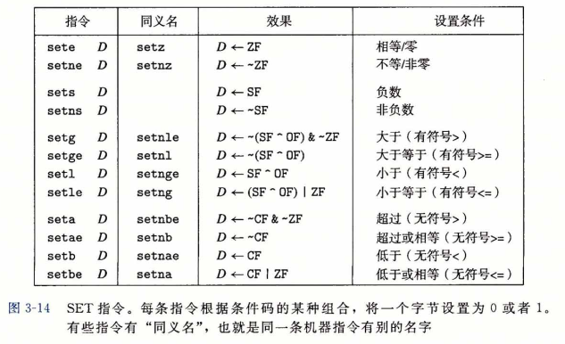

```assembly
;iat comp(data_t a, data_t b)
;a in Xrdi, b in Zrsi
1	comp:
2	cmpq	%rsi, %rdi			;Compare a:b
3	setl	%al					;Set low-order	byte	of %eax to 0	or 1
4	movzbl	%al, %eax			;Clear rest of	%eax	(and rest of	%rax)
5	ret
```

​		注意 cmpq 指令的比较顺序(第2行）。虽然参数列出的顺序先是 ％rsi(b) 再是 ％rdi(a) ， 实际上比较的是 a 和 b 。还要记得，正如在3. 4. 2节中讨论过的那样，movzbl 指令不仅会把 %eax 的高 3 个字节清零，还会把整个寄存器 ％rax 的高 4 个字节都清零。

​		某些底层的机器指令可能有多个名字，我们称之为“<u>同义名（synonym)</u>”。比如说， setg(表示“设置大于”）和setnle(表示“设置不小于等于”）指的就是同一条机器指令。 编译器和反汇编器会随意决定使用哪个名字。

​		虽然所有的算术和逻辑操作都会设置条件码，但是各个SET命令的描述都适用的情况是：执行比较指令，根据计算 t = a-b 设置条件码。更具体地说，假设 <u>a</u> 、<u>b</u> 和 <u>t</u> 分别是变量 a 、b 和 t 的补码形式表示的整数，因此 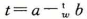，这里 w 取决于 a 和 b 的大小。

​		来看 sete 的情况，即 “ <u>当相等时设置(set when equal)</u>”  指令。当 a = b 时，会得到 t = 0 , 因此零标志置位就表示相等。

​		类似地，考虑用 setl , 即“<u>当小于时设置（set when less)</u>”指 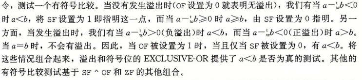

​		对于无符号比较的测试，现在设 <u>a</u> 和 <u>b</u> 是变量 a 和 b 的无符号形式表示的整数。在执 行计算 t = a-b 中，当<u>a</u> —<u>b</u><0时，CMP 指令会设置进位标志，因而无符号比较使用的是进位标志和零标志的组合。

​		注意到机器代码如何区分有符号和无符号值是很重要的。同 C 语言不同，机器代码不会将每个程序值都和一个数据类型联系起来。相反，大多数情况下，机器代码对于有符号和无符号两种情况都使用一样的指令，这是因为许多算术运算对无符号和补码算术都有一样的位级行为。有些情况需要用不同的指令来处理有符号和无符号操作，例如，使用不同版本的右移、除法和乘法指令，以及不同的条件码组合。


### 跳转指令

​		正常执行的情况下，指令按照它们出现的顺序一条一条地执行。**跳转(jump)**指令会导 致执行切换到程序中一个全新的位置。在汇编代码中，这些跳转的目的地通常用一个**标号(label)**指明。考虑下面的汇编代码序列（完全是人为编造的）：

```assembly
movq $0,%rax 			;Set %rax to 0
jmp .L1					;Goto .L1
movq (%rax),%rdx 		;Null pointer dereference (skipped)
.L1:
popq %rdx				;Jump target
```

​		指令 jmp . L1 会导致程序跳过 movq 指令，而从 popq 指令开始继续执行。在产生目标代码文件时，汇编器会确定所有带标号指令的地址，并将跳转目标（目的指令的地址）编码为跳转指令的一部分。

​		图3-15列举了不同的跳转指令。<u>jmp 指令是**无条件跳转**。它可以是直接跳转，即跳转目标是作为指令的一部分编码的</u>；<u>也可以是**间接跳转**，即跳转目标是从寄存器或内存位置中读出的</u>。汇编语言中，直接跳转是给出一个标号作为跳转目标的，例如上面所示代码中的标号“.L1”。间接跳转的写法是后面跟一个操作数指示符，使用图3-3中描述的内存操作数格式中的一种。举个例子，指令

​			 jmp *%rax

​		用寄存器 ％rax 中的值作为跳转目标，而指令

​			jmp *(%rax)

​		中的值作为读地址，从内存中读出跳转目标。

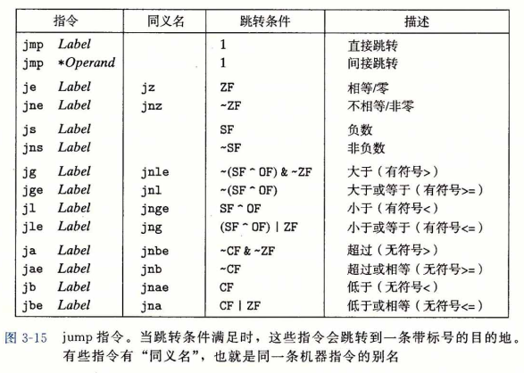

​		表中所示的其他跳转指令都是有<u>条件</u>的——它们根据条件码的某种组合，或者跳转， 或者继续执行代码序列中下一条指令。这些指令的名字和跳转条件与SET指令的名字和设置条件是相匹配的（参见图3-14)。同SET指令一样，一些底层的机器指令有多个名字。 条件跳转只能是直接跳转。


### 跳转指令的编码

​		虽然我们不关心机器代码格式的细节，但是理解跳转指令的目标如何编码，这对第7章研究链接非常重要。此外，它也能帮助理解反汇编器的输出。在汇编代码中，跳转目标用符号标号书写。汇编器，以及后来的链接器，会产生跳转目标的适当编码。跳转指令有几种不同的编码，但是最常用都是**PC相对的（PC-relative)**。也就是，它们会将目标指令的地址与紧跟在跳转指令后面那条指令的地址之间的差作为编码。这些地址偏移量可以编码为1、2或4个字节。第二种编码方法是给出“绝对”地址，用4个字节直接指定目标。 汇编器和链接器会选择适当的跳转目的编码。

​		下面是一个PC相对寻址的例子，这个函数的汇编代码由编译文件branch. c产生。它包含两个跳转：第2行的jmp 指令前向跳转到更高的地址，而第 7 行的 jg 指令后向跳转到较低的地址。

```assembly
1	movq 	%rdi,	%rax
2	jmp		.L2
3 .L3:
4	sarq	%rax
5 .L2:
6	testq %rax,	%rax
7	jg	-L3
8	rep; ret
```

汇编器产生的 " .o " 格式的反汇编版本如下：

```assembly
1	0	48	89	f8		mov		%rdi,%rax
2	3	eb	03			jmp		8 <loop+0x8>
3	5	48	dl	f8		sar		%rax
4	8	48	85	cO		test	%rax,%rax
5	b	If	f8			jg		5 <loop+0x5>
6	d	f3	c3			repz 	retq	
```

​		右边反汇编器产生的注释中，第2行中跳转指令的跳转目标指明为0x8,第5行中跳转指令的跳转目标是0x5(反汇编器以十六进制格式给出所有的数字）。不过，观察指令的字节编码，会看到第一条跳转指令的目标编码（在第二个字节中）为0x03。把它加上0x5, 也就是下一条指令的地址，就得到跳转目标地址0x8,也就是第4行指令的地址。

​		类似，第二个跳转指令的目标用单字节、补码表示编码为0xf8(十进制-8)。将这个数加上0xd(十进制13)，即第6行指令的地址，我们得到0x5,即第3行指令的地址。

​		这些例子说明，<u>当执行PC相对寻址时，程序计数器的值是跳转指令后面的那条指令的地址，而不是跳转指令本身的地址</u>。这种惯例可以追溯到早期的实现，当时的处理器会将更新程序计数器作为执行一条指令的第一步。

​		下面是链接后的程序反汇编版本：

```assembly
1	4004d0	48	89	f8		mov		%rdi,%rax
2	4004d3	eb	03			jmp		4004d8 <loop+0x8>
3	4004d5	48	dl	f8		sar		%rax
4	4004d8	48	85	cO		test	%rax,%rax
5	4004db	7f	f8			jg		4004d5 <loop+0x5>
6	4004dd	f3	c3			repz	retq
```

​		这些指令被重定位到不同的地址，但是第2行和第5行中跳转目标的编码并没有变。 通过使用与PC相对的跳转目标编码，指令编码很简洁（只需要2个字节），而且目标代码可以不做改变就移到内存中不同的位置。


### 用条件控制来实现条件分支

​		将条件表达式和语句从C语言翻译成机器代码，最常用的方式是结合有条件和无条件跳转。（另一种方式在下一节中会看到，有些条件可以用数据的条件转移实现，而不是用控制的条件转移来实现。）例如，图3-16a给出了一个计算两数之差绝对值的函数的C代码。这个函数有一个副作用，会增加两个计数器，编码为全局变量 lt_cnt 和ge_cnt 之 —。GCC产生的汇编代码如图3-16c所示。把这个机器代码再转换成C语言，我们称之为函数 gotodiff_se (图3-16b)。它使用了 C语言中的 goto 语句，这个语句类似于汇编代码中的无条件跳转。使用 goto 语句通常认为是一种不好的编程风格，因为它会使代码非常难以阅读和调试。本文中使用 goto 语句，是为了构造描述汇编代码程序控制流的 C 程序。我们称这样的编程风格为“ goto 代码”。

​		在 goto 代码中（图3-16b)，第5行中的 goto x_ge_y 语句会导致跳转到第9行中的标号 x_ge_y 处 (当时会进行跳转）。从这一点继续执行，完成函数 absdiff_se 的 else 部分并返回。另一方面，如果测试 x >= y 失败，程序会计算 absdiff_se 的 if 部分指定的步骤并返回。

​		汇编代码的实现（图3-16c)首先比较了两个操作数（第2行），设置条件码。如果比较的结果表明 x 大于或者等于 y ，那么它就会跳转到第 8 行，增加全局变量 ge_cnt ，计算 x - y 作为返回值并返回。由此我们可以看到absdiff_se 对应汇编代码的控制流非常类似于 gotodiff_se 的 goto 代码。

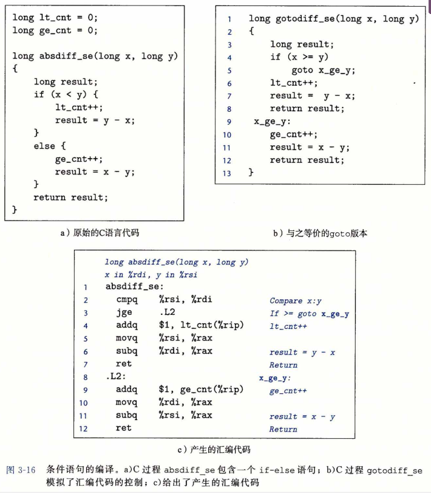

C语言中的if-eise语句的通用形式模板如下：

​		` 		if (test-expr)
​		then-statement
​	else
​		else-statement`


​		这里如 test-expr 是一个整数表达式，它的取值为0(解释为“假”）或者为非0(解释为“真”）。 两个分支语句中（then-statement 或 else-statement)只会执行一个。

​		对于这种通用形式，汇编实现通常会使用下面这种形式，这里，我们用C语法来描述控制流：

​		`t = test-expr; `
​		`if (!t)
​			goto false; `

​		`then-statement `

​		`goto done; `

`false:
	else-statement
done:`

​		也就是，汇编器为 then-statement 和 else-statement 产生各自的代码块。它会插入条件和无条件分支，以保证能执行正确的代码块。


### 用条件传送来实现条件分支

​		实现条件操作的传统方法是通过使用<u>控制</u>的条件转移。当条件满足时，程序沿着一条执行路径执行，而当条件不满足时，就走另一条路径。这种机制简单而通用，但是在现代处理器上，它可能会非常低效。

​		一种替代的策略是使用数据的条件转移。这种方法计算一个条件操作的两种结果，然 后再根据条件是否满足从中选取一个。只有在一些受限制的情况中，这种策略才可行，但是如果可行，就可以用一条简单的条件传送指令来实现它，条件传送指令更符合现代处理器的性能特性。我们将介绍这一策略，以及它在 x86-64上的实现。

​		图3-17a给出了一个可以用条件传送编译的示例代码。这个函数计算参数 x 和 y 差的绝对值，和前面的例子一样（图3-16)。不过前面的例子中，分支里有副作用，会修改 lt_ cnt 或 ge_cnt 的值，而这个版本只是简单地计算函数要返回的值。

​		GCC 为该函数产生的汇编代码如图3-17c所示，它与图3-17b中所示的 C 函数 cmovdiff 有相似的形式。研究这个C版本，我们可以看到它既计算了 y-x，也计算了 x-y， 分别命名为 rval 和 eval 。然后它再测试 x 是否大于等于 y ，如果是，就在函数返回 rval 前，将 eval 复制到 rval 中。图3-17c中的汇编代码有相同的逻辑。关键就在于汇编代码的那条 cmovge 指令(第7行)实现了 cmovdiff 的条件赋值(第8行)。只有当第6行的 cmpq 指令表明—个值大于等于另一个值(正如后缀 ge 表明的那样)时，才会把数据源寄存器传送到目的。

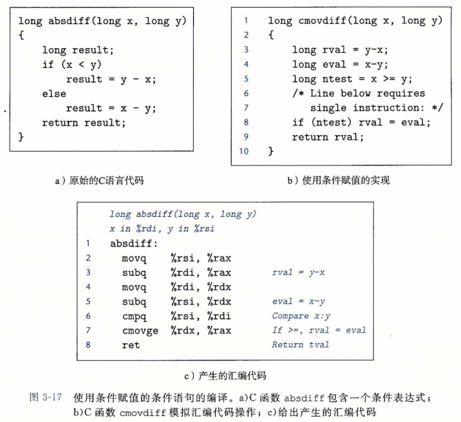

​		为了理解为什么基于条件数据传送的代码会比基于条件控制转移的代码（如图3-16中 那样）性能要好，我们必须了解一些关于现代处理器如何运行的知识。正如我们将在第4 章和第5章中看到的，处理器通过使用**流水线（pipelining)**来获得高性能，在流水线中，一条指令的处理要经过一系列的阶段，每个阶段执行所需操作的一小部分（例如，从内存取指令、确定指令类型、从内存读数据、执行算术运算、向内存写数据，以及更新程序计数 器）。这种方法通过重叠连续指令的步骤来获得高性能，

​		例如，在取一条指令的同时，执行它前面一条指令的算术运算。要做到这一点，要求能够事先确定要执行的指令序列，这样才能保持流水线中充满了待执行的指令。当机器遇到条件跳转（也称为“分支”）时，只有当分支条件求值完成之后，才能决定分支往哪边走。处理器采用非常精密的分支预测逻辑来猜测每条跳转指令是否会执行。只要它的猜测还比较可靠（现代微处理器设计试图达到90%以上的成功率），指令流水线中就会充满着指令。另一方面，错误预测一个跳转， 要求处理器丢掉它为该跳转指令后所有指令已做的工作，然后再开始用从正确位置处起始的指令去填充流水线。正如我们会看到的，这样一个错误预测会招致很严重的惩罚，浪费大约15~30个时钟周期，导致程序性能严重下降。

​		作为一个示例，我们在 IntelHaswell 处理器上运行 absdiff 函数，用两种方法来实 现条件操作。在一个典型的应用中，x < y 的结果非常地不可预测，因此即使是最精密的分支预测硬件也只能有大约 50% 的概率猜对。此外，两个代码序列中的计算执行都只需要一个时钟周期。因此，分支预测错误处罚主导着这个函数的性能。对于包含条件跳转的 x86-64 代码，我们发现当分支行为模式很容易预测时，每次调用函数需要大约8个时钟周期；而分支行为模式是随机的时候，每次调用需要大约17. 50个时钟周期。由此我们可以推断出分支预测错误的处罚是大约19个时钟周期。这就意味着函数需要的时间范围大约在8到27个周期之间，这依赖于分支预测是否正确。

​		另一方面，无论测试的数据是什么，编译出来使用条件传送的代码所需的时间都是大约8个时钟周期。控制流不依赖于数据，这使得处理器更容易保持流水线是满的。

​		图3-18列举了 x86-64 上一些可用的条件传送指令。每条指令都有两个操作数：源寄存器或者内存地址S,和目的寄存器R。与不同的SET(3.6.2节）和跳转指令（3.6.3节） 一样，这些指令的结果取决于条件码的值。源值可以从内存或者源寄存器中读取，但是只有在指定的条件满足时，才会被复制到目的寄存器中。

​		源和目的的值可以是16位、32位或64位长。不支持单字节的条件传送。无条件指令的操作数的长度显式地编码在指令名中（例如 movw 和 movl ),汇编器可以从目标寄存器的名字推断出条件传送指令的操作数长度，所以对所有的操作数长度，都可以使用同一个的指令名字。

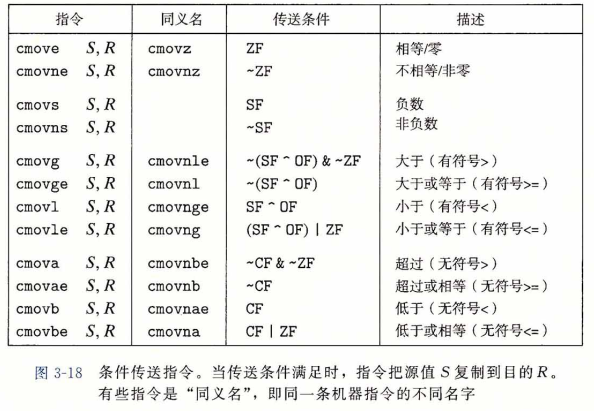

​		同条件跳转不同，处理器无需预测测试的结果就可以执行条件传送。处理器只是读源 值(可能是从内存中），检查条件码，然后要么更新目的寄存器，要么保持不变。我们会在 第4章中探讨条件传送的实现。

​		为了理解如何通过条件数据传输来实现条件操作，考虑下面的条件表达式和赋值的通 用形式：

​		`v= test-expr ? then-expr : else-expr;` 

​		用条件控制转移的标准方法来编译这个表达式会得到如下形式：

```c
	if (! test-expr) 
    	goto false; 
	v = then-expr;
	goto done; 
false:
	v = else-expr;
done:
```


​		这段代码包含两个代码序列：一个对求值，另一个对 then-expr 求值。条件跳转和无条件跳转结合起来使用是为了保证只有一个序列执行。

​		基于条件传送的代码，会对then-expr 和 else-expr 都求值，最终值的选择基于对 test-expr 的求值。可以用下面的抽象代码描述：

​		`v = then-expr;`

​		` ve = else-expr ;` 

​		` t = test-expr;` 

​		`if (!t) v = ve;`
​		这个序列中的最后一条语句是用条件传送实现的——只有当测试条件 t 满足时，vt 的值 才会被复制到 v 中。

​		不是所有的条件表达式都可以用条件传送来编译。最重要的是，无论测试结果如何，我们给出的抽象代码会对 then-expr 和 else-expr 都求值。如果这两个表达式中的任意一个可能产生错误条件或者副作用，就会导致非法的行为。前面的一个例子（图3-16)就是这种情况。实际上，我们在该例中引人副作用就是为了强制GCC用条件转移来实现这个函数。 作为说明，考虑下面这个C函数： 

```c
long cread(long *xp) {
	return (xp ? *xp : 0);
}
```

​		乍一看，这段代码似乎很适合被编译成使用条件传送，当指针为空时将结果设置为0, 如下面的汇编代码所示：

```assembly
;long cread(long *xp)
;Invalid implementation of function cread
;xp in register %rdi 
1 cread:
2	movq	(%rdi), %rax		;v = *xp
3	testq	%rdi, %rdi	   		;Test x
4	movl	$0， %edx		   ;Set ve = 0
5	cmove	%rdx, %rax			;If x==0, v = ve
6	ret							;Return v
```

​		不过，这个实现是非法的，因为即使当测试为假时，movq指令（第2行）对xp的间接引用还是发生了，导致一个间接引用空指针的错误。所以，必须用分支代码来编译这段代码。

​		使用条件传送也不总是会提高代码的效率。例如，如果 then-expr 或者 else-expr 的求值需要大量的计算，那么当相对应的条件不满足时，这些工作就白费了。编译器必须考虑浪费的计算和由于分支预测错误所造成的性能处罚之间的相对性能。说实话，编译器并不具有足够的信息来做出可靠的决定；例如，它们不知道分支会多好地遵循可预测的模式。 我们对GCC的实验表明，只有当两个表达式都很容易计算时，例如表达式分别都只是一条加法指令，它才会使用条件传送。根据我们的经验，即使许多分支预测错误的开销会超过更复杂的计算，GCC还是会使用条件控制转移。

​		所以，总的来说，条件数据传送提供了一种用条件控制转移来实现条件操作的替代策略。它们只能用于非常受限制的情况，但是这些情况还是相当常见的，而且与现代处理器的运行方式更契合。


### 循环

​		C语言提供了多种循环结构，即do-while、while和for。汇编中没有相应的指令 存在，可以用条件测试和跳转组合起来实现循环的效果。GCC和其他汇编器产生的循环 代码主要基于两种基本的循环模式。我们会循序渐进地研究循环的翻译，从do-while开 始，然后再研究具有更复杂实现的循环，并覆盖这两种模式。

##### 		1. do-while 循环

​		do-while语句的通用形式如下：
​		   	 `do
​		body-statement 
​		while (test-expr);`
这个循环的效果就是重复执行 body-statement 。对 test-expr 求值，如果求值的结果为非零，就继续循环。可以看到, body-statement 至少会执行一次。

​		这种通用形式可以被翻译成如下所示的条件和 goto 语句：
​		  	 `loop:
​		body-statement 
​		t = test-expr; 
​		if (t)
​			goto loop;`
也就是说，每次循环，程序会执行循环体里的语句，然后执行测试表达式。如果测试为真，就回去再执行一次循环。

​		看一个示例，图3-19a给出了一个函数的实现，用 do-while 循环来计算函数参数的阶乘，写作 n! 。这个函数只计算 n > 0 时 n 的阶乘的值。

​		图3-19b所示的 goto 代码展示了如何把循环变成低级的测试和条件跳转的组合。result 初始化之后，程序开始循环。首先执行循环体，包括更新变量 result 和 n 。然后测试 n > 1 , 如果是真，跳转到循环开始处。图3-19c所示的汇编代码就是 goto 代码的原型。条件跳转指令 jg (第7行)是实现循环的关键指令，它决定了是需要继续重复还是退出循环。

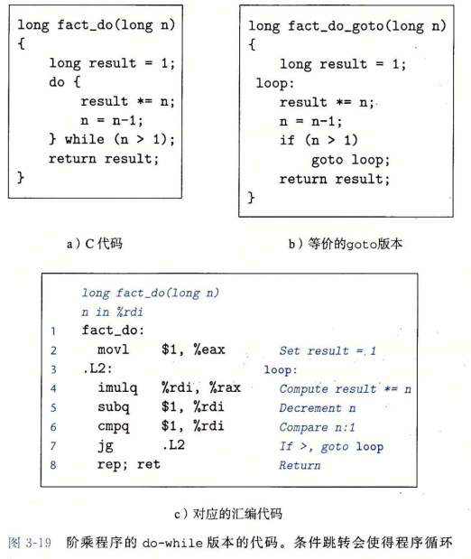

​		逆向工程像图 3-19c 中那样的汇编代码，需要确定哪个寄存器对应的是哪个程序值。本例中，这个对应关系很容易确定：我们知道 n 在寄存器 %rdi 中传递给函数。可以看到寄存器 %rax 初始化为1(第2行）。（注意，虽然指令的目的寄存器是 ％eax ，它实际上还会把 ％rax 的高 4 字节设置为0。)还可以看到这个寄存器还会在第 4 行被乘法改变值。此外，％rax 用来返回函数值，所以通常会用来存放需要返回的程序值。因此我们断 %rax 对应程序值result。

##### 		2.while 循环

​		while语句的通用形式如下：

​				`while (test-expr) 
​			body-statement`

与do-while的不同之处在于，在第一次执行 body-statement 之前，它会对 test-expr 求值，循环有可能就中止了。有很多种方法将 while 循环翻译成机器代码，GCC在代码生成中使用其中的两种方法。这两种方法使用同样的循环结构，与 do-while 一样，不过它们实现初始测试的方法不同。

​		第一种翻译方法，我们称之为**跳转到中间（jump to middle)**,它执行一个无条件跳转跳到循环结尾处的测试，以此来执行初始的测试。可以用以下模板来表达这种方法，这个模板把通用的 while 循环格式翻译到 goto 代码：

```c
	goto test; 
loop:
	body-statement 
test:
	t = test-expr;
	if (t)
		goto loop；
```

​		作为一个示例，图3-20a给出了使用 while 循环的阶乘函数的实现。这个函数能够正确地计算 0! = 1 。它旁边的函数 fact_while_jm_goto(图3-20b) 是 GCC 带优化命令行选项 -Og 时产生的汇编代码的C语言翻译。比较fact_while (图3-20b)和 fact_do(图3-19b) 的代码，可以看到它们非常相似，区别仅在于循环前的goto test语句使得程序在修改 result 或 n 的值之前，先执行对 n 的测试。图的最下面（图3-20c)给出的是实际产生的汇编代码。

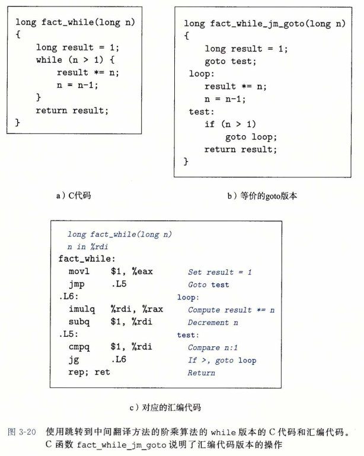

​		第二种翻译方法，我们称之为 guarded-do ,首先用条件分支，如果初始条件不成立就跳过循环，把代码变换为 do-while 循环。当使用较高优化等级编译时，例如使用命令行 选项-01，GCC会采用这种策略。可以用如下模板来表达这种方法，把通用的while循环格式翻译成do-while循环：

```c
t = test-expr; 
if (!t)
	goto done;
do
	body-statement
    while (.test-expr);
done:
```

相应地，述可以把它翻译成goto代码如下：

```c
t = test-expr;
if (!t)
	goto done; 
loop:
	body-statement 
	t = test-expr; 
	if (t)
		goto loop;
done ：
```


利用这种实现策略，编译器常常可以优化初始的测试，例如认为测试条件总是满足。

​		再来看个例子，图3-21给出了图3-20所示阶乘函数同样的C代码，不过给出的是 GCC使用命令行选项 -O1 时的编译。图3-21c给出实际生成的汇编代码，图3-21b是这个汇编代码更易读的C语言表示。根据 goto 代码，可以看到如果对于 n 的初始值 n < 1 ， 那么将跳过该循环。该循环本身的基本结构与该函数 do-while 版本产生的结构（图3-19) 一样。不过，一个有趣的特性是，循环测试(汇编代码的第9行）从原始C代码的 n > 1变成了 n ≠ 1 。编译器知道只有当 n > 1 时才会进人循环，所以将 n 减 1 意味着 n > 1 或者 n = 1。因此，测试 n ≠ 1 就等价于测试 n <= 1 。

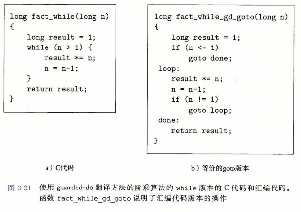

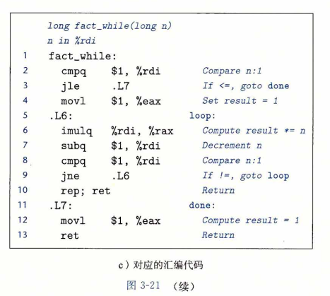

##### 		3.for循环

​		for循环的通用形式如下：
​		`for (init-expr; test-expr; update-expr) 
​			body-statement`
C语言标准说明（有一个例外，练习题3.29中有特别说明），这样一个循环的行为与下面这段使用 while 循环的代码的行为一样： 

init-expr;
while (test-expr) { 
	body-statement 
	update-expr;
}

​		程序首先对初始表达式 init-expr 求值，然后进入循环；在循环中它先对测试条件 test-expr 求值，如果测试结果为“假”就会退出，否则执行循环体 body-statement ; 最后对更新表达式 update-expr 求值。

​		GCC 为 for 循环产生的代码是 while 循环的两种翻译之一，这取决于优化的等级。 也就是，跳转到中间策略会得到如下 goto 代码：
​		init-expr ；
​		goto test;
​	loop:
​		body-statement 
​		update-expr;
​	test ：
​		t = test-expr;
​		if (t)
​				goto loop;

而guarded-do策略得到：

​	init-expr；
​	t = test-expr；
​	if (!t)
​		goto done;
loop:
​	body-statement 
​	update-expr; 
​	t = test-expr ;
​	if (t)
​		goto loop;
done:

作为一个示例，考虑用for循环写的阶乘函数:

```c
long fact_for(long n) {
    long i;
    long result = 1; 
    for (i = 2; i <= n; i++)
        result *= i; 
    return result;
}
```

​		如上述代码所示，用for循环编写阶乘函数最自然的方式就是将从 2 —直到 n 的因子乘起来，因此，这个函数与我们使用 while 或者 do-while 循环的代码很不一样。

​		这段代码中的for循环的不同组成部分如下：
`init-expr					  i = 2
test-expr					 i <= n
update-expr			   i++
body-statement		result *= i;`
​		用这些部分替换前面给出的模板中相应的位置，就把 for 循环转换成了 while 循环， 得到下面的代码：

```c
long fact_for_while(long n)
{
    long i = 2; 
    long result = 1; 
    while (i <= n) { 
        result *= i; 
        i++;
    }
    return result;
}
```

对while循环进行跳转到中间变换，得到如下goto代码：

```c
long fact_for_jra_goto(long n){
    long i = 2; 
    long result = 1; 
    goto test; 
  loop:
	result *= i; 
    i++;
  test:
	if (i <= n) 
        goto loop; 
    return result;
}
```

​		确实，仔细查看使用命令行选项 -Og 的 GCC 产生的汇编代码，会发现它非常接近于以下模板:

```assembly
;long fact_for(long n) 
;n in Xrdi
fact_for:		
	movl	$1, %eax			;Set result = 1
	movl	$2, %edx			;Set i = 2
	jmp	.L8	Goto 				;test
.L9:						;loop:
	imulq	%rdx, %rax			;Compute result*=1
	addq	$1, %rdx			;Increment i
.L8:						;test:
	cmpq	%rdi, %rdx			;Compare i:n
	jle	.L9						;If <=, goto loop
	rep; ret					Return
```


### switch 语句

​		**switch(开关)**语句可以根据一个整数索引值进行**多重分支（multiway branching)**。在处理具有多种可能结果的测试时，这种语句特别有用。它们不仅提高了 C 代码的可读性， 而且通过使用**跳转表(jump table)**这种数据结构使得实现更加高效。跳转表是一个数组， 表项 i 是一个代码段的地址，这个代码段实现当开关索引值等于 i 时程序应该采取的动作。 程序代码用开关索引值来执行一个跳转表内的数组引用，确定跳转指令的目标。和使用一 组很长的 if-else 语句相比，使用跳转表的优点是执行开关语句的时间与开关情况的数量无关。GCC根据开关情况的数量和开关情况值的稀疏程度来翻译开关语句。当开关情况数量比较多（例如4个以上），并且值的范围跨度比较小时，就会使用跳转表。

​		图3-22a是一个 C 语言 switch 语句的示例。这个例子有些非常有意思的特征，包括**情况标号（case label)**跨过一个不连续的区域（对于情况 101 和 105 没有标号），有些情况有多个标号(情况 104 和 106 ),而有些情况则会落人其他情况之中（情况 102 )，因为对应该情况的代码段没有以 break 语句结尾。

​		图3-23是编译 switch_eg 时产生的汇编代码。这段代码的行为用 C 语言来描述就是图3-22b中的过程switch_eg_impl。这段代码使用了 GCC 提供的对跳转表的支持，这是对 C 语言的扩展。数组 jt 包含 7 个表项，每个都是一个代码块的地址。这些位置由代码中的标号定义，在 jt 的表项中由代码指针指明，由标号加上 ' && ' 前缀组成。（回想运算符 & 创建一个指向数据值的指针。在做这个扩展时，GCC 的作者们创造了一个新的运算符 && ，这个运算符创建一个指向代码位置的指针。）建议你研究一下C语言过程 switch_eg_ impl ,以及它与汇编代码版本之间的关系。

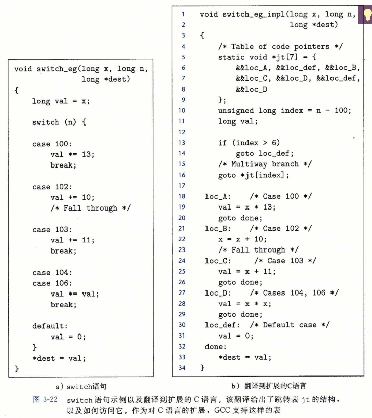

​		原始的C代码有针对值 100 、102-104 和 106 的情况，但是开关变量 n 可以是任意整数。编译器首先将 n 减去 100 ,把取值范围移到 0 和 6 之间，创建一个新的程序变量，在我们的 C 版本中称为 index 。补码表示的负数会映射成无符号表示的大正数，利用这一事实，将 index 看作**无符号**值，从而进一步简化了分支的可能性。因此可以通过测试 index 是否大于 6 来判定  index 是否在 0〜6 的范围之外。在 C 和汇编代码中，根据 index 的值，有五个不同的跳转位置：
​		loc_A(在汇编代码中标识为.L3)，loc_B(.L5) ,  loc_C(.L6) ,  loc_D(.L7) 和 loc_def (.L8) ,最后一个是默认的目的地址。每个标号都标识一个实现某个情况分支的代码块。在 C 和汇编代码中，程序都是将 index 和 6 做比较，如果大于 6 就跳转到默认的代码处。

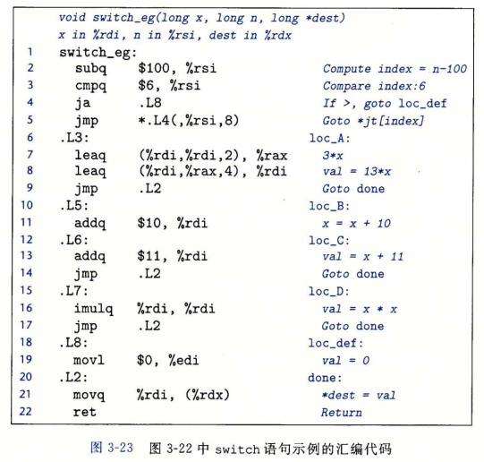

​		执行 switch 语句的关键步骤是通过跳转表来访问代码位置。在 C 代码中是第 16 行， 一条 goto 语句引用了跳转表 jt 。GCC 支持计算 goto(computedgoto) ，是对 C 语言的扩展。在我们的汇编代码版本中，类似的操作是在第5行，jmp 指令的操作数有前缀 ' * ' ，， 表明这是一个间接跳转，操作数指定一个内存位置，索引由寄存器 ％rsi 给出，这个寄存器保存着index的值。（我们会在3. 8节中看到如何将数组引用翻译成机器代码。）

​		C 代码将跳转表声明为一个有 7 个元素的数组，每个元素都是一个指向代码位置的指针。这些元素跨越 index的值 0 ~ 6 ,对应于 n 的值 100〜106 。可以观察到，跳转表对重复情况的处理就是简单地对表项 4 和 6 用同样的代码标号（loc_D),而对于缺失的情况的 处理就是对表项 1 和 5 使用默认情况的标号（loc_def)。

​		在汇编代码中，跳转表用以下声明表示，我们添加了一些注释：

```assembly
1	. section	. rodata
2	.align 8		;Align address to multiple of 8		
3	.L4:				
4	.quad	.L3		;Case	100:	loc_A
5	.quad	.L8		;Case	101:	loc_def
6	.quad	.L5		;Case	102:	loc-B
7	.quad	.L6		;Case	103:	loc_C
8	.quad	.L7		;Case	104:	loc_D
9	.quad	.L8		;Case	105:	loc_def
10	.quad	.L7		;Case	106:	loc_D
```

​		这些声明表明，在叫做  **“.rodata” （只读数据，Read-Only Data)** 的目标代码文件的段中，应该有一组 7个 “ 四 ” 字（ 8 个字节），每个字的值都是与指定的汇编代码标号（例如.L3)相关联的指令地址。标号 .L4 标记出这个分配地址的起始。与这个标号相对应的地址会作为间接跳转（第5行）的基地址。

​		不同的代码块( C 标号 loc_A 到 loc_D 和 loc_def )实现了 switch 语句的不同分支。它们中的大多数只是简单地计算了 val 的值，然后跳转到函数的结尾。类似地，汇编代码块计算了寄存器 ％rdi 的值，并且跳转到函数结尾处由标号 .L2 指示的位置。只有情况标号 102 的代码不是这种模式的，正好说明在原始 C 代码中情况 102 会落到情况 103 中。具体处理如下:  以标号 .L5 起始的汇编代码块中，在块结尾处没有 jmp 指令，这样代码就会继续执行下一个块。 类似地，C 版本 switch_eg_impl 中以标号 loc_B 起始的块的结尾处也没有 goto 语句。

​		检査所有这些代码需要很仔细的研究，但是关键是领会使用跳转表是一种非常有效的实现多重分支的方法。在我们的例子中，程序可以只用一次跳转表引用就分支到 5 个不同 的位置。甚至当 switch 语句有上百种情况的时候，也可以只用一次跳转表访问去处理。 