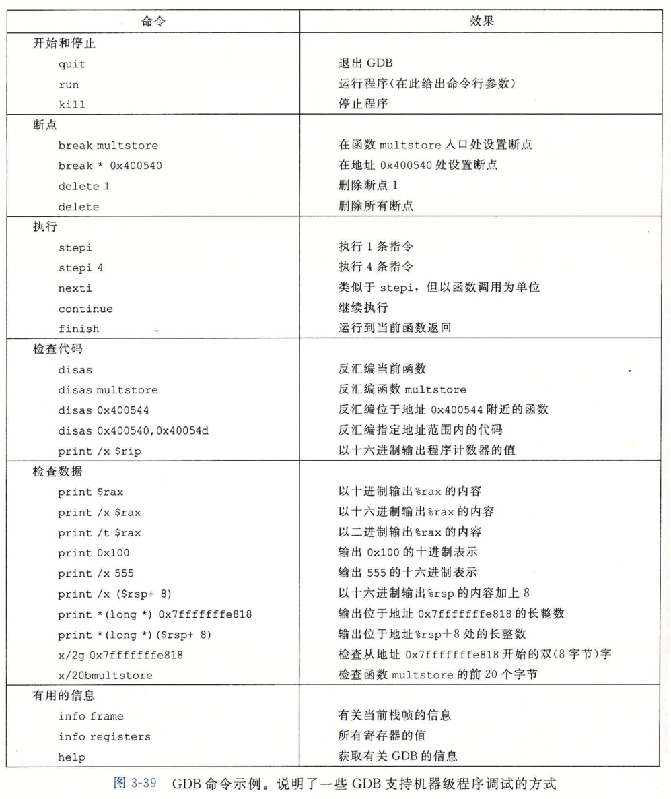
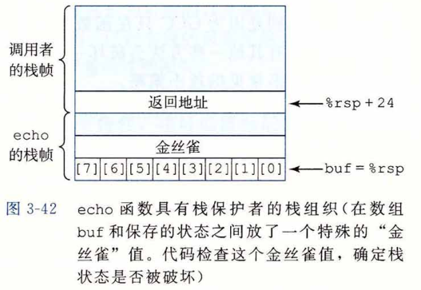

## 在机器级程序中将控制与数据结合起来

​		到目前为止，我们已经分别讨论机器级代码如何实现程序的控制部分和如何实现不同的数据结构。在本节中，我们会看看数据和控制如何交互。首先，深入审视一下指针，它是 C 编程语言中最重要的概念之一，但是许多程序员对它的理解都非常浅显。我们复习符号调试器 GDB 的使用，用它仔细检查机器级程序的详细运行。接下来，看看理解机器级程序如何帮助我们研究缓冲区溢出，这是现实世界许多系统中一种很重要的安全漏洞。最 后，查看机器级程序如何实现函数要求的栈空间大小在每次执行时都可能不同的情况。

### 理解指针

​		指针是 C 语言的一个核心特色。它们以一种统一方式，对不同数据结构中的元素产生引用。对于编程新手来说，指针总是会带来很多的困惑，但是基本概念其实非常简单。在此，我们重点介绍一些指针和它们映射到机器代码的关键原则。

- **每个指针都对应一个类型。**这个类型表明该指针指向的是哪一类对象。以下面的指针声明为例：
  `int * ip; 
  char * * cpp;`
  变量 ip 是一个指向 int 类型对象的指针，而 cpp 指针指向的对象自身就是一个指向 char 类型对象的指针。通常，如果对象类型为 T ，那么指针的类型为 T* 。特殊的 void * 类型代表通用指针。比如说，malloc 函数返回一个通用指针，然后通过显式强制类型转换或者赋值操作那样的隐式强制类型转换，将它转换成一个有类型的指针。指针类型不是机器代码中的一部分；它们是 C 语言提供的一种抽象，帮助程序员避免寻址错误。
- **每个指针都有一个值。**这个值是某个指定类型的对象的地址。特殊的 NULL(0) 值表示该指针没有指向任何地方。
- **指针用‘&’运算符创建。**这个运算符可以应用到任何 lvalue 类的 C 表达式上， lvalue 意指可以出现在赋值语句左边的表达式。这样的例子包括变量以及结构、 联合和数组的元素。我们已经看到，因为 leaq 指令是设计用来计算内存引用的地址的，& 运算符的机器代码实现常常用这条指令来计算表达式的值。
- ***操作符用于间接引用指针。**其结果是一个值，它的类型与该指针的类型一致。间接引用是用内存引用来实现的，要么是存储到一个指定的地址，要么是从指定的地址读取。
- **数组与指针紧密联系。**一个数组的名字可以像一个指针变量一样引用（但是不能修改）。数组引用（例如a[3])与指针运算和间接引用（例如 * (a+ 3)) 有一样的效果。 数组引用和指针运算都需要用对象大小对偏移量进行伸缩。当我们写表达式 P+ i ， 这里指针 P 的值为 f，得到的地址计算为 f+L×i ，这里 L 是与 p 相关联的数据类型的大小。
- **将指针从一种类型强制转换成另一种类型，只改变它的类型，而不改变它的值。**强制类型转换的一个效果是改变指针运算的伸缩。例如，如果 P 是一个 char*类型 的指针，它的值为 s，那么表达式（int * )P+ 7计算为 s + 28,而（int * ) (P+ 7) 计算为 s + 7。（回想一下，强制类型转换的优先级高于加法。）
- **指针也可以指向函数。**这提供了一个很强大的存储和向代码传递引用的功能，这些引用 可以被程序的某个其他部分调用。例如，如果我们有一个函数，用下面这个原型定义：
  ` int fun(int x, int *p);`
  然后，我们可以声明一个指针 fP ,将它赋值为这个函数，代码如下：
  `int ( *fp) (int, int *); 
  fp = fun;`
  然后用这个指针来调用这个函数： 
  `int y = 1;
  int result = fp(3, &y);`
  函数指针的值是该函数机器代码表示中第一条指令的地址。


### 应用：使用GDB调试器

​		GNU 的调试器 GDB 提供了许多有用的特性，支持机器级程序的运行时评估和分析。 对于本书中的示例和练习，我们试图通过阅读代码，来推断出程序的行为。有了 GDB， 可以观察正在运行的程序，同时又对程序的执行有相当的控制，这使得研究程序的行为变为可能。

​		图3-39给出了一些 GDB 命令的例子，帮助研究机器级 x86-64 程序。先运行 OBJ-DUMP 来获得程序的反汇编版本，是很有好处的。我们的示例都基于对文件 prog 运行 GDB，程序的描述和反汇编见3. 2. 3节。我们用下面的命令行来启动 GDB :
​		linux> gdb prog

​		通常的方法是在程序中感兴趣的地方附近设置断点。断点可以设置在函数入口后面， 或是一个程序的地址处。程序在执行过程中遇到一个断点时，程序会停下来，并将控制返回给用户。在断点处，我们能够以各种方式查看各个寄存器和内存位置。我们也可以单步跟踪程序，一次只执行几条指令，或是前进到下一个断点。



​		正如我们的示例表明的那样，GDB 的命令语法有点晦涩，但是在线帮助信息（用 GDB 的 help 命令调用）能克服这些毛病。相对于使用命令行接口来访问 GDB，许多程序员更愿意使用DDD，它是GDB的一个扩展，提供了图形用户界面。


### 内存越界引用和缓冲区溢出

​		我们已经看到，C 对于数组引用不进行任何边界检查，而且局部变量和状态信息（例如保存的寄存器值和返回地址）都存放在栈中。这两种情况结合到一起就能导致严重的程序错误，对越界的数组元素的写操作会破坏存储在栈中的状态信息。当程序使用这个被破坏的状态，试图重新加载寄存器或执行 ret 指令时，就会出现很严重的错误。

​		—种特别常见的状态破坏称为**缓冲区溢出（buffer overflow)**。通常，在栈中分配某个字符数组来保存一个字符串，但是字符串的长度超出了为数组分配的空间。下面这个程序示例就说明了这个问题：

```c
/* Implementation of library function get() */ 
char *gets(char *s){
	int c;
	char *dest = s;
	while ((c = getchar()) != '\n' && c != EOF)
		*dest++ = c;
	if (c == EOF && dest == s)
        /* No characters read */ 
        return NULL;
	*dest++ = '\0'; /* Terminate string */
	return s;
}

/* Read input line and write it back */ 
void echo(){
	char buf [8];	/* Way too small! */
	gets(buf);
	puts(buf);
}
```

​		前面的代码给出了库函数 gets 的一个实现，用来说明这个函数的严重问题。它从标准输入读入一行，在遇到一个回车换行字符或某个错误情况时停止。它将这个字符串复制到参数 f 指明的位置，并在字符串结尾加上 null 字符。

​		在函数 echo() 中，我们使用了 gets ,  这个函数只是简单地从标准输入中读入一行，再把它回送到标准输出。
gets 的问题是它没有办法确定是否为保存整个字符串分配了足够的空间。在 echo示例中，我们故意将缓冲区设得非常小——只有 8 个字节长。任何长度超过 7个 字符的字符串都会导致写越界。

​		检查 GCC 为 echo 产生的汇编代码，看看栈是如何组织的：

```assembly
;void echoO 
1 echo:
2	subq	$24， %rsp			;Allocate 24	bytes on stack
3	movq	%rsp, %rdi			;Compute buf	as %rsp
4	call	gets				;Call gets	
5	movq	%rsp， %rdi          ;Compute buf	as %rsp
6	call	puts				;Call puts	
7	addq	$24, %rsp			;Deallocate stack space	
8	ret							;Return	
```

​		图3-40画出了 echo 执行时栈的组织。该程序把栈指针减去了 24(第2行），在栈上分配了 24 个字节。字符数组 buf 位于栈顶，可以看到，％rsp 被复制到红也作为调用 gets 和 puts 的参数。这个调用的参数和存储的返回指针之间的 16 字节是未被使用的。只要用户输入不超过 7 个字符，gets 返回的字符串（包括结尾的null)就能够放进为 buf 分配的空间里。不过，长一些的字符串就会导致 gets 覆盖栈上存储的某些信息。随着字符串变长，下面的信息会被破坏：

| 输人的字符数量 | 附加的被破坏的状态 |
| -------------- | ------------------ |
| 0〜7           | 无                 |
| 9〜23          | 未被使用的栈空间   |
| 24 〜31        | 返回地址           |
| 32 +           | caller中保存的状态 |

​		字符串到 23 个字符之前都没有严重的后果，但是超过以后，返回指针的值以及更多可能的保存状态会被破坏。如果存储的返回地址的值被破坏了，那么 ret 指令(第 8 行)会导致程序跳转到一个完全意想不到的位置。如果只看 C 代码，根本就不可能看出会有上面这些行为。只有通过研究机器代码级别的程序才能理解像 gets 这样的函数进行的内存越界写的影响。
​	
​		我们的 echo 代码很简单，但是有点太随意了。更好一点的版本是使用 fgets 函数， 它包括一个参数，限制待读入的最大字节数。家庭作业3. 71要求你写出一个能处理任意 长度输人字符串的 echo 函数。通常，使用 gets 或其他任何能导致存储溢出的函数，都是不好的编程习惯。不幸的是，很多常用的库函数，包括 strcpy 、strcat 和sprintf， 都有一个属性——不需要告诉它们目标缓冲区的大小，就产生一个字节序列 [ 97 ] 。这样的情况就会导致缓冲区溢出漏洞。

​		缓冲区溢出的一个更加致命的使用就是让程序执行它本来不愿意执行的函数。这是一种最常见的通过计算机网络攻击系统安全的方法。通常，输入给程序一个字符串，这个字符串包含一些可执行代码的字节编码，称为**攻击代码（exploit code)**,另外，还有一些字节会用一个指向攻击代码的指针覆盖返回地址。那么，执行 ret 指令的效果就是跳转到攻击代码。

​		在一种攻击形式中，攻击代码会使用系统调用启动一个 shell 程序，给攻击者提供一组操作系统函数。在另一种攻击形式中，攻击代码会执行一些未授权的任务，修复对栈的破坏，然后第二次执行 ret 指令，（表面上)正常返回到调用者。

​		让我们来看一个例子，在1988年11月，著名的 Internet蠕虫病毒通过Internet以四种不同的方法获取对许多计算机的访问。一种是对 finger 守护进程 fingerd 的缓冲区溢出攻击，fingerd 服务 FINGER 命令请求。通过以一个适当的字符串调用 FINGER，蠕虫可以使远程的守护进程缓冲区溢出并执行一段代码，让蠕虫访问远程系统。一旦蠕虫获得了对系统的访问，它就能自我复制，几乎完全地消耗掉机器上所有的计算资源。结果， 在安全专家制定出如何消除这种蠕虫的方法之前，成百上千的机器实际上都瘫痪了。这种蠕虫的始作俑者最后被抓住并被起诉。时至今日，人们还是不断地发现遭受缓冲区溢出攻击的系统安全漏洞，这更加突显了仔细编写程序的必要性。任何到外部环境的接口都应该是“防弹的”，这样，外部代理的行为才不会导致系统出现错误。


### 对抗缓冲区溢出攻击

​		缓冲区溢出攻击的普遍发生给计算机系统造成了许多的麻烦。现代的编译器和操作系统实现了很多机制以避免遭受这样的攻击，限制入侵者通过缓冲区溢出攻击获得系统控制的方式。在本节中，我们会介绍一些 Linux 上最新 GCC 版本所提供的机制。

##### 1.栈随机化

​		为了在系统中插入攻击代码，攻击者既要插入代码，也要插入指向这段代码的指针， 这个指针也是攻击字符串的一部分。产生这个指针需要知道这个字符串放置的栈地址。在过去，程序的栈地址非常容易预测。对于所有运行同样程序和操作系统版本的系统来说， 在不同的机器之间，栈的位置是相当固定的。因此，如果攻击者可以确定一个常见的 Web 服务器所使用的栈空间，就可以设计一个在许多机器上都能实施的攻击。以传染病来打个比方，许多系统都容易受到同一种病毒的攻击，这种现象常被称作**安全单一化（security monoculture) [96]** 。

​		**栈随机化**的思想使得栈的位置在程序每次运行时都有变化。因此，即使许多机器都运行同样的代码，它们的栈地址都是不同的。实现的方式是：程序开始时，在栈上分配一段 0~n 字节之间的随机大小的空间，例如，使用分配函数 alloca 在栈上分配指定字节数量的空间。程序不使用这段空间，但是它会导致程序每次执行时后续的栈位置发生了变化。 分配的范围 n 必须足够大，才能获得足够多的栈地址变化，但是又要足够小，不至于浪费程序太多的空间。

​		下面的代码是一种确定“典型的”栈地址的方法：

```c
int main(){
    long local;
	printf("local at %p\n", &local); 
    return 0;
}
```

​		这段代码只是简单地打印出 main 函数中局部变量的地址。在 32 位 Linux 上运行这段代码 10 000 次，这个地址的变化范围为 0xff7fc59c 到 0xffffd09c ，范围大小大约是 2^23 。在更新一点儿的机器上运行 64 位 Linux ,这个地址的变化范围为 0x7fff0001b698 到 0x7ffffffaa4a8，范围大小大约是 2^32。

​		在 Linux 系统中，栈随机化已经变成了标准行为。它是更大的一类技术中的一种，这 类技术称为**地址空间布局随机化（Address-Space Layout Randomization)**，或者简称 ASLR [99]。采用 ASLR , 每次运行时程序的不同部分，包括程序代码、库代码、栈、全局变量和堆数据，都会被加载到内存的不同区域。这就意味着在一台机器上运行一个程序，与在其他机器上运行同样的程序，它们的地址映射大相径庭。这样才能够对抗一些形式的攻击。

​		然而，一个执著的攻击者总是能够用蛮力克服随机化，他可以反复地用不同的地址进行攻击。一种常见的把戏就是在实际的攻击代码前插入很长一段的 nop (读作“no op”，no operatioin的缩写)指令。执行这种指令除了对程序计数器加一，使之指向下一条指令之外，没有任何的效果。只要攻击者能够猜中这段序列中的某个地址，程序就会经过这个序列，到达攻击代码。这个序列常用的术语是 “ **空操作雪橇（nop sled)**” [97]，意思是程序 会“ 滑过 ”这个序列。如果我们建立一个 256 个字节的 nop sled，那么枚举 2^15 = 32 768 个 起始地址，就能破解 n = 2^23 的随机化，这对于一个顽固的攻击者来说，是完全可行的。对于 64 位的情况，要尝试枚举 2^24 = 16 777 216 就有点儿令人畏惧了。我们可以看到栈随机化和其他一些 ASLR 技术能够增加成功攻击一个系统的难度，因而大大降低了病毒或者蠕虫的传播速度，但是也不能提供完全的安全保障。

##### 2.栈破坏检测

​		计算机的第二道防线是能够检测到何时桟已经被破坏。我们在 echo 函数示例（图3-40)中看到，破坏通常发生在当超越局部缓冲区的边界时。在 C 语言中，没有可靠的方法来防止对数组的越界写。但是，我们能够在发生了越界写的时候，在造成任何有害结果之前，尝试检测到它。

​		最近的 GCC 版本在产生的代码中加入了一种**栈保护者（stack protector)**机制，来检测缓冲区越界。其思想是在栈帧中任何局部缓冲区与栈状态之间存储一个特殊的**金•丝雀（canary)**值，如图3-42所示 [26, 97]。这个金丝雀值，也称为 **哨兵值 (guard value)**，是在程序每次运行时随机 产生的，因此，攻击者没有简单的办法能够知道它是什么。在恢复寄存器状态和从函数返回之前，程序检查这个金丝雀值是否被该函数的某个操作或者该函数调用的某个函数的某个操作改变了。如果是的，那么程序异常中止。



​		最近的 GCC 版本会试着确定一个函数是否容易遭受栈溢出攻击，并且自动插入这种溢出检测。实际上，对于前面的栈溢出展示，我们不得不用命令行选项“ -fno-stack-protector ” 来阻止 GCC 产生这种代码。当不用这个选项来编译 echo 函数时，也就是允许使用桟保护者，得到下面的汇编代码：

```assembly
void echo ()
1 echo:
2	subq $24, %rsp				;Allocate 24 bytes on stack
3	movq	%fs:40, %rax		;Retrieve canary
4	movq	%rax, 8(%rsp)		;Store on stack
5	xorl	%eax, %eax			;Zero out register
6	movq	%rsp, %rdi			;Compute buf as %rsp
7	call	gets				;Call gets
8	movq	%rsp, %rdi			;Compute buf as %rsp
9	call	puts				;Call puts
0	movq	8(%rsp), %rax		;Retrieve canary
1	xorq	%fs:40, %rax		;Compare to stored value
2	je	.L9						;If =, goto ok
3	call	__stack_chk_fail	;Stack corrupted!
14 .L9:						  ;ok:
15	addq	$24, %rsp			;Deallocate stack space
16	ret
```

​		这个版本的函数从内存中读出一个值（第 3 行），再把它存放在栈中相对于 ％rsp 偏移量为 8 的地方。指令参数 ％fs:40 指明金丝雀值是用**段寻址（segmented addressing)**从内存中读入的，段寻址机制可以追溯到80286 的寻址，而在现代系统上运行的程序中已经很少见到了。将金丝雀值存放在一个特殊的段中，标志为“只读”，这样攻击者就不能覆盖存储的金丝雀值。在恢复寄存器状态和返回前，函数将存储在栈位置处的值与金丝雀值做比较（通过第11行的 xorq 指令）。如果两个数相同，xorq 指令就会得到 0 ,函数会按照正常的方式完成。非零的值表明栈上的金丝雀值被修改过，那么代码就会调用一个错误处理例程。

​		栈保护很好地防止了缓冲区溢出攻击破坏存储在程序栈上的状态。它只会带来很小的性能损失，特别是因为GCC 只在函数中有局部 char 类型缓冲区的时候才插入这样的代码。当然，也有其他一些方法会破坏一个正在执行的程序的状态，但是降低栈的易受攻击性能够对抗许多常见的攻击策略。

##### 3.限制可执行代码区域

​		最后一招是消除攻击者向系统中插入可执行代码的能力。一种方法是限制哪些内存区域能够存放可执行代码。在典型的程序中，只有保存编译器产生的代码的那部分内存才需要是可执行的。其他部分可以被限制为只允许读和写。正如第9章中会看到的，虚拟内存空间在逻辑上被分成了 **页（page)**，典型的每页是 2048 或者 4096 个字节。硬件支持多种形式的内存保护，能够指明用户程序和操作系统内核所允许的访问形式。许多系统允许控制三种访问形式：读(从内存读数据)、写(存储数据到内存)和执行(将内存的内容看作机器级代码)。以前，x86 体系结构将读和执行访问控制合并成一个 1 位的标志，这样任何被标记为可读的页也都是可执行的。栈必须是既可读又可写的，因而栈上的字节也都是可执行的。已经实现的很多机制，能够限制一些页是可读但是不可执行的，然而这些机制通常会带来严重的性能损失。

​		最近，AMD 为它的 64 位处理器的内存保护引人了 **“NX”（No-Execute,不执行）位**， 将读和执行访问模式分开，Intel也跟进了。有了这个特性，栈可以被标记为可读和可写， 但是不可执行，而检查页是否可执行由硬件来完成，效率上没有损失。

​		有些类型的程序要求动态产生和执行代码的能力。例如，“**即时(just-in-time)**”编译技术为解释语言(例如 Java )编写的程序动态地产生代码，以提高执行性能。是否能够将可执行代码限制在由编译器在创建原始程序时产生的那个部分中，取决于语言和操作系统。

​		我们讲到的这些技术——随机化、栈保护和限制哪部分内存可以存储可执行代码—— 是用于最小化程序缓冲区溢出攻击漏洞三种最常见的机制。它们都具有这样的属性，即不需要程序员做任何特殊的努力，带来的性能代价都非常小，甚至没有。单独每一种机制都降低了漏洞的等级，而组合起来，它们变得更加有效。不幸的是，仍然有方法能够攻击计算机[85, 97]，因而蠕虫和病毒继续危害着许多机器的完整性。


### 支持变长栈帧

​		到目前为止，我们已经检查了各种函数的机器级代码，但它们有一个共同点，即编译器能够预先确定需要为栈帧分配多少空间。但是有些函数，需要的局部存储是变长的。例 如，当函数调用 alloca 时就会发生这种情况。alloca 是一个标准库函数，可以在栈上分配任意字节数量的存储。当代码声明一个局部变长数组时，也会发生这种情况。

​		虽然本节介绍的内容实际上是如何实现过程的一部分，但我们还是把它推迟到现在才讲，因为它需要理解数组和对齐。

​		图3-43a的代码给出了一个包含变长数组的例子。该函数声明了 n 个指针的局部数组  P ，这里 n 由第一个参数给出。这要求在栈上分配 8n 个字节，这里 n 的值每次调用该函数时都会不同。因此编译器无法确定要给该函数的栈帧分配多少空间。此外，该程序还产生一个对局部变量 i 的地址引用，因此该变量必须存储在栈中。在执行工程中，程序必须能够访问局部变量 i 和数组 P 中的元素。返回时，该函数必须释放这个栈帧，并将栈指针设置为存储返回地址的位置。


​		为了管理变长栈帧，x86-64 代码使用寄存器 ％rbp 作为**帧指针（frame pointer)**(有时称为**基指针（base pointer)**，这也是 ％rbp 中 bp 两个字母的由来）。当使用帧指针时，栈帧的组织结构与图3-44中函数 vframe 的情况一样。可以看到代码必须把化咋之前的值保存到栈中，因为它是一个被调用者保存寄存器。然后在函数的整个执行过程中，都使得 %rbp  指向那个时刻栈的位置，然后用固定长度的局部变量（例如 i )相对于 ％rbp 的偏移量来引用它们。


		图3-43b是 GCC 为函数 vframe 生成的部分代码。在函数的开始，代码建立栈帧，并为数组 P 分配空间。首先把 ％rbp 的当前值压入栈中，将 ％rbp 设置为指向当前的栈位置(第2〜3行)。然后，在栈上分配 16 个字节， 其中前 8 个字节用于存储局部变量 i ，而后 8 个字节是未被使用的。接着，为数组 p 分配空间（第5〜11行）。练习题3. 49探讨了分配多少空间以及将 p 放在这段空间的什么位置。 当程序到第 11 行的时候，已经（1)在栈上分配了 8n 字节，并（2)在已分配的区域内放置好数组 P，至少有 8n 字节可供其使用。

​		初始化循环的代码展示了如何引用局部变量i和P的例子。第13行表明数组元素p U]被设置为q。该指令用寄存器紅^中的值作为p的起始地址。我们可以看到修改局部 变量i(第15行）和读局部变量（第17行）的例子。i的地址是引用-8 (%rbp)，也就是相对 于帧指针偏移量为-8的地方。

​		在函数的结尾，leave指令将帧指针恢复到它之前的值（第20行）。这条指令不需要 参数，等价于执行下面两条指令：

```assembly
movq %rbp, %rsp 	;Set stack pointer to beginning of frsune 
popq %rbp			;Restore saved %rbp and set stack ptr to end of caller's frame
```


也就是，首先把栈指针设置为保存％rbp值的位置，然后把该值从栈中弹出到％rbp。这个 指令组合具有释放整个桟帧的效果。

​		在较早版本的x86代码中，每个函数调用都使用了帧指针。而现在，只在栈帧长可变 的情况下才使用，就像函数vframe的情况一样。历史上，大多数编译器在生成IA32代 码时会使用帧指针。最近的GCC版本放弃了这个惯例。可以看到把使用帧指针的代码和 不使用帧指针的代码混在一起是可以的，只要所有的函数都把％^^当做被调用者保存寄 存器来处理即可。