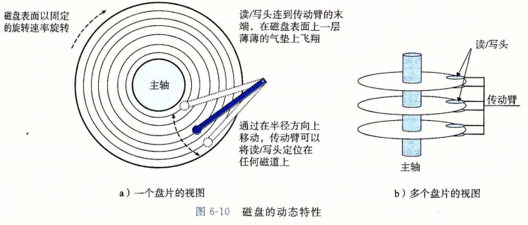
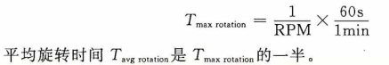
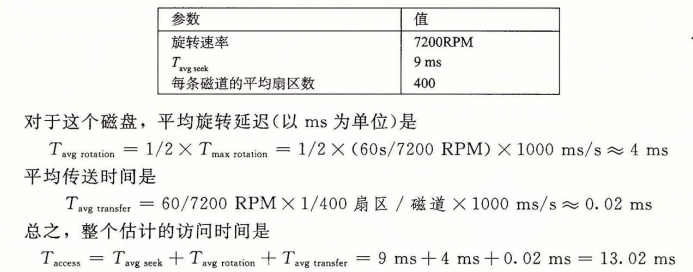
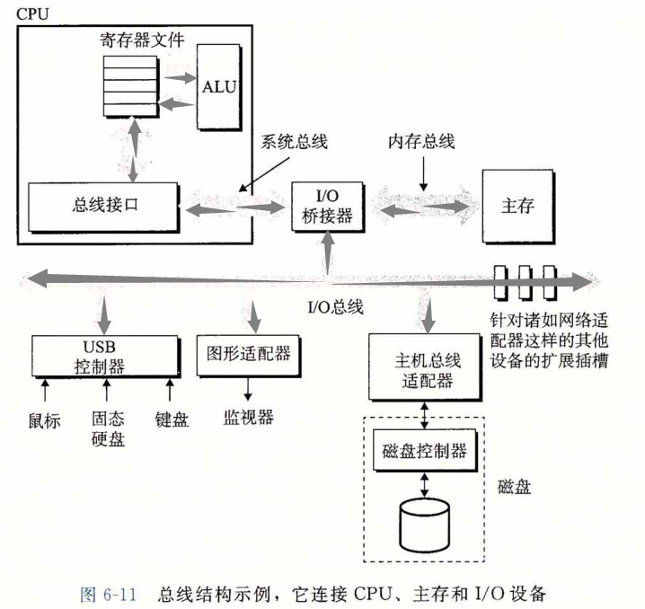
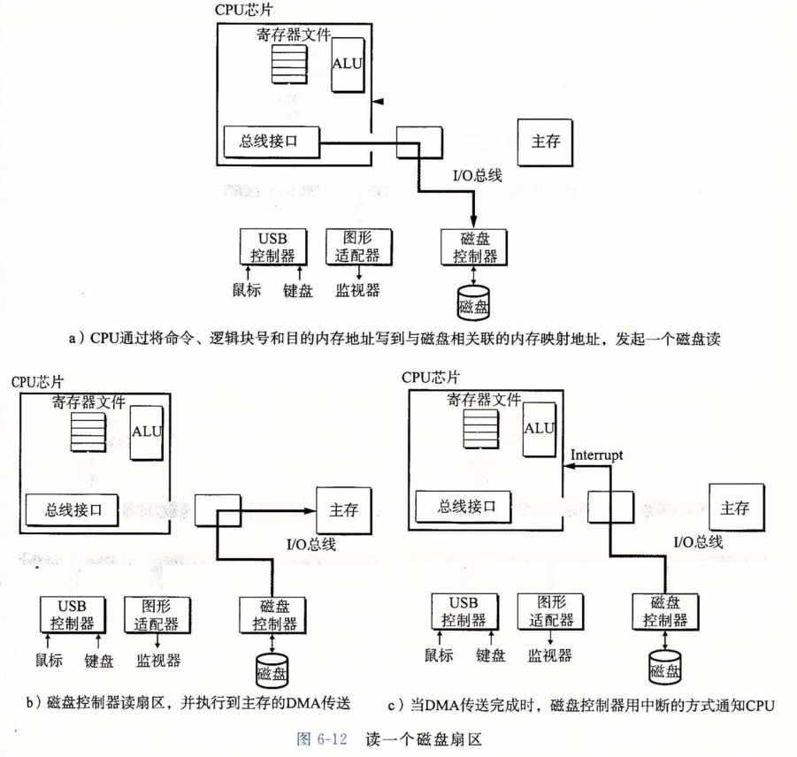

## 磁盘存储

​		**磁盘**是广为应用的保存大量数据的存储设备，存储数据的数量级可以达到几百到几千千兆字节，而基于RAM的存储器只能有几百或几千兆字节。不过，从磁盘上读信息的时间为毫秒级，比从 DRAM 读慢了 10 万倍，比从SRAM 读慢了 100 万倍。

##### 1.磁盘构造

​		磁盘是由**盘片(platter)**构成的。每个盘片有两面或者称为**表面(surface)**,表面覆盖着磁性记录材料。盘片中央有一个可以**旋转的主轴(spindle)**,它使得盘片以固定的**旋转速率 (rotational rate)**旋转，通常是 5400〜15 000 转每分钟（Revolution Per Minute，RPM)。磁盘通常包含一个或多个这样的盘片，并封装在一个密封的容器内。

​		图6-9a展示了一个典型的磁盘表面的结构。每个表面是由一组称为**磁道(track)**的同心圆组成的。每个磁道被划分为一组**扇区(sector)**。每个扇区包含相等数量的数据位（通常 是512字节），这些数据编码在扇区上的磁性材料中。扇区之间由一些**间隙(gap)**分隔开， 这些间隙中不存储数据位。间隙存储用来标识扇区的格式化位。

​		磁盘是由一个或多个叠放在一起的盘片组成的，它们被封装在一个密封的包装里，如 图6-9b所示。整个装置通常被称为**磁盘驱动器(disk drive)**,我们通常简称为**磁盘(disk)**。 有时，我们会称磁盘为**旋转磁盘(rotating disk)**，以使之区别于基于闪存的固态硬盘 (SSD), SSD是没有移动部分的。

​		磁盘制造商通常用术语**柱面(cylinder)**来描述多个盘片驱动器的构造，这里，柱面是所有盘片表面上到主轴中心的距离相等的磁道的集合。例如，如果一个驱动器有三个盘片和六个面，每个表面上的磁道的编号都是一致的，那么柱面 k 就是 6 个磁道 k 的集合。

##### 2.磁盘容量

​		一个磁盘上可以记录的最大位数称为它的最大容量，或者简称为容量。磁盘容量是由 以下技术因素决定的：

- 记录密度（recording density)(位/英寸）：磁道一英寸的段中可以放入的位数。
- 磁道密度（track density)(道/英寸）：从盘片中心出发半径上一英寸的段内可以有的 磁道数。
- 面密度（areal density)(位/平方英寸）：记录密度与磁道密度的乘积。

​       磁盘制造商不懈地努力以提高面密度（从而增加容量），而面密度每隔几年就会翻倍。 最初的磁盘，是在面密度很低的时代设计的，将每个磁道分为数目相同的扇区，扇区的数目是由最靠内的磁道能记录的扇区数决定的。为了保持每个磁道有固定的扇区数，越往外的磁道扇区隔得越开。在面密度相对比较低的时候，这种方法还算合理。不过，随着面密度的提高，扇区之间的间隙（那里没有存储数据位）变得不可接受地大。因此，现代大容量 磁盘使用一种称为**多区记录(multiple zone recording)**的技术，在这种技术中，柱面的集合被分割成不相交的子集合，称为**记录区(recording zone)**。每个区包含一组连续的柱面。一 个区中的每个柱面中的每条磁道都有相同数量的扇区，这个扇区的数量是由该区中最里面的磁道所能包含的扇区数确定的。

​		下面的公式给出了一个磁盘的容量：

例如，假设我们有一个磁盘，有 5 个盘片，每个扇区 512 个字节，每个面 20 000 条磁道， 每条磁道平均 300 个扇区。那么这个磁盘的容量是：

​		注意，制造商是以千兆字节(GB)或兆兆字节(TB)为单位来表达磁盘容量的，这里 1GB=10^9 字节，1TB=10^12 字节。

##### 3.磁盘操作

​		磁盘用**读/写头(read/write head)**来读写存储在磁性表面的位，而读写头连接到一个**传动臂(actuator arm)**—端，如图6-10a所示。通过沿着半径轴前后移动这个传动臂，驱动器可以将读/写头定位在盘面上的任何磁道上。这样的机械运动称为**寻道(seek)**。一旦读/ 写头定位到了期望的磁道上，那么当磁道上的每个位通过它的下面时，读/写头可以感知到这个位的值(读该位），也可以修改这个位的值(写该位）。有多个盘片的磁盘针对每个盘面都有一个独立的读/写头，如图6-10b所示。读/写头垂直排列，一致行动。在任何时刻，所有的读/写头都位于同一个柱面上。

​		在传动臂末端的读/写头在磁盘表面高度大约 0.1 微米处的一层薄薄的气垫上飞翔(就是字面上这个意思），速度大约为 80 km/h 。这可以比喻成将一座摩天大楼(442米高)放倒，然后让它在距离地面 2.5 cm( 1 英寸) 的高度上环绕地球飞行，绕地球一天只需要 8 秒钟！在这样小的间隙里，盘面上一粒微小的灰尘都像一块巨石。如果读/写头碰到了这样的一块巨石，读/写头会停下来，撞到盘面——所谓的**读/写头冲撞(head crash)**。为此，磁盘总是密封包装的。

​		磁盘以扇区大小的块来读写数据。对扇区的访**问时间(access time)**有三个主要的部分：**寻道时间（seek time)**、**旋转时间（rotational latency)**和**传送时间（transfer time)**:

- **寻道时间**：为了读取某个目标扇区的内容，传动臂首先将读/写头定位到包含目标扇区的磁道上。<u>移动传动臂所需的时间称为寻道时间。</u>寻道时间 T(seek) 依赖于读/写 头以前的位置和传动臂在盘面上移动的速度。现代驱动器中<u>平均</u>寻道时间 T(avg seek) 是通过对几千次对随机扇区的寻道求平均值来测量的，通常为 3〜9 ms。一次寻道的最大时间 T (max seek)可以高达 20ms 。
- **旋转时间**：一旦读/写头定位到了期望的磁道，驱动器等待目标扇区的第一个位旋转到读/写头下。这个步骤的性能依赖于当读/写头到达目标扇区时盘面的位置以及磁盘的旋转速度。在最坏的情况下，读/写头刚刚错过了目标扇区，必须等待磁盘转一整圈。因此，最大旋转延迟(以秒为单位)是
  
- **传送时间**：当目标扇区的第一个位位于读/写头下时，驱动器就可以开始读或者写该扇区的内容了。一个扇区的传送时间依赖于旋转速度和每条磁道的扇区数目。因此，我们可以粗略地估计一个扇区以秒为单位的平均传送时间如下
  

我们可以估计访问一个磁盘扇区内容的平均时间为平均寻道时间、平均旋转延迟和平均传送时间之和。例如，考虑一个有如下参数的磁盘：

这个例子说明了一些很重要的问题：

- 访问一个磁盘扇区中512个字节的时间主要是寻道时间和旋转延迟。访问扇g中的 第一个字节用了很长时间，但是访问剩下的字节几乎不用时间。
- 因为寻道时间和旋转延迟大致相等，所以将寻道时间乘2是估计磁盘访问时间的简 单而合理的方法。
- 对存储在SRAM中的一个64位字的访问时间大约是4ns，对DRAM的访问时间是 60ns。因此，从内存中读一个512个字节扇区大小的块的时间对SRAM来说大约是 256ns,对DRAM来说大约是4000ns。磁盘访问时间，大约10ms，是SRAM的大 约40 000倍，是DRAM的大约2500倍。

##### 4.逻辑磁盘块

​		正如我们看到的那样，现代磁盘构造复杂，有多个盘面，这些盘面上有不同的记录区。为了对操作系统隐藏这样的复杂性，现代磁盘将它们的构造呈现为一个简单的视图，一个 B 个扇区大小的逻辑块的序列，编号为 0，1，…，B - 1。磁盘封装中有一个小的硬件/固件设备，称为**磁盘控制器**，维护着逻辑块号和实际（物理）磁盘扇区之间的映射关系。

​		当操作系统想要执行一个 I / O 操作时，例如读一个磁盘扇区的数据到主存，操作系统会发送一个命令到磁盘控制器，让它读某个逻辑块号。控制器上的固件执行一个快速表查找，将一个逻辑块号翻译成一个(盘面，磁道，扇区）的三元组，这个三元组唯一地标识了对应的物理扇区。控制器上的硬件会解释这个三元组，将读/写头移动到适当的柱面，等待扇区移动到读/写头下，将读/写头感知到的位放到控制器上的一个小缓冲区中，然后将它们复制到主存中。

##### 5.连接I/O设备

​		例如图形卡、监视器、鼠标、键盘和磁盘这样的输入/输出 ( I / O ) 设备，都是通过 I / O总线，例如 Intel 的**外围设备互连（Peripheral Component Interconnect, PCI)**总线连接到 CPU 和 主存 的。系统总线和内存总线是与 CPU 相关的，与它们不同，诸如 PCI 这样的 I / O 总线设计成与底层 CPU 无关。例如，PC 和 Mac 都可以使用PCI 总线。图6-11展示了 一个典型的 I/O 总线结构，它连接了 CPU、主存和 I/O 设备。

​		虽然 I/O 总线比系统总线和内存总线慢，但是它可以容纳种类繁多的第三方 I/O 设备。例如，在图6-11中，有三种不同类型的设备连接到总线。

- **通用串行总线（Universal Serial Bus，USB)**控制器是一个连接到 USB 总线的设备的中转机构，USB总线是一个广泛使用的标准，连接各种外围 I/O 设备，包括键盘、鼠 标、调制解调器、数码相机、游戏操纵杆、打印机、外部磁盘驱动器和固态硬盘。 USB 3. 0总线的最大带宽为 625MB/S 。USB 3.1总线的最大带宽为1250MB/S。
- **图形卡**（或**适配器**）包含硬件和软件逻辑，它们负责代表 CPU 在显示器上画像素。
- **主机总线适配器**将一个或多个磁盘连接到 I/O 总线，使用的是一个特别的主机总线接口定义的通信协议。两个最常用的这样的磁盘接口是 SCSI (读作“ scuzzy ”)和 SATA (读作“ sat-uh ”。SCSI 磁盘通常比 SATA 驱动器更快但是也更贵。SCSI 主机总线适配器（通常称为 SCSI 控制器）可以支持多个磁盘驱动器，与 SATA 适配器不同，它只能支持一个驱动器。

​		其他的设备，例如**网络适配器**，可以通过将适配器插入到主板上空的扩展槽中，从而连接到 I/O 总线，这些插槽提供了到总线的直接电路连接。

##### 6.访问磁盘

​		虽然详细描述 I/O 设备是如何工作的以及如何对它们进行编程超出了我们讨论的范围，但是我们可以给你一个概要的描述。例如，图6-12总结了当 CPU 从磁盘读数据时发生的步骤。

​		CPU 使用一种称为 **内存映射 I/O ( memory-mapped I/O )** 的技术来向 I/O 设备发射命令 (图6-12a)。在使用内存映射 I/O 的系统中，地址空间中有一块地址是为与 I/O 设备通信保留的。每个这样的地址称为一个 **I/O 端口(I/O port)**。当一个设备连接到总线时，它与一个或多个端口相关联(或它被映射到一个或多个端口）。

​		来看一个简单的例子，假设磁盘控制器映射到端口 0xa0 。随后，CPU 可能通过执行三个对地址 0xa0 的存储指令，发起磁盘读：
​		第一条指令是发送一个命令字，告诉磁盘发起一个读，同时还发送了其他的参数，例如当读完成时，是否中断 CPU (我们会在8.1节中讨论中断)。
​		第二条指令指明应该读的逻辑块号。
​		第三条指令指明应该存储磁盘扇区内容的主存地址。

​		当 CPU 发出了请求之后，在磁盘执行读的时候，它通常会做些其他的工作。回想一下，一个 1 GHz 的处理器时钟周期为 1 ns ，在用来读磁盘的 16 ms 时间里，它潜在地可能执行 1600 万条指令。在传输进行时，只是简单地等待，什么都不做，是一种极大的浪费。

​		在磁盘控制器收到来自 CPU 的读命令之后，它将逻辑块号翻译成一个扇区地址，读该扇区的内容，然后将这些内容直接传送到主存，不需要 CPU 的干涉（图6-12b)。设备可以自己执行读或者写总线事务而不需要 CPU 干涉的过程，称为直接 **内存访问(Direct Memory Access, DMA)** 。这种数据传送称为 **DMA 传送(DMA transfer)**。

​		在 DMA 传送完成，磁盘扇区的内容被安全地存储在主存中以后，磁盘控制器通过给 CPU 发送一个中断信号来通知 CPU (图6-12C)。基本思想是中断会发信号到 CPU 芯片的一个外部引脚上。这会导致 CPU 暂停它当前正在做的工作，跳转到一个操作系统例程。 这个程序会记录下 I/O 已经完成，然后将控制返回到 CPU 被中断的地方。