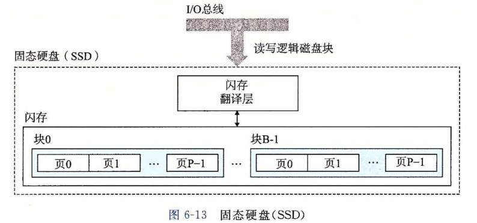

## 固态硬盘

​		**固态硬盘(Solid State Disk，SSD)** 是一种基于闪存的存储技术（参见6. 1.1节），在某些情况下是传统旋转磁盘的极有吸引力的替代产品。图6-13展示了它的基本思想。SSD 封装插到 I/O 总线上标准硬盘插槽（通常是 USB 或 SATA )中，行为就和其他硬盘一样， 处理来自 CPU 的读写逻辑磁盘块的请求。一个 SSD 封装由一个或多个闪存芯片和**闪存翻译层（flash translation layer）**组成，闪存芯片替代传统旋转磁盘中的机械驱动器，而闪存翻译层是一个硬件/固件设备，扮演与磁盘控制器相同的角色，<u>将对逻辑块的请求翻译成对底层物理设备的访问。</u>

​		图6-14展示了典型 SSD 的性能特性。注意，读 SSD 比写要快。随机读和写的性能差别是由底层闪存基本属性决定的。如图6-13所示，一个闪存由 B 个块的序列组成，每个块由 P 页组成。通常，页的大小是 512 字节 〜 4 KB ，块是由 32 〜 128 页组成的，块的大小为 16 KB 〜 512 KB 。数据是以页为单位读写的。只有在一页所属的块整个被擦除之后，才能写这一页（通常是指该块中的所有位都被设置为 1 )。不过，一旦一个块被擦除了，块中 每一个页都可以不需要再进行擦除就写一次。在大约进行 100 000 次重复写之后，块就会磨损坏。一旦一个块磨损坏之后，就不能再使用了。

​		随机写很慢，有两个原因。首先，擦除块需要相对较长的时间，1 ms 级的，比访问页所需时间要高一个数量级。其次，如果写操作试图修改一个包含已经有数据（也就是不是全为1)的页 p ，<u>那么这个块中所有带有用数据的页都必须被复制到一个新（擦除过的）块</u>， 然后才能进行对页 p 的写。制造商已经在闪存翻译层中实现了复杂的逻辑，试图抵消擦写块的高昂代价，最小化内部写的次数，但是随机写的性能不太可能和读一样好。

​		比起旋转磁盘，SSD 有很多优点。它们由半导体存储器构成，没有移动的部件，因而随机访问时间比旋转磁盘要快，能耗更低，同时也更结实。不过，也有一些缺点。首先， 因为反复写之后，闪存块会磨损，所以 SSD 也容易磨损。闪存翻译层中的**平均磨损（wear leveling)**逻辑试图通过将擦除平均分布在所有的块上来最大化每个块的寿命。实际上，平均磨损逻辑处理得非常好，要很多年 SSD 才会磨损坏(参考练习题6. 5)。其次，SSD 每字节比旋转磁盘贵大约 30 倍，因此常用的存储容量比旋转磁盘小 100 倍。不过，随着 SSD 变得越来越受欢迎，它的价格下降得非常快，而两者的价格差也在减少。

​		在便携音乐设备中，SSD 已经完全的取代了旋转磁盘，在笔记本电脑中也越来越多地作为硬盘的替代品，甚至在台式机和服务器中也开始出现了。虽然旋转磁盘还会继续存在，但是显然，SSD 是一项重要的替代选择。