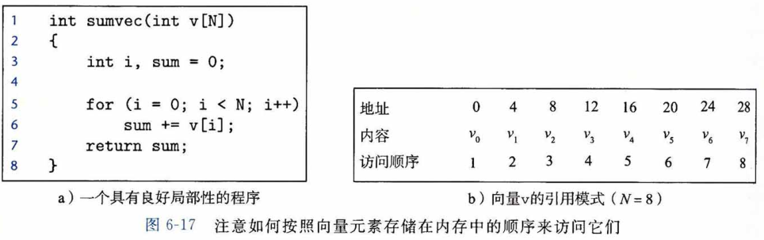
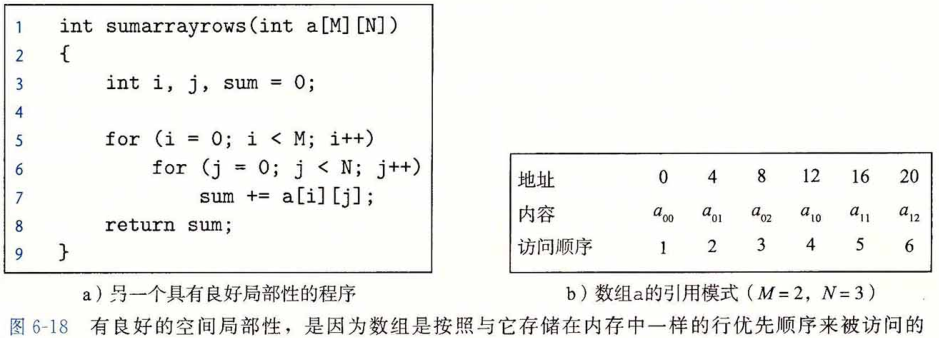
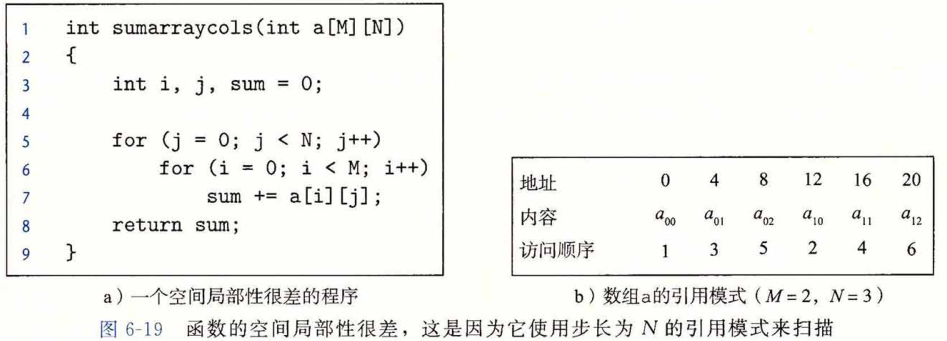

## 局部性

​		一个编写良好的计算机程序常常具有良好的**局部性(locality)**。也就是，它们倾向于引用邻近于其他最近引用过的数据项的数据项，或者最近引用过的数据项本身。这种倾向性，被称为**局部性原理(principle of locality)**,是一个持久的概念，对硬件和软件系统的设计和性能都有着极大的影响。

​		局部性通常有两种不同的形式：**时间局部性(temporal locality)**和**空间局部性(spatial locality)**。在一个具有良好时间局部性的程序中，被引用过一次的内存位置很可能在不远的将来再被多次引用。在一个具有良好空间局部性的程序中，如果一个内存位置被引用了一次，那么程序很可能在不远的将来引用附近的一个内存位置。

​		程序员应该理解局部性原理，因为一般而言，有良好局部性的程序比局部性差的程序运行得更快。现代计算机系统的各个层次，从硬件到操作系统、再到应用程序，它们的设计都利用了局部性。在硬件层，局部性原理允许计算机设计者通过引入称为高速缓存存储器的小而快速的存储器来保存最近被引用的指令和数据项，从而提高对主存的访问速度， 在操作系统级，局部性原理允许系统使用主存作为虚拟地址空间最近被引用块的高速缓存。类似地，操作系统用主存来缓存磁盘文件系统中最近被使用的磁盘块。局部性原理在应用程序的设计中也扮演着重要的角色。例如，Web 浏览器将最近被引用的文档放在本地磁盘上，利用的就是时间局部性。大容量的 Web 服务器将最近被请求的文档放在前端磁盘高速缓存中，这些缓存能满足对这些文档的请求，而不需要服务器的任何干预。

### 对程序数据引用的局部性

​		考虑图6-17a中的简单函数，它对一个向量的元素求和。这个程序有良好的局部性吗？要回答这个问题，我们来看看每个变量的引用模式。在这个例子中，变量 sum 在每次循环迭代中被引用一次，因此，对于 sum 来说，有好的时间局部性。另一方面，因为 sum 是标量，对于 sum 来说，没有空间局部性。

​		正如我们在图6-17b中看到的，向量 v 的元素是被顺序读取的，一个接一个，按照它们存储在内存中的顺序（为了方便，我们假设数组是从地址 0 开始的）。因此，对于变量 v ， 函数有很好的空间局部性，但是时间局部性很差，因为每个向量元素只被访问一次。因为对于循环体中的每个变量，这个函数要么有好的空间局部性，要么有好的时间局部性，所以我们可以断定 sumvec 函数有良好的局部性。

​		我们说像 sumvec 这样顺序访问一个向量每个元素的函数，具有步长为 1 的**引用模式 (stride-1 reference pattern)**(相对于元素的大小）。有时我们称步长为 1 的引用模式为**顺序引用模式（sequential reference pattern)**。一个连续向量中，每隔 k 个元素进行访问，就称为步长为 k 的引用模式（stride-k reference pattern)。步长为 1 的引用模式是程序中空间局部性常见和重要的来源。一般而言，随着步长的增加，空间局部性下降。

​		对于引用多维数组的程序来说，步长也是一个很重要的问题。例如，考虑图6-18a中的函数 sumarrayrows，它对一个二维数组的元素求和。双重嵌套循环按照行**优先顺序（row-major order)** 读数组的元素。也就是，内层循环读第一行的元素，然后读第二行，依此类推。 函数 sumarrayrows 具有良好的空间局部性，因为它按照数组被存储的行优先顺序来访问这个数组(图6-18b)。其结果是得到一个很好的步长为 1 的引用模式，具有良好的空间局部性。

​		—些看上去很小的对程序的改动能够对它的局部性有很大的影响。例如，图6-19a中 的函数 sumarraycols 计算的结果和图6-18a中函数 sumarrayrows 的一样。唯一的区别是我们交换了 i 和 j 的循环。这样交换循环对它的局部性有何影响？函数 sumarraycols 的空间局部性很差，因为它按照列顺序来扫描数组，而不是按照行顺序。因为 C 数组在内存中是按照行顺序来存放的，结果就得到步长为 N 的引用模式，如图6-19b所示。

### 取指令的局部性

​		因为程序指令是存放在内存中的，CPU 必须取出（读出）这些指令，所以我们也能够评价一个程序关于取指令的局部性。例如，图6-17中 for 循环体里的指令是按照连续的内存顺序执行的，因此循环有良好的空间局部性。因为循环体会被执行多次，所以它也有很好的时间局部性。

​		代码区别于程序数据的一个重要属性是在运行时它是不能被修改的。当程序正在执行时，CPU 只从内存中读出它的指令。CPU 很少会重写或修改这些指令。

### 局部性小结

​			在这一节中，我们介绍了局部性的基本思想，还给出了量化评价程序中局部性的一些简单原则：

- **重复引用相同变量的程序有良好的时间局部性。**
- 对于具有步长为 k 的引用模式的程序，**步长越小，空间局部性越好。**具有步长为 l 的引用模式的程序有很好的空间局部性。在内存中以大步长跳来跳去的程序空间局部性会很差。
- 对于取指令来说，**循环有好的时间和空间局部性。**循环体越小，循环迭代次数越多，局部性越好。

​        在本章后面，在我们学习了高速缓存存储器以及它们是如何工作的之后，我们会介绍如何用高速缓存命中率和不命中率来量化局部性的概念。你还会弄明白为什么有良好局部性的程序通常比局部性差的程序运行得更快。尽管如此，了解如何看一眼源代码就能获得对程序中局部性的高层次的认识，是程序员要掌握的一项有用而且重要的技能