## 高速缓存存储器

​		早期计算机系统的存储器层次结构只有三层：CPU 寄存器、DRAM 主存储器和磁盘存储。不过，由于 CPU 和主存之间逐渐增大的差距，系统设计者被迫在 CPU 寄存器文件 和主存之间插人了一个小的 SRAM 高速缓存存储器，称为 L1 高速缓存（一级缓存），如 图6-24所示。L1 高速缓存的访问速度几乎和寄存器一样快，典型地是大约 4 个时钟周期。

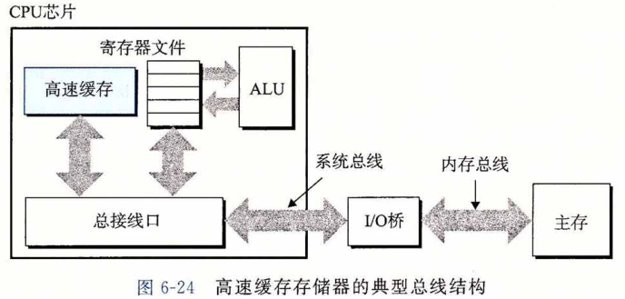

​		随着 CPU 和主存之间的性能差距不断增大，系统设计者在 L1 高速缓存和主存之间又插入了一个更大的高速缓存，称为 L2 高速缓存，可以在大约 10 个时钟周期内访问到它。 有些现代系统还包括有一个更大的高速缓存，称为 L3 高速缓存，在存储器层次结构中， 它位于 L2 高速缓存和主存之间，可以在大约 50 个周期内访问到它。虽然安排上有相当多的变化，但是通用原则是一样的。对于下一节中的讨论，我们会假设一个简单的存储器层次结构，CPU 和主存之间只有一个 L1 髙速缓存。


### 通用的高速缓存存储器组织结构

​		考虑一个计算机系统，其中每个存储器地址有 m 位，形成 M = 2 ^ m 个不同的地址。如图6-25a所示，这样一个机器的高速缓存被组织成一个有 S = 2 ^ s 个**高速缓存组(cache set)**的数组。每个组包含 E 个**高速缓存行(cache line)**。每个行是由一个 B = 2 ^ b 字节的**数据块(block)**组成的，一个**有效位(valid bit)**指明这个行是否包含有意义的信息，还有 t = m- ( b + s ) 个**标记位(tag bit)**(是当前块的内存地址的位的一个子集），它们唯一地标识存储在 这个高速缓存行中的块。

的通用组织.png)

​		一般而言，高速缓存的结构可以用元组（S, E，B, m)来描述。高速缓存的大小（或容量）C 指的是所有块的大小的和。标记位和有效位不包括在内。因此，C = S X E X B 。

​		当一条加载指令指示 CPU 从主存地址 A 中读一个字时，它将地址 A 发送到高速缓存。如果高速缓存正保存着地址 A 处那个字的副本，它就立即将那个字发回给 CPU 。那么高速缓存如何知道它是否包含地址 A 处那个字的副本的呢？高速缓存的结构使得它能通过简单地检查地址位，找到所请求的字，类似于使用极其简单的哈希函数的哈希表。下面介绍它是如何工作的：

​		参数 S 和 B 将 m 个地址位分为了三个字段，如图6-25b所示。A 中 s 个组**索引**位是一个到 S 个组的数组的索引。第一个组是组 0 ,第二个组是组 1 ，依此类推。组索引位被解释为一个无符号整数，它告诉我们这个字必须存储在哪个组中。一旦我们知道了这个字必须放在哪个组中，A 中的 t 个标记位就告诉我们这个组中的哪一行包含这个字（如果有的话）。当且仅当设置了有效位并且该行的标记位与地址 A 中的标记位相匹配时，组中的这一行才包含这个字。一旦我们在由组索引标识的组中定位了由标号所标识的行，那么 b 个块偏移位给出了在 B 个字节的数据块中的字偏移。

​		你可能已经注意到了，对高速缓存的描述使用了很多符号。图6-26对这些符号做了个小结，供你参考。

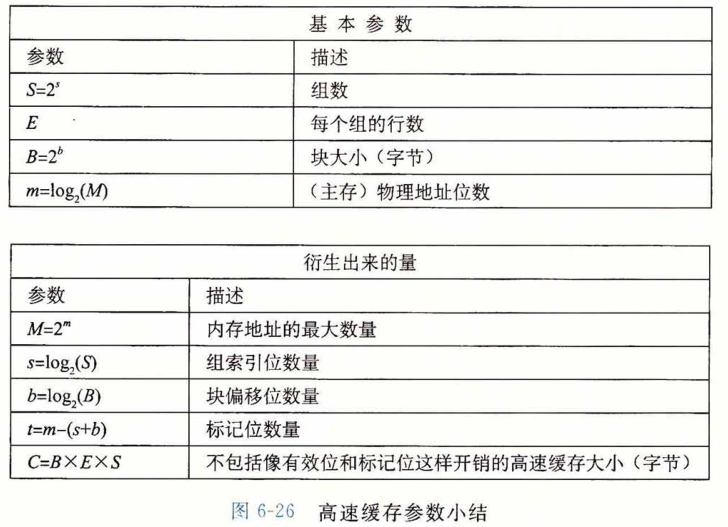


### 直接映射高速缓存

​		据每个组的高速缓存行数 E，高速缓存被分为不同的类。每个组只有一行( E = 1 )的高速缓存称为**直接映射高速缓存（direct-mapped cache)**(见图6-27)。直接映射高速缓存是最容易实现和理解的，所以我们会以它为例来说明一些高速缓存工作方式的通用概念。

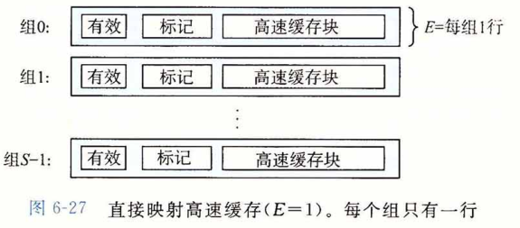

​		假设我们有这样一个系统，它有一个 CPU 、一个寄存器文件、一个 L1 高速缓存和一个主存。当 CPU 执行一条读内存字 w 的指令，它向 L1 高速缓存请求这个字。如果 L1 高速缓存有 w 的一个缓存的副本，那么就得到 L1 高速缓存命中，高速缓存会很快抽取出 w ,并将它返回给 CPU 。否则就是缓存不命中，当 L1 高速缓存向主存请求包含 w 的块的一个副本时，CPU 必须等待。当被请求的块最终从内存到达时，L1 高速缓存将这个块存放在它的一个高速缓存行里，从被存储的块中抽取出字然后将它返回给 CPU 。高速缓存确定一个请求是否命中，然后抽取出被请求的字的过程.分为三步：1)组选择；2) 行匹配；3)字抽取。

##### 1.直接映射高速缓存中的组选择

​		在这一步中，高速缓存从 w 的地址中间抽取出 s 个组索引位。这些位被解释成一个对应于一个组号的无符号整数。换句话来说，如果我们把高速缓存看成是一个关于组的一维数组，那么这些组索引位就是一个到这个数组的索引。图6-28展示了直接映射高速缓存的组选择是如何工作的。在这个例子中，组索引位 00001(2)被解释为一个选择组 1 的整数索引。

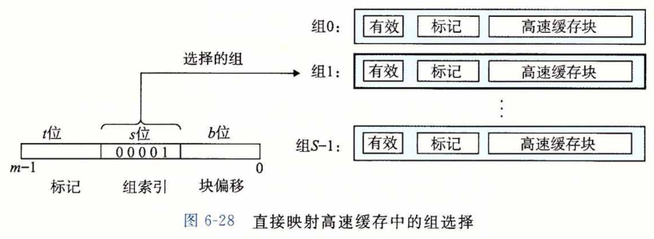

##### 2.直接映射高速缓存中的行匹配

​		在上一步中我们已经选择了某个组 i ，接下来的一步就要确定是否有字 w 的一个副本存储在组 i 包含的一个高速缓存行中。在直接映射高速缓存中这很容易，而且很快，这是因为每个组只有一行。当且仅当设置了有效位，而且高速缓存行中的标记与 w 的地址中的标记相匹配时，这一行中包含 w 的一个副本。

​		图6-29展示了直接映射高速缓存中行匹配是如何工作的。在这个例子中，选中的组中只有一个高速缓存行。这个行的有效位设置了，所以我们知道标记和块中的位是有意义的。因为这个高速缓存行中的标记位与地址中的标记位相匹配，所以我们知道我们想要的那个字的一个副本确实存储在这个行中。换句话说，我们得到一个缓存命中。另一方面, 如果有效位没有设置，或者标记不相匹配，那么我们就得到一个缓存不命中。

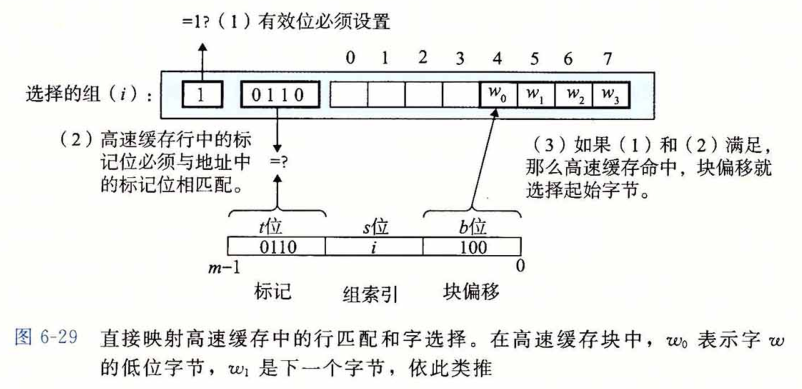

##### 3.直接映射高速缓存中的字选择

​		一旦命中，我们知道 w 就在这个块中的某个地方。最后一步确定所需要的字在块中是从哪里开始的。如图6-29所示，块偏移位提供了所需要的字的第一个字节的偏移。就像我们把高速缓存看成一个行的数组一样，我们把块看成一个字节的数组，而字节偏移是到这个数组的一个索引。在这个示例中，块偏移位是100(2) ,它表明 w 的副本是从块中的字节 4 开始的（我们假设字长为4字节）。

##### 4.直接映射高速缓存中不命中时的行替换

​		如果缓存不命中，那么它需要从存储器层次结构中的下一层取出被请求的块，然后将新的块存储在组索引位指示的组中的一个高速缓存行中。一般而言，如果组中都是有效高速缓存行了，那么必须要驱逐出一个现存的行。对于直接映射高速缓存来说，每个组只包含有一行，替换策略非常简单：用新取出的行替换当前的行。

##### 5.综合：运行中的直接映射高速缓存

​		高速缓存用来选择组和标识行的机制极其简单，因为硬件必须在几个纳秒的时间内完成这些工作。不过，用这种方式来处理位是很令人困惑的。一个具体的例子能帮助解释清楚这个过程。假设我们有一个直接映射高速缓存，描述如下
​					`(S,E,B,m) = (4,1,2,4)`
换句话说，高速缓存有 4 个组，每个组一行，每个块 2 个字节，而地址是 4 位的。我们还假设每个字都是单字节的。当然，这样一些假设完全是不现实的，但是它们能使示例保持简单。

​		当你初学高速缓存时，列举出整个地址空间并划分好位是很有帮助的，就像我们在 图6-30对 4 位的示例所做的那样。关于这个列举出的空间，有一些有趣的事情值得注意：

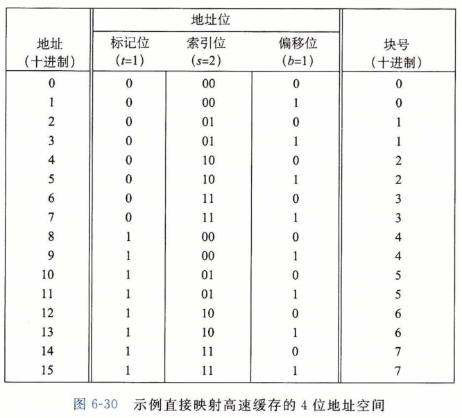

- 标记位和索引位连起来唯一地标识了内存中的每个块。例如，块 0 是由地址 0 和 1 组成的，块 1 是由地址 2 和 3 组成的，块 2 是由地址 4 和 5 组成的，依此类推。
- 因为有 8 个内存块，但是只有 4 个高速缓存组，所以多个块会映射到同一个高速缓存组（即它们有相同的组索引）。例如，块 0 和 4 都映射到组0,块 1 和 5 都映射到组 1 ，等等。
- 映射到同一个高速缓存组的块由标记位唯一地标识。例如，块 0 的标记位为 0 ,而块 4 的标记位为 1，块 1 的标记位为 0 ,而块 5 的标记位为 1 ,以此类推。

让我们来模拟一下当 CPU 执行一系列读的时候，高速缓存的执行情况。记住对于这个示例，我们假设 CPU 读 1 字节的字。虽然这种手工的模拟很乏味，你可能想要跳过它， 但是根据我们的经验，在学生们做过几个这样的练习之前，他们是不能真正理解高速缓存是如何工作的。

​		初始时，高速缓存是空的（即每个有效位都是 0 ):

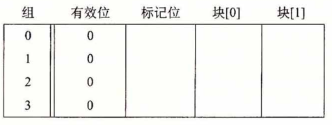

表中的每一行都代表一个高速缓存行。第一列表明该行所属的组，但是请记住提供这个位只是为了方便，实际上它并不真是高速缓存的一部分。后面四列代表每个高速缓存行的实际的位。现在，让我们来看看当 CPU 执行一系列读时，都发生了什么：

​		**1 ) 读地址0的字。**因为组 0 的有效位是 0 ,是缓存不命中。高速缓存从内存（或低一层的高速缓存)取出块 0 ,并把这个块存储在组 0 中。然后，高速缓存返回新取出的高速缓存行的块 [ 0 ] 的 m [0] (内存位置 0 的内容）。


​		**2 ) 读地址1的字**。这次会是高速缓存命中。高速缓存立即从高速缓存行的块[1]中返回m[l]。高速缓存的状态没有变化。
​		**3 ) 读地址13的字**。由于组 2 中的高速缓存行不是有效的，所以有缓存不命中。高速缓存把块 6 加载到组 2中，然后从新的高速缓存行的块 [1] 中返回 m[13]。

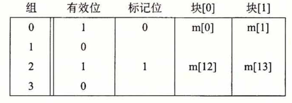

​		**4 ) 读地址8的字**。这会发生缓存不命中。组 0 中的高速缓存行确实是有效的，但是标记不匹配。高速缓存将块 4 加载到组 0 中（替换读地址 0 时读入的那一行），然后从新的高速缓存行的块[0]中返回m[8]。

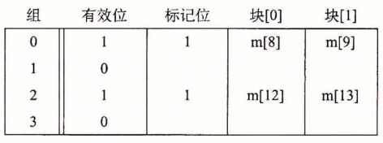
		**5 ) 读地址0的字**。又会发生缓存不命中，因为在前面引用地址 8 时，我们刚好替换了块 0 。这就是冲突不命中的一个例子，也就是我们有足够的高速缓存空间，但是却交替地引用映射到同一个组的块。

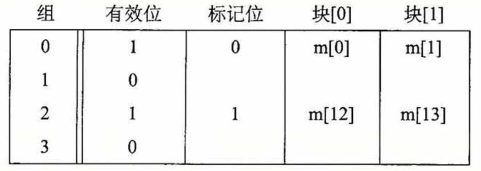


##### 6.直接映射高速缓存中的冲突不命中

​		冲突不命中在真实的程序中很常见，会导致令人困惑的性能问题。当程序访问大小为 2 的幂的数组时，直接映射高速缓存中通常会发生冲突不命中。例如，考虑一个计算两个向量点积的函数：

```c
1	float dotprod(float x[8], float y[8]) 
2	{
3		float sum = 0.0; 
4	    int i;
5    
6		for (i = 0; i < 8; i++) 
7	        sum += x[i] * y[i];
8	    return sum;
9	}
```

对于 x 和 y 来说，这个函数有良好的空间局部性，因此我们期望它的命中率会比较高。不幸的是，并不总是如此。

​		假设浮点数是 4 个字节，x 被加载到从地址 0 开始的 32 字节连续内存中，而 y 紧跟在 x 之后，从地址 32 开始。为了简便，假设一个块是 16 个字节（足够容纳 4 个浮点数），高速缓存由两个组组成，高速缓存的整个大小为 32 字节。我们会假设变量 sum 实际上存放在一个 CPU 寄存器中，因此不需要内存引用。根据这些假设每个 x[i] 和 y[i] 会映射到相同的高速缓存组：

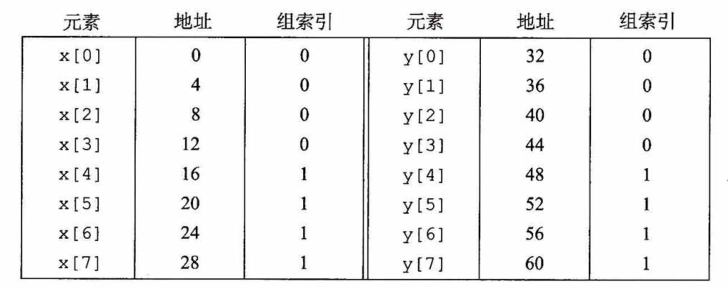

​		在运行时，循环的第一次迭代引用 x[0] ,缓存不命中会导致包含 x[0]〜x[3] 的块被加载到组 0 。接下来是对y[0] 的引用，又一次缓存不命中，导致包含 y[0]〜y[3] 的块被复制到组 0 ,覆盖前一次引用复制进来的 x 的值。在下一次迭代中，对 x[1] 的引用不命中，导致 x[0]~x[3] 的块被加载回组 0 ,覆盖掉 y[0] ~ y[3] 的块。因而现在我们就有了一个冲突不命中，而且实际上后面每次对 x 和 y 的引用都会导致冲突不命中，因为我们在 x 和 y 的块之间**抖动(thrash)**。术语“抖动”描述的是这样一种情况，即高速缓存反复地加载和驱逐相同的高速缓存块的组。

​		简要来说就是，即使程序有良好的空间局部性，而且我们的高速缓存中也有足够的空间来存放 x[i] 和 y[i] 的块，每次引用还是会导致冲突不命中，这是因为这些块被映射到了同一个高速缓存组。这种抖动导致速度下降 2 或 3 倍并不稀奇。另外，还要注意虽然我们的示例极其简单，但是对于更大、更现实的直接映射高速缓存来说，这个问题也是很真实的。

​		幸运的是，一旦程序员意识到了正在发生什么，就很容易修正抖动问题。一个很简单的方法是在每个数组的结尾放 B 字节的填充。例如，不是将 x 定义为 float x [8] , 而是定义成 float x[12]。假设在内存中 y 紧跟在 x 后面，我们有下面这样的从数组元素到组的映射：

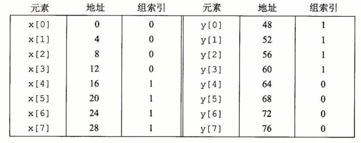

在 x 结尾加了填充，x[i] 和 y[i] 现在就映射到了不同的组，消除了抖动冲突不命中。