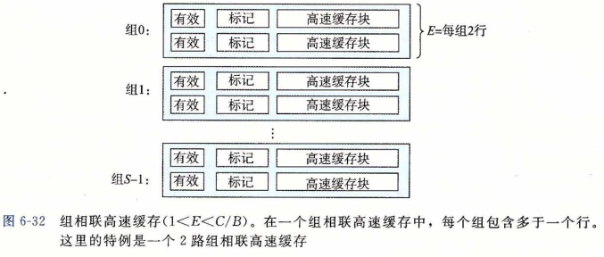
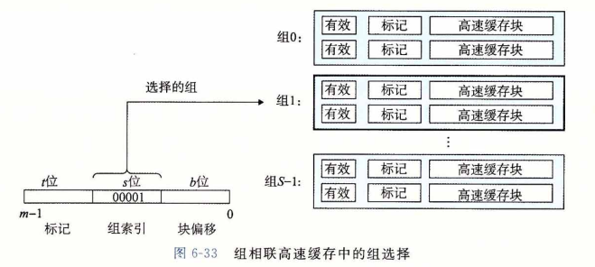
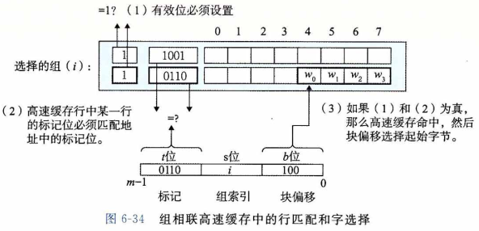
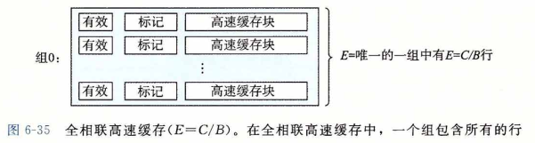
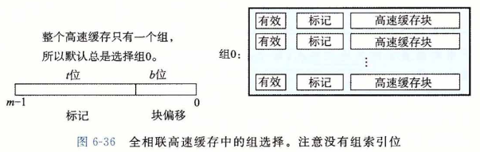
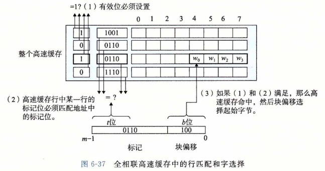
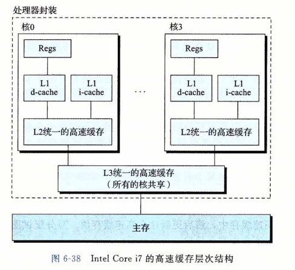
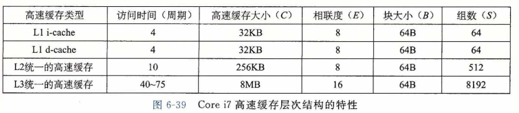

### 组相联高速缓存

​		直接映射高速缓存中冲突不命中造成的问题源于每个组只有一行（或者，按照我们的术语来描述就是 E = 1 )这个限制。**组相联高速缓存(set associative cache)**放松了这条限制， 所以每个组都保存有多于一个的高速缓存行。一个 1 < E < C < B 的高速缓存通常称为 E 路组相联高速缓存。在下一节中，我们会讨论 E = C/B 这种特殊情况。图6-32展示了一个2 路组相联高速缓存的结构。

##### 1.组相联高速缓存中的组选择

​		它的组选择与直接映射高速缓存的组选择一样，组索引位标识组。图6-33总结了这个原理。

##### 2.组相联高速缓存中的行匹配和字选择

​		组相联高速缓存中的行匹配比直接映射高速缓存中的更复杂，因为它必须检查多个行的标记位和有效位，以确定所请求的字是否在集合中。传统的内存是一个值的数组，以地 址作为输人，并返回存储在那个地址的值。另一方面，相联存储器是一个 (key, value) 对的数组，以 key 为输入，返回与输人的 key 相匹配的 (key, value) 对中的 value 值。因此， 我们可以把组相联高速缓存中的每个组都看成一个小的相联存储器，key 是标记和有效位，而 value 就是块的内容。

​		图6-34展示了相联高速缓存中行匹配的基本思想。这里的一个重要思想就是组中的任何一行都可以包含任何映射到这个组的内存块。所以高速缓存必须搜索组中的每一行， 寻找一个有效的行，其标记与地址中的标记相匹配。如果高速缓存找到了这样一行，那么我们就命中，块偏移从这个块中选择一个字，和前面一样。

##### 3.组相联高速缓存中不命中时的行替换

​		如果 CPU 请求的字不在组的任何一行中，那么就是缓存不命中，高速缓存必须从内存中取出包含这个字的块。不过，一旦高速缓存取出了这个块，该替换哪个行呢？当然, 如果有一个空行，那它就是个很好的候选。但是如果该组中没有空行，那么我们必须从中选择一个非空的行，希望 CPU 不会很快引用这个被替换的行。

​		程序员很难在代码中利用高速缓存替换策略，所以在此我们不会过多地讲述其细节。 最简单的替换策略是随机选择要替换的行。其他更复杂的策略利用了局部性原理，以使在 比较近的将来引用被替换的行的概率最小。例如，**最不常使用(Least-Frequently-Used, LFU)策略**会替换在过去某个时间窗口内引用次数最少的那一行。最近**最少使用(Least-Recently-Used，LRU)策略**会替换最后一次访问时间最久远的那一行。所有这些策略都需要额外的时间和硬件。但是，越往存储器层次结构下面走，远离 CPU , —次不命中的开销就会更加昂贵，用更好的替换策略使得不命中最少也变得更加值得了。

### 全相联高速缓存

​		**全相联高速缓存(fully associative cache)**是由一个包含所有高速缓存行的组（即 E = C / B ) 组成的。图6-35给出了基本结构。

##### 1.全相联高速缓存中的组选择

​		全相联高速缓存中的组选择非常简单，因为只有一个组，图6-36做了个小结。注意地址中没有组索引位，地址只被划分成了一个标记和一个块偏移。

##### 2.全相联高速缓存中的行匹配和字选择

​		全相联高速缓存中的行匹配和字选择与组相联高速缓存中的是一样的，如图6-37所 示。它们之间的区别主要是规模大小的问题。

​		因为高速缓存电路必须并行地搜索许多相匹配的标记，构造一个又大又快的相联高速缓存很困难，而且很昂贵。因此，全相联高速缓存只适合做小的高速缓存，例如虚拟内存系统中的翻译备用**缓冲器(TLB)**，它缓存页表项（见9. 6. 2节）。

### 有关写的问题

​		正如我们看到的，高速缓存关于读的操作非常简单。首先，在高速缓存中查找所需字 w 的副本。如果命中，立即返回字 w 给 CPU 。如果不命中，从存储器层次结构中较低层中取出包含字 w 的块，将这个块存储到某个高速缓存行中（可能会驱逐一个有效的行），然后返回字 w 。

​		写的情况就要复杂一些了。假设我们要写一个已经缓存了的字 w (写命中，write hit)。 在高速缓存更新了它的的副本之后，怎么更新 w 在层次结构中紧接着低一层中的副本呢？最简单的方法，称为**直写(write-through)**，就是立即将 w 的高速缓存块写回到紧接着的低一层中。虽然简单，但是直写的缺点是每次写都会引起总线流量。另一种方法，称为 **写回(write-back)**,尽可能地推迟更新，只有当替换算法要驱逐这个更新过的块时，才把它写到紧接着的低一层中。由于局部性，写回能显著地减少总线流量，但是它的缺点是增加了复杂性。高速缓存必须为每个高速缓存行维护一个额外的**修改位(dirty bit)**，表明这个高速缓存块是否被修改过。

​		另一个问题是如何处理写不命中。一种方法，称为**写分配(write-allocate)**，加载相应的低一层中的块到高速缓存中，然后更新这个高速缓存块。写分配试图利用写的空间局部性，但是缺点是每次不命中都会导致一个块从低一层传送到高速缓存。另一种方法，称为**非写分配（not-write-allocate)**，避开高速缓存，直接把这个字写到低一层中。直写高速缓存通常是非写分配的。写回高速缓存通常是写分配的。

​		为写操作优化高速缓存是一个细致而困难的问题，在此我们只略讲皮毛。细节随系统 的不同而不同，而且通常是私有的，文档记录不详细。对于试图编写高速缓存比较友好的程序的程序员来说，我们建议在心里采用一个使用写回和写分配的高速缓存的模型，这样建议有几个原因。通常，由于较长的传送时间，存储器层次结构中较低层的缓存更可能使用写回，而不是直写。例如，虚拟内存系统(用主存作为存储在磁盘上的块的缓存）只使用写回。但是由于逻辑电路密度的提高，写回的高复杂性也越来越不成为阻碍了，我们在现代系统的所有层次上都能看到写回缓存。所以这种假设符合当前的趋势。假设使用写回写分配方法的另一个原因是，它与处理读的方式相对称，因为写回写分配试图利用局部性。 因此，我们可以在高层次上开发我们的程序，展示良好的空间和时间局部性，而不是试图为某一个存储器系统进行优化。

### —个真实的高速缓存层次结构的解剖

​		到目前为止，我们一直假设高速缓存只保存程序数据。不过，实际上，高速缓存既保 存数据，也保存指令。只保存指令的高速缓存称为 i-cache , 只保存程序数据的高速缓存称为 d-cache。既保存指令又包括数据的高速缓存称为**统一的高速缓存(unified cache)**。现代处理器包括独立的 i-cache 和 d-cache 。这样做有很多原因。有两个独立的高速缓存，处理器能够同时读一个指令字和一个数据字。i-cache 通常是只读的，因此比较简单。通常会针对不同的访问模式来优化这两个高速缓存，它们可以有不同的块大小，相联度和容量。使用不同的高速缓存也确保了数据访问不会与指令访问形成冲突不命中，反过来也是一样， 代价就是可能会引起容量不命中增加。

​		图6-38给出了 Intel Core i7 处理器的高速缓存层次结构。每个 CPU 芯片有四个核。 每个核有自己私有的 L1 i-cache、L1 d-cache 和 L2 统一的高速缓存。所有的核共享片上  L3 统一的高速缓存。这个层次结构的一个有趣的特性是所有的 SRAM 高速缓存存储器都在CPU芯片上。

图6-39总结了 Core i7高速缓存的基本特性。

### 高速缓存参数的性能影响

​		有许多指标来衡量高速缓存的性能：

- **不命中率（miss rate)**。在一个程序执行或程序的一部分执行期间，内存引用不命中 的比率。它是这样计算的：不命中数量 / 引用数量。
- **命中率（hit rate)**。命中的内存引用比率。它等于 1 - 不命中率。
- **命中时间（hit time)**。从高速缓存传送一个字到 CPU 所需的时间，包括组选择、行 确认和字选择的时间。对于 L1 高速缓存来说，命中时间的数量级是几个时钟周期。
- **命中处罚（miss penalty)**。由于不命中所需要的额外的时间。L1 不命中需要从 L2  得到服务的处罚，通常是数 10 个周期；从 L3 得到服务的处罚，50 个周期；，从主存得到的服务的处罚，200 个周期。

​        优化高速缓存的成本和性能的折中是一项很精细的工作，它需要在现实的基准程序代码上进行大量的模拟，因此超出了我们讨论的范围。不过，还是可以认识一些定性的折中考量的。

##### 		1.高速缓存大小的影响

​		一方面，较大的高速缓存可能会提高命中率。另一方面，使大存储器运行得更快总是要难一些的。结果，较大的高速缓存可能会增加命中时间。这解释了为什么 L1 高速缓存比 L2 高速缓存小，以及为什么 L2 高速缓存比 L3 高速缓存小。

##### 		2.块大小的影响

​		大的块有利有弊。一方面，较大的块能利用程序中可能存在的空间局部性，帮助提高命中率。不过，对于给定的高速缓存大小，块越大就意味着高速缓存行数越少，这会损害时间局部性比空间局部性更好的程序中的命中率。较大的块对不命中处罚也有负面影响， 因为块越大，传送时间就越长。现代系统(如Core i7)会折中使高速缓存块包含 64 个字节。

##### 		3.相联度的影响

​		这里的问题是参数E选择的影响， E 是每个组中高速缓存行数。较高的相联度（也就是 E 的值较大）的优点是降低了高速缓存由于冲突不命中出现抖动的可能性。不过，较高的相联度会造成较高的成本。较高的相联度实现起来很昂贵，而且很难使之速度变快。每一行需要更多的标记位，每一行需要额外的 LRU 状态位和额外的控制逻辑。较高的相联度会增加命中时间，因为复杂性增加了，另外，还会增加不命中处罚，因为选择牺牲行的复杂性也增加了。

​		相联度的选择最终变成了命中时间和不命中处罚之间的折中。传统上，努力争取时钟 频率的高性能系统会为L1 高速缓存选择较低的相联度（这里的不命中赴罚只是几个周期）， 而在不命中处罚比较高的较低层上使用比较小的相联度。例如，Ime丨Core i7系统中，L1 和 L2 高速缓存是 8 路组相联的，而 L3 高速缓存是 16 路组相联的。

##### 		4.写策略的影响

​		直写髙速缓存比较容易实现，而且能使用独立于高速缓存的写**缓冲区(write buffer)**， 用来更新内存。此外，读不命中开销没这么大，因为它们不会触发内存写。另一方面，写回高速缓存引起的传送比较少，它允许更多的到内存的带宽用于执行 DMA 的 I/O 设备。此 外，越往层次结构下面走，传送时间增加，减少传送的数量就变得更加重要。一般而言， 高速缓存越往下层，越可能使用写回而不是直写。