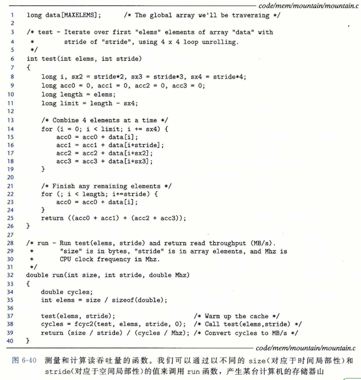
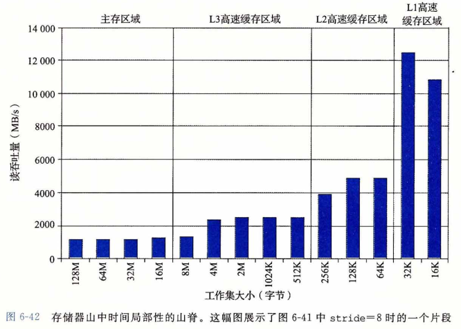
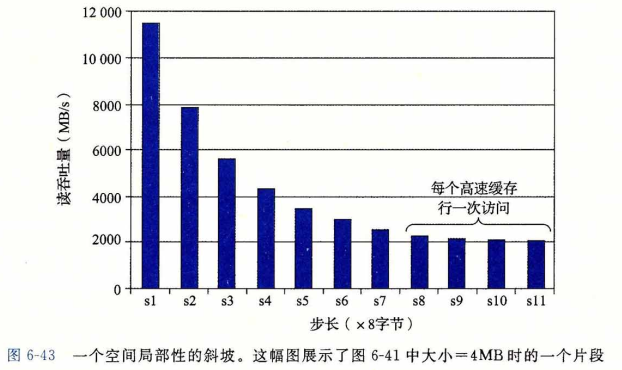
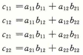
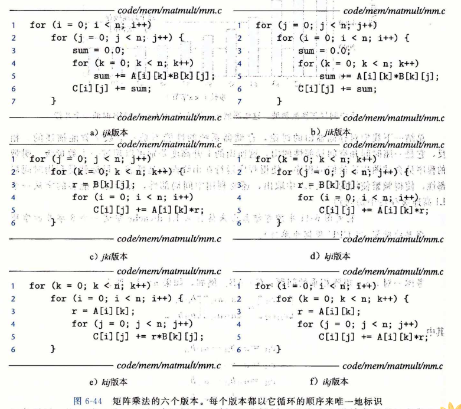
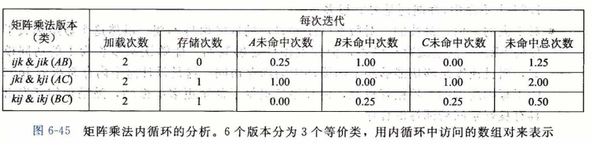
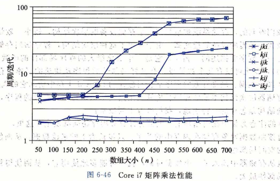

## 综合：高速缓存对程序性能的影响

​		本节通过研究高速缓存对运行在实际机器上的程序的性能影响，综合了我们对存储器层次结构的讨论。

### 存储器山

​		一个程序从存储系统中读数据的速率称为**读吞吐量(read throughput)** , 或者有时称为**读带宽(read bandwidth)**。如果一个程序在 s 秒的时间段内读 n 个字节，那么这段时间内的读吞吐量就等于 n / s ，通常以兆字节每秒 ( MB/S ) 为单位。

​		如果我们要编写一个程序，它从一个**紧密程序循环(tight program loop)**中发出一系列读请求，那么测量出的读吞吐量能让我们看到对于这个读序列来说的存储系统的性能。图6-40给出了一对测量某个读序列读吞吐量的函数。

​		test 函数通过以步长 stride 扫描一个数组的头 elems 个元素来产生读序列。为了提高内循环中可用的并行性，使用了 4 X 4 展开（见5.9节）。run 函数是一个包装函数， 调用 test 函数，并返回测量出的读吞吐量。第37行对 test 函数的调用会对高速缓存做暖身。第 38 行的 fcyc2 函数以参数 elems 调用 test 函数，并估计 test 函数的运行时间，以 CPU 周期为单位。注意，run 函数的参数 size 是以字节为单位的，而 test 函数对应的参数 elems是以数组元素为单位的。另外，注意第39行将 MB/s 计算为 10^6 字节/ 秒，而不是 2^20 字节/秒。

​		run 函数的参数 size 和 stride 允许我们控制产生出的读序列的时间和空间局部性程度。size 的值越小，得到的工作集越小，因此时间局部性越好。stride 的值越小，得到的空间局部性越好。如果我们反复以不同的 size 和stride 值调用 run 函数，那么我们就能得到一个读带宽的时间和空间局部性的二维函数，称为**存储器山(memory mountain)**[112]。

​		每个计算机都有表明它存储器系统的能力特色的唯一的存储器山。例如，图6-41展 示了 Intel Core i7系统的存储器山。在这个例子中，size 从 16KB 变到 128KB , stride 从 1 变到 12 个元素，每个元素是一个 8 个字节的long int。

​		这座Core i7山的地形地势展现了一个很丰富的结构。垂直于大小轴的是四条山脊， 分别对应于工作集完全在L1 高速缓存、L2 高速缓存、L3 高速缓存和 主存 内的时间局部性区域。注意，L1 山脊的最高点（那里CPU读速率为14 GB/S)与主存山脊的最低点（那里 CPU 读速率为 900 MB/S )之间的差别有一个数量级。

​		在 L2 、L3 和主存山脊上，随着步长的增加，有一个空间局部性的斜坡，空间局部性下降。注意，即使当工作集太大，不能全都装进任何一个高速缓存时，主存山脊的最高点也比它的最低点高 8 倍。因此，即使是当程序的时间局部性很差时，空间局部性仍然能补救，并且是非常重要的。

​		有一条特别有趣的平坦的山脊线，对于步长 1 垂直于步长轴，此时读吞吐量相对保持不变，为 12GB/S，即使工作集超出了 L1 和 L2 的大小。这显然是由于Corei7存储器系统中的**硬件预取(prefetching)**机制，它会自动地识别顺序的、步长为 1 的引用模式，试图在 一些块被访问之前，将它们取到高速缓存中。虽然文档里没有记录这种预取算法的细节， 但是从存储器山可以明显池看到这个算法对小步长效果最好——也是代码中要使用步长为 1 的顺序访问的另一个理由。

​		如果我们从这座山中取出一个片段，保持步长为常数，如图6-42所示，我们就能很清楚地看到高速缓存的大小和时间局部性对性能的影响了。大小最大为 32KB 的工作集完全能放进 L1 d-cache 中，因此，读都是由 L1 来服务的，吞吐量保持在峰值 12GB/S 处。 大小最大为 256KB 的工作集完全能放进统一的 L2 高速缓存中，对于大小最大为 8M ，工作集完全能放进统一的 L3 高速缓存中。更大的工作集大小主要由主存来服务。

​		L2 和 L3 高速缓存区域最左边的边缘上读吞吐量的下降很有趣，此时工作集大小为 256KB 和 8MB ，等于对应的高速缓存的大小。为什么会出现这样的下降，还不是完全清楚。要确认的唯一方法就是执行一个详细的高速缓存模拟，但是这些下降很有可能是与其他数据和代码行的冲突造成的。

​		以相反的方向横切这座山，保持工作集大小不变，我们从中能看到空间局部性对读吞吐量的影响。例如，图6-43展示了工作集大小固定为 4MB 时的片段。这个片段是沿着图6-41中的 L3 山脊切的，这里，工作集完全能够放到 L3 高速缓存中，但是对 L2 高速缓存来说太大了。

​		注意随着步长从 1 个字增长到 8 个字，读吞吐量是如何平稳地下降的。在山的这个区域中，L2 中的读不命中会导致一个块从 L3 传送到 L2 。后面在 L2 中这个块上会有一定数量的命中，这是取决于步长的。随着步长的增加，L2 不命中与 L2 命中的比值也增加了。 因为服务不命中要比命中更慢，所以读吞吐量也下降了。一旦步长达到了 8 个字，在这个系统上就等于块的大小 64 个字节了，每个读请求在 L2 中都会不命中，必须从 L3 服务。

​		总结一下我们对存储器山的讨论，存储器系统的性能不是一个数字就能描述的。相反，它是一座时间和空间局部性的山，这座山的上升高度差别可以超过一个数量级。明智的程序员会试图构造他们的程序，使得程序运行在山峰而不是低谷。目标就是利用时间局部性，使得频繁使用的字从 L1 中取出，还要利用空间局部性，使得尽可能多的字从一个 L1 高速缓存行中访问到。

### 重新排列循环以提高空间局部性

考虑一对 n X n 矩阵相乘的问题：C=AB。例如，如果 n = 2 ,那么

其中：

​		矩阵乘法函数通常是用 3 个嵌套的循环来实现的，分别用索引 i , j 和 k 来标识。如果改变循环的次序，对代码进行一些其他的小改动，我们就能得到矩阵乘法的 6 个在功能上等价的版本，如图6-44所示。每个版本都以它循环的顺序来唯一地标识。

​		在高层次来看，这 6 个版本是非常相似的。如果加法是可结合的，那么每个版本计算出的结果完全一样每个版本总共都执行 O(n^3) 个操作，而加法和乘法的数量相同。A 和 B 的 n^2 个元素中的每一个都要读 n 次。计算 C 的 n^2 个元素中的每一个都要对 n 个值求和。不过，如果分析最里层循环迭代的行为，我们发现在访问数量和局部性上还是有区别的。为了分析，我们做了如下假设:

- 每个数组都是一个 double 类型的 n X n 的数组，sizeof (double) = 8 。

- 只有一个高速缓存，其块大小为 32 字节(B = 32)。

- 数组大小 n 很大，以至于矩阵的一行都不能完全装进 L1 高速缓存中。

- 编译器将局部变量存储到寄存器中，因此循环内对局部变量的引用不需要任何加载或存储指令。

- 

  ​	图6-45总结了我们对内循环的分析结果。注意6个版本对地形成了3个等价类，用内循环中访问的矩阵对来表示每个类。例如，版本 ijk 和 jik 是类 AB 的成员，因为它们在最内层的循环中引用的是矩阵A和B（而不是C）。对于每个类，我们统计了每个内循环迭代中加载（读）和存储（写）的数量。每次循环迭代中对A、B和C的引用在高速缓存中不命中的数量，以及每次迭代缓存不明中的总数。

  ​		类AB例程的内循环（图6-44a和图6-44b）以步长1扫描数组A的一行。因为每个高速缓存块保存四个8字节的字。A的不命中率是每次迭代不命中 0.25 次。另一方面，内循环以步长 n 扫描数组 B 的一列。因为 n 很大，每次对数组 B 的访问都不会命中，所以每次迭代总会有1.25次不命中。

  

类AC例程的内循环（图6-44c和图6-44d)有一些问题。每次迭代执行两个加载和一个存储(相对于类 AB 例程，它们执行 2 个加载而没有存储）。内循环以步长 n 扫描 A 和 C 的列，结果是每次加载都会不命中，所以每次迭代总共有两个不命中。注意，与类 AB 例程相比 ， 交换循环降低了空间局部性。

​		BC例程（图6-44e和图6-44f)展示了一个很有趣的折中使用了两个加载和一个存储， 它们比AB例程多需要一个内存操作。另一方面因为内循环以步长为 1 的访问模式按行 扫描B和C, 每次迭代每个数组上的不命中率只有0:25 次不命中，所以每次迭代总共有 0.50 个不命中。

​		图6-46小结了一个 Core i7 系统上矩阵乘法各个版本的性能。这个图画出了测量出的每次内循环迭代所需的 CPU 周期数作为数组大小( n )的函数。

对于这幅图有很多有意思的地方值得注意：

- 对于大的 n 值，即使毎个版本都执行相同数量的浮点算术操作，最快的版本比最慢 的版本运行得快几乎 40 倍
- 每次迭代内存引用和不命中数量都相同的一对版本，有大致相同的测量性能。
- 内存行为最糟糕的两个版本就每次迭代的访问数量和不命中数量而言，明显地比 其他4个版本运行得慢，其他4个版本有较少的不命中次数或者较少的访问次数, 或者兼而有之。	
- 在这个情况中，与内存访问总数相比，不命中率是一个更好的性能预测指标。例如，即使类BC例程(2个加载和1个存储)在内循环中比类AS例程(2个加载)执行 更多的内存引用，类BC例程（每次迭代有0. 5个不命中）比类AB例程（每次迭代有 1. 25个不命中）性能还是要好很多。
- 对于大的n值，最快的一对版本（kij 和 ikj）的性能保持不变。虽然这个数组远大于 任何SRAM高速缓存存储器，但预取硬件足够聪明，能够认出步长为 1 的访问模 式，而且速度足够快能够跟上内循环中的内存访问。这是设计这个内存系统的 Intel 的工程师所做的一项极好成就，向程序员提供了甚至更多的鼓励，鼓励他们开发出具有良好空间局部性的程序。

### 在程序中利用局部性

​		正如我们看到的，存储系统被组织成一个存储设备的层次结构，较小、较快的设备靠 近顶部，较大、较慢的设备靠近底部。由于采用了这种层次结构，程序访问存储位置的实际速率不是一个数字能描述的。相反，它是一个变化很大的程序局部性的函数（我们称之为存储器山），变化可以有几个数量级。有良好局部性的程序从快速的高速缓存存储器中 访问它的大部分数据。局部性差的程序从相对慢速的DRAM主存中访问它的大部分数据。

​		理解存储器层次结构本质的程序员能够利用这些知识编写出更有效的程序，无论具体 的存储系统结构是怎样的。特别地，我们推荐下列技术：

- 将你的注意力集中在内循环上，大部分计算和内存访问都发生在这里。
- 通过按照数据对象存储在内存中的顺序、以步长为 1 的来读数据，从而使得你程序中的空间局部性最大。
- 一旦从存睹器中读入了一个数据对象，就尽可能多地使用它，从而使得程序中的时间局部性最大。