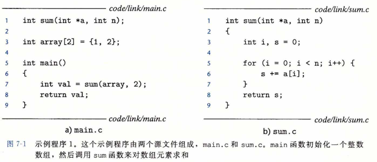
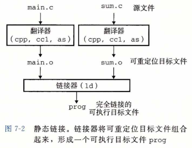

## 编译器驱动程序

​		考虑图7-1中的C语言程序。它将作为贯穿本章的一个小的运行示例，帮助我们说明关于链接是如何工作的一些重要知识点。

​		大多数编译系统提供**编译器驱动程序(compiler driver)**，它代表用户在需要时调用语言预处理器、编译器、汇编器和链接器。比如，要用GNU编译系统构造示例程序，我们就要通过在Shell中输入下列命令来调用 GCC 驱动程序：

​		`linux> gcc  -Og  -O  prog  main.c  sum.c	`

​		图7-2概括了驱动程序在将示例程序从 ASCII 码源文件翻译成可执行目标文件时的行为。（如果你想看看这些步骤，用 -v 选项来运行GCC。）驱动程序首先运行 C 预处理器(cpp),它将 C 的源程序 main.c 翻译成一个 ASCII 码的中间文件 main.i :
​	`cpp   [other arguments]   main.c   /tmp/main.i`

​		接下来，驱动程序运行 C 编译器(cc1)，它将 main.i 翻译成一个 ASCII 汇编语言文件 main.s:

`cc1 /tmp/main.i -Og [.otherarguments] -o /tmp/main.s`

​		然后，驱动程序运行汇编器(as)，它将 main.s 翻译成一个**可重定位目标文件(relocatable object file)** main.o:

`as [other arguments] -o  /tmp/main.o  /tmp/main.s`

​		驱动程序经过相同的过程生成 sum.o 。最后，它运行链接器程序 1d ，将 main. o和 sum.o 以及一些必要的系统目标文件组合起来，创建一个**可执行目标文件(executable object file)** prog:

`		1d -o prog [system object files and argsl /tmp/main.o /tmp/sum. o`

​		要运行可执行文件 prog ，我们在 Linux shell 的命令行上输入它的名字： 

`linux> ./prog`
		shell 调用操作系统中一个叫做**加载器(loader)**的函数，它将可执行文件 prog 中的代码和数据复制到内存，然后将控制转移到这个程序的开头。