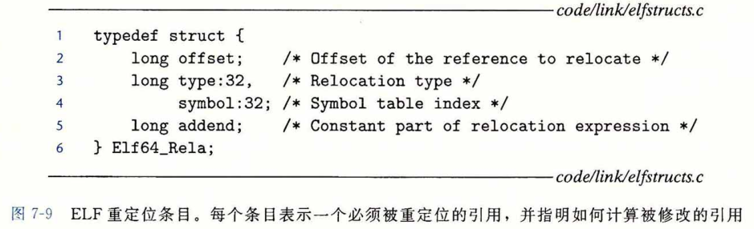
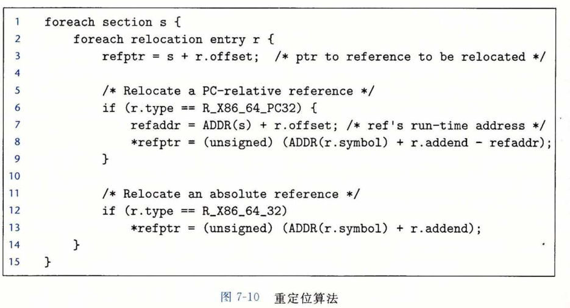
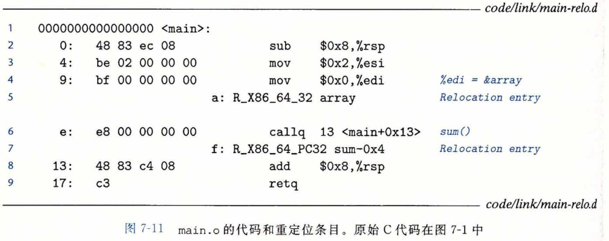
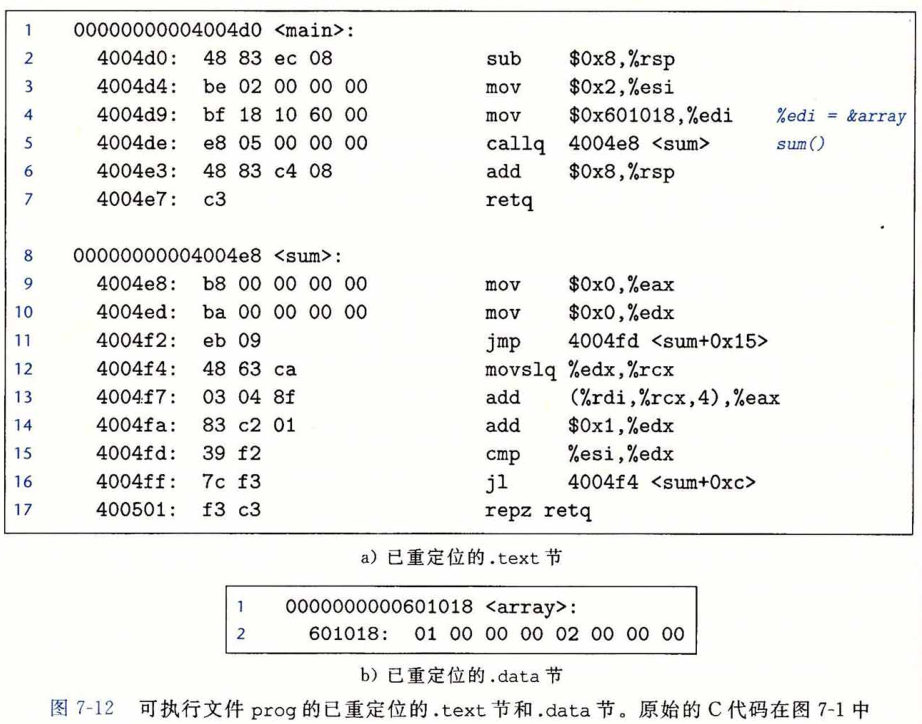

## 重定位

​		一旦链接器完成了符号解析这一步，就把代码中的每个符号引用和正好一个符号定义 ( 即它的一个输入目标模块中的一个符号表条目）关联起来。此时，链接器就知道它的输入目标模块中的代码节和数据节的确切大小。现在就可以开始重定位步骤了，在这个步骤 中，将合并输入模块，并为每个符号分配运行时地址。重定位由两步组成：

- **重定位节和符号定义**。在这一步中，链接器将所有相同类型的节合并为同一类型的新的聚合节。例如，来自所有输入模块的 .data 节被全部合并成一个节，这个节成为输出的可执行目标文件的 .data 节。然后，链接器将运行时内存地址赋给新的聚合节，赋给输入模块定义的每个节，以及赋给输入模块定义的每个符号。当这一步 完成时，程序中的每条指令和全局变量都有唯一的运行时内存地址了。
- **重定位节中的符号引用**。在这一步中，链接器修改代码节和数据节中对每个符号的引用，使得它们指向正确的运行时地址。要执行这一步，链接器依赖于可重定位目标模块中称为**重定位条目(relocation entry)**的数据结构，我们接下来将会描述这种数据结构。

### 重定位条目

​		当汇编器生成一个目标模块时，它并不知道数据和代码最终将放在内存中的什么位置。它也不知道这个模块引用的任何外部定义的函数或者全局变量的位置。所以，无论何时汇编器遇到对最终位置未知的目标引用，它就会生成一个重定位条目，告诉链接器在将目标文件合并成可执行文件时如何修改这个引用。代码的重定位条目放在 .rel.text 中。 已初始化数据的重定位条目放在 .rel.data 中。

​		图7-9展了 ELF 重定位条目的格式。
​		offset 		是需要被修改的引用的节偏移。
​		symbol  	标识被修改引用应该指向的符号。
​		type 	  	告知链接器如何修改新的引用。
​		addend 	是一个有符号常数，一些类型的重定位要使用它对被修改引用的值做偏移调整。

​		ELF 定义了 32 种不同的重定位类型，有些相当隐秘。我们只关心其中两种最基本的重定位类型：

- **R_X86_64_PC32**。重定位一个使用 32 位 PC 相对地址的引用。回想一下3.6.3节， —个 PC 相对地址就是距程序计数器（PC）的当前运行时值的偏移量。当 CPU 执行一条使用 PC 相对寻址的指令时，它就将在指令中编码的 32 位值加上 PC 的当前运行时值，得到有效地址（如 call 指令的目标），PC 值通常是下一条指令在内存中的地址。
- **R_X86_64_32**。重定位一个使用 32 位绝对地址的引用。通过绝对寻址，CPU 直接使用在指令中编码的 32 位值作为有效地址，不需要进一步修改。

​       这两种重定位类型支持 x86-64 **小型代码模型（small code model）**，该模型假设可执行目标文件中的代码和数据的总体大小小于 2GB ，因此在运行时可以用 32 位 PC 相对地址来访问。 GCC 默认使用小型代码模型。大于 2GB 的程序可 以用-mcmodel = medium(中型代码模型） 和 -mcmodel = large(大型代码模型）标志来编译，不过在此我们不讨论这些模型。

### 重定位符号引用

​		图7-10展示了链接器的重定位算法的伪代码。第 1 行和第 2 行在每个节 s 以及与每个节相关联的重定位条目 r上迭代执行。为了使描述具体化，假设每个节 s 是一个字节数组，每个重定位条目 r 是一个类型为 Elf64_Rela 的结构，如图7-9中的定义。另外，还假设当算法运行时，链接器已经为每个节（用 ADDR(s) 表示）和每个符号都选择了运行时地址（用 ADDR(r.symbol) 表示）。第 3 行计算的是需要被重定位的 4 字节引用的数组 s 中的地址。如果这个引用使用的是 PC 相对寻址，那么它就用第 5〜9 行来重定位。如果该引用使用的是绝对寻址，它就通过第 11〜13 行来重定位。

​		让我们来看看链接器如何用这个算法来重定位图7-1示例程序中的引用。图7-11给出 了（用 objdump-dx main.o 产生的）GNU OBJDUMP 工具产生的 main 。的反汇编代码。

​		main 函数引用了两个全局符号：array 和 sum。为每个引用，汇编器产生一个重定位条目，显示在引用的后面一行上。这些重定位条目告诉链接器对 sum 的引用要使用 32 位 PC 相对地址进行重定位，而对 array 的引用要使用 32 位绝对地址进行重定位。接下来两节会详细介绍链接器是如何重定位这些引用的。

##### 1.重定位PC相对引用

​		图7-11的第6行中，函数 main 调用 sum 函数，sum 函数是在模块 sum.o 中定义的。call 指令开始于节偏移0xe8 的地方，包括 1 字节的操作码 0xe8 , 后面跟着的是对目标 sum 的 32 位 PC 相对引用的占位符。

​		相应的重定位条目 r 由 4 个字段组成：

​			r.offset = 0xf 
​			r. symbol = sum 
​			r. type = R_X86_64_PC32
​			r. addend = -4

​		这些字段告诉链接器修改开始于偏移量 0xf 处的 32 位 PC 相对引用，这样在运行时它会指向 sum 例程。现在，假设链接器已经确定

​			ADDR(s) = ADDR(.text) = 0x4004d0
和

​			ADDR(r.symbol) = ADDR(sum) = 0x4004e8

​		使用图7-10 中的算法，链接器首先计算出引用的运行时地址（第7行）： 

​		refaddr = ADDR(s) + r.offset 
​					  = 0x4004d0 + 0xf 
​					  = 0x4004df

然后，更新该引用，使得它在运行时指向 sum 程序（第 8 行）：

​		*refptr = (unsigned ) ( ADDR(r.symbol) + r.addend - refaddr)
​					 = (unsigned ) ( 0x4004e8	        + (-4)	        - 0x4004df)
​					 = (unsigned ) ( 0x5 )

在得到的可执行目标文件中，call 指令有如下的重定位的形式：

​		4004de:	e8 05 00 00 00		callq 	4004e8 	<sum>	sum()

​		在运行时，call 指令将存放在地址 0x4004de 处。当 CPU 执行 call 指令时，PC 的值为 0X4004e3 , 即紧随在 call 指令之后的指令的地址。为了执行这条指令，CPU 执行以下的步骤：

​		1)	将 PC 压入栈中
​		2)	PC ← PC + 0x5 = 0x4004e3 + 0x5 = 0x4004e8

因此，要执行的下一条指令就是 sum 例程的第一条指令，这当然就是我们想要的！

##### 2.重定位绝对引用

​		重定位绝对引用相当简单。例如，图7-11的第 4 行中，mov 指令将 array 的地址（一 个32位立即数值）复制到寄存器 ％edi 中。mov 指令开始于节偏移量 0x9 的位置，包括 1 字节操作码 0xbf，后面跟着对 array 的 32 位绝对引用的占位符。

​		对应的占位符条目 r 包括 4 个字段：

​		r.offset      = 0xa 
​		r. symbol  = array 
​		r .type       = R_X86_64_32
​		r. addend = 0

​		这些字段告诉链接器要修改从偏移量 0xa 开始的绝对引用，这样在运行时它将会指向 array 的第一个字节。现在，假设链接器已经确定 

​		ADDR(r.symbol) = ADDR(array) = 0x601018

​		链接器使用图7-10中算法的第13行修改了引用：
​		*refptr = (unsigned) (ADDR(r.symbol) + r.addend)
​			         = (unsigned) (0x601018	        + 0)
​					 = (unsigned) (0x601018)

​		在得到的可执行目标文件中，该引用有下面的重定位形式：

​		4004d9:	bf 18 10 60 00	mov		 $0x601018，％edi 				;%edi = &array

​		综合到一起，图7-12给出了最终可执行目标文件中已重定位的.text节和.data节。在加 载的时候，加载器会把这些节中的字节直接复制到内存，不再进行任何修改地执行这些指令。

