## 信号

​		到目前为止对异常控制流的学习中，我们已经看到了硬件和软件是如何合作以提供基本的低层异常机制的。我们也看到了操作系统如何利用异常来支持进程上下文切换的异常控制流形式。在本节中，我们将研究一种更高层的软件形式的异常，称为 **Linux 信号**，它允许进程和内核中断其他进程。

​		一个信号就是一条小消息，它通知进程系统中发生了一个某种类型的事件。比如，图8-26 展示了 Linux 系统上支持的 30 种不同类型的信号。

​		每种信号类型都对应于某种系统事件。低层的硬件异常是由内核异常处理程序处理的，正常情况下，对用户进程而言是不可见的。信号提供了一种机制，通知用户进程发生了这些异常。 比如，如果一个进程试图除以 0 , 那么内核就发送给它一个 SIGFPE 信号 ( 号码 8 ) 。如果一个进程执行一条非法指令，那么内核就发送给它一个 SIGILL 信号 ( 号码 4 )。如果进程进行非法内存引用，内核就发送给它一个 SIGSEGV 信号(号码 11 ) 。其他信号对应于内核或者其他用户进程中较高层的软件事件。比如，如果当进程在前台运行时，你键入 Ctrl+C (也就是同时按下Ctrl 键和 C 键)，那么内核就会发送一个 SIGINT 信号 ( 号码 2 ) 给这个前台进程组中的每个进程。一个进程可以通过向另一个进程发送一个 SIGKILL 信号 ( 号码 9 ) 强制终止它。当一个子进程终止或者停止时，内核会发送一个 SIGCHLD 信号 ( 号码 17 ) 给父进程。

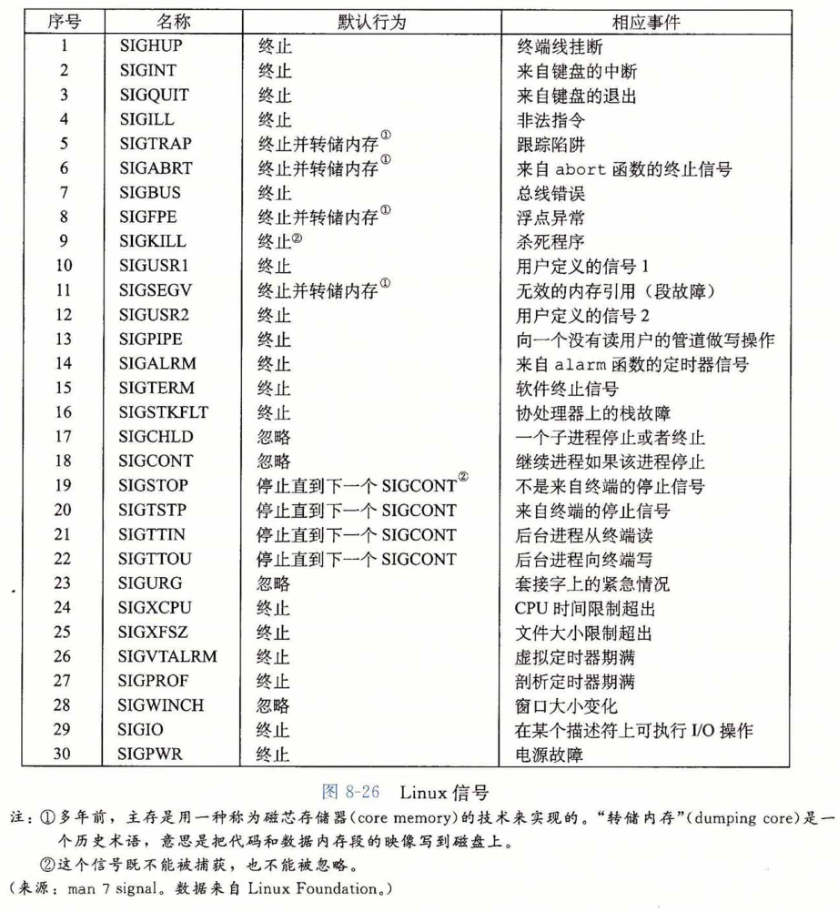

### 信号术语

​		传送一个信号到目的进程是由两个不同步骤组成的：

* **发送信号**。内核通过更新目的进程上下文中的某个状态，发送（递送）一个信号给目的进程。发送信号可以有如下两种原因：1) 内核检测到一个系统事件，比如除零错误或者子进程终止。2) —个进程调用了 kill 函数（在下一节中讨论），显式地要求内核发送一个信号给目的进程。一个进程可以发送信号给它自己。
* **接收信号**。当目的进程被内核强迫以某种方式对信号的发送做出反应时，它就接收了信号。进程可以忽略这个信号，终止或者通过执行一个称为**信号处理程序（signal handler)** 的用户层函数捕获这个信号。图 8-27 给出了信号处理程序捕获信号的基本思想。

​       —个发出而没有被接收的信号叫做**待处理信号（pending signal）**。在任何时刻，一种类型至多只会有一个待处理信号。如果一个进程有一个类型为 k 的待处理信号，那么任何接下来发送到这个进程的类型为 k 的信号都**不会**排队等待；它们只是被简单地丢弃。一个进程可以有选择性地阻塞接收某种信号。当一种信号被阻塞时，它仍可以被发送，但是产生的待处理信号不会被接收，直到进程取消对这种信号的阻塞。

​		—个待处理信号最多只能被接收一次。内核为每个进程在 pending 位向量中维护着待处理信号的集合，而在blocked 位向量中维护着被阻塞的信号集合。只要传送了一个类型为 k 的信号，内核就会设置 pending 中的第 k 位，而只要接收了一个类型为 k 的信号，内核就会清除 pending 中的第 k 位。

### 发送信号

​		Unix 系统提供了大量向进程发送信号的机制。所有这些机制都是基于**进程组（process group）**这个概念的。

##### 1.进程组

​		每个进程都只属于一个进程组，进程组是由一个正整数进程组 ID 来标识的。getpgrp 函数返回当前进程的进程组 ID :

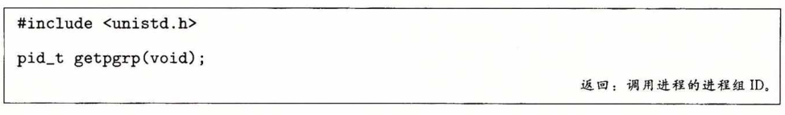

​		默认地，一个子进程和它的父进程同属于一个进程组。一个进程可以通过使用 setpgid 函数来改变自己或者其他进程的进程组：

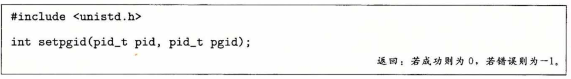

​		setpgid 函数将进程 pid 的进程组改为 pgid 。如果 pid 是 0 , 那么就使用当前进程的 PID 。如果 pgid 是 0 ,那么就用 pid 指定的进程的 PID 作为进程组 ID 。例如，如果进程 15213 是调用进程，那么 

​		setpgid(0, 0);

会创建一个新的进程组，其进程组 ID 是 15213 , 并且把进程 15213 加入到这个新的进程组中。

##### 2.用/bin/kill程序发送信号

​		/bin/kill 程序可以向另外的进程发送任意的信号。比如，命令 

​			linux> /bin/kill   -9   15213

发送信号9 (SIGKILL) 给进程 15213 。一个为负的 PID 会导致信号被发送到进程组 PID 中的每个进程。比如，命令

​			linux> /bin/kill   -9   -15213

发送一个 SIGKILL 信号给进程组 15213 中的每个进程。注意，在此我们使用完整路径 /bin/kill，因为有些 Unix shell 有自己内置的 kill 命令。

##### 3.从键盘发送信号

​		Unix shell 使用**作业(job)**这个抽象概念来表示为对一条命令行求值而创建的进程。在任何时刻，至多只有一个前台作业和 0 个或多个后台作业。比如，键入 

​		linux> Is I sort

会创建一个由两个进程组成的前台作业，这两个进程是通过 Unix 管道连接起来的：一个进程运行 Is 程序，另一个运行 sort 程序。shell 为每个作业创建一个独立的进程组。进程组 ID 通常取自作业中父进程中的一个。比如，图8-28展示了有一个前台作业和两个后台作业的 shell 。前台作业中的父进程 PID 为 20 ,进程组 ID 也为 20 。父进程创建两个子进程，每个也都是进程组 20 的成员。

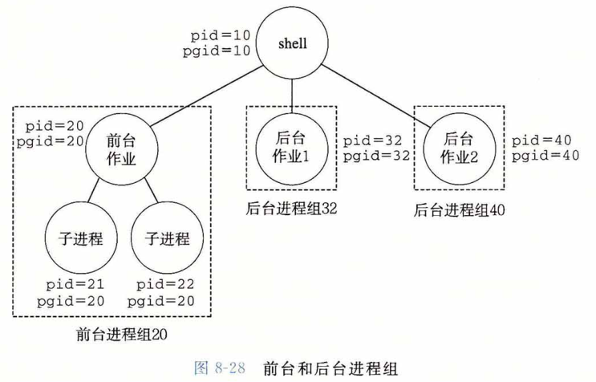

​		在键盘上输入Ctrl+C 会导致内核发送一个 SIGINT 信号到前台进程组中的每个进程。默认情况下，结果是终止前台作业。类似地，输人 Ctrl + Z 会发送一个 SIGTSTP 信号到前台进程组中的每个进程。默认情况下，结果是停止（挂起）前台作业。

##### 4.用kill函数发送信号

​		进程通过调用 kill 函数发送信号给其他进程（包括它们自己）。

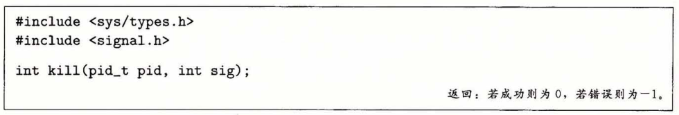

​		如果 pid 大于零，那么 kill 函数发送信号号码 sig 给进程 pid 。如果 pid 等于零，那么 kill发 送信号 sig 给调用进程所在进程组中的每个进程，包括调用进程自己。如果 pid 小于零，kill 发送信号 sig 给进程组 |pid| (pid的绝对值）中的每个进程。图8-29雇示了一个示例，父进程用 kill 函数发送 SIGKILL 信号给它的子进程。

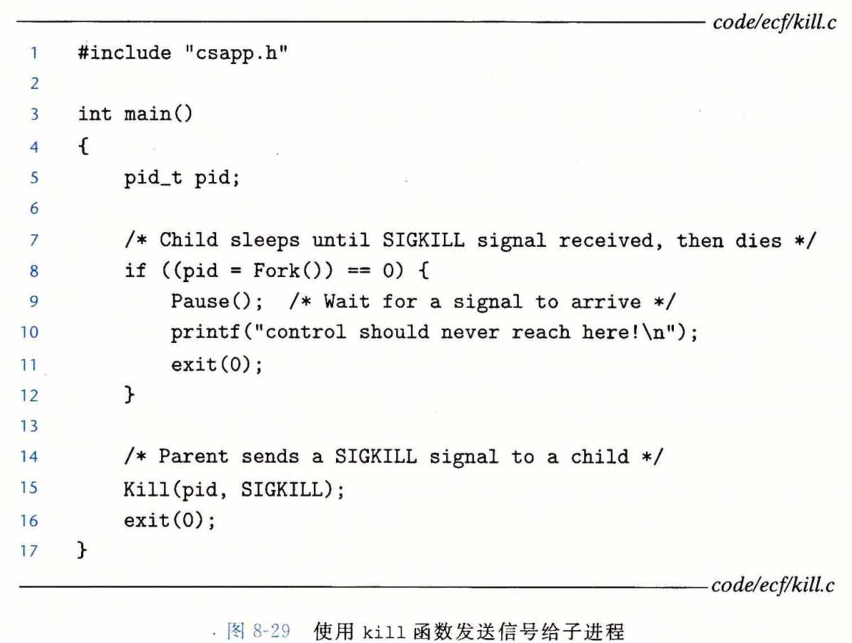

##### 5.用 alarm 函数发送信号

​		进程可以通过调用 alarm 函数向它自己发送 SIGALRM 信号。

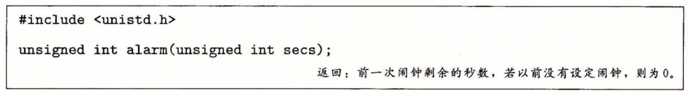

​		alarm 函数安排内核在 secs 秒后发送一个 SIGALRM 信号给调用进程。如果 secs 是零，那么不会调度安排新的闹钟（alarm）。在任何情况下，对 alarm 的调用都将取消任何待处理的（pending）闹钟，并且返回任何待处理的闹钟在被发送前还剩下的秒数（如果这次对alarm的调用没有取消它的话）；如果没有任何待处理的闹钟，就返回零。

### 接收信号

​		当内核把进程 p 从内核模式切换到用户模式时（例如，从系统调用返回或是完成了一次上下文切换），它会检査进程的未被阻塞的待处理信号的集合(pending &〜 blocked)。 如果这个集合为空（通常情况下），那么内核将控制传递到 p 的逻辑控制流中的下一条指令 （I(next)）。然而，如果集合是非空的，那么内核选择集合中的某个信号 k （通常是最小的 k）， 并且强制 p <u>接收</u>信号 k 。收到这个信号会触发进程采取某种行为。一旦进程完成了这个行为，那么控制就传递回 p 的逻辑控制流中的下一条指令（I(next)）。每个信号类型都有一个预定义的默认行为，是下面中的一种：

* 进程终止。
* 进程终止并转储内存。
* 进程停止（挂起）直到被 SIGCONT 信号重启。
* 进程忽略该信号。

​        图8-26展示了与每个信号类型相关联的默认行为。比如，收到 SIGKILL 的默认行为就是终止接收进程。另外，接收到 SIGCHLD 的默认行为就是忽略这个信号。进程可以通过使用 signal 函数修改和信号相关联的默认行为。唯一的例外是 SIGSTOP 和 SIGKILL， 它们的默认行为是不能修改的。

​		signal 函数可以通过下列三种方法之一来改变和信号 signum 相关联的行为：

- 如果 handler 是 SIG_IGN，那么忽略类型为 signum 的信号D。
- 如果 handler 是 SIG_DFL，那么类型为 signum 的信号行为恢复为默认行为。
- 否则，handler 就是用户定义的函数的地址，这个函数被称为**信号处理程序**，只要进程接收到一个类型为signum 的信号，就会调用这个程序。通过把处理程序的地址传递到 signal 函数从而改变默认行为，这叫做**设置信号处理程序（installing the handler)**。 调用信号处理程序被称为**捕获信号**。执行信号处理程序被称为**处理信号**。

​        当一个进程捕获了一个类型为 k 的信号时，会调用为信号 k 设置的处理程序，一个整数参数被设置为 k 。这个参数允许同一个处理函数捕获不同类型的信号。

​		当处理程序执行它的 return 语句时，控制（通常）传递回控制流中进程被信号接收中断位置处的指令。我们说“通常”是因为在某些系统中，被中断的系统调用会立即返回一个错误。

​		图8-30展示了一个程序，它捕获用户在键盘上输入 Ctrl + C 时发送的 SIGINT 信号。 SIGINT 的默认行为是立即终止该进程。在这个示例中，我们将默认行为修改为捕获信号，输出一条消息，然后终止该进程。

​		信号处理程序可以被其他信号处理程序中断，如图8-31所示。在这个例子中，主程序捕获到信号 s , 该信号会中断主程序，将控制转移到处理程序 S 。S 在运行时，程序捕获信号 t ≠ s，该信号会中断 S ，控制转移到处理程序 T 。当 T 返回时，S 从它被中断的地方继续执行。最后，S 返回，控制传送回主程序，主程序从它被中断的地方继续执行。

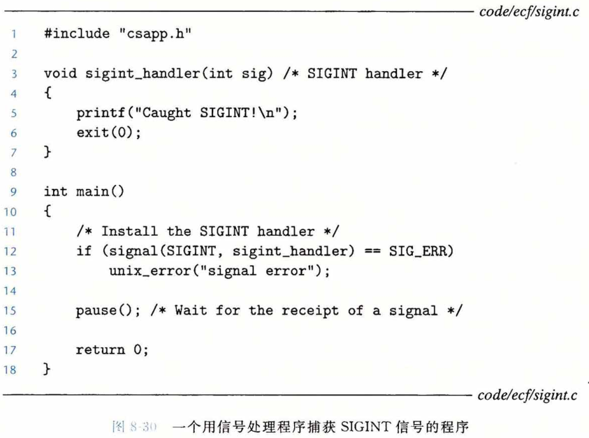

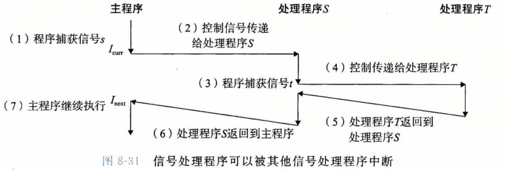

### 阻塞和解除阻塞信号

​		Linux 提供阻塞信号的隐式和显式的机制：

​		**隐式阻塞机制**。内核默认阻塞任何当前处理程序正在处理信号类型的待处理的信号。 例如，图 8-31 中，假设程序捕获了信号 s，当前正在运行处理程序 S。如果发送给该进程另一个信号 s，那么直到处理程序 S 返回，s 会变成待处理而没有被接收。

​		**显式阻塞机制**。应用程序可以使用 sigprocmask 函数和它的辅助函数，明确地阻塞和解除阻塞选定的信号。

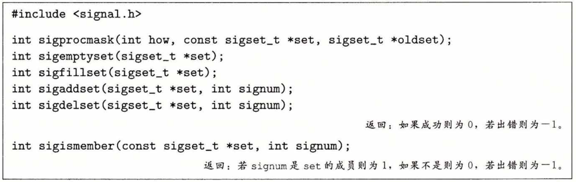

​		sigprocmask 函数改变当前阻塞的信号集合（8. 5. 1节中描述的 blocked 位向量）。具体的行为依赖于 how 的值：

​		SIG_BLOCK：把 set 中的信号添加到 blocked 中（blocked = blocked | set )。 
​		SIG_UNBLOCK：从 blocked 中删除 set 中的信号（blocked = blocked | set )。
​		SIG_SETMASK ： block = set。

​		如果 oldset 非空，那么 blocked 位向量之前的值保存在 oldset 中。

​		使用下述函数对 set 信号集合进行操作：

​		sigemptyset 初始化 set 为空集合。
​		sigfillset 函数把每个信号都添加到 set 中。
​		sigaddset 函数把 signum 添加到 set，
​		sigdelset 从 set 中删除 signum，如果 signum 是 set 的成员，那么 sigismember 返回 1，否则返回 0 。

​		例如，图8-32展示了如何用 sigprocmask 来临时阻塞接收 SIGINT 信号。

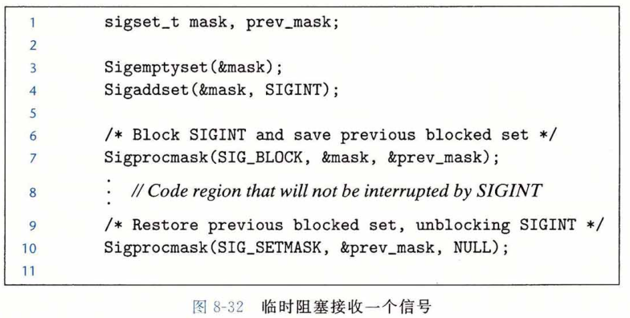

### 编写信号处理程序

​		信号处理是 Linux 系统编程最棘手的一个问题。处理程序有几个属性使得它们很难推理分析：
​			1)  处理程序与主程序并发运行，共享同样的全局变量，因此可能与主程序和其他处理程序互相干扰；
​			2)  如何以及何时接收信号的规则常常有违人的直觉；
​			3) 不同的系统有不同的信号处理语义。

​		在本节中，我们将讲述这些问题，介绍编写安全、正确和可移植的信号处理程序的一些基本规则。

##### 1.安全的信号处理

​		信号处理程序很麻烦是因为它们和主程序以及其他信号处理程序<u>并发地</u>运行，正如我们在图 8 - 31 中看到的那样。如果处理程序和主程序并发地访问同样的全局数据结构，那么结果可能就不可预知，而且经常是致命的。

​		我们会在第 12 章详细讲述并发编程。这里我们的目标是给你一些保守的编写处理程序的原则，使得这些处理程序能安全地并发运行。如果你忽视这些原则，就可能有引入细微的并发错误的风险。如果有这些错误，程序可能在绝大部分时候都能正确工作。然而当它出错的时候，就会错得不可预测和不可重复，这样是很难调试的。一定要防患于未然！

* **G0. 处理程序要尽可能简单**。避免麻烦的最好方法是保持处理程序尽可能小和简单。例如，处理程序可能只是简单地设置全局标志并立即返回；所有与接收信号相关的处理都由主程序执行，它周期性地检查（并重置）这个标志。
* **G1.在处理程序中只调用异步信号安全的函数**。所谓异步信号安全的函数(或简称安全的函数)能够被信号处理程序安全地调用，原因有二：要么它是可重入的(例如只访问局部变量， 见12. 7.2节)，要么它不能被信号处理程序中断。图8-33列出了 Linux 保证安全的系统级函数。注意，许多常见的函数(例如 printf 、sprintf 、malloc 和 exit )都不在此列。

​		信号处理程序中产生输出唯一安全的方法是使用 write 函数(见10.1节)。特别地,调用 printf 或 sprintf 是不安全的。<u>为了绕开这个不幸的限制,我们开发一些安全的函数,称为 SIO( 安全的 I/O )包,可以用来在信号处理程序中打印简单的消息。</u>

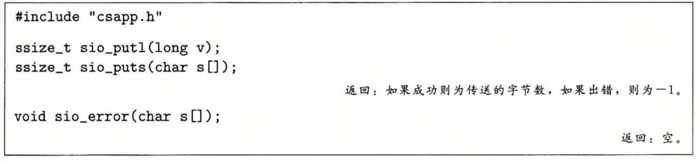

​		sio_putl 和 sio_puts 函数分别向标准输出传送一个 long 类型数和一个字符串。 sio_error 函数打印一条错误消息并终止。

​		图 8-34 给出的是 SIO 包的实现，它使用了 csapp.c 中两个私有的可重入函数。第 3 行的 sio_strlen 函数返回字符串 s 的长度。第 10 行的 sio_Itoa 函数基于来自[61]的 itoa 函数，把 v 转换成它的基 b 字符串表示，保存在 s 中。第 17 行的 _exit 函数是 exit 的一个<u>异步信号安全</u>的变种。

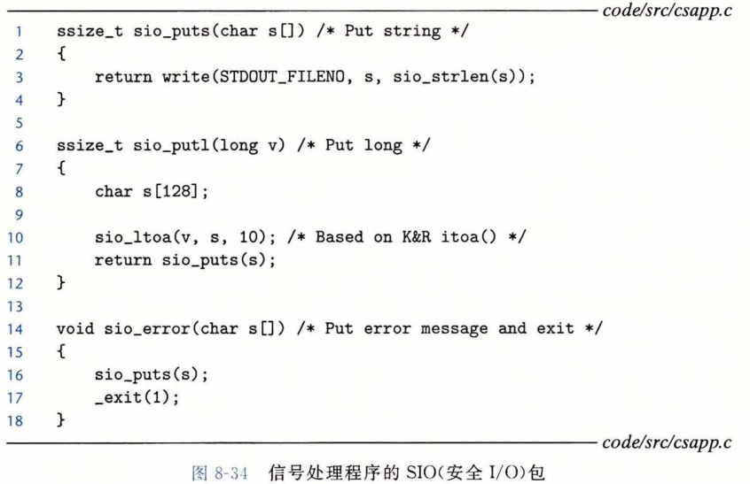

图 8-35 给出了图 8-30 中 SIGINT 处理程序的一个安全的版本。

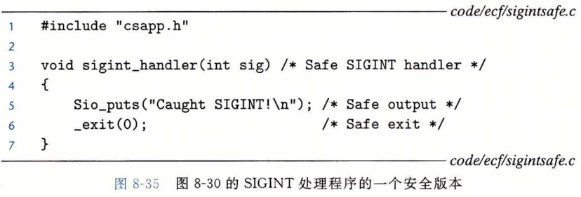

* G2. **保存和恢复errno**。许多 Linux 异步信号安全的函数都会在出错返回时设置 errno 。在处理程序中调用这样的函数可能会干扰主程序中其他依赖于 errno 的部分。解决方法是在进入处理程序时把 errno 保存在一个局部变量中，在处理程序返回前恢复它。注意，只有在处理程序要返回时才有此必要。如果处理程序调用  _exit 终止该进程，那么就不需要这样做了。

*  G3. **阻塞所有的信号，保护对共享全局数据结构的访问**。如果处理程序和主程序或其他处理程序共享一个全局数据结构，那么在访问（读或者写）该数据结构时，你的处理程序和主程序应该暂时阻塞所有的信号。这条规则的原因是从主程序访问一个数据结构 d 通常需要一系列的指令，如果指令序列被访问 d 的处理程序中断，那么处理程序可能会发现 d 的状态不一致，得到不可预知的结果。在访问J时暂时阻塞信号保证了处理程序不会中断该指令序列。

* G4. **用volatile声明全局变量**。考虑一个处理程序和一个 main 函数，它们共享一个全局变量 g 。处理程序更新 g ，main 周期性地读 g 。对于一个优化编译器而言，main 中 g  的值看上去从来没有变化过，因此使用缓存在寄存器中 g 的副本来满足对 g 的每次引用是很安全的。如果这样，main 函数可能永远都无法看到处理程序更新过的值。
          可以用 volatile 类型限定符来定义一个变量，告诉编译器不要缓存这个变量。例如： **volatile  int   g ;** 
          volatile 限定符强迫编译器每次在代码中引用 g 时，都要从内存中读取 g 的值。一般来说，和其他所有共享数据结构一样，应该暂时阻塞信号，保护每次对全局变量的访问。

* G5. **用 sig_atomic_t 声明标志**。在常见的处理程序设计中，处理程序会写全局标志来记录收到了信号。主程序周期性地读这个标志，响应信号，再清除该标志。对于通过这种方式来共享的标志，C 提供一种整型数据类型 sig_atomic_t , 对它的读和写保证会是<u>原子的</u>（不可中断的），因为可以用一条指令来实现它们： 
  **volatile sig_atomic_t flag;**

  ​        因为它们是不可中断的，所以可以安全地读和写 sig_atomic_t 变量，而不需要暂时阻塞信号。注意，这里对原子性的保证只适用于单个的读和写，不适用于像  flag++ 或 flag=flag+10 这样的更新，它们可能需要多条指令。

​        要记住我们这里讲述的规则是保守的，也就是说它们不总是严格必需的。例如，如果你知道处理程序绝对不会修改 errno , 那么就不需要保存和恢复 errno 。或者如果你可以证明 printf 的实例都不会被处理程序中断，那么在处理程序中调用 printf 就是安全的。 对共享全局数据结构的访问也是同样。不过，一般来说这种断言很难证明。所以我们建议你采用保守的方法，遵循这些规则，使得处理程序尽可能简单，调用安全函数，保存和恢复 errno ，保护对共享数据结构的访问，并使用 volatile 和 sig_atomic_t 。

##### 2.正确的信号处理

​		信号的一个与直觉不符的方面是未处理的信号是不排队的。因为 pending 位向量中每种类型的信号只对应有一位，所以每种类型最多只能有一个未处理的信号。因此，如果两个类型 k 的信号发送给一个目的进程，而因为目的进程当前正在执行信号 k 的处理程序，所以信号 k 被阻塞了，那么第二个信号就简单地被丢弃了；它不会排队。关键思想是如果存在一个未处理的信号就表明至少有一个信号到达了。

​		要了解这样会如何影响正确性，来看一个简单的应用，它本质上类似于像 shell 和 Web 服务器这样的真实程序。基本的结构是父进程创建一些子进程，这些子进程各自独立运行一段时间，然后终止。父进程必须回收子进程以避免在系统中留下僵死进程。但是我们还希望父进程能够在子进程运行时自由地去做其他的工作。所以，我们决定用 SIGCHLD 处理程序来回收子进程，而不是显式地等待子进程终止。（回想一下，只要有一个子进程终止或者停止，内核就会发送一个 SIGCHLD 信号给父进程。）

​		图8-36展示了我们的初次尝试。父进程设置了一个 SIGCHLD 处理程序，然后创建

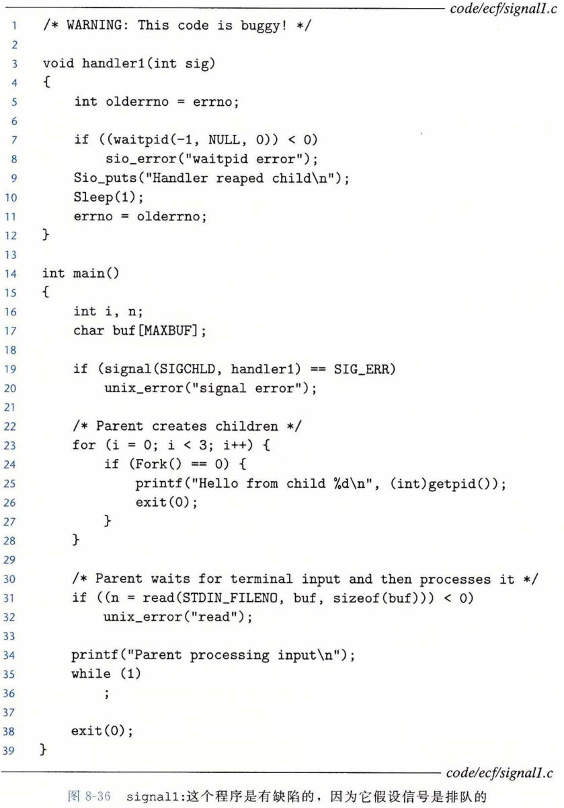

了 3 个子进程。同时，父进程等待来自终端的一个输入行，随后处理它。这个处理被模型化为一个无限循环。当每个子进程终止时，内核通过发送一个 SIGCHLD 信号通知父进程。父进程捕获这个 SIGCHLD 信号，回收一个子进程，做一些其他的清理工作（模型化为 sleep 语句），然后返回。

图8-36中的 signal1 程序看起来相当简单。然而，当在 Linux 系统上运行它时，我们得到如下输出：

​		linux> ./signall 
​		Hello from child 14073 
​		Hello from child 14074 
​		Hello from child 14075 
​		Handler reaped child 
​		Handler reaped child 
​		CR
​		Parent processing input

从输出中我们注意到，尽管发送了 3 个 SIGCHLD 信号给父进程，但是其中只有两个信号被接收了，因此父进程只是回收了两个子进程。如果挂起父进程，我们看到，实际上子进程 14075 没有被回收，它成了一个僵死进程（在ps 命令的输出中由字符串 “ defunct ” 表呀)：
			Ctrl+Z 
			Suspended  
			linux> ps t 
				PID 	TTY 		STAT	 TIME	 COMMAND

​					.
​					.

​					.
​			14072  pts/3 		T  		0:02  		./signall
​			14075  pts/3 		Z  		0:00  		[signall] < defunct >
​			14076  pts/3		 R+ 		0:00  		ps t

​		哪里出错了呢？问题就在于我们的代码<u>没有解决信号不会排队等待</u>这样的情况。所发生的情况是：父进程接收并捕获了第一个信号。当处理程序还在处理第一个信号时，第二个信号就传送并添加到了待处理信号集合里。然而，因为 SIGCHLD 信号被 SIGCHLD 处理程序阻塞了，所以第二个信号就不会被接收。此后不久，就在处理程序还在处理第一个信号时，第三个信号到达了。因为已经有了一个待处理的 SIGCHLD ,第三个 SIGCHLD 信号会被丢弃。一段时间之后，处理程序返回，内核注意到有一个待处理的 SIGCHLD 信号，就迫使父进程接收这个信号。父进程捕获这个信号，并第二次执行处理程序。在处理程序完成对第二个信号的处理之后，已经没有待处理的SIGCHLD 信号了，而且也绝不会再有，因为第三个 SIGCHLD 的所有信息都已经丢失了。**由此得到的重要教训是，不可以用信号来对其他进程中发生的事件计数。**

​		为了修正这个问题，我们必须回想一下，存在一个待处理的信号只是暗示自进程最后一次收到一个信号以来，至少已经有一个这种类型的信号被发送了。所以我们必须修改 SIGCHLD 的处理程序，使得每次 SIGCHLD 处理程序被调用时，回收尽可能多的僵死子进程。图8-37展示了修改后的 SIGCHLD 处理程序。

当我们在Linux 系统上运行 signal2 时，它现在可以正确地回收所有的僵死子进程了：

linux> ./signal2 
Hello from child 15237
Hello from child 15238 
Hello from child 15239 
Handler reaped child 
Handler reaped child 
Handler reaped child 
CR
Parent processing input

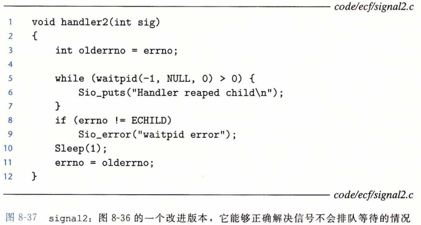

##### 3.可移植的信号处理

​		Unix 信号处理的另一个缺陷在于不同的系统有不同的信号处理语义。例如：

* **signal 函数的语义各有不同**。有些老的 Unix 系统在信号 k 被处理程序捕获之后就把对信号 k 的反应恢复到默认值。在这些系统上，每次运行之后，处理程序必须调用 signal 函数，显式地重新设置它自己。

* **系统调用可以被中断**。像 read 、write 和 accept 这样的系统调用潜在地会阻塞进程一段较长的时间，称为慢速系统调用。在某些较早版本的 Unix 系统中，当处理程序捕获到一个信号时，被中断的慢速系统调用在信号处理程序返回时不再继续， 而是立即返回给用户一个错误条件，并将 errno 设置为 EINTR 。在这些系统上， 程序员必须包括手动重启被中断的系统调用的代码。

​        要解决这些问题，Posix 标准定义了 sigaction 函数，它允许用户在设置信号处理时，明确指定他们想要的信号处理语义。

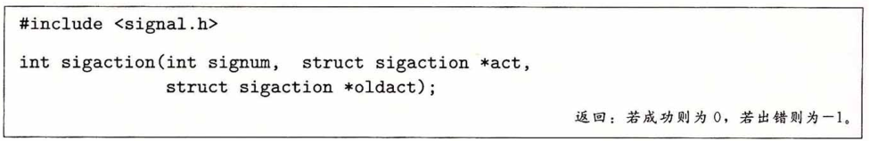

​		sigaction 函数运用并不广泛，因为它要求用户设置一个复杂结构的条目。一个更简洁的方式，最初是由W.Richard Stevens 提出的[110]，就是定义一个包装函数，称为 Signal，它调用 sigaction 。图8-38给出了 Signal的定义，它的调用方式与 signal 函数的调用方式一样。

​		Signal 包装函数设置了一个信号处理程序，其信号处理语义如下：

* 只有这个处理程序当前正在处理的那种类型的信号被阻塞。

* 和所有信号实现一样，信号不会排队等待。

* 只要可能，被中断的系统调用会自动重启。

* 一旦设置了信号处理程序，它就会一直保持，直到 Signal 带着 handler 参数为 SIG_IGN 或者 SIG_DFL 被调用。

​		我们在所有的代码中实现 Signal 包装函数。

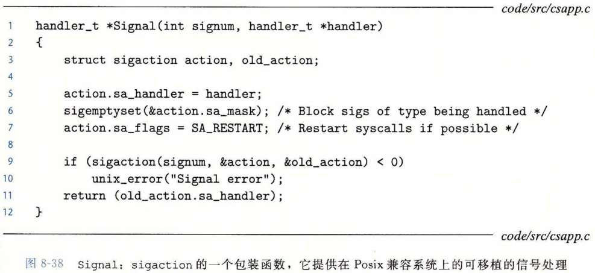

### 同步流以避免讨厌的并发错误

​		如何编写读写相同存储位置的并发流程序的问题，困扰着数代计算机科学家。一般而言，流可能交错的数量与指令的数量呈指数关系。这些交错中的一些会产生正确的结果， 而有些则不会。基本的问题是以某种方式同步并发流，从而得到最大的可行的交错的集合，每个可行的交错都能得到正确的结果。

​		并发编程是一个很深且很重要的问题，我们将在第12章中更详细地讨论。不过，在本章中学习的有关异常控制流的知识，可以让你感觉一下与并发相关的有趣的智力挑战。 例如，考虑图8-39中的程序，它总结了一个典型的 Unix shell 的结构。父进程在一个全局作业列表中记录着它的当前子进程，每个作业一个条目。addjob 和deletejob 函数分别向这个作业列表添加和从中删除作业。

​		当父进程创建一个新的子进程后，它就把这个子进程添加到作业列表中。当父进程在 SIGCHLD 处理程序中回收一个终止的（僵死）子进程时，它就从作业列表中删除这个子进程。

​		乍—看，这段代码是对的。不幸的是，可能发生下面这样的事件序列：

​		1) 父进程执行 fork 函数，内核调度新创建的子进程运行，而不是父进程。
​		2) 在父进程能够再次运行之前，子进程就终止，并且变成一个僵死进程，使得内核传递一个 SIGCHLD 信号给父进程。
​		3) 后来，当父进程再次变成可运行但又在它执行之前，内核注意到有未处理的 SIGCHLD 信号，并通过在父进程中运行处理程序接收这个信号。
​		4) 信号处理程序回收终止的子进程，并调用 deletejob , 这个函数什么也不做，因 为父进程还没有把该子进程添加到列表中。
​		5) 在处理程序运行完毕后，内核运行父进程，父进程从 fork 返回，通过调用 add-job 错误地把 （不存在的） 子进程添加到作业列表中。

​		因此，对于父进程的 main 程序和信号处理流的某些交错，可能会在 addjob 之前调用 deletejob 。这导致作业列表中出现一个不正确的条目，对应于一个不再存在而且永远也不会被删除的作业。另一方面，也有一些交错，事件按照正确的顺序发生。例如，如果在 fork 调用返回时，内核刚好调度父进程而不是子进程运行，那么父进程就会正确地把子进程添加到作业列表中，然后子进程终止，信号处理函数把该作业从列表中删除。

​		这是一个称为**竞争（race）**的经典同步错误的示例。在这个情况中，main 函数中调用 addjob 和处理程序中调用 deletejob 之间存在竞争。如果 addjob 赢得进展，那么结果就是正确的。如果它没有，那么结果就是错误的。这样的错误非常难以调试，因为几乎不可能测试所有的交错。你可能运行这段代码十亿次，也没有一次错误，但是下一次测试却导致引发竞争的交错。

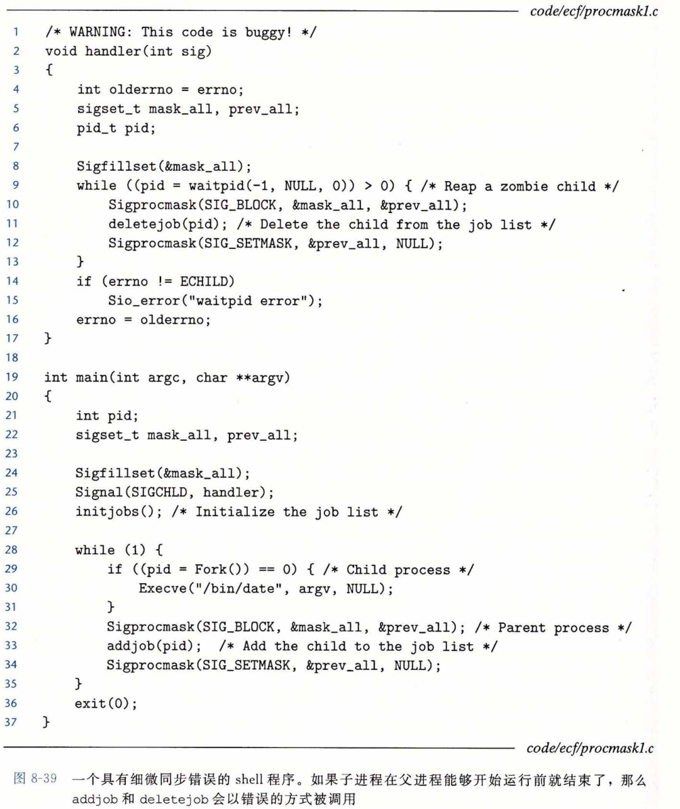

​		图8-40展示了消除图8-39中竞争的一种方法。通过在调用 fork 之前，阻塞 SIGCHLD 信号，然后在调用addjob 之后取消阻塞这些信号，我们保证了在子进程被添加到作业列表中之后回收该子进程。注意，子进程继承了它们父进程的被阻塞集合，所以我们必须在调用 execve 之前，小心地解除子进程中阻塞的 SIGCHLD 信号。

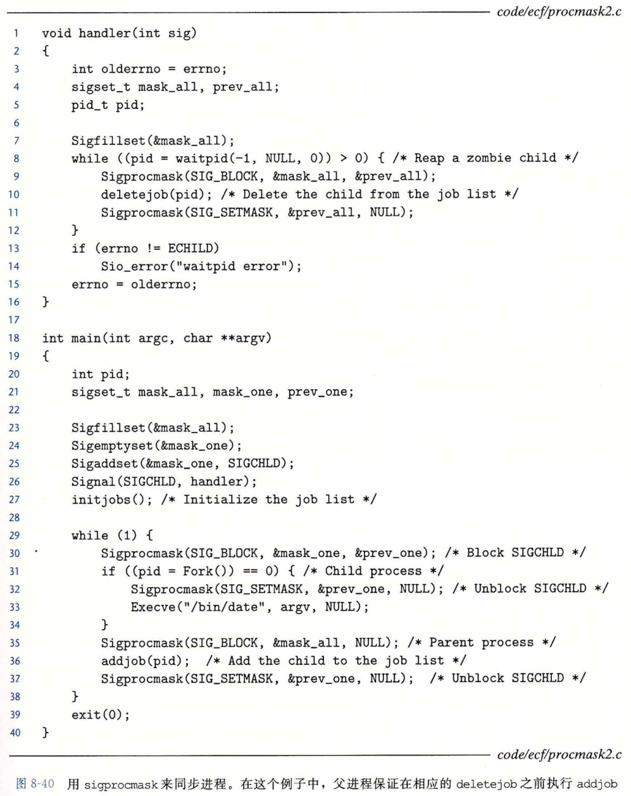

### 显式地等待信号

​		有时候主程序需要显式地等待某个信号处理程序运行。例如，当 Linux shell 创建一个前台作业时，在接收下一条用户命令之前，它必须等待作业终止，被 SIGCHLD 处理程序回收。 图8-41给出了一个基本的思路。父进程设置 SIGINT 和 SIGCHLD 的处理程序，然后进入一个无限循环。它阻塞 SIGCHLD 信号，避免8. 5. 6节中讨论过的父进程和子进程之间的竞争。创建了子进程之后，把 pid 重置为 0 ,取消阻塞 SIGCHLD，然后以循环的方式等待 pid变为非零。子进程终止后，处理程序回收它，把它非零的 PID 赋值给全局 pid 变量。这会终止循环，父进程继续其他的工作，然后开始下一次迭代。

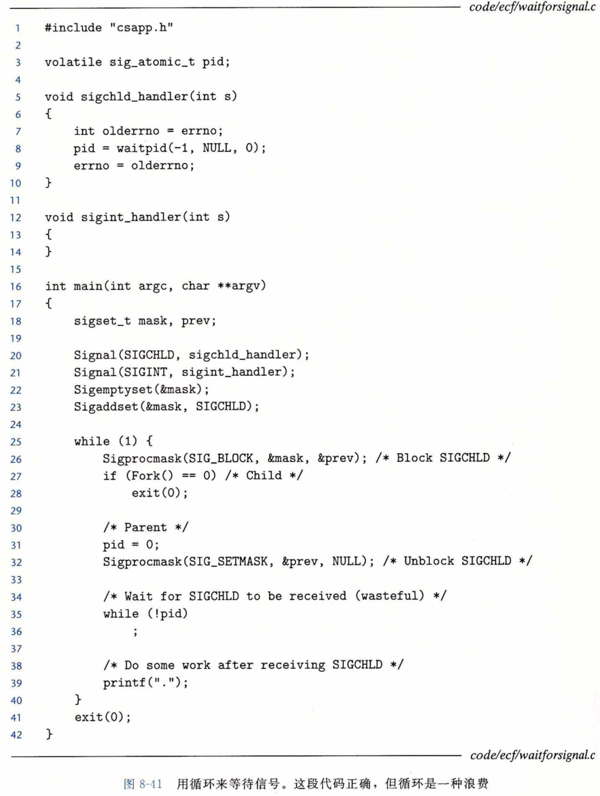

​		当这段代码正确执行的时候，循环在浪费处理器资源。我们可能会想要修补这个问题，在循环体内插入 pause:

​		while (!pid) /* Race! */ 
​			pause() ;

​		注意，我们仍然需要一个循环，因为收到一个或多个 SIGINT 信号，pause 会被中断。不过，这段代码有很严重的竞争条件：如果在 while 测试后和 pause 之前收到 SIGCHLD 信号，pause 会永远睡眠。

​		另一个选择是用 sleep 替换 pause :

​		while (!pid) /* Too slow! */ 
​			sleep(1);

​		当这段代码正确执行时，它太慢了。如果在 while 之后 pause 之前收到信号，程序必须等相当长的一段时间才会再次检查循环的终止条件。使用像 nanosleep 这样更高精度的休眠函数也是不可接受的，因为没有很好的方法来确定休眠的间隔。间隔太小，循环会太浪费。间隔太大，程序又会太慢。

​		合适的解决方法是使用 sigsuspend 。

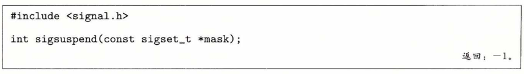

​		sigsuspend 函数暂时用 mask 替换当前的阻塞集合，然后挂起该进程，直到收到一个信号，其行为要么是运行一个处理程序，要么是终止该进程。如果它的行为是终止，那么该进程不从 sigsuspend 返回就直接终止。如果它的行为是运行一个处理程序，那么 sigsuspend 从处理程序返回，恢复调用 sigsuspend 时原有的阻塞集合。

​		sigsuspend 函数等价于下述代码的原子的（不可中断的）版本：

1  sigprocmask(SIG.SETMASK,  &mask, &prev);
2  pause ();
3  sigprocmask(SIG_SETMASK,  &prev, NULL);

原子属性保证对 sigprocmask（第1行）和 pause （第2行）的调用总是一起发生的，不会被中断。这样就消除了潜在的竞争，即在调用 sigprocmask 之后但在调用 pause 之前收到了一个信号。

​		图8-42展示了如何使用 sigsuspend 来替代图8-41中的循环。在每次调用 sigsuspend 之前，都要阻塞 SIGCHLD。 sigsuspend 会暂时取消阻塞 SIGCHLD， 然后休眠， 直到父进程捕获信号。在返回之前，它会恢复原始的阻塞集合，又再次阻塞 SIGCHLD 。 如果父进程捕获一个 SIGINT 信号，那么循环测试成功，下一次迭代又再次调用 sigsuspend。如果父进程捕获一个 SIGCHLD，那么循环测试失败，会退出循环。此时， SIGCHLD 是被阻塞的，所以我们可以可选地取消阻塞 SIGCHLD 。在真实的有后台作业需要回收的 shell 中这样做可能会有用处。

​		sigsuspend 版本比起原来的循环版本不那么浪费，避免了引入 pause 带来的竞争， 又比 sleep 更有效率。

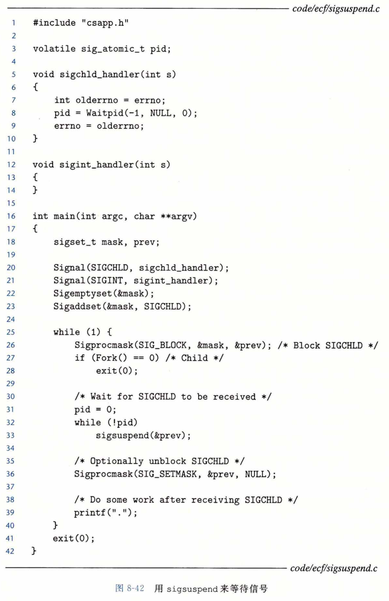