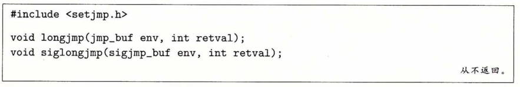
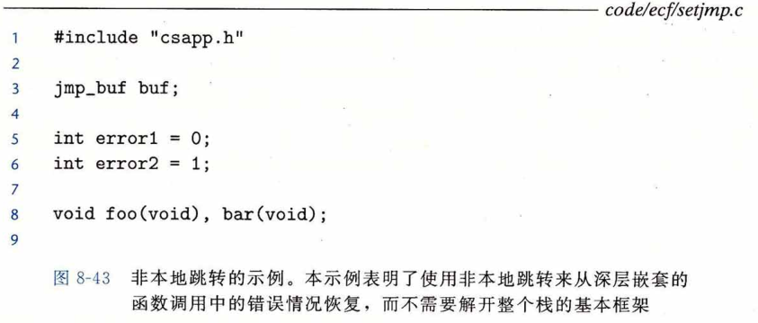
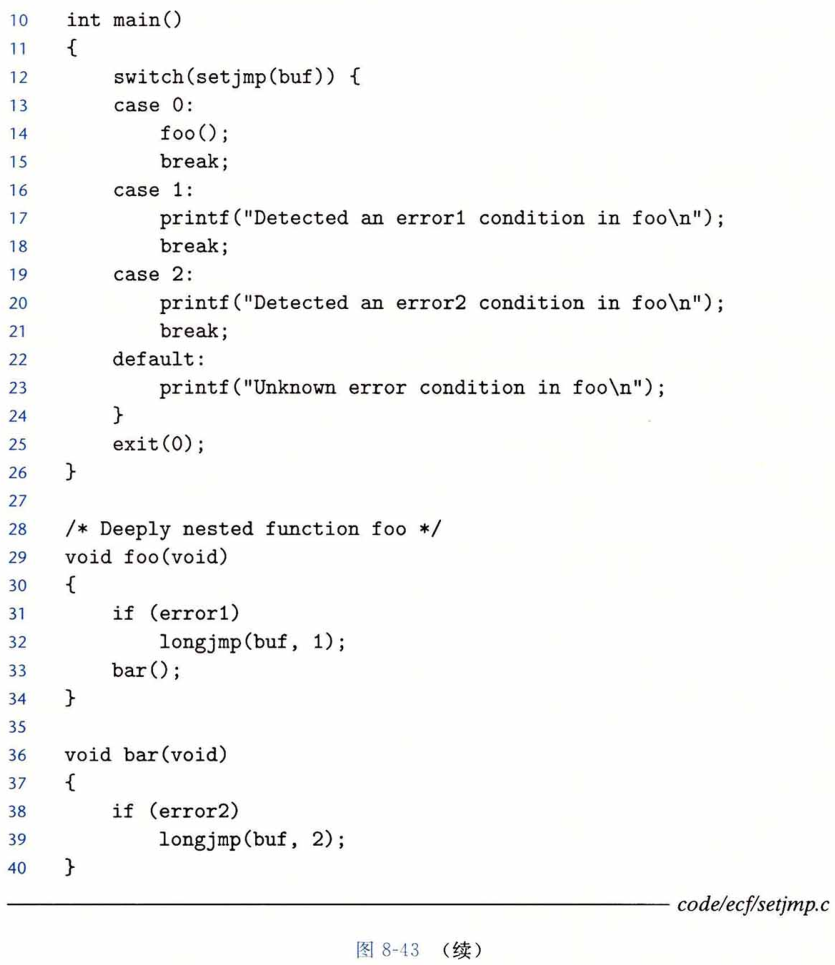
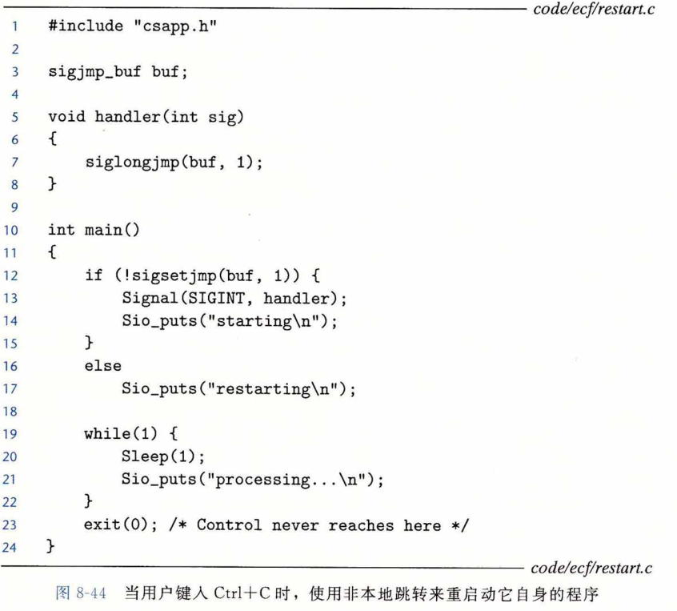

## 非本地跳转

​		C 语言提供了一种用户级异常控制流形式，称为**非本地跳转（nonlocal jump）**,它将控制直接从一个函数转移到另一个当前正在执行的函数，而不需要经过正常的<u>调用-返回序列</u>。非本地跳转是通过 setjmp 和 longjmp 函数来提供的。


​		与刺激的 abort() 和 exit() 相比, goto 语句看起来是处理异常的更可行方案。不幸的是，goto 是本地的：它只能跳到所在函数内部的标号上，而不能将控制权转移到所在程序的任意地点（当然，除非你的所有代码都在main体中）。

​		**setjmp(j) 设置 “ jump ” 点，保存当前上下文，当调用 longjmp() 的时候恢复至保存时的上下文。**

**例：**

```C
#include <stdio.h>
#include <setjmp.h>
jmp_buf env;
double divide(double a,double b){
       const double delta = 0.00000000001;         //由于浮点数不精确,所以需要定义个很小的数
       if(!((-delta<b)&&(b<delta)))
       {
              return  a/b ;
       }
       else
       {
              longjmp(env,1);                    //直接跳转到23行,ret=setjmp(env)代码处,并返回异常值(1)
              return 0;
       }
}
 
int main( ){
    int ret;
 
    ret=setjmp(env); //手动调用 setjmp(),将返回正常值(0),   
 
  　　   if(!ret)            //正常操作
　　　　{
　　　　　　printf("5/0=%lf\n",divide(5,0));
　　　　}
 　　　　else  if(ret==1)     //异常操作
       {
　　　　　　printf("ERR\n");
       } 
    return 0;
}
```

最后运行返回：
			`ERR`

​		setjmp 函数在 env 缓冲区中保存当前调用环境，以供后面的 longjmp 使用，并返回  0 。调用环境包括程序计数器、栈指针和通用目的寄存器。出于某种超出本书描述范围的原因，setjmp 返回的值不能被赋值给变量： 
​			rc = setjmp(env);  /* Wrong! */
​		不过它可以安全地用在 switch 或条件语句的测试中[62]。



​		longjmp 函数从 env 缓冲区中恢复调用环境，然后触发一个从最近一次初始化 env 的 setjmp 调用的返回。然后 setjmp 返回，并带有非零的返回值 retval 。

​		第一眼看过去，setjmp 和 longjmp 之间的相互关系令人迷惑。setjmp 函数只被调用一次，但返回多次：一次是当第一次调用 setjmp，而调用环境保存在缓冲区 env 中时， 一次是为每个相应的 longjmp 调用。另一方面，longjmp 函数被调用一次，但从不返回。

​		<u>非本地跳转的一个重要应用就是允许从一个深层嵌套的函数调用中立即返回，通常是由检测到某个错误情况引起的</u>。如果在一个深层嵌套的函数调用中发现了一个错误情况， 我们可以使用非本地跳转直接返回到一个普通的本地化的错误处理程序，而不是费力地解开调用栈。

​		图8-43展示了一个示例，说明这可能是如何工作的。main 函数首先调用 setjmp 以保存当前的调用环境，然后调用函数 foo , foo 依次调用函数 bar 。如果 foo 或者 bar 遇到一个错误，它们立即通过一次 longjmp 调用从setjmp 返回。setjmp 的非零返回值指明了错误类型，随后可以被解码，且在代码中的某个位置进行处理。





​		longjmp 允许它跳过所有中间调用的特性可能产生意外的后果。例如，如果中间函数调用中分配了某些数据结构，本来预期在函数结尾处释放它们，那么这些释放代码会被跳过，因而会产生内存泄漏。

​		非本地跳转的另一个重要应用是使一个信号处理程序分支到一个特殊的代码位置，而不是返回到被信号到达中断了的指令的位置。图8-44展示了一个简单的程序，说明了这种基本技术。当用户在键盘上键入 Ctrl+C 时，这个程序用信号和非本地跳转来实现软重启。sigsetjmp 和 siglongjmp 函数是 setjmp 和 longjmp 的可以被信号处理程序使用的版本。



​		在程序第一次启动时，对 sigsetjmp 函数的初始调用保存调用环境和信号的上下文 (包括待处理的和被阻塞的信号向量）。随后，主函数进入一个无限处理循环。当用户键人 Ctrl + C 时，内核发送一个 SIGINT 信号给这个进程，该进程捕获这个信号。不是从信号处理程序返回，如果是这样那么信号处理程序会将控制返回给被中断的处理循环，反之， 处理程序完成一个非本地跳转，回到 main 函数的开始处。当我们在系统上运行这个程序 时，得到以下输出：

linux> ./restart 
starting 
processing... 
processing...
Ctrl+C 
restarting 
processing...
Ctrl+C 
restarting 
processing...

​		关于这个程序有两件很有趣的事情。首先，为了避免竞争，必须在调用了 sigsetjmp 之后再设置处理程序。否则，就会冒在初始调用 sigsetjmp 为 siglongjmp 设置调用环境之前运行处理程序的风险。其次，你可能已经注意到了，sigsetjmp 和 siglongjmp 函数不在图8-33中异步信号安全的函数之列。原因是一般来说 siglongjmp 可以跳到任意代码，所以我们必须小心，只在 siglongjmp 可达的代码中调用安全的函数。在本例中，我们调用安全的 sio_puts 和 sleep 函数。不安全的 exit 函数是不可达的。

**PS: ** C++ 和 Java 提供的异常机制是较高层次的，是 C 语言的 setjmp 和 longjmp 函数的更加结构化的版本。你可以把 try 语句中的 catch 子句看做类似于 setjmp 函数。相似地，throw 语句就类似于 longjmp 函数。