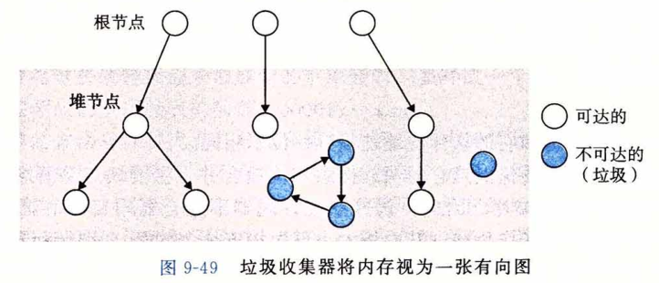
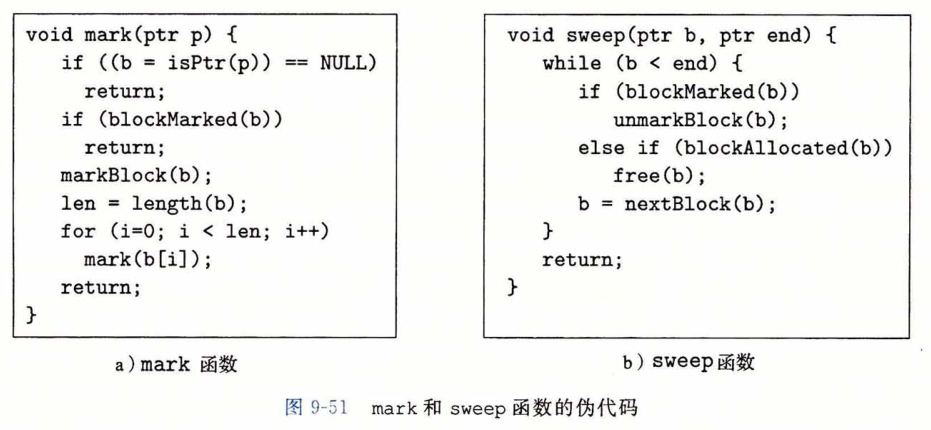
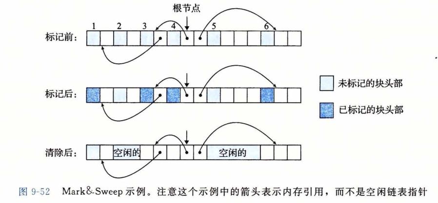

## 垃圾收集

​		在诸如 C malloc 包这样的显式分配器中，应用通过调用 malloc 和 free 来分配和释放堆块。应用要负责释放所有不再需要的已分配块。

​		未能释放已分配的块是一种常见的编程错误。例如，考虑下面的 C 函数，作为处理的 一部分，它分配一块临时存储：

```c
1	void garbage()
2	{
3       int *p = (int *)Malloc(15213);
4    
5		return; /* Array p is garbage at this point */
6	}
```

​		因为程序不再需要 p , 所以在 garbage 返回前应该释放 p 。不幸的是，程序员忘了释放这个块。它在程序的生命周期内都保持为已分配状态，毫无必要地占用着本来可以用来满足后面分配请求的堆空间。

​		**垃圾收集器（garbage collector）**是一种动态内存分配器，它自动释放程序不再需要的已分配块。这些块被称为**垃圾（garbage）**(因此术语就称之为垃圾收集器）。自动回收堆存储的过程叫做**垃级收集（garbage collection）**。在一个支持垃圾收集的系统中，应用显式分配堆块，但是从不显示地释放它们。在 C 程序的上下文中，应用调用 malloc ，但是从不调用free。反之，垃圾收集器定期识别垃圾块，并相应地调用 free , 将这些块放回到空闲链表中。

​		垃圾收集可以追溯到 John McCarthy 在 20 世纪 60 年代早期在 MIT 开发的 Lisp 系统。 它是诸如 Java 、ML、Perl 和 Mathematica 等现代语言系统的一个重要部分，而且它仍然是一个重要而活跃的研究领域。有关文献描述了大量的垃圾收集方法，其数量令人吃惊。 我们的讨论局限于 McCarthy 独创的 Mark&Sweep (标记&清除）算法，这个算法很有趣， 因为它可以建立在已存在的 malloc 包的基础之上，为 C 和 C++ 程序提供垃圾收集。


### 垃圾收集器的基本知识

​		垃圾收集器将内存视为一张有向**可达图（reachability graph）**，其形式如图9-49所示。 该图的节点被分成一组**根节点（root node）**和一组**堆节点（heap node）**。每个堆节点对应于堆中的一个已分配块。有向边 p → q 意味着块 p 中的某个位置指向块 q 中的某个位置。根节点对应于这样一种不在堆中的位置，它们中包含指向堆中的指针。这些位置可以是寄存器、栈里的变量，或者是虚拟内存中读写数据区域内的全局变量。



​		当存在一条从任意根节点出发并到达 p 的有向路径时，我们说节点 p 是**可达的 (reachable)**。在任何时刻，不可达节点对应于垃圾，是不能被应用再次使用的。垃圾收集器的角色是维护可达图的某种表示，并通过释放不可达节点且将它们返回给空闲链表，来定期地回收它们。

​		像 ML 和 Java 这样的语言的垃圾收集器，对应用如何创建和使用指针有很严格的控制，能够维护可达图的一种精确的表示，因此也就能够回收所有垃圾。然而，诸如 C 和 C++ 这样的语言的收集器通常不能维持可达图的精确表示。这样的收集器也叫做**保守的垃圾收集器（conservative garbage collector)**。从某种意义上来说它们是保守的，即每个可达块都被正确地标记为可达了，而一些不可达节点却可能被错误地标记为可达。

​		收集器可以按需提供它们的服务，或者它们可以作为一个和应用并行的独立线程，不断地更新可达图和回收垃圾。例如，考虑如何将一个 C 程序的保守的收集器加入到已存在的 malloc 包中，如图9-50所示。


​		无论何时需要堆空间时，应用都会用通常的方式调用 malloc 。如果 malloc 找不到一个合适的空闲块，那么它就调用垃圾收集器，希望能够回收一些垃圾到空闲链表。收集器识别出垃圾块，并通过调用 free 函数将它们返回给堆。关键的思想是收集器代替应用去调用 free 。当对收集器的调用返回时，mallo c重试，试图发现一个合适的空闲块。如果还是失败了，那么它就会向操作系统要求额外的内存。最后，malloc 返回一个指向请求块的指针（如果成功）或者返回一个空指针（如果不成功）。


### Mark & Sweep 垃圾收集器

​		Mark & Sweep垃圾收集器由**标记（mark）**阶段和**清除（sweep）**阶段组成，标记阶段标记出根节点的所有可达的和已分配的后继，而后面的清除阶段释放每个未被标记的已分配块。块头部中空闲的低位中的一位通常用来表示这个块是否被标记了。

​		我们对 Mark & Sweep 的描述将假设使用下列函数，其中 ptr 定义为 typedef  void  *ptr :

* ptr  isPtr (ptr  p)。如果 p 指向一个已分配块中的某个字，那么就返回一个指向这个块的起始位置的指针 b 。否则返回 NULL 。

* int  blockMarked (ptr  b)。如果块 b 是已标记的，那么就返回 true 。

* int  blockAllocated (ptr  b)。如果块 b 是已分配的，那么就返回 true 。

* void  markBlock (ptr  b)。标记块 b。

* int  length (b)。返回块 b 的以字为单位的长度（不包括头部）。

* void  unmarkBlock (ptr  b)。将块 b 的状态由已标记的改为未标记的。

* ptr   nextBlock(ptr   b) 。返回堆中块 b 的后继。

​        标记阶段为每个根节点调用一次图 9-51a 所示的 mark 函数。如果 p 不指向一个已分配并且未标记的堆块，mark 函数就立即返回。否则，它就标记这个块，并对块中的每个字递归地调用它自己。每次对 mark 函数的调用都标记某个根节点的所有未标记并且可达的后继节点。在标记阶段的末尾，任何未标记的已分配块都被认定为是不可达的，是垃圾，可以在清除阶段回收。



​		清除阶段是对图9_51b 所示的 sweep 函数的一次调用。sweep 函数在堆中每个块上反复循环，释放它所遇到的所有未标记的已分配块(也就是垃圾）。



​		图9-52展示了一个小堆的 Mark&Sweep 的图形化解释。块边界用粗线条表示。每个方块对应于内存中的一个字。每个块有一个字的头部，要么是已标记的，要么是未标记的。

​		初始情况下，图9-52中的堆由六个已分配块组成，其中每个块都是未分配的。第3 块包含一个指向第1块的指针。第4块包含指向第3块和第6块的指针。根指向第4块。 在标记阶段之后，第1块、第3块、第4块和第6块被做了标记，因为它们是从根节点达的。第2块和第5块是未标记的，因为它们是不可达的。在清除阶段之后，这两个不可 达块被回收到空闲链表。


### C 程序的保守 Mark&Sweep

​		Mark&Sweep 对 C 程序的垃圾收集是一种合适的方法，因为它可以就地工作，而不需要移动任何块。然而，C 语言为 isPtr 函数的实现造成了一些有趣的挑战。

​		第一，C 不会用任何类型信息来标记内存位置。因此，对isPtr没有一种明显的方式 来判断它的输入参数P是不是一个指针。第二，即使我们知道P是一个指针，对isPtr也 没有明显的方式来判断P是否指向一个已分配块的有效载荷中的某个位置。

​		对后一问题的解决方法是将已分配块集合维护成一棵平衡二叉树，这棵树保持着这样一 个属性：左子树中的所有块都放在较小的地址处，而右子树中的所有块都放在较大的地址 处。如图9-53所示，这就要求每个已分配块的头部里有两个附加字段（left和right)。每 个字段指向某个已分配块的头部。isPtr(PtrP)函数用树来执行对已分配块的二分查找。在 每一步中，它依赖于块头部中的大小字段来判断P是否落在这个块的范围之内。


​		平衡树方法保证会标记所有从根节点可达的节点，从这个意义上来说它是正确的。这 是一个必要的保证，因为应用程序的用户当然不会喜欢把他们的已分配块过早地返回给空 闲链表。然而，这种方法从某种意义上而言又是保守的，因为它可能不正确地标记实际上 不可达的块，因此它可能不会释放某些垃圾。虽然这并不影响应用程序的正确性，但是这 可能导致不必要的外部碎片。

​		C 程序的 Mark & Sweep 收集器必须是保守的，其根本原因是 C 语言不会用类型信息来标记内存位置。因此，像 int 或者 float 这样的标量可以伪装成指针。例如，假设某 个可达的已分配块在它的有效载荷中包含一个int，其值碰巧对应于某个其他已分配块 b 的有效载荷中的一个地址。对收集器而言，是没有办法推断出这个数据实际上是 int 而不是指针。因此，分配器必须保守地将块 b 标记为可达，尽管事实上它可能是不可达的。