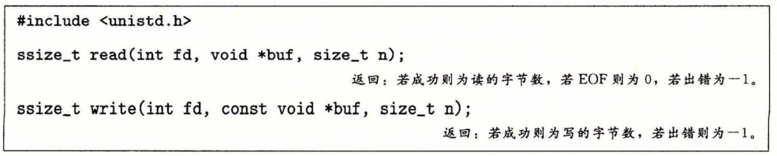
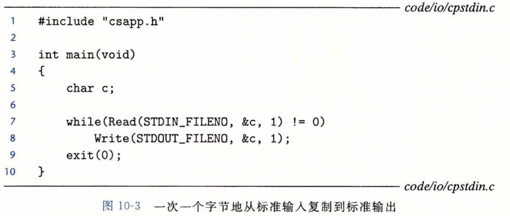

## 读和写文件

​		应用程序是通过分别调用 read 和 write 函数来执行输入和输出的。

​		read 函数从描述符为 fd 的当前文件位置复制最多 n 个字节到内存位置 buf 。返回值 -1 表示一个错误，而返回值 0 表示 EOF 。否则，返回值表示的是实际传送的字节数量。

​		write 函数从内存位置 buf 复制至多 n 个字节到描述符 fd 的当前文件位置。图10-3展示了一个程序使用 read 和 write 调用一次一个字节地从标准输入复制到标准输出。

​		通过调用 Iseek 函数，应用程序能够显示地修改当前文件的位置，这部分内容不在我们的讲述范围之内。

​		在某些情况下，read 和 write 传送的字节比应用程序要求的要少。这些**不足值（short count）**不表示有错误。出现这样情况的原因有：

* **读时遇到EOF**。假设我们准备读一个文件，该文件从当前文件位置开始只含有 20 多个字节，而我们以 50 个字节的片进行读取。这样一来，下一个 read 返回的不足值为 20 , 此后的 read 将通过返回不足值 0 来发出 EOF 信号。

* **从终端读文本行**。如果打开文件是与终端相关联的（如键盘和显示器），那么每个 read 函数将一次传送一个文本行，返回的不足值等于文本行的大小。

* **读和写网络套接字（socket）**。如果打开的文件对应于网络套接字（11.4节），那么内部缓冲约束和较长的网络延迟会引起 read 和 write 返回不足值。对 Linux **管道 (pipe) **调用 read 和 write 时，也有可能出现不足值，这种进程间通信机制不在我们讨论的范围之内。

​        实际上，除了 EOF，当你在读磁盘文件时，将不会遇到不足值，而且在写磁盘文件时， 也不会遇到不足值。然而，如果你想创建健壮的（可靠的）诸如 Web 服务器这样的网络应用， 就必须通过反复调用 read 和 write 处理不足值，直到所有需要的字节都传送完毕。