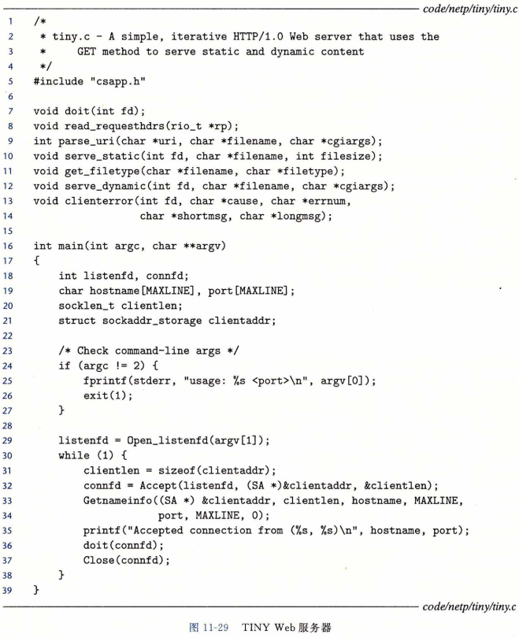

## 综合：TINY Web服务器

​		我们通过开发一个虽小但功能齐全的称为 TINY 的 Web 服务器来结束对网络编程的讨论。TINY 是一个有趣的程序。在短短 250 行代码中，它结合了许多我们已经学习到的思想，例如进程控制、Unix I/O、套接字接口和 HTTP 。虽然它缺乏一个实际服务器所具备的功能性、健壮性和安全性，但是它足够用来为实际的 Web 浏览器提供静态和动态的内容。我们鼓励你研究它，并且自己实现它。将一个实际的浏览器指向你自己的服务器， 看着它显示一个复杂的带有文本和图片的 Web 页面，真是非常令人兴奋（甚至对我们这些作者来说，也是如此！）。

##### 		1.TINY 的 main 程序

​		图11-29展示了 TINY 的主程序。TINY 是一个迭代服务器，监听在命令行中传递来的端口上的连接请求。在通过调用 open_listenfd 函数打开一个监听套接字以后，TINY 执行典型的无限服务器循环，不断地接受连接请求（ 第 32 行），执行事务（第 36 行），并关闭连接的它那一端 ( 第 37 行 ）。

##### 		2.doit函数

​		图11-30中的 doit 函数处理一个 HTTP 事务。首先，我们读和解析请求行（ 第 11〜 14 行）。注意，我们使用图11-8 中的 rio_readlineb 函数读取请求行。

​		TINY 只支持 GET方 法。如果客户端请求其他方法（比如 POST )，我们发送给它一个错误信息，并返回到主程序（第 15〜19 行），主程序随后关闭连接并等待下一个连接请求。否则，我们读并且(像我们将要看到的那样)忽略任何请求报头（第 20 行）。

​		然后，我们将 URI 解析为一个文件名和一个可能为空的 CGI 参数字符串，并且设置一个标志，表明请求的是静态内容还是动态内容（第 23 行）。如果文件在磁盘上不存在， 我们立即发送一个错误信息给客户端并返回。

​		最后，如果请求的是静态内容，我们就验证该文件是一个普通文件，而我们是有读权限的（第 31 行）。如果是这样，我们就向客户端提供静态内容（第 36 行）。相似地，如果请求的是动态内容，我们就验证该文件是可执行文件(第 39 行），如果是这样，我们就继续 , 并且提供动态内容（第 44 行）。

##### 		3.clienterror 函数

​		TINY 缺乏一个实际服务器的许多错误处理特性。然而，它会检查一些明显的错误， 并把它们报告给客户端。图11-31中的 clienterror 函数发送一个 HTTP 响应到客户端， 在响应行中包含相应的状态码和状态消息，响应主体中包含一个 HTML 文件，向浏览器的用户解释这个错误。

​		回想一下，HTML 响应应该指明主体中内容的大小和类型。因此，我们选择创建 HTML 内容为一个字符串，这样一来我们可以简单地确定它的大小。还有，请注意我们为所有的输出使用的都是图10-4中健壮的 rio_writen 函数。

##### 		4.read_requesthdrs 函数

​		TINY 不使用请求报头中的任何信息。它仅仅调用图11-32中的 read_requesthdrs 函数来读取并忽略这些报头。注意，终止请求报头的空文本行是由回车和换行符对组成 的，我们在第 6 行中检查它。

##### 		5.parse_uri 函数

​		TINY 假设静态内容的主目录就是它的当前目录，而可执行文件的主目录是 ./cgi-bin 。 任何包含字符串 cgi-bin 的 URI 都会被认为表示的是对动态内容的请求。默认的文件名是 ./home.html。

​		图11-33 中的 parse_uri 函数实现了这些策略。它将 URI 解析为一个文件名和一个可选的 CGI 参数字符串。如果请求的是静态内容（第 5 行），我们将清除 CGI 参数字符串 ( 第 6 行 ），然后将 URI 转换为一个 Linux 相对路径名，例如 ./index.html ( 第  7〜 8 行）。 如果 URI 是用 “ /  ”结尾的（ 第 9 行 ），我们将把默认的文件名加在后面 ( 第 10 行 ）。另一方面，如果请求的是动态内容 ( 第 13 行 ），我们就会抽取出所有的 CGI 参数（ 第 14〜20 行）， 并将 URI 剩下的部分转换为一个 Linux 相对文件名（第 21〜22 行）。

#####  		6.serve_static 函数

​		TINY 提供五种常见类型的静态内容：HTML 文件、无格式的文本文件，以及编码为 GIF 、PNG 和 JPG 格式的图片。

​		图11-34中的 serve_static 函数发送一个 HTTP 响应，其主体包含一个本地文件的内容。首先，我们通过检查文件名的后缀来判断文件类型（ 第 7 行 ），并且发送响应行和响应报头给客户端 ( 第 8 〜 13 行 ）。注意用一个空行终止报头。

​		接着，我们将被请求文件的内容复制到已连接描述符 fd 来发送响应主体。这里的代码是比较微妙的，需要仔细研究。第 18 行以读方式打开 filename , 并获得它的描述符。 在第 19 行，Linux mmap 函数将被请求文件映射到一个虚拟内存空间。回想我们在第9.8 节中对 mmap 的讨论，调用 mmap 将文件 srcfd 的前 filesize 个字节映射到一个从地址 srcp 开始的私有只读虚拟内存区域。

​		一旦将文件映射到内存，就不再需要它的描述符了，所以我们关闭这个文件（第 20 行）。执行这项任务失败将导致潜在的致命的内存泄漏。第 21 行执行的是到客户端的实际文件传送。rio_writen 函数复制从 srcp 位置开始的 filesize 个字节（它们当然已经被映射到了所请求的文件）到客户端的已连接描述符。最后，第 22 行释放了映射的虚拟内存区域。这对于避免潜在的致命的内存泄漏是很重要的。

##### 		7.serve_dynamic 函数

​		TINY 通过派生一个子进程并在子进程的上下文中运行一个 CGI 程序，来提供各种类型的动态内容。

​		图11-35中的 serve_dynamic 函数一开始就向客户端发送一个表明成功的响应行，同时还包括带有信息的Server 报头。CGI 程序负责发送响应的剩余部分。注意，这并不像我们可能希望的那样健壮，因为它没有考虑到CGI 程序会遇到某些错误的可能性。

​		在发送了响应的第一部分后，我们会派生一个新的子进程（第 11 行）。子进程用来自请求 URI 的 CGI 参数初始化 QUERY_STRING 环境变量（ 第 13 行 ）。注意，一个真正的服务器还会在此处设置其他的 CGI 环境变量。为了简短，我们省略了这一步。

​		接下来，子进程重定向它的标准输出到已连接文件描述符 ( 第 14 行 ），然后加载并运行 CGI 程序 ( 第 15行 ）。因为 CGI 程序运行在子进程的上下文中，它能够访问所有在调用 execve 函数之前就存在的打开文件和环境变量。 因此， CGI 程序写到标准输出上的任何东西都将直接送到客户端进程，不会受到任何来自父进程的干涉。其间，父进程阻塞在对 wait 的调用中，等待当子进程终止的时候，回收操作系统分配给子进程的资源 ( 第 17行）。

