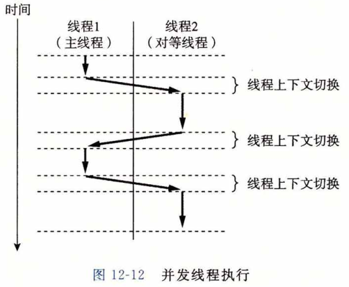
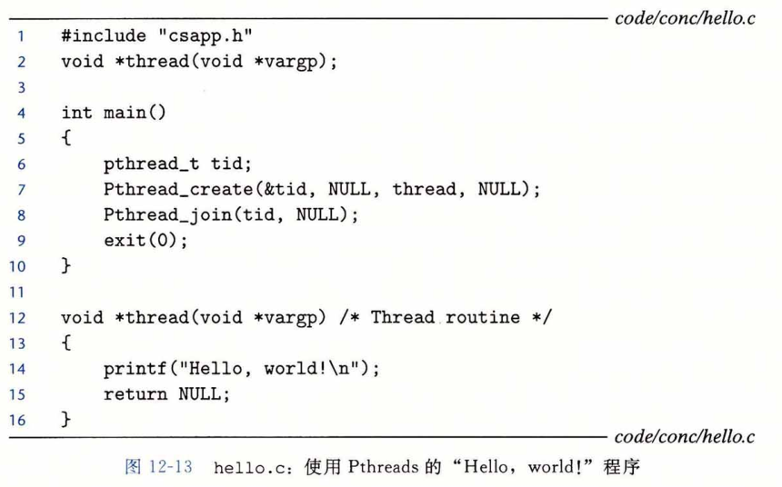
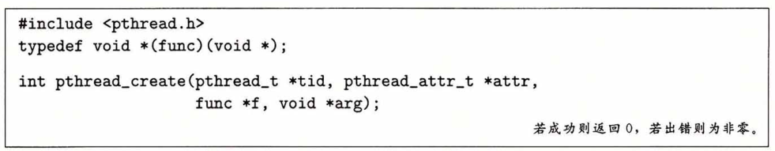
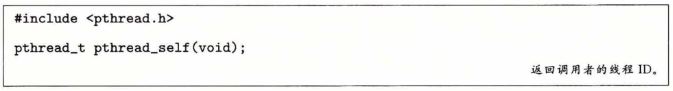
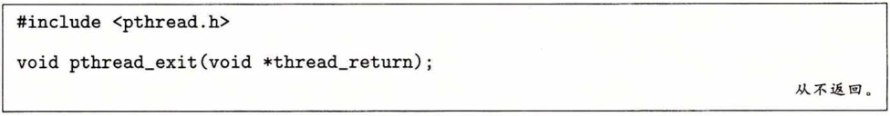
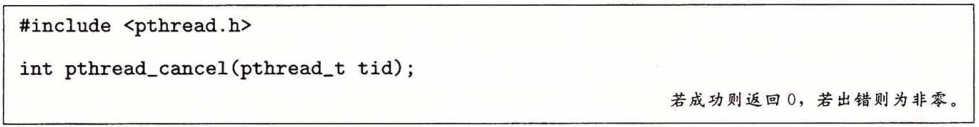
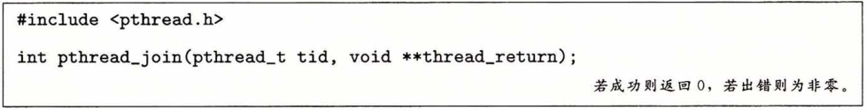
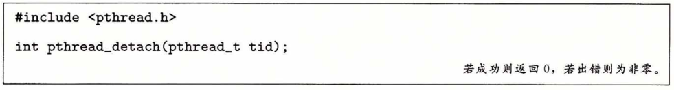
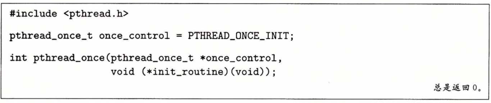
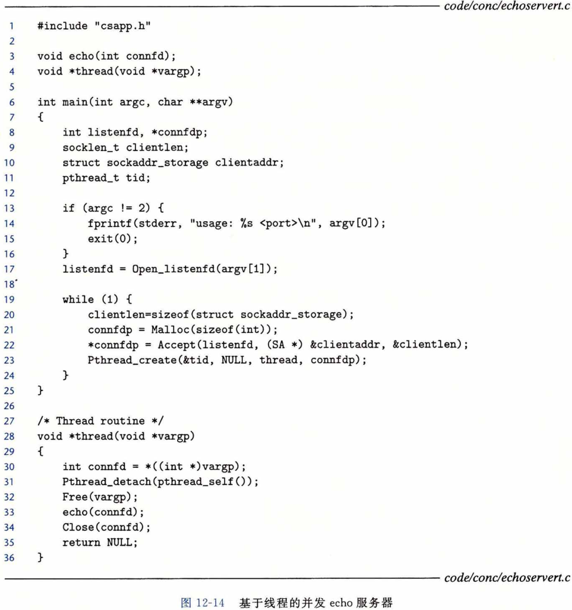

## 基于线程的并发编程

​		到目前为止，我们已经看到了两种创建并发逻辑流的方法。

​		在第一种方法中，我们为每个流使用了单独的进程。内核会自动调度每个进程，而每个进程有它自己的私有地址空间，这使得流共享数据很困难。
​		在第二种方法中，我们创建自己的逻辑流，并利用 I/O 多路复用来显式地调度流。因为只有一个进程，所有的流共享整个地址空间。本节介绍第三种方法——基于线程，它是这两种方法的混合。

​		**线程（thread）**就是运行在进程上下文中的逻辑流。在本书里迄今为止，程序都是由每个进程中一个线程组成的。但是现代系统也允许我们编写一个进程里同时运行多个线程的程序。线程由内核自动调度。每个线程都有它自己的**线程上下文（thread context）**,包括一个唯一的整数**线程ID（Thread ID, TID）**、栈 、栈指针 、程序计数器 、通用目的寄存器和条件码。所有的运行在一个进程里的线程共享该进程的整个虚拟地址空间。

​		基于线程的逻辑流结合了基于进程和基于 I/O 多路复用的流的特性。同进程一样，线程由内核自动调度，并且内核通过一个整数 ID 来识别线程。同基于 I/O 多路复用的流一样，多个线程运行在单一进程的上下文中，因此共享这个进程虚拟地址空间的所有内容， 包括它的代码、数据、堆、共享库和打开的文件。

### 线程执行模型

​		多线程的执行模型在某些方面和多进程的执行模型是相似的。思考图12-12中的示例。每个进程开始生命周期时都是单一线程，这个线程称为**主线程（main thread）**。

​		在某一时刻，主线程创建一个**对等线程 (peer thread)**,从这个时间点开始，两个线程就并发地运行。最后，因为主线程执行—个慢速系统调用，例如 read 或者 sleep，或者因为被系统的间隔计时器中断，控制就会通过上下文切换传递到对等线程。对等线程会执行一段时间，然后控制传递回主线程，依次类推。

​		在一些重要的方面，线程执行是不同于进程的。因为一个线程的上下文要比一个进程的上下文小得多，线程的上下文切换要比进程的上下文切换快得多。另一个不同就是线程不像进程那样，不是按照严格的父子层次来组织的。和一个进程相关的线程组成一个对等（线程）池，独立于其他线程创建的线程。主线程和其他线程的区别仅在于它总是进程中第一个运行的线程。对等（线程）池概念的主要影响是，一个线程可以杀死它的任何对等线程，或者等待它的任意对等线程终止。另外，每个对等线程都能读写相同的共享数据。

### Posix 线程

​		**Posix 线程（Pthreads）**是在 C 程序中处理线程的一个标准接口。它最早出现在 1995 年，而且在所有的 Linux 系统上都可用。Pthreads 定义了大约 60 个函数，允许程序创建、 杀死和回收线程，与对等线程安全地共享数据，还可以通知对等线程系统状态的变化。

​		图12-13展示了一个简单的 Pthreads 程序。主线程创建一个对等线程，然后等待它的终止。对等线程输出 “ Hello, world!  \n ” 并且终止。当主线程检测到对等线程终止后， 它就通过调用 exit 终止该进程。这是我们看到的第一个线程化的程序，所以让我们仔细地解析它。

​		线程的代码和本地数据被封装在一个**线程例程（thread routine）**中。正如第二行里的原型所示，每个线程例程都以一个通用指针作为输入，并返回一个通用指针。如果想传递多个参数给线程例程，那么你应该将参数放到一个结构中，并传递一个指向该结构的指针。相似地，如果想要线程例程返回多个参数，你可以返回一个指向一个结构的指针。

​		第 4 行标出了主线程代码的开始。主线程声明了一个本地变量 tid，可以用来存放对等线程的 ID ( 第 6 行）。主线程通过调用 pthread_create 函数创建一个新的对等线程（第 7 行）。当对 pthread_create 的调用返回时，主线程和新创建的对等线程同时运行，并且 tid 包含新线程的 ID 。通过在第 8 行调用 pthread_join，主线程等待对等线程终止。 最后，主线程调用 exit（第 9 行），终止当时运行在这个进程中的所有线程（在这个示例中就只有主线程）。

​		第 12 〜 16 行定义了对等线程的例程。它只打印一个字符串，然后就通过执行第 15 行中的 return 语句来终止对等线程。

### 创建线程

​		线程通过调用 pthread_create 函数来创建其他线程。

​		pthread_create 函数创建一个新的线程，并带着一个输入变量 arg，在新线程的上下文中运行**线程例程 f**。能用 attr 参数来改变新创建线程的默认属性。改变这些属性已超出我们学习的范围，在我们的示例中，总是用一个为 NULL 的 attr 参数来调用 pthread_create  函数。

​		当 pthread_create 返回时，参数 tid 包含新创建线程的 ID 。新线程可以通过调用  pthread_self 函数来获得它自己的线程 ID 。

### 终止线程

一个线程是以下列方式之一来终止的：

* 当顶层的线程例程返回时，线程会隐式地终止。

* 通过调用 pthread_exit 函数，线程会显式地终止。如果主线程调用 pthread_exit , 它会等待所有其他对等线程终止，然后再终止主线程和整个进程，返回值为 thread_return。

* 某个对等线程调用 Linux 的 exit 函数，该函数终止进程以及所有与该进程相关的线程。

* 另一个对等线程通过以当前线程 ID 作为参数调用 Pthread_cancel 函数来终止当前线程。

### 回收已终止线程的资源

​		线程通过调用 pthread_join 函数等待其他线程终止。

​		pthread_join 函数会阻塞，直到线程 tid 终止，将线程例程返回的通用（void*）指针赋值为 thread_return 指向的位置，然后回收已终止线程占用的所有内存资源。

​		注意，和 Linux 的 wait 函数不同，Pthread_join 函数只能等待一个指定的线程终止。没有办法让 pthread_wait 等待任意一个线程终止。这使得代码更加复杂，因为它迫使我们去使用其他一些不那么直观的机制来检测进程的终止。实际上，Stevens在[110]中就很有说服力地论证了这是规范中的一个错误。

### 分离线程

​		在任何一个时间点上，线程是**可结合的（joinable）**或者是**分离的（detached）**。一个可结合的线程能够被其他线程收回和杀死。在被其他线程回收之前，它的内存资源（例如栈）是不释放的。相反，一个分离的线程是不能被其他线程回收或杀死的。它的内存资源在它终止时由系统自动释放。

​		默认情况下，线程被创建成可结合的。为了避免内存泄漏，每个可结合线程都应该要么被其他线程显式地收回，要么通过调用 pthread_detach 函数被分离。

​		pthread_detach 函数分离可结合线程 tid 。线程能够通过以 pthread_self () 为参数的 pthread_detach 调用来分离它们自己。

​		尽管我们的一些例子会使用可结合线程，但是在现实程序中，有很好的理由要使用分离的线程。

​		例如，一个高性能 Web 服务器可能在每次收到 Web 浏览器的连接请求时都创建一个新的对等线程。因为每个连接都是由一个单独的线程独立处理的，所以对于服务器而言，就很没有必要（实际上也不愿意）显式地等待每个对等线程终止。在这种情况下，每个对等线程都应该在它开始处理请求之前分离它自身，这样就能在它终止后回收它的内存资源了。

### 初始化线程

​		pthread_once 函数允许你初始化与线程例程相关的状态。

​		once_control 变量是一个全局或者静态变量，总是被初始化为 PTHREAD_ONCE_ INIT 。当你第一次用参数 once_control 调用 pthread_once 时，它调用 init_rou_ tine，这是一个没有输入参数、也不返回什么的函数。接下来的以 once_control 为参数的 pthread_once 调用不做任何事情。无论何时，当你需要动态初始化多个线程共享的全局变量时，pthread_once 函数是很有用的。我们将在12. 5. 5节里看到一个示例。

### 基于线程的并发服务器

​		图12-14展示了基于线程的并发 echo 服务器的代码。整体结构类似于基于进程的设计。主线程不断地等待连接请求，然后创建一个对等线程处理该请求。虽然代码看似简单，但是有几个普遍而且有些微妙的问题需要我们更仔细地看一看。第一个问题是当我们调用 pthread_create 时，如何将已连接描述符传递给对等线程。最明显的方法就是传递一个指向这个描述符的指针，就像下面这样

​				`connfd = Accept(listenfd, (SA *) &clientaddr, &clientlen);
​		 Pthread_create(&tid, NULL, thread, &connfd);`

然后，我们让对等线程间接引用这个指针，并将它赋值给一个局部变量，如下所示

`void * thread(void *vargp) {
		int connfd = *((int *)vargp);
		...
		...
}`

然而，这样可能会出错，因为它在对等线程的赋值语句和主线程的 accept 语句间引入了**竞争(race)**。如果赋值语句在下一个 accept 之前完成，那么对等线程中的局部变量 connfd 就得到正确的描述符值。然而，如果赋值语句是在 accept 之后才完成的，那么对等线程中的局部变量 connfd 就得到下一次连接的描述符值。那么不幸的结果就是，现在两个线程在同一个描述符上执行输入和输出。为了避免这种潜在的致命竞争，我们必须将 accept 返回的每个已连接描述符分配到它自己的动态分配的内存块，如第 20〜21 行所示。我们会在12. 7. 4节中回过来讨论竞争的问题。

​		另一个问题是在线程例程中避免内存泄漏。既然不显式地收回线程，就必须分离每个线程，使得在它终止时它的内存资源能够被收回（第 31 行）。更进一步，我们必须小心释放主线程分配的内存块（第 32 行）。