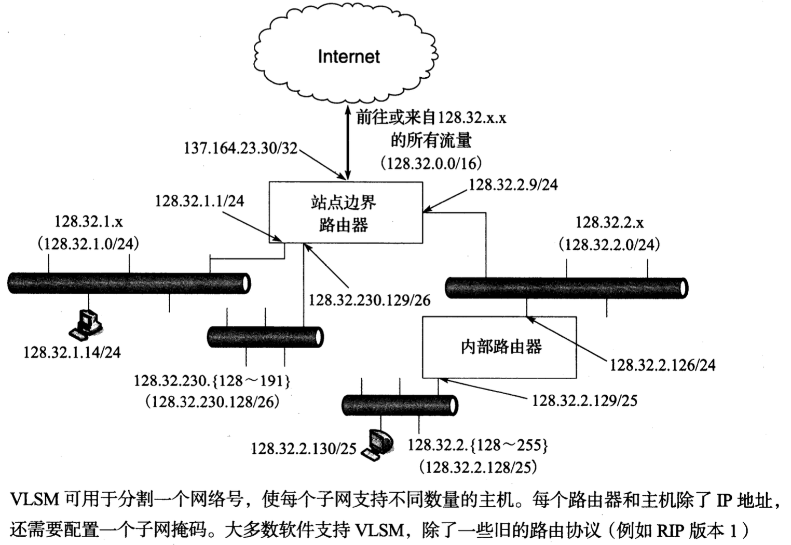

# IP地址

## 分类寻址

​	当最初定义Intemet地址结构时,每个单播IP地址都有一个网络部分,用于识别接日使用的IP地址在哪个网络中可被发现;以及一个主机地址,用于识别由网络部分给出的网络中的特定主机。因此,地址中的一些连续位称为网络号,其余位称为主机号.。当时,大多数主机只有一个网络接日,因此术语接口地址和主机地址有时交替使用。

​	地址空间的划分涉及**五大类**。每类都基于网络中可容纳的主机数量,确定在一个32 位的 IPv4 地址中分配给网络号和主机号的位数。

## 子网掩码

​		**子网掩码**是由一台主机或路由器使用的分配位,以确定如何从一台主机对应 IP 地址中获得网络和子网信息。IP 子网掩码与对应的 IP 地址长度相同(IPv4 为 32 位, IPv6 为 128 位)。它们通常在一台主机或路由器中以 IP 地址相同的方式配置,既可以是静态的(通常是路由器)，也可以使用一些动态方式，例如动态主机配置协议(DHCP ;见第6章)。对于 IPv4，子网掩码以 IPv4 地址相同的方式(即点分十进制)编写。虽然最初不需要以这种方式分配，当前子网掩码由一些 1 后跟一些 0 构成。这样安排，就可以用容易记的格式表示掩码，只需给出一些连续位的 1 (左起)的掩码。这种格式是当前最常见的格式,有时也被称为前缀长度。

​		掩码由路由器和主机使用，以确定一个 IP 地址的网络/子网部分的结束和主机部分的开始。<u>子网掩码中的一位**设为 1** 表示一个 IP 地址的对应位与一个地址的网络/子网部分的对应位相结合,并将结果作为转发数据报的基础</u>(见第5章)。<u>相反,子网掩码中的一位**设为 0**，表示一个 IP 地址的对应位作为主机 ID 的一部分。</u>例如,我们在下图中可以看到，当子网掩码为 255.255.255.0 时，如何处理 IPv4 地址128.32.1.140：

## 可变长子网掩码

## 广播地址

​		在每个 ipv4 子网中，一个特殊地址被保留作为子网广播地址。构建方式为：对<u>子网掩码</u>**取反**，并与子网中其他地址进行或运算：

​		如上图，子网 128.32.1.0/24 的子网广播地址是 128.32.1.255。这种地址作为目的地的数据称为**定向广播**，这种广播可作为单独的数据包通过 Internet 路由直达目标子网，再作为一组广播数据发送给子网中所有主机。（但是一般路由器都禁用）

​		除了子网广播，地址 255.255.255.255 被保留为**本地网络广播**，它根本不会被路由器转发

