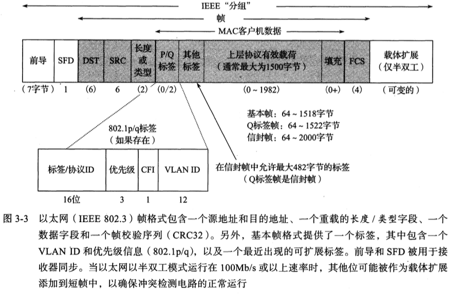
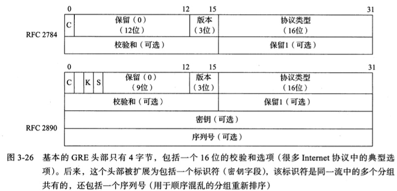
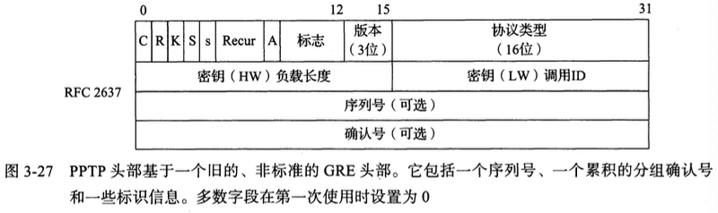

# 链路层

​		其他章中我们知道 TCP/IP 协议族中设计链路层的目的是为 IP 模块发送和接收 IP 数据报。

## 以太网和802局域网

### 以太网帧格式

​		所有的以太网(802.3)帧都基于一个共同的格式。在原有规范的基础上,帧格式已被改进以支持额外功能。下图显示了当前的以太网帧格式,以及它与IEEE提出的一个相对新的术语IEEE分组(一个在其他标准中经常使用的术语)的关系。

1. **前导**、**SFD**字段：接收器电路用它确定一个帧的到达时间，并确定编码位(称为**时钟恢复**)之间的时间量。
           由于以太网是一个异步的局域网(即每个以太网接日卡中不保持精确的时钟同步)，从一个接口到另一个接口的编码位之间的间隔可能不同。前导是一个公认的模式(典型值为 0xAA)，在发现**帧起始分隔符(SFD)**时，接收器使用它“恢复时钟”。 SFD 的固定值为 0xAB。
2. **目的地址(DST)、源地址(SRC)**: 各 6 字节，有时候也称为：“MAC 地址”、 “链路层地址”、 “802地址”、 “硬件地址”或“物理地址”。
3. **帧类型**或**长度**：在多数情况下用于确定后面的数据类型。TCP/IP网络场景值包括：**IPV4(0x0800)**、**IPv6(0x86DD)**、**ARP(0x0806)**。0x8100 表示一个 Q 标签帧(可携带一个 “虚拟局域网” 或 802.1q 其中的 VLANID)。一个以太网帧的基本大小是 1518 字节，但最近的标准改为 2000 字节。所以：如果 **类型/长度字段** 的值大于或等于 `0x0600`（1536），那么该字段表示 **类型**。如果值小于 `0x0600`，则表示该字段为 **数据长度**。
4. 数据（**有效载荷**）。。。1500字节(MTU)
5. **帧校验序列/循环冗余校验(CRC)**：4字节（32位），校验流程：发送端将数据（包括帧头、源MAC地址、目的MAC地址、数据部分等）作为一长串比特流，通过与生成多项式的除法运算，得到一个 32 位的余数值。这个余数值就是 CRC 校验值（FCS）。接收端同样会根据相同的算法对收到的帧进行 CRC 计算，得到一个余数。如果余数是零，则说明数据在传输过程中没有发生错误；否则，接收端会丢弃该帧并请求重新传输。
   

### 帧大小

​	以太网帧有最小和最大尺寸：

- **最小帧**：64 字节，其中有效载荷最小为 48 字节，如果不够会填充 0；
- **最大帧**：1518 字节，包含4字节CRC和14字节头部

## PPP 点到点协议

​		PPP 表示**点到点协议**，PPP实际上是一个协议集合,而不是一个单一的协议。它支持建立链接的基本方法——称为**链路控制协议(Link Control Protocol, LCP)**，以及一系列 NCP 协议，在 LCP 建立了基本链路之后，用于为各种协议(包括 IPv4、 IPv6 和非 IP 协议)建立网络层链路。一些相关标准涉及对 PPP 的压缩和加密控制,以及在链接建立后的一些认证方法。

### 1、链路控制协议

## 隧道基础

​		在某些情况下，两台计算机通过 Intemet 或其他网络建立一条虚拟链路是有用的。虚拟专用网络(vpN)提供这种服务。实现这类服务的最常用方法称为隧道。一般来说，隧道是**在高层(或同等层)分组中携带低层数据**。

​		例如，在一个 IPv4 或 IPv6 分组中携带 IPv4 数据，在一个 UDP、 IPv4 或 IPv6 分组中携带以太网数据。隧道转变了在头部中协议严格分层的思路，并允许形成覆盖网络（即这些“链路”实际是其他协议实现的虚拟链路,而不是物理连接的网络）。这是一个非常强大和有用的技术。这里,我们讨论了一些隧道方案的基础。

​		为某个协议层的分组或另一层的分组建立隧道有多种方法。用于建立隧道的 3 个常见协议包括:

- 通用路由封装(GRE)[RFC2784] ;
- Microsoft 专用的点对点隧道协议(PPTP)[RFC2637];
- 第 2 层隧道协议(L2TP) [RFC3931]。

​		其他协议包括早期非标准的 IP-in-IP 隧道协议[RFC1853]。 GRE 和 IT2P 后来发展成为标准，并分别代替了 IP-in-IP 和 PPTP （但这两种协议仍在使用）。我们将重点放在 GRE 和 PPTP，但更关注 PPTP，因为它是个人用户的常用协议，即使它并不是一个 IETF 标准。 L2TP 本身不提供安全保障，它常用于 IP 层安全( IPsec)。由于 GRE 和 PPTP 有密切关系，我们现在看下图中的 GRE 头部，它们分别基于原来的标准和修订后的标准。

​		RCFC 2784 中第一个位字段（C）指出是否存在**校验和**，如果校验和存在，那么校验和和保留 1 字段都会存在，并且会被设置为 0。RFCF 2890 扩展了基本格式，包括可选的密钥和序列号，分别由K、S字段控制。

​		虽然 GRE 是 PPTP 的基础，但是这两个协议的目的不同。GRE 隧道常用于网络基础设施内的流量传输，例如 ISP 之间或企业内部网与分支机构之间，虽然 GRE 隧道可与 IPsec 结合，但这个流量通常没必要加密。相反， PPTP 常用于用户和 ISP 或企业内部网之间，并需要加密(例如使用MPPE)。 PPTP 本质上是 GRE 和 PPP 的结合，因此 GRE 可基于 PPP 提供虚拟的点到点链路。

​	GRE 使用 IPv4 或 IPv6 携带流量，因此它更像是一种第 3 层隧道技术。 PPTP 常用于携带第 2 层帧（例如以太网），因此需要模拟一条直接的局域网（链路层）连接。例如，它可用于对企业网络的远程访问。 PPTP 采用的是对标准 GRE 头部的改进方案（如下图）。		

​		我们可看到上图与标准 GRE 头部的一些差异，包括额外的 R、 S 和 A 位字段，以及标志字段和回溯(Recur)字段。它们中的多数设置为 0，并且没有使用(它们的分配是基于一个旧的、非标准的 GRE 版本)。 K、 S 和 A 位字段分别表示密钥、序列号和确认号字段是否存在。如果存在，序列号字段保存对方可看到的最大分组数。

### 单向链路（UDL）

​		单向链路（Unidirectional Link, UDL）是指链路仅在一个方向上工作的情况。这种情况下，传统的双向协议（例如 PPP 配置消息）无法正常运行。

​	•	**单向链路定义**：链路只支持下行通信（例如用户下载流量）而不支持上行通信。

​	•	**应用场景**：早期卫星互联网连接的典型情况，用户的主要需求是接收下行流量（例如视频、网页内容），上传需求较少。

​	•	**技术限制**：传统的 Internet 协议（如 PPP）需要双向链路进行消息交换，单向链路导致这些协议无法正常运行。

**解决方法**

为了解决单向链路的问题，提出了辅助 Internet 接口的“隧道”机制：

​	1.	**协议标准**：

​	•	**RFC3077** 提出了结合 UDL 操作的标准。

​	•	UDL 的上行流量通过 GRE 隧道封装为 IP 分组，由辅助接口转发至目的地。

​	2.	**动态隧道配置协议（DTCP）**：

​	•	定义了动态配置隧道的机制，用于自动建立和维护隧道。

​	•	下行链路会发送 “Hello 消息”，包含 UDL 的 MAC 地址、IP 地址等信息。

​	•	接收方根据 Hello 消息检测链路，并选择适当的隧道终端。

