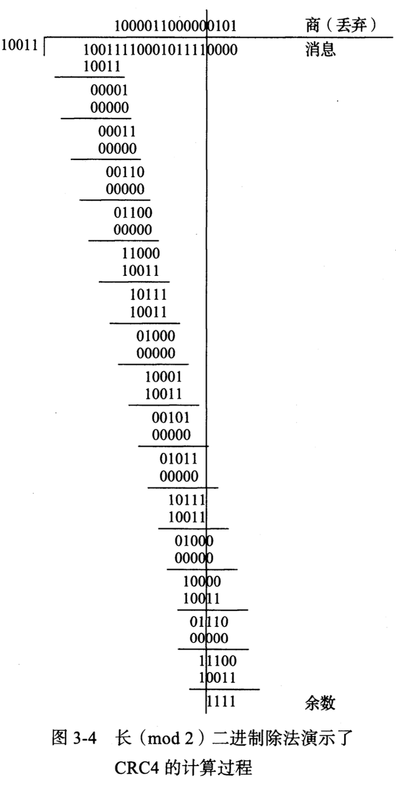

# 链路层

​		其他章中我们知道 TCP/IP 协议族中设计链路层的目的是为 IP 模块发送和接收 IP 数据报。

## 以太网和802局域网

### 以太网帧格式

​		所有的以太网(802.3)帧都基于一个共同的格式。在原有规范的基础上,帧格式已被改进以支持额外功能。下图显示了当前的以太网帧格式,以及它与IEEE提出的一个相对新的术语IEEE分组(一个在其他标准中经常使用的术语)的关系。

1. **前导**、**SFD**字段：接收器电路用它确定一个帧的到达时间，并确定编码位(称为**时钟恢复**)之间的时间量。
           由于以太网是一个异步的局域网(即每个以太网接日卡中不保持精确的时钟同步)，从一个接口到另一个接口的编码位之间的间隔可能不同。前导是一个公认的模式(典型值为 0xAA)，在发现**帧起始分隔符(SFD)**时，接收器使用它“恢复时钟”。 SFD 的固定值为 0xAB。
2. **目的地址(DST)、源地址(SRC)**: 各 6 字节，有时候也称为：“MAC 地址”、 “链路层地址”、 “802地址”、 “硬件地址”或“物理地址”。
3. **帧类型**或**长度**：在多数情况下用于确定后面的数据类型。TCP/IP网络场景值包括：**IPV4(0x0800)**、**IPv6(0x86DD)**、**ARP(0x0806)**。0x8100 表示一个 Q 标签帧(可携带一个 “虚拟局域网” 或 802.1q 其中的 VLANID)。一个以太网帧的基本大小是 1518 字节，但最近的标准改为 2000 字节。所以：如果 **类型/长度字段** 的值大于或等于 `0x0600`（1536），那么该字段表示 **类型**。如果值小于 `0x0600`，则表示该字段为 **数据长度**。
4. 数据（**有效载荷**）。。。1500字节(MTU)
5. **帧校验序列/循环冗余校验(CRC)**：4字节（32位），校验流程：发送端将数据（包括帧头、源MAC地址、目的MAC地址、数据部分等）作为一长串比特流，通过与生成多项式的除法运算，得到一个 32 位的余数值。这个余数值就是 CRC 校验值（FCS）。接收端同样会根据相同的算法对收到的帧进行 CRC 计算，得到一个余数。如果余数是零，则说明数据在传输过程中没有发生错误；否则，接收端会丢弃该帧并请求重新传输。
   

### 帧大小

​	以太网帧有最小和最大尺寸：

- **最小帧**：64 字节，其中有效载荷最小为 48 字节，如果不够会填充 0；

