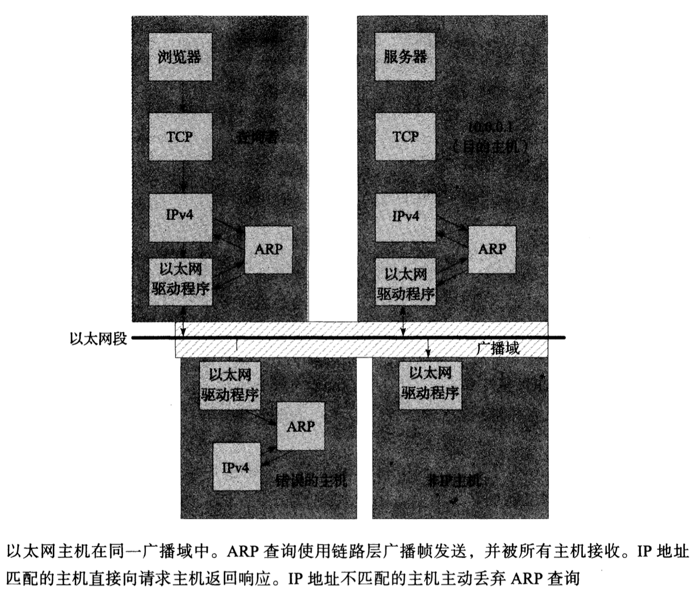
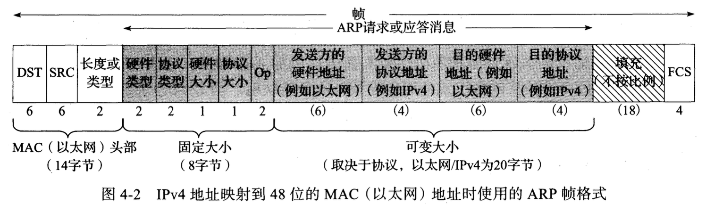

# ARP地址解析协议

## 为什么需要 ARP？

**1. 网络通信的困境**

​		在一个网络中，IP 地址是用于标识设备的逻辑地址，但它并不能直接在硬件上通信。因为硬件实际上依赖的是 MAC 地址（物理地址），而 MAC 地址是硬件制造时赋予的固定值。

问题来了：

- 一个主机知道对方的 IP 地址，却不知道对方的 MAC 地址时，如何发起通信？
- 如果需要手动配置 IP 和 MAC 地址的对应关系，这对规模较大的网络几乎是不可能的。

**2. ARP 的提出**

​		为了解决这个问题，ARP（地址解析协议）应运而生。它的目标是**动态解析 IP 地址到 MAC 地址的映射**，让设备可以“问一问”网络，找到目标设备的硬件地址，进而发起通信。

​		简而言之，ARP 是网络设备之间的“导航员”。

**3. ARP 的意义**

​		通过 ARP 的动态解析机制，网络设备可以无缝通信，无需人为干预或手动配置。这种简单却强大的协议让网络变得“自动化”，同时支持大规模扩展。


## 一个例子

​		当用户通过 Web 浏览器访问一个网站（如 http://10.0.0.1）时，主机需要判断目标服务器位于本地网络还是远程网络：

​	•	如果是**本地网络**，需要直接发送数据包给目标主机；

​	•	如果是**远程网络**，数据包会被发送到网关或路由器再转发。

​		本例假设 10.0.0.1 位于本地网络，目标地址包含一个 IPv4 地址，而非域名或主机名。

**直接交付的关键步骤**

​	1. **URL 解析和 IP 地址确认**：

- 浏览器调用操作系统解析 URL，发现 http://10.0.0.1 包含一个 IPv4 地址，而非域名。
- 确认目标地址（10.0.0.1）属于本地网络，无需经过路由器转发。

​	2.	**发起 TCP 连接**：

- 浏览器向操作系统发起请求，尝试通过 TCP 建立连接。
- TCP 封装数据包后，将目标地址交由网络层处理。

​	3.	**判断目标的 MAC 地址是否已知**：

- 如果主机尚未记录目标 IP 地址对应的 MAC 地址，操作系统触发 ARP 查询。

​	4.	**发送 ARP 请求（广播）**：

​	主机生成一个 ARP 请求消息：

- 内容：包含目标的 IPv4 地址（10.0.0.1），询问其对应的 MAC 地址。

​	ARP 请求以广播的形式发送到本地网络，所有设备均可接收。

​	5.	**目标主机响应 ARP 请求**：

- 目标主机（10.0.0.1）接收到广播后，检查请求的 IP 地址是否匹配自身。
- 如果匹配，目标主机发送单播 ARP 响应，提供其 MAC 地址。

​	6.	**记录映射关系**：

- 发起请求的主机接收到 ARP 响应后，将 IP 地址与 MAC 地址的映射关系缓存到本地 ARP 表中。

​	7.	**发送数据包到目标主机**：

- 主机利用 ARP 表中记录的 MAC 地址，将封装好的数据包直接发送到目标主机。

- 数据包通过以太网驱动程序传输，目标主机接收并处理。

**ARP 的工作机制**

​	1. **ARP 请求的广播**：

- ARP 使用链路层广播的方式，将请求消息发送到所有网络设备。
- 消息内容包括目标主机的 IP 地址（如 10.0.0.1）以及询问其对应的 MAC 地址。

​	2. **ARP 响应的单播**：

- 目标主机收到请求后，发送 ARP 响应消息，包含自己的 MAC 地址。
- 该响应是单播消息，仅发回请求方。

​	3. **地址映射的缓存**：

- 主机将目标 IP 地址和 MAC 地址的映射关系缓存到 ARP 表中，以便后续直接使用。



**注意事项**

​	1. **非本地主机的处理**：

- 如果目标地址不在同一子网，数据包会发送到路由器，ARP 在此时不会被触发。

​	2. **NBMA 环境中的问题**：

- 非广播多路访问网络（NBMA）可能需要复杂的映射协议支持（如 RFC2332 中描述）。

​	3. **动态过期机制**：

- 缓存的 ARP 表项有过期时间，确保网络变化时能够及时更新。


##  **ARP 帧格式**

### **ARP 帧结构概述**



​	1.	**帧的整体结构**：

​	图 4-2 展示了以太网中 ARP 请求和应答消息的典型帧格式。

​	ARP 帧分为两部分：

- **以太网头部**（14 字节）：包含源地址（SRC）、目标地址（DST）及帧类型字段。
- **ARP 消息**（28 字节，或变长）：由 ARP 协议定义的固定字段和动态字段组成，用于封装具体的地址解析信息。

​	2.	**目的**：

- 通过 ARP 帧，将目标的 IPv4 地址映射到 48 位的以太网 MAC 地址。
- 在局域网中，ARP 消息通过广播发送请求，并通过单播返回响应。


### **帧结构字段详解**

| **字段名称**        | **字节数** | **作用**                                                     |
| ------------------- | ---------- | :----------------------------------------------------------- |
| **DST**（目的地址） | 6          | 在以太网头部中表示目的 MAC 地址。**ARP 请求中为广播地址（全 1）。** |
| **SRC**（源地址）   | 6          | 在以太网头部中表示发送端的 MAC 地址。                        |
| **长度/类型**       | 2          | 在以太网头部中标识帧的类型（ARP 的值为 0x0806）。            |
| **硬件类型**        | 2          | 表示硬件地址类型，例如以太网为 1。                           |
| **协议类型**        | 2          | 表示协议类型，例如 IPv4 的值为 0x0800。                      |
| **硬件地址长度**    | 1          | 指定硬件地址的长度（以太网为 6 字节）。                      |
| **协议地址长度**    | 1          | 指定协议地址的长度（IPv4 为 4 字节）。                       |
| **操作字段（Op）**  | 2          | 指定操作类型：1 表示 ARP 请求，2 表示 ARP 应答，3表示RARP请求，表示RARP应答 |
| **发送方硬件地址**  | 6          | 发送端的 MAC 地址，用于表示源硬件地址。                      |
| **发送方协议地址**  | 4          | 发送端的 IP 地址，用于表示源协议地址。                       |
| **目标硬件地址**    | 6          | 目标的 MAC 地址，ARP 请求中填全 0 或 1。                     |
| **目标协议地址**    | 4          | 目标的 IP 地址，用于标识需要解析的 IP 地址。                 |

------

​		当一个系统接收到一个 ARP 请求。它填充自己的硬件地址，将网个发送方地址和两个接收方地址互换。将 Op 字段设为 2 或者 4。然后发送生成的应答。

### 注意事项

​	1.	**重复信息**：

​	•	以太网头部和 ARP 消息中都包含源和目标硬件地址，虽然看似冗余，但确保了地址映射的正确性。

​	2.	**请求与应答的关系**：

​	•	ARP 请求通过广播发送，所有设备接收；

​	•	目标设备接收后，单播返回应答消息。

​	3.	**动态字段**：

​	•	硬件地址和协议地址长度字段支持不同地址类型的动态适配，但在以太网中通常固定为 6 和 4 字节。


### （重要）例子

好的！我将问题和回答整理成清晰的笔记格式，方便你记录和复习。

---

#### **问题：**
执行 `telnet 10.0.0.99` 时，如果 `10.0.0.99` 是一个未知IP地址，是否会触发ARP请求？

---

#### **回答：**

##### **1. 是否触发ARP请求的条件**
- **触发ARP请求的情况：**
  1. `10.0.0.99` 是本地网络中的IP地址（与你的设备在同一子网内）。
  2. 本地ARP缓存中没有 `10.0.0.99` 的MAC地址。
- **不触发ARP请求的情况：**
  1. `10.0.0.99` 是远程网络中的IP地址（与你的设备不在同一子网内），数据包会直接发送到默认网关。
  2. 本地ARP缓存中已经有 `10.0.0.99` 的MAC地址。

---

##### **2. 具体过程**
1. **检查子网：**
   - 设备首先检查 `10.0.0.99` 是否在同一子网内。
   - 如果在同一子网内，继续下一步；如果不在，数据包发送到默认网关。

2. **检查ARP缓存：**
   - 设备检查本地ARP缓存，看是否有 `10.0.0.99` 的MAC地址。
   - 如果有，直接使用缓存中的MAC地址；如果没有，触发ARP请求。

3. **发送ARP请求：**
   - 设备发送ARP广播请求，询问：“谁有 `10.0.0.99`？请告诉我你的MAC地址。”
   - 如果没有设备响应（因为 `10.0.0.99` 不存在），ARP请求会超时。

4. **Telnet连接结果：**
   - 如果ARP请求成功，设备获取到 `10.0.0.99` 的MAC地址，继续建立Telnet连接。
   - 如果ARP请求超时，Telnet连接失败。

---

##### **3. 总结**
- **本地网络中的未知IP地址：**
  - 会触发ARP请求。
  - 如果IP地址不存在，ARP请求超时，Telnet连接失败。
- **远程网络中的IP地址：**
  - 不会触发ARP请求，数据包发送到默认网关。
- **ARP缓存的作用：**
  - 如果ARP缓存中有目标IP的MAC地址，直接使用缓存，不触发ARP请求。

---

#### **要点：**
| **条件**                        | **是否触发ARP请求** | **结果**                            |
| ------------------------------- | ------------------- | ----------------------------------- |
| `10.0.0.99` 是本地IP，ARP缓存无 | 是                  | 发送ARP请求，等待响应               |
| `10.0.0.99` 是本地IP，ARP缓存有 | 否                  | 直接使用缓存中的MAC地址             |
| `10.0.0.99` 是远程IP            | 否                  | 数据包发送到默认网关，不触发ARP请求 |
| `10.0.0.99` 不存在              | 是（本地IP）        | ARP请求超时，Telnet连接失败         |


## **免费ARP（Gratuitous ARP）**

### **1. 免费ARP的定义**

免费ARP是指设备主动发送一个ARP请求，但请求中的**目标IP地址**和**源IP地址**都是设备自己的IP地址。它的目的是通知网络中的其他设备：“我的IP地址和MAC地址已经更新或确认，请更新你们的ARP缓存。”

---

#### **2. 免费ARP的帧结构**
免费ARP的帧结构与普通ARP请求类似，但有以下特殊之处：
- **操作码（Operation）**：1（表示ARP请求）。
- **源IP地址（Sender IP Address）**：设备自己的IP地址。
- **源MAC地址（Sender MAC Address）**：设备自己的MAC地址。
- **目标IP地址（Target IP Address）**：设备自己的IP地址。
- **目标MAC地址（Target MAC Address）**：通常为 `00:00:00:00:00:00` 或 `ff:ff:ff:ff:ff:ff`（广播地址）。

---

#### **3. 免费ARP的作用**
免费ARP主要用于以下场景：

##### **(1) IP地址冲突检测**
- 当设备配置了一个新的IP地址时，它会发送一个免费ARP请求。
- 如果网络中已经有其他设备使用了相同的IP地址，该设备会回复一个ARP响应。
- 发送方收到响应后，可以检测到IP地址冲突，并采取相应措施（如重新配置IP地址）。

##### **(2) 更新ARP缓存**
- 当设备的MAC地址发生变化（例如更换网卡）或IP地址发生变化时，它会发送免费ARP。
- 网络中的其他设备收到免费ARP后，会更新自己的ARP缓存，确保后续通信使用正确的MAC地址。

##### **(3) 高可用性切换**
- 在高可用性（HA）场景中，当主设备故障，备用设备接管时，备用设备会发送免费ARP。
- 通知网络中的其他设备：“现在这个IP地址由我（备用设备）负责，请更新ARP缓存。”

---

#### **4. 免费ARP的抓包示例**
使用Wireshark抓取免费ARP包时，可以看到以下特征：
- **ARP请求**：操作码为 `1`。
- **源IP地址**和**目标IP地址**相同。
- **目标MAC地址**为 `00:00:00:00:00:00` 或 `ff:ff:ff:ff:ff:ff`。

示例：
```
Sender MAC: 00:11:22:33:44:55
Sender IP: 192.168.1.100
Target MAC: 00:00:00:00:00:00
Target IP: 192.168.1.100
```

---

#### **5. 免费ARP的实际应用**
##### **在Linux中发送免费ARP**
可以使用 `arping` 命令发送免费ARP：
```bash
arping -U -I eth0 192.168.1.100
```
- `-U`：表示发送免费ARP。
- `-I eth0`：指定网络接口。
- `192.168.1.100`：设备的IP地址。

##### **在Windows中发送免费ARP**
Windows没有直接发送免费ARP的命令，但可以通过以下方式触发：
1. 禁用并重新启用网络接口。
2. 使用工具（如Nmap）发送免费ARP。

---

#### **总结**
- **免费ARP**是一种特殊的ARP请求，用于IP地址冲突检测、更新ARP缓存和高可用性切换。
- 它的帧结构与普通ARP请求类似，但源IP地址和目标IP地址相同。
- 免费ARP是网络通信中非常重要的一种机制，确保设备能够正确更新和同步ARP缓存。

希望这个整理对你有帮助！如果需要进一步补充或修改，请告诉我！


