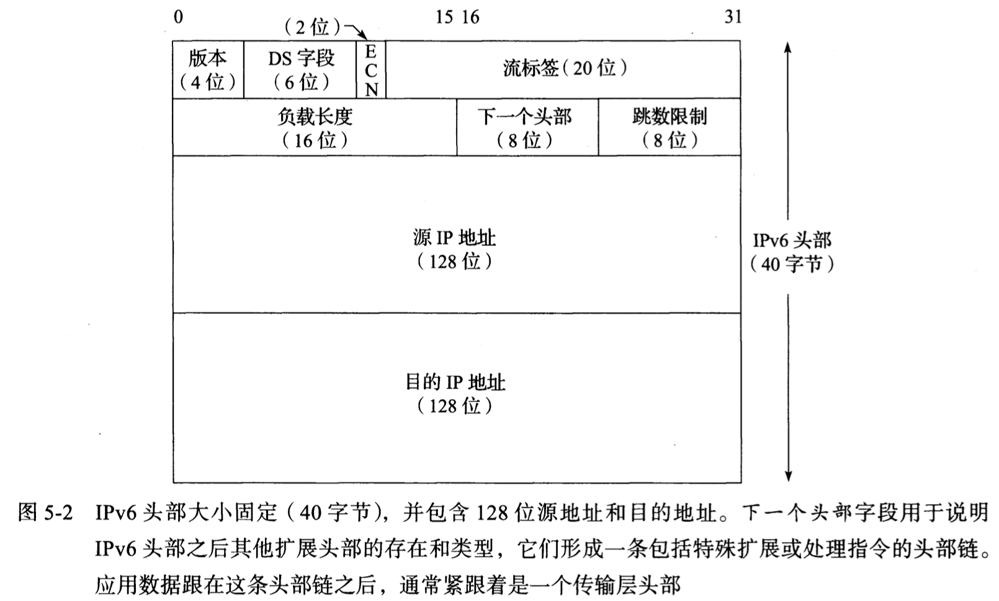

# Internet 协议

### IPv4与IPv6核心特性及头部结构

------

#### **IP协议核心特性**

1. **尽力而为（Best Effort）**：
   - 不保证数据报成功到达目的地。
   - 路由器可能因缓冲区不足丢弃数据报（优先丢弃最新到达的）。
   - **可靠性需由上层协议（如TCP）提供**。
2. **无连接（Connectionless）**：
   - 每个数据报独立处理，不维护链路状态信息。
   - 可能导致数据报乱序、重复或内容错误，需上层协议处理。

------

#### **IPv4数据报头部**




### IPv4与IPv6头部字段详解

------

#### **IPv4头部字段**

1. **版本（Version，4位）**：
   - 标识IP版本（IPv4为4，IPv6为6）。
   - **唯一相同字段位置**：IPv4和IPv6头部中版本字段的位置一致，但其他字段完全不同。
2. **IHL（Internet头部长度，4位）**：
   - 以32位字为单位表示IPv4头部长度（最大15字 → 60字节）。
   - **默认值**：5（对应20字节，无选项时）。
   - **限制**：选项字段因长度限制（最大40字节）几乎不再使用（如“记录路由”功能受限）。
3. **服务类型（ToS）/ DS字段 + ECN（8位）**：
   - **历史演变**：最初为ToS字段，后分为：
     - **DS字段（6位）**：区分服务（QoS优先级）。
     - **ECN（2位）**：显式拥塞通知（用于流量控制）。
   - **适用性**：IPv4和IPv6共用此设计（RFC 2474/3168/3260）。
4. **总长度（Total Length，16位）**：
   - IPv4数据报总长度（含头部，最大65,535字节）。
   - **作用**：避免低层协议填充导致数据混淆（如以太网最小帧填充）。
   - **分片处理**：分片后每个分片的总长度字段反映分片大小。
5. **标识（Identification，16位）**：
   - 唯一标识发送方的数据报，用于分片重组。
   - **生成方式**：发送方每次发送数据报时递增计数器。
6. **生存时间（TTL，8位）**：
   - 初始值建议为64（或128/255），每经路由器减1，归零时丢弃并发送ICMP错误。
   - **演变**：最初表示生存秒数，现仅统计跳数。IPv6中改名为“跳数限制”。
7. **协议（Protocol，8位）**：
   - 标识上层协议类型（如TCP=6，UDP=17）。
   - **多路分解**：支持IP封装多种协议（如IPv4-in-IPv4，值为4）。
8. **头部校验和（Header Checksum，16位）**：
   - **仅校验头部**，不保护数据内容。
   - **IPv6取消此字段**，依赖上层协议校验（如TCP/UDP的校验和）。
9. **源/目的IP地址（32位 × 2）**：
   - 标识发送方和接收方的接口地址（组播/广播地址例外）。

------

#### **IPv6头部字段**

1. **版本（Version，4位）**：固定为6。
2. **流量类别（Traffic Class，8位）**：类似IPv4的DS字段（QoS）。
3. **流标签（Flow Label，20位）**：标记同一数据流（优化实时传输）。
4. **负载长度（Payload Length，16位）**：
   - 数据部分长度（不含IPv6头部，包含扩展头部）。
   - **限制**：最大64KB（可通过“超长数据报”选项扩展至4GB）。
5. **下一个头部（Next Header，8位）**：
   - 指示后续头部类型（如TCP/UDP或扩展头部链）。
   - **功能扩展**：类似IPv4的协议字段，但支持链式扩展头部（如分片、路由、IPsec）。
6. **跳数限制（Hop Limit，8位）**：同IPv4的TTL。
7. **源/目的IP地址（128位 × 2）**：支持海量地址空间（约3.4×10³⁸个地址）。

------

#### **关键差异对比**

| **特性**     | **IPv4**               | **IPv6**                                  |
| :----------- | :--------------------- | :---------------------------------------- |
| **头部长度** | 可变（20-60字节）      | 固定40字节，扩展头部链式处理              |
| **校验和**   | 包含头部校验和         | 取消，依赖上层协议校验                    |
| **分片机制** | 路由器和发送方均可分片 | 仅发送方负责分片（路由器丢弃超MTU数据报） |
| **地址长度** | 32位（依赖NAT）        | 128位（直接端到端通信）                   |
| **特殊字段** | 选项字段（受限）       | 流标签、扩展头部链（灵活功能扩展）        |
| **安全性**   | 无原生支持             | 原生支持IPsec（通过扩展头部）             |

------

#### **特殊注意事项**

1. **字节序（Endianness）**：
   - IP头部使用**网络字节序（高位优先）**，主机需在发送/接收时转换（如PC使用低位优先）。
2. **IPv4选项字段的局限性**：
   - 最大40字节，但因兼容性和处理效率问题，实际极少使用。
3. **IPv6扩展头部链**：
   - 按需加载扩展功能（如路由、分片、IPsec），提升处理效率。
4. **数据报大小限制**：
   - **IPv4**：主机需支持≥576字节（UDP常用512字节规避限制）。
   - **IPv6**：最小链路MTU为1280字节，支持超长数据报（理论4GB）。

------

#### **示例应用场景**

- **IPv4分片**：DNS查询（UDP+512字节数据）需避免分片以提升效率。
- **IPv6流标签**：视频流服务通过流标签优化实时传输质量（QoS）。
- **IPv6扩展头部**：IPsec加密通过扩展头部链实现端到端安全。


---

### DS字段与ECN机制详解

---

#### **背景与演变**

1. **原始ToS字段（IPv4）与流量类别字段（IPv6）(旧实现)**：

   

   - **结构**（见图5-4）：
     - **优先级（3位）**：定义数据报优先级（000-111，优先级递增）。
     - **D/T/R子字段（各1位）**：分别表示低延时（D）、高吞吐量（T）、高可靠性（R）。

   

   - **优先级名称**（表5-1）：
     - 例如：`111`表示“网络控制”（最高优先级），`000`表示“常规”流量。
   - **应用场景**：源于军事通信系统（如AUTOVON电话系统），后被VoIP等实时通信沿用。

2. **DS 字段与 ECN 的引入（现代实现）**：

   - **DS字段（6位）**：取代ToS的优先级和D/T/R子字段，支持区分服务（DiffServ）。
   - **ECN（2位）**：显式拥塞通知，用于标记网络拥塞。

---

#### **DS字段的核心机制**
1. **DSCP（区分服务代码点）**：
   
   
   
   - **定义**：6位值，用于指示路由器对数据报的转发行为（PHB，每跳行为）。
   
   - **分类**（表5-2）：
     
     
   
2. **常见DSCP值**（表5-3）：
   
   
   
   - **类别选择器（CS）**：兼容原始优先级字段，如：
     - `CS0`（000000）：常规尽力而为流量。
     - `CS7`（111000）：网络控制流量（最高优先级）。
   - **保证转发（AF）**：
     - 格式：`AFij`（i=类别，j=丢弃优先级，如`AF32`表示类别3、丢弃优先级2）。
     - **应用**：确保不同类别的流量独立转发，高丢弃优先级数据优先被丢弃。
   - **加速转发（EF）**：
     - **DSCP值**：101110（RFC3246）。
     - **特点**：低延时、低抖动，适用于实时流量（如VoIP）。
   - **容量许可流量（VOICE-ADMIT）**：
     - **DSCP值**：101100（RFC5865），用于需要带宽预留的语音流量。

---

#### **ECN（显式拥塞通知）**
1. **功能**：
   - **拥塞标记**：当路由器检测到持续拥塞时，设置ECN位。
   - **反馈机制**：接收方（如TCP）通过ACK通知发送方降低发送速率，避免丢包。
2. **优势**：在路由器缓冲区溢出前主动缓解拥塞，提升网络效率。

---

#### **差异化服务的实际应用**
1. **典型场景**：
   - **实时流量**（EF）：视频会议、VoIP（低延时优先）。
   - **关键业务流量**（AF）：企业ERP系统（保证转发，避免丢弃）。
   - **控制流量**（CS7）：路由协议数据（最高优先级）。
2. **配置参考**：
   - [RFC4594] 提供差异化服务的部署指南。
3. **挑战**：
   - **公平性问题**：高优先级流量可能挤占普通资源。
   - **经济模型**：服务等级与定价挂钩（如ISP按QoS收费）。

---

#### **关键对比：ToS vs DS/ECN**
| **特性**       | **原始ToS字段**             | **DS/ECN字段**                    |
| -------------- | --------------------------- | --------------------------------- |
| **优先级定义** | 8级优先级（3位）            | 64级DSCP（6位） + 拥塞标记（2位） |
| **功能扩展**   | 仅支持简单优先级和D/T/R需求 | 支持复杂QoS策略（如AF、EF）       |
| **兼容性**     | 仅IPv4                      | IPv4和IPv6通用                    |
| **拥塞控制**   | 无                          | 通过ECN主动通知拥塞               |

---

#### **示例：DSCP配置场景**
1. **企业网络**：
   - **语音流量**：标记为EF（101110），确保低延时。
   - **数据库同步**：标记为AF41（100010），保证高可靠性。
   - **普通流量**：标记为CS0（000000），默认尽力而为。
2. **ISP网络**：
   - **控制流量**（BGP/OSPF）：标记为CS6（110000），优先转发。
   - **用户视频流**：标记为AF31（011010），按类别分配带宽。

---

#### **总结**
- **DS字段**：通过DSCP值实现精细化流量分类，支持复杂QoS策略。
- **ECN**：主动拥塞通知机制，优化网络资源利用率。
- **挑战**：需平衡服务质量与公平性，实际部署依赖设备支持和策略配置。


### IPv4 选项与 IPv6 扩展头部的对比

---


#### **IPv4选项的核心特性**

1. **基本结构**：
   - **类型字段（8位）**：包含3个子字段：
     - **复制位（1位）**：指示选项是否复制到分片。
     - **类别（2位）**：定义选项用途（如控制、调试）。
     - **编号（5位）**：标识具体选项类型。
   - **长度可变**：多数选项包含类型、长度、数据三部分（如源路由、记录路由）。

2. **常见选项**（表5-4）：
   | **选项名称**       | **编号** | **用途**                           | **现状**           |
   | ------------------ | -------- | ---------------------------------- | ------------------ |
   | 源路由（Loose）    | 3        | 指定数据报路径（可包含中间路由器） | 极少使用，常被过滤 |
   | 记录路由           | 7        | 记录数据报经过的路由器IP地址       | 诊断用途，极少使用 |
   | 时间戳             | 4        | 记录数据报经过的时间戳             | 诊断用途，极少使用 |
   | 路由器警告         | 20       | 提示路由器需特殊处理数据报内容     | 偶尔使用（如RSVP） |
   | 快速启动（实验性） | 25       | 支持快速传输协议                   | 实验性，极少部署   |

3. **局限性**：
   - **头部空间限制**：IPv4选项最大40字节（IHL字段限制为60字节），难以支持复杂功能。
   - **兼容性问题**：不同路由器对选项支持不一致，导致功能失效。
   - **安全风险**：源路由等选项可能被用于攻击（如IP欺骗），常被防火墙过滤。

---

#### **IPv6的扩展头部设计**
1. **核心改进**：
   - **固定基本头部（40字节）**：去除非必要字段（如校验和），提升处理效率。
   - **链式扩展头部**：通过“下一个头部”字段串联多个扩展头部（如分片、路由、IPsec）。
     - **示例链**：IPv6头部 → 路由扩展 → 分片扩展 → TCP头部 → 数据。

2. **常见扩展头部类型**：
   
   | **扩展头部** | **功能**                             | **对应IPv4选项**   |
   | ------------ | ------------------------------------ | ------------------ |
   | 分片扩展     | 管理数据报分片与重组                 | IPv4分片字段       |
   | 路由扩展     | 指定严格/松散源路由路径              | IPv4源路由选项     |
   | 逐跳选项扩展 | 携带需逐跳处理的指令（如路由器警告） | IPv4路由器警告选项 |
   | IPsec扩展    | 支持端到端加密与认证                 | IPv4无原生支持     |
   
3. **优势**：
   - **灵活性**：按需添加扩展头部，避免头部臃肿。
   - **安全性**：IPsec成为原生支持功能（通过扩展头部）。
   - **效率**：路由器仅处理必要扩展头部，其余由终端主机解析。

---

#### **关键对比：IPv4选项 vs IPv6扩展头部**
| **对比项**   | **IPv4选项**                       | **IPv6扩展头部**                      |
| ------------ | ---------------------------------- | ------------------------------------- |
| **设计目标** | 单一头部内嵌入附加功能             | 通过链式扩展头部实现模块化功能        |
| **处理效率** | 路由器需解析复杂选项，降低转发速度 | 路由器仅处理逐跳选项，其他由终端处理  |
| **安全性**   | 选项易被滥用（如源路由）           | 通过IPsec扩展实现端到端安全           |
| **实际应用** | 多数选项因兼容性/安全问题被弃用    | 扩展头部广泛用于分片、路由、QoS等功能 |

---

#### **典型场景分析**
1. **IPv4源路由的困境**：
   - **问题**：指定路径可能导致环路或恶意路由，被防火墙广泛过滤。
   - **IPv6替代**：通过路由扩展头部实现更安全的路径控制。

2. **IPv6分片扩展的优势**：
   - **发送方分片**：仅发送方负责分片，路由器不参与，避免MTU不一致问题。
   - **示例**：发送端根据路径MTU提前分片，减少中间路由器的处理负担。

3. **IPsec的集成**：
   - **IPv4局限**：需额外配置（如VPN隧道）。
   - **IPv6原生支持**：通过扩展头部直接封装加密/认证信息，简化部署。

---

#### **总结**
- **IPv4选项**：早期尝试通过单一头部实现多功能，但因空间限制和安全问题逐渐被淘汰。
- **IPv6扩展头部**：采用链式模块化设计，兼顾灵活性、效率和安全性，成为现代网络的核心特性。


---

### **IP转发机制详解**

---

#### **1. IP转发的基本概念**
- **定义**：IP转发是路由器或主机根据目的IP地址决定如何传输数据报的过程。
- **核心场景**：
  - **直接交付**：目的主机与发送方在同一网络（如以太网、Wi-Fi），无需路由器。
  - **间接交付**：目的主机在远程网络，需通过默认路由器转发。

---

#### **2. 主机与路由器的区别**
| **角色**   | **行为**                                             |
| ---------- | ---------------------------------------------------- |
| **主机**   | 仅处理自己生成或接收的数据报，不转发其他流量。       |
| **路由器** | 转发所有接收到的非本地数据报，依赖转发表选择下一跳。 |

---

#### **3. 转发表的组成**
转发表（路由表）通常包含以下字段：
| **字段**   | **描述**                                                     |
| ---------- | ------------------------------------------------------------ |
| **目的地** | 目的IP地址或网络前缀（如`192.168.1.0/24`）。                 |
| **掩码**   | 用于与目的IP进行按位与操作，确定匹配的网络范围（如`255.255.255.0`）。 |
| **下一跳** | 数据报应转发到的下一路由器或主机的IP地址。                   |
| **接口**   | 发送数据报的物理或逻辑接口（如`eth0`、`wlan0`）。            |

---

#### **4. IP转发流程**
1. **接收数据报**：IP层检查目的IP地址。
2. **本地处理判断**：
   - 若目的IP为本机地址、广播或组播地址，交付上层协议（如TCP/UDP）。
   - 否则，执行转发逻辑。
3. **查找转发表**：使用**最长前缀匹配算法**选择最优路由。
4. **转发或丢弃**：
   - 匹配成功：将数据报发送至下一跳地址。
   - 匹配失败：丢弃数据报，可能发送ICMP“主机不可达”错误。

---

#### **5. 最长前缀匹配算法**
- **步骤**：
  1. **按位与操作**：目的IP地址与每条路由条目的掩码进行按位与运算。
  2. **匹配比较**：结果与路由条目的“目的地”字段比较，筛选出所有匹配条目。
  3. **选择最优路由**：优先选择掩码中1的位数最多的条目（即最长前缀）。
- **示例**：
  - 目的IP：`192.168.1.100`
  - 路由条目1：`192.168.1.0/24`（掩码`255.255.255.0`，24位1）
  - 路由条目2：`192.168.0.0/16`（掩码`255.255.0.0`，16位1）
  - **选择**：条目1（更长的前缀匹配）。

---

#### **6. 多宿主与负载均衡**
- **多宿主场景**：设备连接多个ISP或网关，转发表中存在多条默认路由。
- **处理方式**：
  - **简单策略**：选择第一个匹配条目。
  - **高级策略**：负载均衡（按流量比例分配）或故障切换（备用路由）。
  - **实际应用**：家庭多WAN路由器、企业网络冗余。

---

#### **7. 错误处理**
- **无法交付**：
  - **主机**：向应用程序返回错误（如“Host Unreachable”）。
  - **路由器**：发送ICMP错误消息（类型3，代码1）至源IP地址。
- **常见原因**：路由表缺失条目、网络隔离、防火墙拦截。

---

#### **8. 实际应用案例**
1. **家庭网络**：
   - 路由器通过默认网关（ISP提供）转发Internet流量。
   - 本地设备（如打印机）通过直接交付通信。
2. **企业网络**：
   - 使用动态路由协议（如OSPF、BGP）维护复杂转发表。
   - 多宿主连接实现冗余和负载均衡。
3. **云环境**：
   - 虚拟路由器通过SDN（软件定义网络）动态调整转发表。

---

#### **9. IPv4与IPv6的差异**
| **特性**       | **IPv4**                       | **IPv6**                       |
| -------------- | ------------------------------ | ------------------------------ |
| **地址长度**   | 32位                           | 128位                          |
| **默认路由**   | `0.0.0.0/0`                    | `::/0`                         |
| **ICMP错误**   | ICMPv4                         | ICMPv6                         |
| **转发表字段** | 相同逻辑，但地址字段长度不同。 | 相同逻辑，但地址字段长度不同。 |

---

#### **总结**
IP转发是互联网数据传输的核心机制，依赖转发表和最长前缀匹配算法实现高效路由。理解其流程与关键组件（如掩码、下一跳）对网络配置和故障排查至关重要。多宿主和负载均衡进一步提升了网络的可靠性和性能。


### **IP转发中的直接交付与间接交付详解**

---

#### **1. 直接交付**
- **定义**：源主机与目的主机位于同一子网（LAN），无需路由器转发。
- **流程**：
  1. **IP层检查**：源主机检查目的IP地址是否属于本地子网。
  2. **ARP查询**：若目的MAC地址未知，通过ARP协议获取目的主机的MAC地址。
  3. **链路层封装**：IP数据报封装在以太网帧中，目标MAC地址为本地主机。
  4. **交换机转发**：交换机根据MAC地址表直接交付数据报。
- **示例**：
  - 主机S（IP: `10.0.0.100`）发送数据报到主机D（IP: `10.0.0.9`）。
  - 转发表匹配本地子网条目（`10.0.0.0/25`），直接通过以太网帧发送。

---


#### **2. 间接交付**

- **定义**：源主机与目的主机位于不同网络，需通过路由器逐跳转发。
- **流程**：
  1. **默认路由匹配**：源主机无本地子网匹配时，使用默认路由（如`0.0.0.0/0`）。
  2. **下一跳寻址**：数据报发送至默认网关（路由器），链路层地址更新为路由器的MAC地址。
  3. **路由器逐跳处理**：每台路由器根据转发表选择下一跳，直至到达目的网络。
  4. **NAT处理（可选）**：若涉及私有地址，路由器进行源IP转换（如`10.0.0.100` → `70.231.132.85`）。
- **示例**：
  - 主机S（IP: `10.0.0.100`）发送数据报到公网服务器`ftp.uu.net`（IP: `192.48.96.9`）。
  - 数据报经路由器R1（NAT转换）→ R2（ISP网关）→ ... → 最终到达目的服务器。

---

#### **关键对比**
| **特性**       | **直接交付**                 | **间接交付**                         |
| -------------- | ---------------------------- | ------------------------------------ |
| **网络范围**   | 同一子网（LAN）              | 跨子网（WAN/Internet）               |
| **路由器参与** | 无需路由器                   | 需多台路由器逐跳转发                 |
| **链路层地址** | 目的主机的MAC地址            | 下一跳路由器的MAC地址                |
| **IP地址变化** | 源和目的IP地址保持不变       | 源IP可能因NAT转换改变（目的IP不变）  |
| **典型工具**   | ARP（IPv4）/邻居请求（IPv6） | Traceroute、NAT、动态路由协议（BGP） |

---

#### **IPv4与IPv6的特殊处理**
1. **IPv4**：
   - **ARP协议**：解析IP地址到MAC地址。
   - **NAT**：解决私有地址与公网地址的转换问题。
2. **IPv6**：
   - **邻居发现协议（NDP）**：替代ARP，通过ICMPv6消息解析链路层地址。
   - **链路本地地址**：格式为`fe80::/10`，需指定接口范围ID（如`%6`）以确保正确路由。
   - **无NAT需求**：IPv6地址充足，但NAT64仍用于IPv4/IPv6过渡场景。

---

#### **工具与调试**
1. **Traceroute**：
   - **原理**：发送TTL递增的UDP/ICMP数据报，记录每跳的ICMP超时消息。
   - **用途**：诊断网络路径、检测路由环路或拥塞点。
   - **示例**：
     ```bash
     traceroute -n ftp.uu.net
     ```
     输出显示数据报经过的路由器IP地址及往返时间（RTT）。

2. **MPLS（多协议标签交换）**：
   - **功能**：通过标签（Label）优化流量路径，支持流量工程（Traffic Engineering）。
   - **示例**：`MPLS Label=32307`表示数据报在标签号为32307的路径上传输。

---

#### **总结**
- **直接交付**是局域网内高效通信的基础，依赖链路层地址解析。
- **间接交付**通过路由器和转发表实现跨网络通信，可能涉及NAT和复杂路由策略。
- **IPv6**在地址解析和本地通信机制上有所改进，减少对NAT的依赖。
- **工具**如Traceroute和MPLS帮助诊断和优化网络路径。


