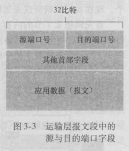
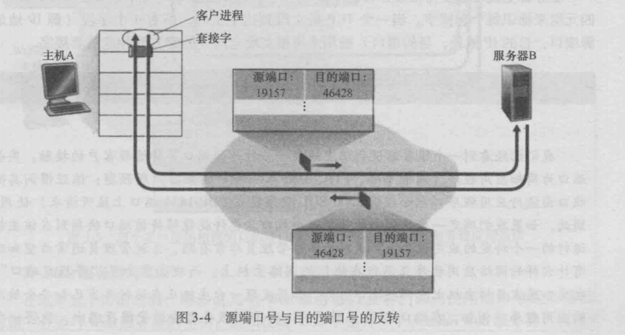
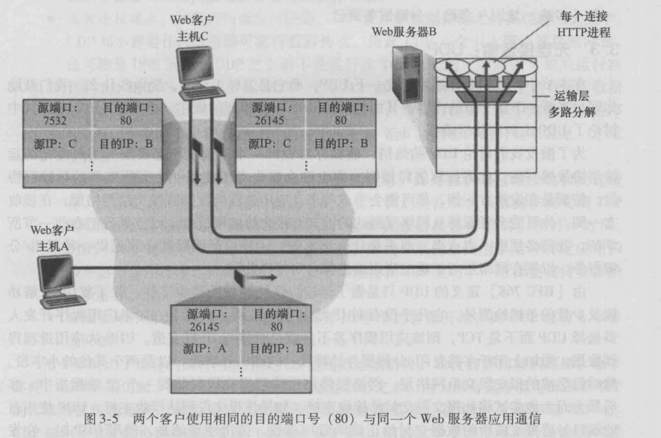

#### 多路复用与多路分解

​		在本节中，我们讨论运输层的多路复用与多路分解，也就是将由网络层提供的<u>主机到主机交付服务</u>延伸到为<u>运行在主机上的应用程序提供进程到进程的交付服务</u>。为了使讨论 具体起见，我们将在因特网环境中讨论这种基本的运输层服务。然而，需要强调的是，多路复用与多路分解服务是所有计算机网络都需要的。

​		在目的主机，运输层从紧邻其下的网络层接收报文段。运输层负责将这些报文段中的数据交付给在主机上运行的适当应用程序进程。我们来看一个例子。假定你正坐在计算机前下载Web页面，同时还在运行一个FTP会话和两个Telnet会话。这样你就有4个网络应用进程在运行，即两个Telnet进程，一个FTP进程和一个HTTP进程。当你的计算机中的运输层从底层的网络层接收数据时，它需要将所接收到的数据定向到这4个进程中的一 个。现在我们来研究这是怎样完成的。

​		首先回想2. 7节的内容，一个进程（作为网络应用的一部分）有一个或多个**套接字（socket）**,它相当于从网络向进程传递数据和从进程向网络传递数据的门户。因此，如 图3-2所示，在接收主机中的运输层实际上并没有直接将数据交付给进程，而是将数据交给了一个中间的套接字。由于在任一时刻，在接收主机上可能有不止一个套接字，所以每个套接字都有唯一的标识符。标识符的格式取决于它是UDP还是TCP套接字，我们将很快对它们进行讨论。


​	现在我们考虑接收主机怎样将一个到达的运输层报文段定向到适当的套接字。为此目的，每个运输层报文段中具有几个字段。在接收端，运输层检査这些字段，标识出接收套接字，进而将报文段定向到该套接字。将运输层报文段中的数据交付到正确的套接字的工作称为**多路分解（demultiplexing)**。在源主机从不同套接字中收集数据块，并为每个数据块封装上首部信息（这将在以后用于分解）从而生成报文段，然后将报文段传递到网络层，所有这些工作称为**多路复用（multiplexing)**。

​		值得注意的是，图3-2中的中间那台主机的运输层必须将从其下的网络层收到的报文段分解后交给其上的P1或P2进程；这一过程是通过将到达的报文段数据定向到对应进程的套接字来完成的。中间主机中的运输层也必须收集从这些套接字输出的数据，形成运输层报文段，然后将其向下传递给网络层。尽管我们在因特网运输层协议的环境下引人了多路复用和多路分解，认识到下列事实是重要 的：它们与在某层（在运输层或别处）的单一协议何时被位于接下来的较高层的多个协议使用有关。

​		为了说明分解的工作过程，可以再以前面一节的家庭进行类比。每一个孩子通过他们 的名字来标识。

<u>			当Bill从邮递员处收到一批信件，并通过査看收信人名字而将信件亲手交付给他的兄弟姐妹们时，他执行的就是一个分解操作</u>。

<u>			当Ann从兄弟姐妹们那里收集信件并将它们交给邮递员时，她执行的就是一个多路复用操作。</u>

​		既然我们理解了运输层多路复用与多路分解的作用，那就再来看看在主机中它们实际是怎样工作的。通过上述讨论，我们知道运输层多路复用要求：

​	①套接字有唯一标识符； ②每个报文段有特殊字段来指示该报文段所要交付到的套接字。

​		如图3-3所示，

- 这些特殊字段是**源端口号字段（source port number field)**和**目的端口号字段（destination port number field)** 。( UDP 报文段和 TCP 报文段还有其他的一些字段，这些将在本章后继几节中进行讨论。）

- 端口号是一个16比特的数，其大小在0 ~ 65535之 间。0~ 1023范围的端口号称为**周知端口号（well-known port number)**,是受限制的，这是指它们保留给诸如HTTP (它使 用端口号80)和FTP (它使用端口号21)之类的周知应用层协议来使用。周知端口的列表在RFC 1700中给出，同时在http://www.iana. wg上有更新文档[RFC 3232]。当我们开发 一个新的应用程序时（如在2. 7节中开发的一个应用程序），必须为其分配一个端口号。




​		现在应该清楚运输层是怎样能够实现分解服务的了 ：在主机上的每个套接字能够分配 一个端口号，当报文段到达主机时，<u>运输层检查报文段中的目的端口号</u>，<u>并将其定向到相应的套接字</u>。然后报文段中的数据通过套接字进入其所连接的进程。如我们将看到的那样，UDP基本上是这样做的。然而，也将如我们所见，TCP中的多路复用与多路分解更为复杂。

1. ##### 无连接的多路复用与多路分解

2. 7.1节讲过，在主机上运行的Python程序使用下面一行代码创建了一个UDP套接字：

   ```python
   clientSocket * socket(socket.AF_INET, socket.SOCK_DGRAM)
   ```

​        当用这种方式创建一个UDP套接字时，运输层自动地为该套接字分配一个端U号。 特别是，运输层从范围1024 ~65535内分配一个端口号，该端口号是当前未被该主机中任 何其他UDP端口使用的号。另外一种方法是，在创建一个套接字后，我们能够在Python 程序中增加一行代码，通过套接字bind()方法为这个UDP套接字关联一个特定的端口号 (如 19157):

```python
clientSocket.bind(('', 19157))
```

​		如果应用程序开发者所编写的代码实现的是一个“周知协议”的服务器端，那么开发者就必须为其分配一个相应的周知端口号。通常，应用程序的客户端让运输层自动地（并且是透明地）分配端口号，而服务器端则分配一个特定的端口号。

​		通过为UDP套接字分配端口号，我们现在能够精确地描述UDP的复用与分解了。假定在主机A中的一个进程具有UDP端口 19157,它要发送一个应用程序数据块给位于主机B中的另一进程，该进程具有UDP端口 46428。主机A中的运输层创建一个运输层报文段，其中包括应用程序数据、源端口号（19157)、目的端口号（46428)和两个其他值 (将在后面讨论，它对当前的讨论并不重要）。然后，运输层将得到的报文段传递到网络层。

​		网络层将该报文段封装到一个IP数据报中，并尽力而为地将报文段交付给接收主机。 如果该报文段到达接收主机B，接收主机运输层就检查该报文段中的目的端口号（46428) 并将该报文段交付给端口号46428所标识的套接字。值得注意的是，<u>主机B能够运行多个进程，每个进程有自己的UDP套接字及相应的端口号</u>。当从网络到达UDP 报文段时，主机B通过检查该报文段中的目的端口号，将每个报文段定向（分解）到相应的套接字。

​		注意到下述事实是重要的：一个UDP套接字是由一个二元组来全面标识的，该二元组包含一个目的IP地址和一个目的端口号。因此，如果两个UDP报文段有不同的源IP地址和/或源端口号，但具有相同的目的IP地址和目的端口号，那么这两个报文段将通过相同的目的套接字被定向到相同的目的进程。

​		你也许现在想知道，源端口号的用途是什么呢？如图3-4所示，在A到B的报文段中，源端口号用作“返回地址”的一部分，即当B需要回发一个报文段给A时，B到A 的报文段中的目的端口号便从A到B的报文段中的源端口号中取值。（完整的返回地址是 A的IP地址和源端口号。）

​		举一个例子，回想2. 7节学习过的那个UDP服务器程序。在 LIDPServer.py中，服务器使用recvform()方法从其自客户接收到的报文段中提取出客户端 (源）端口号，然后，它将所提取的源端口号作为目的端口号，向客户发送一个新的报文段。




##### 2.而向连接的多路复用与多路分解

​		为了理解TCP分解，我们必须更为仔细地研究TCP套接字和TCP连接创建。TCP套接字和UDP套接字之间的一个细微差别是，TCP套接字是由一个四元组<u>（源IP地址，源端口号，目的IP地址，目的端口号）</u>来标识的。这样，当一个TCP报文段从网络到达一台主机时，该主机使用全部4个值来将报文段定向（分解）到相应的套接字。特别与UDP 不同的是，两个具有不同源IP地址或源端口号的到达TCP报文段将被定向到两个不同的套接字，除非TCP报文段携带了初始创建连接的请求。为了深人地理解这一点，我们再来重新考虑2. 7. 2节中的TCP客户-服务器编程的例子：

- TCP服务器应用程序有一个“welcoming socket”，它在12000号端口上等待来自 TCP客户（见图2-29)的连接建立请求。

- TCP客户使用下面的代码创建一个套接字并发送一个连接建立请求报文段：
  `clientsocket = socket(AF_INET, SOCK_STREAM) `

  `clientSocket.connect((serverName,12000))`

- 一条连接建立请求只不过是一个目的端口号为12000, TCP首部的特定“连接建立位”置位的TCP报文段（在3.5节进行讨论）。这个报文段也包含一个由客户选择的源端口号。

- 当运行服务器进程的计算机的主机操作系统接收到具有目的端口 12000的人连接 请求报文段后，它就定位服务器进程，该进程正在端口号12000等待接受连接。 该服务器进程则创建一个新的套接字：
  `connectionSocket, addr = serverSocket.accept()`

- 该服务器的运输层还注意到连接请求报文段中的下列4个值：

  - ①该报文段中的源端口号；
  - ②源主机IP地址；
  - ③该报文段中的目的端口号；
  - ④自身的IP地址。
  - 新创建的连接套接字通过这4个值来标识。所有后续到达的报文段，如果它们的源端口号、源主机IP地址、目的端口号和目的IP地址都与这4个值匹配，则被分解到这个套接字。随着TCP连接完成，客户和服务器便可相互发送数据了。

​       服务器主机可以支持很多并行的TCP套接字，每个套接字与一个进程相联系，并由其四元组来标识每个套接字。当一个TCP报文段到达主机时，所有4个字段（源IP地址， 源端口，目的IP地址，目的端口）被用来将报文段定向（分解）到相应的套接字。

图3_5图示了这种情况，图中主机C向服务器B发起了两个HTTP会话，主机A向服 务器B发起了一个HTTP会话。主机A与主机C及服务器B都有自己唯一的IP地址，它 们分别是A、C、B。主机C为其两个HTTP连接分配了两个不同的源端口号（26145和 7532)。因为主机A选择源端口号时与主机C互不相干，因此它也可以将源端口号26145 分配给其HTTP连接。但这不是问题，即服务器B仍然能够正确地分解这两个具有相同源端口号的连接，因为这两条连接有不同的源IP地址。



##### 3.Web服务器与TCP

​		在结束这个讨论之前，再多说几句Web服务器以及它们如何使用端口号是有益的。 考虑一台运行Web服务器的主机，例如在端口 80上运行一个Apache Web服务器。当客户(如浏览器）向该服务器发送报文段时，所有报文段的目的端口都将为80。特别是，初始连接建立报文段和承载HTTP请求的报文段都有80的目的端口。如我们刚才描述的那样， 该服务器能够根据源IP地址和源端口号来区分来自不同客户的报文段。

​		图3-5显示了一台Web服务器为每条连接生成一个新进程。如图3-5所示，每个这样的进程都有自己的连接套接字，通过这些套接字可以收到HTTP请求和发送HTTP响应。 然而，我们要提及的是，<u>连接套接字与进程之间并非总是有着一一对应的关系</u>。事实上， 当今的高性能Web服务器通常只使用一个进程，但是为每个新的客户连接创建一个具有新连接套接字的<u>新线程</u>。（线程可被看作是一个轻量级的子进程。）如果做了第2章的第一个编程作业，你所构建的Web服务器就是这样工作的。对于这样一台服务器，在任意给定的时间内都可能有（具有不同标识的）许多连接套接字连接到相同的进程。

​		如果客户与服务器使用持续HTTP,则在整条连接持续期间，客户与服务器之间经由 同一个服务器套接字交换HTTP报文。然而，如果客户与服务器使用非持续HTTP,则对 每一对请求/响应都创建一个新的TCP连接并在随后关闭，因此对每一对请求/响应创建一 个新的套接字并在随后关闭。这种套接字的频繁创建和关闭会严重地影响一个繁忙的Web 服务器的性能（尽管有许多操作系统技巧可用来减轻这个问题的影响）。读者若对与持续 和非持续HTTP有关的操作系统问题感兴趣的话，可参见[Nielsen丨997, Nahum 20〇2]。

​		既然我们已经讨论过了运输层多路复用与多路分解问题，下面我们就继续讨论因特网 运输层协议之一，即UDP。在下一节中，我们将看到UDP无非就是对网络层协议增加了 一点（多路）复用/(多路）分解服务而已。