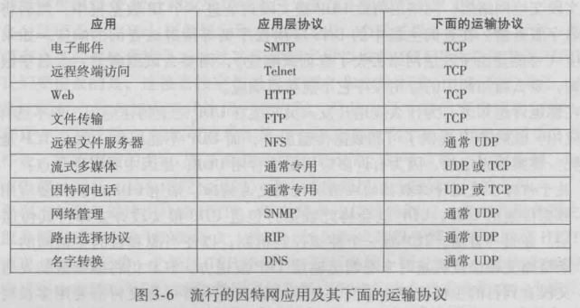
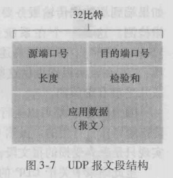

### 无连接运输：UDP

​		在本节中，我们要仔细地研究一下UDP,看它是怎样工作的，能做些什么。我们鼓励 你回过来看一下2.1节的内容，其中包括了 UDP服务模型的概述，再看看2. 7.1节，其中 讨论了UDP上的套接字编程。

​		为了激发我们讨论UDP的热情，假如你对设计一个不提供不必要服务的最简化的运输层协议感兴趣。你将打算怎样做呢？你也许会首先考虑使用一个无所事事的运输层协议。特别是在发送方一侧，你可能会考虑将来自应用进程的数据直接交给网络层；在接收方一侧，你可能会考虑将从网络层到达的报文直接交给应用进程。而正如我们在前一节所学的，我们必须做一点点事，而不是什么都不做！运输层最低限度必须提供一种复用/分解服务，以便在网络层与正确的应用级进程之间传递数据。

​		由[KFC 768]定义的UDP只是做了运输协议能够做的最少工作。除了复用/分解功能及少量的差错检测外，它几乎没有对IP增加别的东西。实际上，如果应用程序开发人员选择UDP而不是TCP,则该应用程序差不多就是直接与IP打交道。UDP从应用进程得到数据，附加上用于多路复用/分解服务的源和目的端口号字段，以及两个其他的小字段， 然后将形成的报文段交给网络层。网络层将该运输层报文段封装到一个IP数据报中，然后尽力而为地尝试将此报文段交付给接收主机。如果该报文段到达接收主机，UDP使用目的端口号将报文段中的数据交付给正确的应用进程。值得注意的是，使用UDP时，在发送报文段之前，发送方和接收方的运输层实体之间没有握手。正因为如此，UDP被称为是无连接的。

​		DNS是一个通常使用UDP的应用层协议的例子。当一台主机中的DNS应用程序想要进行一次查询时，它构造了一个DNS查询报文并将其交给UDP。无须执行任何与运行在目的端系统中的UDP实体之间的握手，主机端的UDP为此报文添加首部字段，然后将形成的报文段交给网络层.网络层将此UDP报文段封装进一个IP数据报中，然后将其发送给一个名字服务器。在査询主机中的DNS应用程序则等待对该查询的响应。如果它没有收到响应（可能是由于底层网络丢失了查询或响应），则要么试图向另一个名字服务器发送该查询，要么通知调用的应用程序它不能获得响应。

​		现在你也许想知道，为什么应用开发人员宁愿在UDP之上构建应用，而不选择在TCP 上构建应用？既然TCP提供了可靠数据传输服务，而UDP不能提供，那么TCP是否总是首选的呢？答案是否定的，因为有许多应用更适合用UDP,原因主要以下几点：

- **关于何时、发送什么数据的应用层控制更为精细。**采用UDP时，只要应用进程将数据传递给UDP, UDP就会将此数据打包进UDP报文段并立即将其传递给网络层。在另一方面，TCP有一个拥塞控制机制，以便当源和目的主机间的一条或多条链路变得极度拥塞时来遏制运输层TCP发送方。TCP仍将继续重新发送数据报文段直到目的主机收到此报文并加以确认，而不管可靠交付需要用多长时间。因为实时应用通常要求最小的发送速率，不希望过分地延迟报文段的传送，且能容忍一些数据丢失，TCP服务模型并不是特別适合这些应用的需要。如后面所讨论的，这些应用可以使用UDP,并作为应用的一部分来实现所需的、超出UDP的不提供不必要的报文段交付服务之外的额外功能。
- **无需连接建立。**如我们后面所讨论的，TCP在开始数据传输之前要经过三次握手。 UDP却不需要任何准备即可进行数据传输。因此UDP不会引入建立连接的时延。 这可能是DNS运行在UDP之上而不是运行在TCP之上的主要原因（如果运行在 TCP上，则DINS会慢得多）。HTTP使用TCP而不是UDP，因为对于具有文本数据的Web网页来说，可靠性是至关重要的。但是，如我们在2. 2节中简要讨论的那 样，HTTP中的TCP连接建立时延对于与下载Web文档相关的时延来说是一个重要因素。
- **无连接状态。**TCP需要在端系统中维护连接状态。此连接状态包括接收和发送缓存、拥塞控制参数以及序号与确认号的参数。我们将在3. 5节看到，要实现TCP 的可靠数据传输服务并提供拥塞控制，这些状态信息是必要的。在另一方面， UDP不维护连接状态，也不跟踪这些参数。因此，某些专门用于某种特定应用的服务器当应用程序运行在UDP之上而不是运行在TCP上时，一般都能支持更多的活跃客户。
- **分组首部开销小。**每个TCP报文段都有20字节的首部开销，而UDP仅有8字节的开销。

​       图3-6列出了流行的因特网应用及其所使用的运输协议。如我们所期望的那样，电子 邮件、远程终端访问、Web及文件传输都运行在TCP之上。因为所有这些应用都需要TCP 的可靠数据传输服务。无论如何，有很多重要的应用是运行在UDP上而不是TCP上。 UDP被用于RIP路由选择表的更新（参见4. 6.1节）。因为这些更新被周期性地发送（通常每5分钟一次），更新的丢失能被最近的更新所替代，因此丢包、过期的更新是无用的。 UDP也用于承载网络管理数据（SNMP，参见第9章）。在这种场合下，UDP要优于TCP， 因为网络管理应用程序通常必须在该网络处于重压状态时运行，而正是在这个时候可靠的、拥塞受控的数据传输难以实现。此外，如我们前面所述，DNS运行在UDP之上，从而避免了 TCP的连接创建时延。

​		如图3-6所示，UDP和TCP现在都用于多媒体应用，如因特网电话、实时视频会议、 流式存储音频与视频。我们将在第7章仔细学习这些应用。我们刚说过，既然所有这些应用都能容忍少量的分组丢失，因此可靠数据传输对于这些应用的成功并不是至关重要的。 此外，TCP的拥塞控制会导致如因特网电话、视频会议之类的实时应用性能变得很差。由于这些原因，多媒体应用开发人员通常将这些应用运行在UDP之上而不是TCP之上。然 而，TCP被越来越多地应用于流式多媒体传输中。例如，[SripanidkulChai2004]发现大约 75%的按需和实况流式多媒体使用了 TCP。当分组丢包率低时，并且为了安全原因，某些机构阻塞UDP流量（参见第8章），对于流式媒体传输来说，TCP变得越来越有吸引 力了。

​		虽然目前通常这样做，但在UDP之上运行多媒体应用是有争议的。如我们前面所 述，UDP没有拥塞控制。但是，需要拥塞控制来预防网络进入一种拥塞状态，此时只能做很少的有用工作。如果每个人都启动流式高比特率视频而不使用任何拥塞控制的话， 就会使路由器中有大量的分组溢出，以至于几乎没有UDP分组能成功地通过源到目的的路径传输。况且，由无控制的UDP发送方引人的高丢包率将引起TCP发送方（如我们将看到的那样，TCP遇到拥塞将减小它们的发送速率）大大地减小它们的速率。因此，UDP中缺乏拥塞控制能够导致UDP发送方和接收方之间的高丢包率，并挤垮了 TCP 会话，这是一个潜在的严重问题[Floydl999]。很多研究人员已提出了一些新机制，以促使所有的数据源（包括UDP源）执行自适应的拥塞控制[Mahdavi 1997; Floyd 2000; Kohler 2006； RFC 4340 ]。

​		在讨论UDP报文段结构之前，我们要提一下，使用UDP的应用是可以实现可靠数据传输的。这可通过在应用程序自身中建立可靠性机制来完成（例如，可通过增加确认与重传机制来实现，如采用我们将在下一节学习的一些机制）。但这并不是无足轻重的任务， 它会使应用开发人员长时间地忙于调试。无论如何，将可靠性直接构建于应用程序中可以 使其“左右逢源”。也就是说应用进程可以进行可靠通信，而无需受制于由TCP拥塞控制机制而无需受制于传输速率限制。

#### 1 UDP报文段结构

​		UDP报文段结构如图3-7所示，它由RFC768定义。应用层数据占用UDP报文段的数据字段。例如，对于DNS应用，数据字段要么包含一个查询报文，要么包含一个响应报文。对于流式音频应用，音频抽样数据填充到数据字段。UDP首部只有4个字段，每个字段由两个字节组成。如前一节所讨论的，通过端口号可以使目的主机将应用数据交给运行在目的端系统中的相应进程（即执行分解功能）。长度字段指示了在UDP报文段中的字节数（首部加数据）。因为数据字段的长度在一个UDP段中不同于在另一个段中，故需要一个明确的长度。接收方使用检验和来检査在该报文段中是否出现了差错。实际上，计算检验和时，除了UDP报文段以外还包括了 IP首部的一些字段。但是我们忽略这些细节，以便能从整体上看问题。下面我们将讨论检验和的计算。在 5.2节中将描述差错检测的基本原理。长度字段指明了包括首部在内的UDP报文段长度（以字节为单位）。

#### 2 UDP检验和

​		UDP检验和提供了差错检测功能。这就是说，检验和用于确定当UDP报文段从源到达目的地移动时，其中的比特是否发生了改变（例如，由于链路中的噪声干扰或者存储在路由器中时引入问题）。<u>发送方的UDP对报文段中的所有16比特字的和进行反码运算, 求和时遇到的任何溢出都被回卷</u>。得到的结果被放在UDP报文段中的检验和字段。下面 给出一个计算检验和的简单例子。在RFC 1071中可以找到有效实现的细节，还可在 [Stone 1998; Stone 2000]中找到它处理真实数据的性能。举例来说，假定我们有下面3 个16比特的字：

​		注意到最后一次加法有溢出，它要被回卷。反码运算就是将所有的0换成1，所有的 1转换成0。因此，该和0100101011000010的反码运算结果是1011010100111101，这变为了检验和。在接收方，全部的4个16比特字（包括检验和）加在一起。如果该分组中没有引入差错，则显然在接收方处该和将是1111111111111111。如果这些比特之一是0,那么我们就知道该分组中已经出现了差错。

​		你可能想知道为什么UDP首先提供了检验和，就像许多链路层协议（包括流行的以太网协议）也提供了差错检测那样。其原因是由于不能保证源和目的之间的所有链路都提供差错检测；这就是说，<u>也许这些链路中的一条可能使用没有差错检测的协议</u>。此外，即使报文段经链路正确地传输，当报文段存储在某台路由器的内存中时，也可能引入比特差错。在既无法确保逐链路的可靠性，又无法确保内存中的差错检测的情况下， 如果端到端数据传输服务要提供差错检测，UDP就必须在端到端基础上在运输层提供差错检测。这是一个在系统设计中被称颂的**端到端原则（erul-eml principle)**的例子 [Salter 1984]，该原则表述为因为某种功能（在此时为差错检测）必须基于端到端实现：“与在较高级别提供这些功能的代价相比，在较低级别上设置的功能可能是冗余的或几乎没有价值的。”

​		因为假定IP是可以运行在任何第二层协议之上的，运输层提供差错检测作为一种保险措施是非常有用的。虽然UDP提供差错检测，但它对差错恢复无能为力。UDP的某种实现只是丢弃受损的报文段；其他实现是将受损的报文段交给应用程序并给出警告。

​		至此结束了关于UDP的讨论。我们将很快看到TCP为应用提供了可靠数据传输及 UDP所不能提供的其他服务。TCP自然要比UDP复杂得多。然而，在讨论TCP之前，我 们后退一步，先来讨论一下可靠数据传输的基本原理是有用的。