### 可靠数据传输原理

​		在本节中，我们在通常情况下考虑可靠数据传输的问题。因为可靠数据传输的实现问题不仅在运输层出现，也会在链路层以及应用层出现，这时讨论它是恰当的。因此，一般性问题对网络来说更为重要。如果的确要将所有网络中最为重要的“前10个”问题排名 的话，可靠数据传输将是名列榜首的候选者。在下一节中，我们将学习TCP,尤其要说明TCP所采用的许多原理，而这些正是我们打算描述的内容。

​		图3-8图示说明了我们学习可靠数据传输的框架。为上层实体提供的服务抽象是：数据可以通过一条可靠的信道进行传输。借助于可靠信道，传输数据比特就不会受到损坏 (由0变为1,或者相反）或丢失，而且所有数据都是按照其发送顺序进行交付。这恰好就是TCP向调用它的因特网应用所提供的服务模型。

​		实现这种服务抽象是**可靠数据传输协议（reliable data transfer protocol)**的责任。由于可靠数据传输协议的下层协议也许是不可靠的，因此这是一项困难的任务。例如，TCP是在不可靠的（IP）端到端网络层之上实现的可靠数据传输协议。更一般的情况是，两个可靠通信端点的下层可能是由一条物理链路（如在链路级数据传输协议的场合下）组成或是由一个全球互联网络（如在运输级协议的场合下）组成。然而，就我们的目的而言，我们可将较低层直接视为不可靠的点对点信道。

​		在本节中，考虑到底层信道模型越来越复杂，我们将不断地开发一个可靠数据传输协议的发送方和接收方。例如，我们将考虑当底层信道能够损坏比特或丢失整个分组时，需要什么样的协议机制。这里贯穿我们讨论始终的一个假设是分组将以它们发送的次序进行交付，某些分组可能会丢失；这就是说，底层信道将不会对分组重排序。图3-8b图示说明了用于数据传输协议的接口。通过调用**rdt_send()**函数，可以调用数据传输协议的发送方。它将要发送的数据交付给位于接收方的较高层。（这里rdt表示可靠数据传输协议， _send指示rdt的发送端正在被调用。开发任何协议的第一步就是要选择一个好的名字！） 在接收端，当分组从信道的接收端到达时，将调用**rdt_rcv()**。当rdt协议想要向较高层交付数据时，将通过调用delver_data()来完成。后面，我们将使用术语“分组”而不用运输层的“报文段'因为本节研讨的理论适用于一般的计算机网络，而不只是用于因特网运输层，所以这时采用通用术语“分组”也许更为合适。


​		在本节中，我们仅考虑**单向数据传输（unidirectional data transfer)**的情况，即数据传输是从发送端到接收端的。可靠的**双向数据传输（bidirectional data transfer)(即全双工数据传输）**情况从概念上讲不会更难，但解释起来更为单调乏味。虽然我们只考虑单向数据传输，注意到下列事实是重要的，我们的协议也需要在发送端和接收端两个方向上传输分组，如图3-8所示。我们很快会看到，除了交换含有待传送的数据的分组之外，rdt的发送 端和接收端还需往返交换控制分组。rdt的发送端和接收端都要通过调用udt_Send()发送分 组给对方（其中udt表示不可靠数据传输）。

#### 构造可靠数据传输协议

​		我们现在一步步地研究一系列协议，它们一个比一个更为复杂，最后得到一个无错、 可靠的数据传输协议。

##### 1.经完全可靠信道的可靠数据传输：rdt 1.0

​	首先，我们考虑最简单的情况，即底层信道是完全可靠的。我们称该协议为**rdt 1.0**, 该协议本身是简单的。图3-9显示了 rdt 1.0发送方和接收方的**有限状态机（Finite-StateMachine, FSM)**的定义。图3-9a中的FSM定义了<u>发送方</u>的操作，图3-9b中的FSM定义了<u>接收方</u>的操作。

​		注意到下列问题是重要的，发送方和接收方有各自的FSM。图3-9中发送方和接收方的FSM每个都只有一个状态。FSM描述图中的箭头指示了协议从一个状态变迁到另一个状态。（因为图3-9中的每个FSM都只有一个状态，因此变迁必定是从一个状态返回到自身；我们很快将看到更复杂的状态图。）引起变迁的事件显示在表示变迁的 横线上方，事件发生时所采取的动作显示在横线下方。如果对一个事件没有动作，或没有就事件发生而采取了一个动作，我们将在横线上方或下方使用符号A，以分别明确地表示缺少动作或事件。FSM的初始状态用虚线表示。尽管图3-9中的FSM只有一个状态，但马上我们就将看到多状态的FSM,因此标 识每个FSM的初始状态是非常重要的。

​		rdt的发送端只通过rdt_send(data)事件接受来自较高层的数据，产生一个包含该数据的分组（经make_pkt(dala)动作），并将 分组发送到信道中。实际上，rdt_seml(data)事件是由较高层应用的过程调用产生的（例 如，rdl_send ()) 。

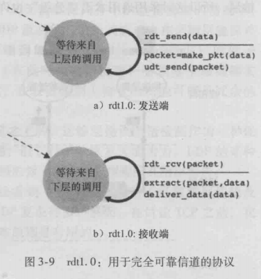

​		在接收端，rdt通过rdt_rcv(packet)事件从底层信道接收一个分组，从分组中取出数据 (经由extract (packet, data )动作），并将数据上传给较髙层（通过deliver_data ( data )动作）。 实际上，rdt_rcv(packet)事件是由较低层协议的过程调用产生的（例如，rdt_rcv())。

​		在这个简单的协议中，一个单元数据与一个分组没差别。而且，所有分组是从发送方流向接收方；有了完全可靠的信道，接收端就不需要提供任何反馈信息给发送方，因为不必担心出现差错！注意到我们也已经假定了接收方接收数据的速率能够与发送方发送数据的速率一样快。因此，接收方没有必要请求发送方慢一点！

##### 2.经具有比特差错信道的可靠数据传输：rdt 2.0

​		底层信道更为实际的模型是分组中的比特可能受损。在分组的传输、传播或缓存的过程中，这种比特差错通常会出现在网络的物理部件中。我们眼下还将继续假定所有发送的分组（虽然有些比特可能受损）将按其发送的顺序被接收。

​		在研发一种经这种信道进行可靠通信的协议之前，首先考虑一下人们会怎样处理这类情形。考虑一下你自己是怎样通过电话口述一条长消息的。在通常情况下，报文接收者在听到、理解并记下每句话后可能会说“OK”。如果报文接收者听到一句含糊不清的话时， 他可能要求你重复刚才那句话。这种口述报文协议使用了**肯定确认（positive acknowledgement) ( “OK”）**(ack)与**否定确认（negative acknowledgment)( “请重复一遍”）**（nak)。这些控制报文使得接收方可以让发送方知道哪些内容被正确接收，哪些内容接收有误并因此需要重复。在计算机网络环境中，基于这样重传机制的可靠数据传输协议称为**自动重传请求（Automatic Repeat request, ARQ)协议**。

​		基本上，ARQ协议中还需要另外三种协议功能来处理存在比特差错的情况：

- **差错检测。**首先，需要一种机制以使接收方检测到何时出现了比特差错。前一节讲到，UDP使用因特网检验和字段正是为了这个目的。在第5章中，我们将更详细地学习差错检测和纠错技术。这些技术使接收方可以检测并可能纠正分组中的比特差错。此刻，我们只需知道这些技术要求有额外的比特（除了待发送的初始数据比特之外的比特）从发送方发送到接收方；这些比特将被汇集在rdt 2.0数据分组的分组检验和字段中。
- **接收方反馈。**因为发送方和接收方通常在不同端系统上执行，可能相隔数千英里， 发送方要了解接收方情况（此时为分组是否被正确接收）的唯一途径就是让接收方提供明确的反馈信息给发送方。在口述报文情况下回答的“肯定确认”（ACK) 和“否定确认”（NAK)就是这种反馈的例子。类似地，我们的rdt 2.0协议将从接收方向发送方回送ACK与NAK分组。理论上，这些分组只需要一个比特长； 如用0表示NAK,用1表示ACK。
- **重传。**接收方收到有差错的分组时，发送方将重传该分组文。


​        图3-10说明了表示rdt 2.0的FSM,该数据传输协议采用了差错检测、肯定确认与否定确认。


​		rdt 2.0的发送端有两个状态。在最左边的状态中，发送端协议正等待来自上层传下来的数据。当产生rdt_send(data)事件时，发送方将产生一个包含待发送数据的分组（sndpkt), 带有检验和（例如，就像在3. 3. 2节讨论的对UDP报文段使用的方法），然后经由udt_ send(sndpkt)操作发送该分组。在最右边的状态中，发送方协议等待来自接收方的ACK或 NAK 分组。如果收到一个 ACK 分组（图 3-10 中符号 rdt_rcv( rcvpkt) && isACK( rcvpkt)对应该事件），则发送方知道最近发送的分组已被正确接收，因此协议返回到等待来自上层的数据的状态。如果收到一个NAK分组，该协议重传最后一个分组并等待接收方为响应重传分组而回送的ACK和NAK。注意到下列事实很重要：当发送方处于等待ACK或NAK 的状态时，它不能从上层获得更多的数据；这就是说，rdt_send()事件不可能出现；仅当接收到ACK并离开该状态时才能发生这样的事件。因此，发送方将不会发送一块新数据， 除非发送方确信接收方已正确接收当前分组。由于这种行为，rdt 2.0这样的协议被称为**停等（stop-and-wait)协议**。

​		rdt 2.0接收方的FSM仍然只有一个状态。当分组到达时，接收方要么回答一个ACK, 要么回答一个NAK,这取决于收到的分组是否受损。在图3-10中，符号rdt_rcv(rcvpkt) && cormpt( rcvpkt)对应于收到一个分组并发现有错的事件。

​		rdt 2.0协议看起来似乎可以运行了，但遗憾的是，它存在一个致命的缺陷。<u>尤其是我们没有考虑到ACK或NAK分组受损的可能性</u>！（在继续研究之前，你应该考虑怎样解决该问题。）遗憾的是，我们细小的疏忽并非像它看起来那么无关紧要。至少，我们需要在 ACK/NAK分组中添加检验和比特以检测这样的差错。更难的问题是协议应该怎样纠正 ACK或NAK分组中的差错。这里的难点在于，如果一个ACK或NAK分组受损，发送方无法知道接收方是否正确接收了上一块发送的数据。

​		考虑处理受损ACK和NAK时的3种可能性：

- 对于第一种可能性，考虑在口述报文情况下人可能的做法。如果说话者不理解来自接收方回答的“0K”或“请重复一遍”，说话者将可能问“你说什么?”（因此 在我们的协议中引人了一种新型发送方到接收方的分组）。接收方则将复述其回答。但是如果说话者的“你说什么？”产生了差错，情况又会怎样呢？接收者不明白那句混淆的话是口述内容的一部分还是一个要求重复上次回答的请求，很可能回一句“你说什么？”。于是，该回答可能含糊不清了。显然，我们走上了一条困难重重之路。
- 第二种可能性是增加足够的检验和比特，使发送方不仅可以检测差错，还可恢复差错。对于会产生差错但不丢失分组的信道，这就可以直接解决问题。
- 第三种方法是，当发送方收到含糊不清的ACK或NAK分组时，只需重传当前数据分组即可。然而，这种方法在发送方到接收方的信道中引人了**冗余分组（dupli-cate packet）**。冗余分组的根本困难在于接收方不知道它上次所发送的ACK或NAK 是否被发送方正确地收到。因此它无法事先知道接收到的分组是新的还是一次重传！

​         解决这个新问题的一个简单方法（几乎所有现有的数据传输协议中，包括TCP,都采用了这种方法）是在数据分组中添加一新字段，让发送方对其数据分组编号，<u>即将发送数据分组的**序号（sequence number)**放在该字段。</u>于是，接收方只需要检查序号即可确定收到的分组是否一次重传。对于停等协议这种简单情况，1比特序号就足够了，因为它可让接收方知道发送方是否正在重传前一个发送分组（接收到的分组序号与最近收到的分组序 号相同），或是一个新分组（序号变化了，用模2运算“前向”移动）。因为目前我们假定信道不丢分组，ACK和NAK分组本身不需要指明它们要确认的分组序号。发送方知道所接收到的ACK和NAK分组（无论是否是含糊不清的）是为响应其最近发送的数据分组而生成的。

​		图3-11和图3-12给出了对rdt 2. 1的FSM描述，这是rdt 2.0的修订版。rdt 2. 1的发 送方和接收方FSM的状态数都是以前的两倍。这是因为协议状态此时必须反映出目前 (由发送方）正发送的分组或（在接收方）希望接收的分组的序号是0还是1。值得注意的是，发送或期望接收〇号分组的状态中的动作与发送或期望接收1号分组的状态中的动作是相似的；唯一的不同是序号处理的方法不同。

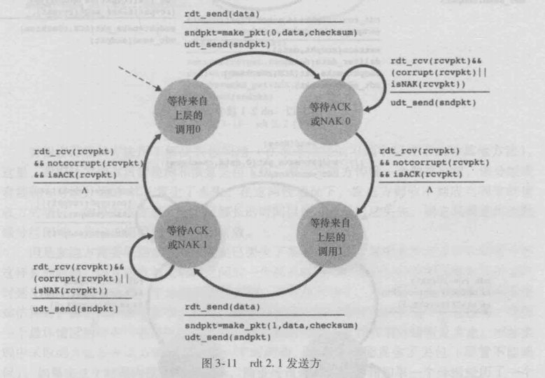

​		协议rdt 2. 1使用了从接收方到发送方的肯定确认和否定确认。当接收到失序的分 时，接收方对所接收的分组发送一个肯定确认。如果收到受损的分组，则接收方将发送一 个否定确认。如果不发送NAK,而是对上次正确接收的分组发送一个ACK，我们也能实现与NAK—样的效果。

​		发送方接收到对同一个分组的两个ACK (即接收冗余ACK (duplicate ACK))后，就知道接收方没有正确接收到跟在被确认两次的分组后面的分组。 rdt 2. 2是在有比特差错信道上实现的一个无NAK的可靠数据传输协议，如图3-13和图3-14 所示。rdt2. 1和rdt2. 2之间的细微变化在于，接收方此时必须包括由一个ACK报文所确认的分组序号（这可以通过在接收方FSM中，在make_pkt()中包括参数ACK0或ACK1 来实现），发送方此时必须检査接收到的ACK报文中被确认的分组序号（这可通过在发送 方FSM中，在isACK()中包括参数0或1来实现）。

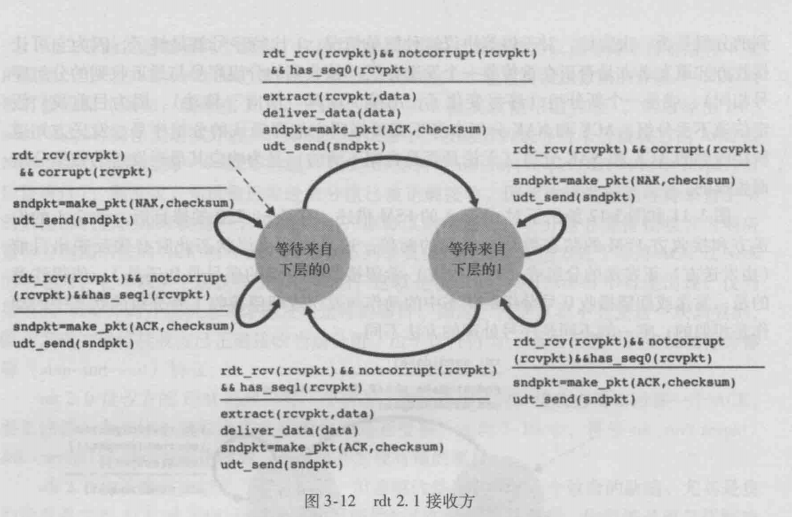


##### 3.经具有比特差错的丢包信道的可靠数据传输：rdt 3.0

​		现在假定除了比特受损外，底层信道还会丢包，这在今天的计算机网络（包括因特网）中并不罕见。协议现在必须处理另外两个关注的问题：怎样检测丢包以及发生丢包后该做些什么。在rdt 2.2中已经研发的技术，如使用检验和、序号、ACK分组和重传等，使我们能给出后一个问题的答案。为解决第一个关注的问题，还需增加一种新的协议机制。

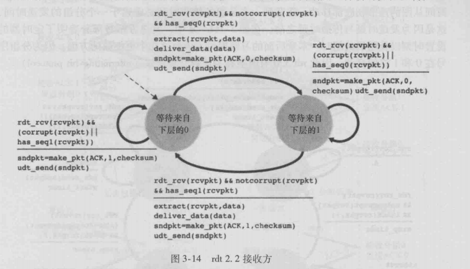

​		有很多可能的方法用于解决丢包问题（在本章结尾的习题中研究了几种其他方法）。这里，我们让发送方负责检测和恢复丢包工作。假定发送方传输一个数据分组，该分组或者接收方对该分组的ACK发生了丢失。在这两种情况下，发送方都收不到应当到来的接收方的响应。如果发送方愿意等待足够长的时间以便确定分组已丢失，则它只需重传该数据分组即可。你应该相信该协议确实有效。

​		但是发送方需要等待多久才能确定已丢失了某些东西呢？很明显发送方至少需要等待这样长的时间：即发送方与接收方之间的一个往返时延（可能会包括在中间路由器的缓冲时延）加上接收方处理一个分组所需的时间。在很多网络中，最坏情况下的最大时延是很难估算的，确定的因素非常少。此外，理想的协议应尽可能快地从丢包中恢复出来；等待 一个最坏情况的时延可能意味着要等待一段较长的时间，直到启动差错恢复为止。因此实践中采取的方法是发送方明智地选择一个时间值，以判定可能发生了丢包（尽管不能确保）。如果在这个时间内没有收到ACK,则重传该分组。注意到如果一个分组经历了一个特别大的时延，发送方可能会重传该分组，即使该数据分组及其ACK都没有丢失。这就在发送方到接收方的信道中引人了**冗余数据分组（duplicate data packet)**的可能性。幸运的是，rdt 2. 2协议已经有足够的功能（即序号）来处理冗余分组情况。

​		从发送方的观点来看，重传是一种万能灵药。发送方不知道是一个数据分组丢失，还是一个ACK丢失，或者只是该分组或ACK过度延时。在所有这些情况下，动作是同样的：重传。为了实现基于时间的重传机制，需要一个**倒计数定时器（countdown timer)**，在一个给定的时间量过期后，可中断发送方。因此，发送方需要能做到：

①每次发送一个分组（包括第一次分组和重传分组）时，便启动一个定时器。

②响应定时器中断（采取适当的动作）。

③终止定时器。

​		图3-15给出了 rdt 3. 0的发送方FSM，这是一个在可能出错和丢包的信道上可靠传输数据的协议；在课后习题中，将请你提供rdt 3.0的接收方FSM。图3-16显示了在没有丢包和延迟分组情况下协议运作的情况，以及它是如何处理数据分组丢失的。在图3-16中， 时间从图的顶部朝底部移动；注意到一个分组的接收时间必定迟于一个分组的发送时间， 这是因为发送时延与传播时延之故。在图3-16b~d中，发送方括号部分表明了定时器的设置时刻以及随后的超时。本章后面的习题探讨了该协议几个更细微的方面。因为分组序号在0和1之间交替，因此rdt 3. 0有时被称为**比特交替协议（alternating-bit protocol)**。

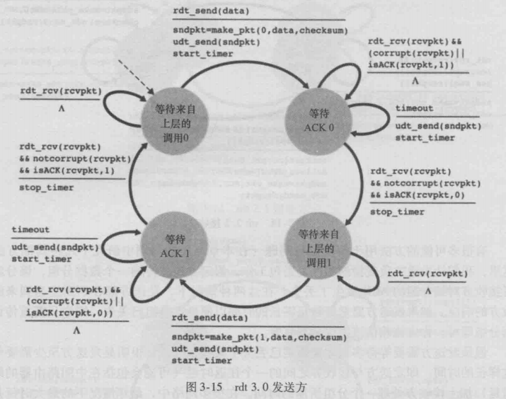

​		现在我们归纳一下数据传输协议的要点。在检验和、序号、定时器、肯定和否定确认 分组这些技术中，每种机制都在协议的运行中起到了必不可少的作用。至此，我们得到了 一个可靠数据传输协议！

#### 流水线可靠数据传输协议

​		rdt 3.0是一个功能正确的协议，但并非人人都对它的性能满意，特别是在今天的高速网络中更是如此。rdt 3. 0性能问题的核心在于它是一个停等协议。

​		为了评价该停等行为对性能的影响，可考虑一种具有两台主机的理想化场合，一台主 机位于美国西海岸，另一台位于美国东海岸，如图3-17所示。在这两个端系统之间的光速往返传播时延RTT大约为30毫秒。假定彼此通过一条发送速率R为1Gbps (每秒10^9比 特）的信道相连。包括首部字段和数据的分组长i为1000字节（8000比特），发送一个分组进入1 Gbps链路实际所需时间是：


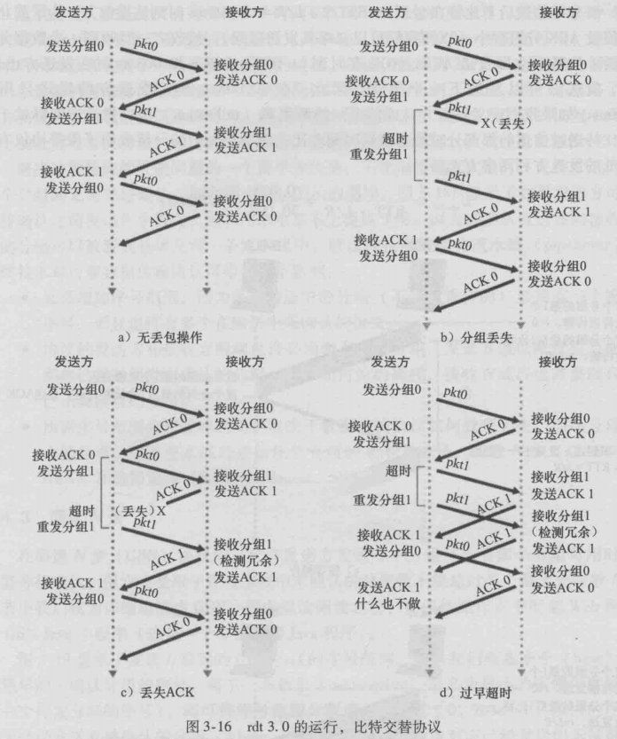


​		图3-18a显示了对于该停等协议，如果发送方在t=0时刻开始发送分组，则在t=L/R=8 us后，最后1比特数据进入了发送端信道。该分组经过15ms的穿越国家的旅途后到达接收端，该分组的最后1比特在时刻t=RTT/2+L/R=15.008ms时到达接收方。为了简化起见， 假设ACK分组很小(以便我们可以忽略其发送时间) ， 接收方一旦收到一个数据分组的最后1比特后立即发送ACK， ACK在时刻t=RTT+L/R=30.008ms时在发送方出现。
此时，发送方可以发送下一个报文。因此，在30.008ms内，发送方的发送只用了0.008ms。如果我们定义发送方(或信道) 的利用率(utilization) 为：发送方实际忙于将发送比特送进信道的那部分时间与发送时间之比，图3-18a中的分析表明了停等协议有着非常低的发送方利用率U sender：

```
U sender=L/R/(RTT+L/R)=0.008/30. 008=0.00027
```

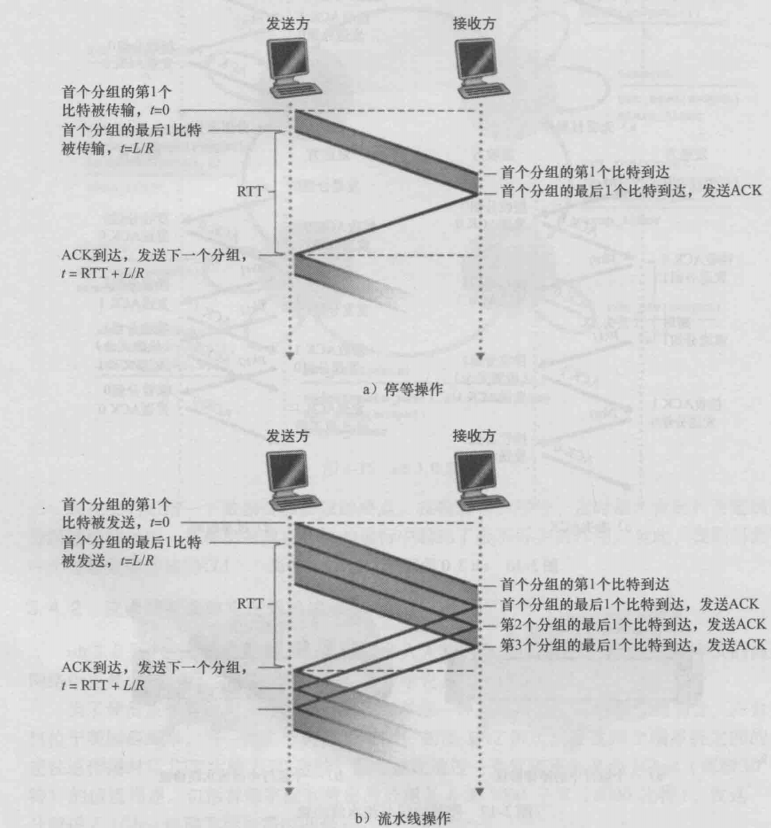

​		这就是说，发送方只有万分之2.7时间是忙的。从其他角度来看，发送方在30.008ms内只能发送1000字节， 有效的吞吐量仅为267kbps， 即使有1Gbps的链路可用!想象一个不幸的网络经理购买了一条千兆比容量的链路， 但他仅能得到267kbps吞吐量的情况!这是一个形象的网络协议限制底层网络硬件所提供的能力的示例。而且，我们还忽略了在发送方和接收方的底层协议处理时间，以及可能出现在发送方与接收方之间的任何中间路由器上的处理与排队时延。考虑到这些因素，将进一步增加时延，使其性能更糟糕。

​		解决这种特殊的性能问题的一个简单方法是：<u>不使用停等方式运行，允许发送方发送多个分组而无需等待确认</u>，如在图3-17b图示的那样。图3-18b显示了如果发送方可以在等待确认之前发送3个报文，其利用率也基本上提高3倍。因为许多从发送方向接收方输送的分组可以被看成是填充到一条流水线中， 故这种技术被称为**流水线(pipelining)** 。流水线技术对可靠数据传输协议可带来如下影响：

- 必须增加序号范围，因为每个输送中的分组(不计算重传的)必须有一个唯一的序号，而且也许有多个在输送中未确认的报文。
- 协议的发送方和接收方两端也许必须缓存多个分组。发送方最低限度应当能缓冲那些已发送但没有确认的分组。如下面讨论的那样，接收方或许也需要缓存那些已正确接收的分组。
- 所需序号范围和对缓冲的要求取决于数据传输协议如何处理丢失、损坏及延时过大的分组。解决流水线的差错恢复有两种基本方法是：**回退N步(Go-Back-N，GBN)** 和**选择重传(Selective Repeat， SR)** 。
  


#### 回退N步

​		在**回退N步(GBN) 协议**中， 允许发送方发送多个分组(当有多个分组可用时) 而不需等待确认，但它也受限于在流水线中未确认的分组数不能超过某个最大允许数N。在本节中我们较为详细地描述GBN。但在继续阅读之前， 建议你操作本书配套Web网站上的GBN Java小程序(这是一个非常好的Java程序) 。

​		图3-19显示了发送方看到的GBN协议的序号范围。如果我们将<u>基序号(base)</u> 定义为最早的未确认分组的序号， 将<u>下一个序号(next seqnum)</u> 定义为最小的未使用序号(即下一个待发分组的序号) ， 则可将序号范围分割成4段。在[0， base-1] 段内的序号对应于已经发送并被确认的分组。[base， nextseqnum-1] 段内对应已经发送但未被确认的分组。[nextseqnum， base+N-1] 段内的序号能用于那些要被立即发送的分组， 如果有数据来自上层的话。最后， 大于或等于base+N的序号是不能使用的， 直到当前流水线中未被确认的分组(特别是序号为base的分组) 已得到确认为止。


​		如图3-19所提示的那样，那些已被发送但还未被确认的分组的许可序号范围可以被看成是一个在序号范围内长度为N的窗口。随着协议的运行，该窗口在序号空间向前滑动。因此， N常被称为**窗口长度(window size)** ， GBN协议也常被称为**滑动窗口协议(sliding-window protocol)** 。你也许想知道， 我们为什么先要限制这些被发送的、未被确认的分组的数目为N呢?为什么不允许这些分组为无限制的数目呢?我们将在3.5节看到，流量控制是对发送方施加限制的原因之一。我们将在3.7节学习TCP拥塞控制时分析另一个原因。

​		在实践中，一个分组的序号承载在分组首部的一个固定长度的字段中。如果分组序号字段的比特数是k，则该序号范围是[0，2^k-1]。在一个有限的序号范围内，所有涉及序号的运算必须使用模2“运算。(即序号空间可被看作是一个长度为2^k的环，其中序号2^k-1紧接着序号0。) 前面讲过， rdt 3.0有一个1比特的序号， 序号范围是[0， 1] 。在本章末的几道习题中探讨了一个有限的序号范围所产生的结果。我们将在3.5节看到，TCP有一个32比特的序号字段， 其中的TCP序号是按字节流中的字节进行计数的， 而不是按分组计数。

​		图3-20和图3-21给出了一个基于ACK、无NAK的GBN协议的发送方和接收方这两端的扩展FSM描述。我们称该FSM描述为扩展FSM， 是因为我们已经增加了变量(类似于编程语言中的变量) base和nextseqnum， 还增加了对这些变量的操作以及与这些变量有关的条件动作。注意到该扩展的FSM规约现在变得有点像编程语言规约。[Boch man1984] 对FSM扩展技术提供了一个很好的综述， 也提供了用于定义协议的其他基于编程语言的技术。

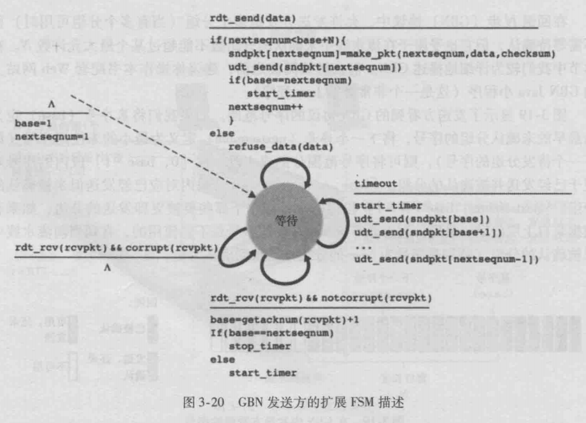

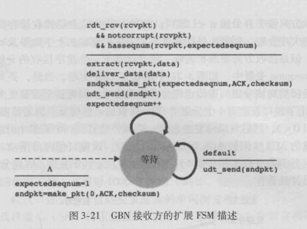

GBN发送方必须响应的三种类型事件：

- **上层的调用。**当上层调用rdt_send() 时， 发送方首先检查发送窗口是否已满， 即是否有N个已发送但未被确认的分组。如果窗口未满，则产生一个分组并将其发送，并相应地更新变量。如果窗口已满，发送方只需将数据返回给上层，隐式地指示上层该窗口已满。然后上层可能会过一会儿再试。在实际实现中，发送方更可能缓存(并不立刻发送)这些数据，或者使用同步机制(如一个信号量或标志)允许上层在仅当窗口不满时才调用rdt_send() 。
- **收到一个ACK。**在GBN协议中， 对序号为n的分组的确认采取**累积确认(cumu-lative acknowledgment)** 的方式， 表明接收方已正确接收到序号为n的以前且包括N在内的所有分组。稍后讨论GBN接收方一端时， 我们将再次研究这个主题。
- **超时事件。**协议的名字“回退Ｎ步”来源于出现丢失和时延过长分组时发送方的行为。就像在停等协议中那样，定时器将再次用于恢复数据或确认分组的丢失。如果出现超时，发送方重传所有已发送但还未被确认过的分组。图3-20中的发送方仅使用一个定时器，它可被当作是最早的已发送但未被确认的分组所使用的定时器。如果收到一个ACK， 但仍有已发送但未被确认的分组， 则定时器被重新启动。如果没有已发送但未被确认的分组，该定时器被终止。

​        在GBN中， 接收方的动作也很简单。如果一个序号为n的分组被正确接收到， 并且按序(即上次交付给上层的数据是序号为n-1的分组)，则接收方为分组n发送一个ACK， 并将该分组中的数据部分交付到上层。在所有其他情况下， 接收方丢弃该分组， 并为最近按序接收的分组重新发送ACK。注意到因为一次交付给上层一个分组， 如果分组k已接收并交付， 则所有序号比k小的分组也已经交付。因此， 使用累积确认是GBN一个自然的选择。

​		在GBN协议中， 接收方丢弃所有失序分组。尽管丢弃一个正确接收(但失序) 的分组有点愚蠢和浪费，但这样做是有理由的。前面讲过，接收方必须按序将数据交付给上层。假定现在期望接收分组n，而分组n+1却到了。因为数据必须按序交付，接收方可能缓存(保存)分组n+1，然后，在它收到并交付分组n后，再将该分组交付到上层。然而， 如果分组n丢失， 则该分组及分组n+1最终将在发送方根据GBN重传规则而被重传。因此，接收方只需丢弃分组n+1即可。这种方法的优点是接收缓存简单，即接收方不需要缓存任何失序分组。因此， 虽然发送方必须维护窗口的上下边界及nextseqnum在该窗口中的位置，但是接收方需要维护的唯一信息就是下一个按序接收的分组的序号。该值保存在expectedseqnum变量中， 如图3-21中接收方FSM所示。当然， 丢弃一个正确接收的分组的缺点是随后对该分组的重传也许会丢失或出错，因此甚至需要更多的重传。

​		图3-22给出了窗口长度为4个分组的GBN协议的运行情况。因为该窗口长度的限制，发送方发送分组0~3，然后在继续发送之前，必须等待直到一个或多个分组被确认。当接收到每一个连续的ACK(例如ACK 0和ACK 1) 时， 该窗口便向前滑动， 发送方便可以发送新的分组(分别是分组4和分组5)。在接收方，分组2丢失，因此分组3、4和5被发现是失序分组并被丢弃。

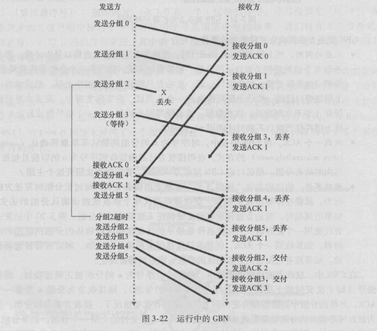

​		在结束对GBN的讨论之前， 需要提请注意的是， 在协议栈中实现该协议可能与图3-20中的扩展FSM有相似的结构。该实现也可能是以各种过程形式出现， 每个过程实现了在响应各种可能出现的事件时要采取的动作。在这种**基于事件的编程(event-based programming)**方式中，这些过程要么被协议栈中的其他过程调用，要么作为一次中断的结果。在发送方， 这些事件包括：

①来自上层实体的调用去调用rdt_send() ； 

②定时器中断；

 ③报文到达时， 来自下层的调用去调用rdt_rcv() 。

​		本章后面的编程作业会使你有机会在一个模拟而真实的网络环境中实际实现这些例程。

​		这里我们注意到,GBN协议中综合了我们将在3.5节中学习TCP可靠数据传输构件时遇到的所有技术。这些技术包括使用序号、累计确认、检验和以及超时/重传操作。

#### 选择重传

​		在图3-17中，GBN协议潜在地允许发送方用多个分组“填充流水线”，因此避免了停等协议中所提到的信道利用率问题。然而，GBN本身也有一些情况存在着性能问题。尤其是当窗口长度和带宽时延积都很大时，在流水线中会有很多分组更是如此。单个分组的差错就能够引起GBN重传大量分组，许多分组根本没有必要重传。随着信道差错率的增加， 流水线可能会被这些不必要重传的分组所充斥。想象一下，在我们口述消息的例子中，如果每次有一个单词含糊不清，其前后1000个单词（例如，窗口长度为1000个单词）不得不被重传的情况。此次口述会由于这些反复述说的单词而变慢。

​		顾名思义，**选择重传（SR)协议**通过让发送方仅重传那些它怀疑在接收方出错（即丢失或受损）的分组而避免了不必要的重传。这种个别的、按需的重传要求接收方逐个地确认正确接收的分组。再次用窗口长度N来限制流水线中未完成、未被确认的分组数。然而，与GBN不同的是，发送方已经收到了对窗口中某些分组的ACK。图3-23显示了 SR 发送方看到的序号空间。图3-24详细描述了SR发送方所采取的动作。

发送方与接收方的序号空间.png)


​		SR接收方将确认一个正确接收的分组而不管其是否按序。失序的分组将被缓存直到所有丟失分组（即序号更小的分组）皆被收到为止，这时才可以将一批分组按序交付给上 层。图3-25详细列出了 SR接收方所采用的各种动作。图3-26给出了一个例子以说明出现丢包时SR的操作。值得注意的是，在图3-26中接收方初始时缓存了分组3、4、5,并 在最终收到分组2时，才将它们一并交付给上层。

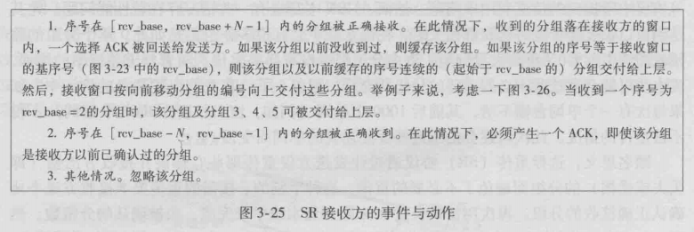

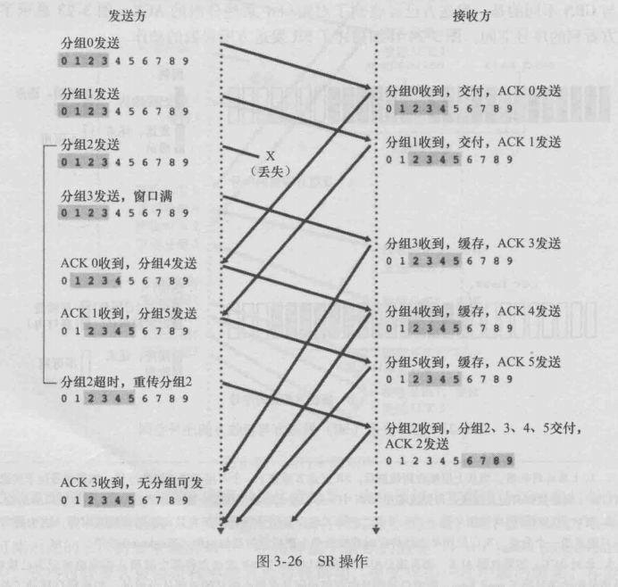

​		注意到图3-25中的第二步很重要，接收方重新确认（而不是忽略）已收到过的那些序号小于当前窗口基序号的分组。你应该理解这种重新确认确实是需要的。例如，给定在图3-23中所示的发送方和接收方的序号空间，如果分组send_base的ACK没有从接收方传播回发送方，则发送方最终将重传分组send_base，即使显然（对我们而不是对发送方来说!）接收方已经收到了该分组。如果接收方不确认该分组，则发送方窗口将永远不能向前滑动！这个例子说明了SR协议（和很多其他协议一样）的一个重要方面。对于哪些分组已经被正确接收，哪些没有，发送方和接收方并不总是能看到相同的结果。对SR协议而言，这就意味着发送方和接收方的窗口并不总是一致。

​		当我们面对有限序号范围的现实时，发送方和接收方窗口间缺乏同步会产生严重的后果。考虑下面例子中可能发生的情况，该例有包括4个分组序号0、1、2、3的有限序范围且窗口长度为3。假定发送了分组0至2,并在接收方被正确接收且确认了。此时， 接收方窗口落在第4、5、6个分组上，其序号分别为3、0、1。现在考虑两种情况。在第一种情况下，如图3-27a所示，对前3个分组的ACK丢失，因此发送方重传这些分组。因此，接收方下一步要接收序号为0的分组，即第一个发送分组的副本。

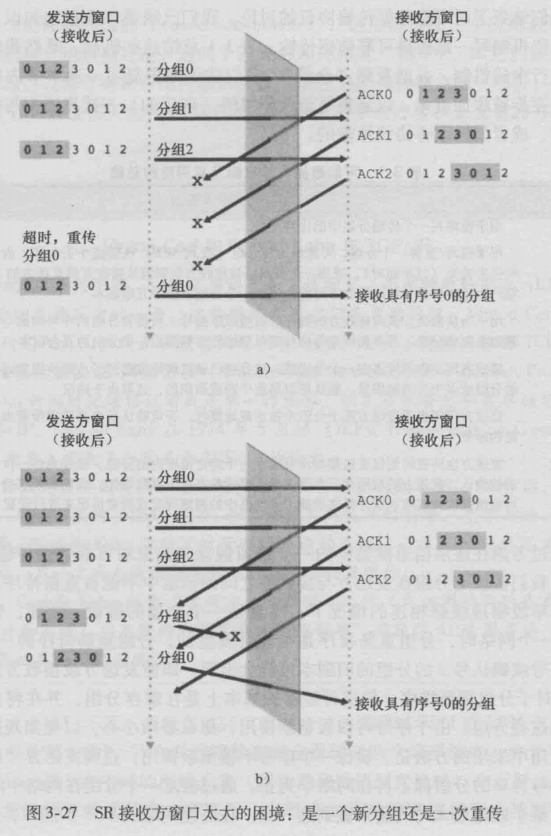

​		在第二种情况下，如图3-27b所示，对前3个分组的ACK都被正确交付。因此发送方向前移动窗口并发送第4、5、6个分组，其序号分别为3、0、1。序号为3的分组丢失， 但序号为0的分组到达（一个包含新数据的分组）。

​		现在考虑一下图3-27中接收方的观点，在发送方和接收方之间有一副假想的帘子， 因为接收方不能“看见”发送方采取的动作。接收方所能观察到的是它从信道中收到的以及它向信道中发出报文序列。就其所关注的而言，图3-27中的两种情况是等同的。没有办法区分是第一个分组的重传还是第5个分组的初次传输。显然，窗口长度比序号空间小1时协议无法工作。但窗口必须多小呢？本章后面的一道习题请你说明为何对于SR协议 而言，窗口长度比须小于或等于序号空间大小的一半。

​		在本书配套的网站上，可以找到一个模仿SR协议运行的Java小程序。尝试进行你以 前对GBN Java小程序所进行的相同的实验。这些结果与你期望的一致吗？

​		至此我们结束了对可靠数据传输协议的讨论。我们已涵盖许多基础知识，并介绍了多 种机制，这些机制可一起提供可靠数据传输。表3-1总结这些机制。既然我们已经学习了 所有这些运行中的机制，并能看到“全景”，我们建议你再复习一遍本节内容，看看这些 机制是怎样逐步被添加进来，以涵盖复杂性渐增的（现实的）连接发送方与接收方的各种信道模型的，或者如何改善协议性能的。 

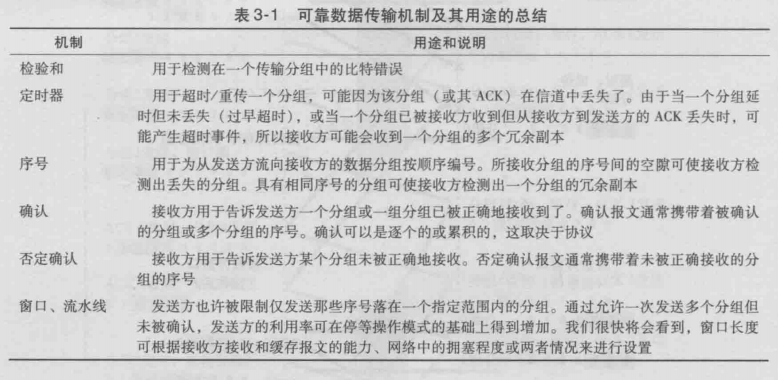

​		我们通过考虑在底层信道模型中的一个遗留假设来结束对可靠数据传输协议的讨论。 前面讲过，我们曾假定分组在发送方与接收方之间的信道中不能被重新排序。这在发送方与接收方由单段物理线路相连的情况下，通常是一个合理的假设。然而，当连接两端的 “信道”是一个网络时，分组重新排序是可能会发生的。分组重新排序的一个表现就是, 一个具有序号或确认号X的分组的旧副本可能会出现，即使发送方或接收方的窗口中都没有包含x。对于分组重新排序，信道可被看成基本上是在缓存分组，并在将来任意时刻自然地释放出这些分组。由于序号可以被重新使用，那么必须小心，以免出现这样的冗余分组。实际应用中采用的方法是，确保一个序号不被重新使用，直到发送方“确信”任何先前发送的序号为x的分组都不再在网络中为止。通过假定一个分组在网络中的“存活”时间不会超过某个固定最大时间量来做到这一点。在高速网络的TCP扩展中，最长的分组寿命被假定为大约3分钟[RFC 1323]。[Sunshine 1978]描述了一种使用序号的方法，它可使重新排序问题完全避免。