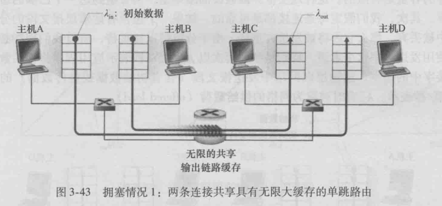
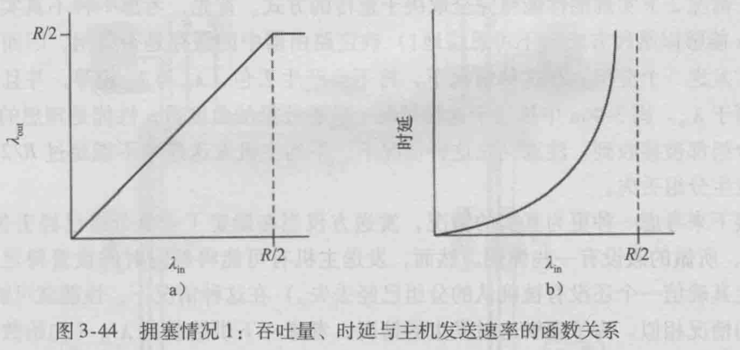
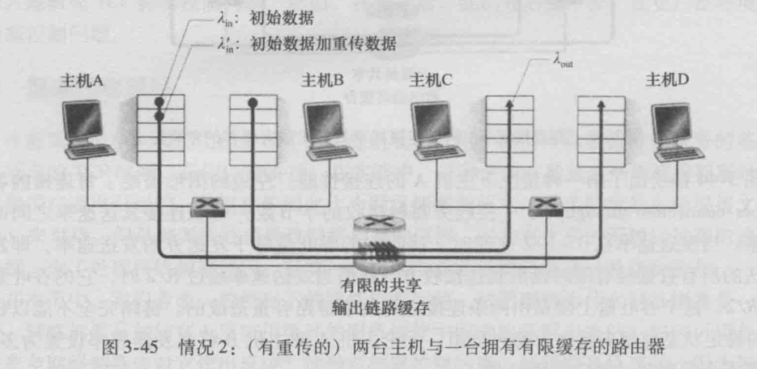
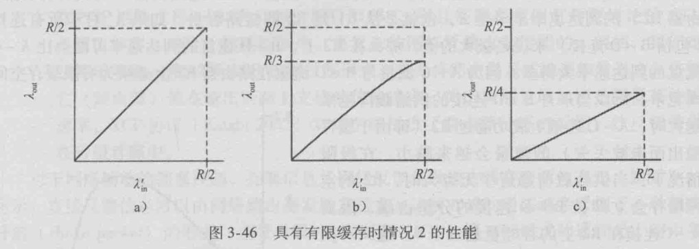
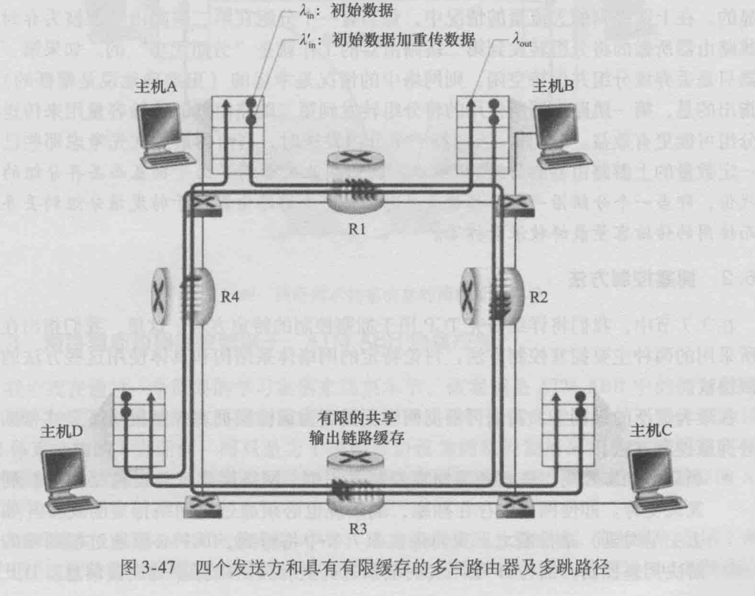
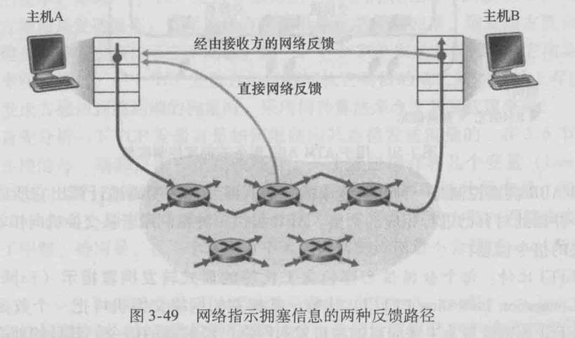
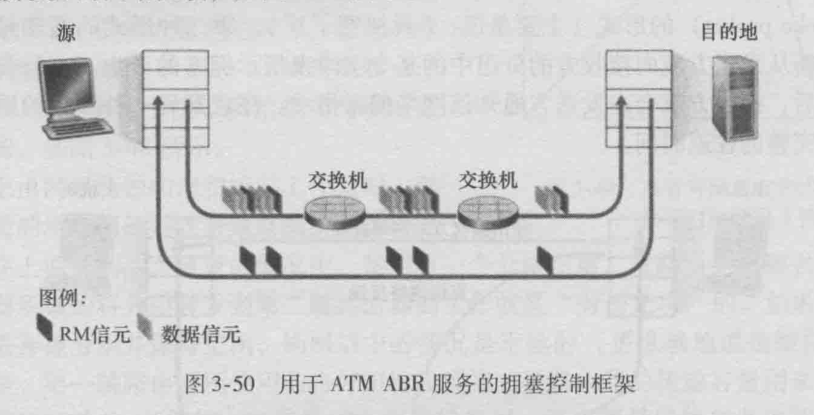

### 拥塞控制原理

​		在前面几节中，我们已经分析了面临分组丢失时用于提供可靠数据传输服务的基本原理及特定的TCP机制。我们以前讲过，在实践中，这种丢包一般是当网络变得拥塞时由于路由器缓存溢出引起的。分组重传因此作为网络拥塞的征兆（某个特定的运输层报文段的丢失）来对待，但是却无法处理导致网络拥塞的原因，因为有太多的源想以过高的速率发送数据。为了处理网络拥塞原因，需要一些机制以在面临网络拥塞时遏制发送方。

​		在本节中，我们考虑一般情况下的拥塞控制问题，试图理解为什么网络拥塞是一件坏事情，网络拥塞是如何在上层应用得到的服务性能中明确地显露出来的？如何可用各种方法来避免网络拥塞或对它作出反应？这种对拥塞控制的更一般研究是恰当的，因为就像可靠数据传输一样，它在组网技术中的前10个基础性重要问题清单中位居前列。我们通过对**异步传递方式（ATM）**网络中**可用比特率（ABR）**服务中的拥塞控制的讨论来总结本节。下面一节包含了 TCP的拥塞控制算法的详细研究。

#### 拥塞原因与代价

​		我们通过分析3个复杂性越来越高的发生拥塞的情况，开始对拥塞控制的一般性研 究。在每种情况下，我们首先将看看出现拥塞的原因以及拥塞的代价（根据资源未被充分利用以及端系统得到的低劣服务性能来评价）。我们暂不关注如何对拥塞作出反应或避免拥塞，而是重点理解一个较为简单的问题，即随着主机增加其发送速率并使网络变得拥塞，这时会发生的情况。

##### 1.情况1:两个发送方和一台具有无穷大缓存的路由器

​		我们先考虑也许是最简单的拥塞情况：两台主机（A和B）都有一条连接，且这两条连接共享源与目的地之间的单跳路由，如图3-43所示。

​		我们假设主机A中的应用程序以 i(in) 字节/秒的平均速率将数据发送到连接中（例如， 通过一个套接字将数据传递给运输层协议）。这些数据是初始数据，这意味着每个数据单元仅向套接字中发送一次。下面的运输层协议是一个简单的协议。数据被封装并发送；不执行差错恢复（如重传）、流量控制或拥塞控制。忽略由于添加运输层和较低层首部信息产生的额外开销，在第一种情况下，主机A向路由器提供流量的速率是 i(in) 字节/秒。主机 B也以同样的方式运行，为了简化问题，我们假设它也是以速率 i(in) 字节/秒发送数据。来自主机A和主机B的分组通过一台路由器，在一段容量为R的共享式输出链路上传输。 该路由器带有缓存，可用于当分组到达速率超过该输出链路的容量时存储"人分组”。在此第一种情况下，我们将假设路由器有无限大的缓存空间。

​		图3-44描绘出了第一种情况下主机A的连接性能。左边的图形描绘了**每连接的吞吐量（per-connection throughput）**（接收方每秒接收的字节数）与该连接发送速率之间的函数关系。当发送速率在0~R/2之间时，接收方的吞吐量等于发送方的发送速率，即发送方发送的所有数据经有限时延后到达接收方。然而当发送速率超过R/2时，它的吞吐量只能达R/2。这个吞吐量上限是由两条连接之间共享链路容量造成的。链路完全不能以超过 R/2的稳定状态速率向接收方交付分组。无论主机A和主机B将其发送速率设置为多高， 它们都不会看到超过R/2的吞吐量。

​	取得每连接R/2的吞吐量实际上看起来可能是件好事，因为在将分组交付到目的地的过程中链路被充分利用了。但是，图3-44b的图形却显示了以接近链路容量的速率运行时产生的后果。当发送速率接近似2时（从左至右），平均时延就会越来越大。当发送速率超过R/2时，路由器中的平均排队分组数就会无限增长，源与目的地之间的平均时延也会变成无穷大（假设这些连接以此发送速率运行无限长时间并且有无限量的缓存可用）。 因此，虽然从吞吐量角度看，运行在总吞吐量接近R的状态也许是一个理想状态，但从时延角度看，却远不是一个理想状态。甚至在这种（极端）理想化的情况中，我们已经发现了拥塞网络的一种代价，即当分组的到达速率接近链路容量时，分组经历巨大的排队时延。

##### 2.情况2:两个发送方和一台H灯打限缓存的路由器

​		现在我们从下列两个方面对情况1稍微做一些修改（参见图3-45)。首先，假定路由器缓存的容量是有限的。这种现实世界的假设的结果是，当分组到达一个已满的缓存时会 被丢弃。其次，我们假定每条连接都是可靠的。如果一个包含有运输层报文段的分组在路由器中被丢弃，那么它终将被发送方重传。由于分组可以被重传，所以我们现在必须更小 心地使用发送速率这个术语。特别是我们再次以 i(in) 字节/秒表示应用程序将初始数据发送到套接字中的速率。运输层向网络中发送报文段（含有初始数据或重传数据）的速率用 ， i(in)‘ 字节/秒表示。 i(in)‘ 有时被称为网络的**供给载荷（offered load)**。

​		在情况2下实现的性能将完全取决于重传的方式。首先，考虑一种不真实的情况，即主机A能够以某种方式（不可思议地！）确定路由器中的缓存是否空闲，因而仅当缓存空闲时才发送一个分组。在这种情况下，将不会产生丢包， i(in) 与 i(in)‘ 相等，并且连接的吞吐量就等于 i(in)。图3-46a中描述了这种情况。从吞吐量的角度看，性能是理想的，即发送的每个分组都被接收到。注意到在这种情况下，平均主机发送速率不能超过R/2,因为假定不会发生分组丢失。

​		接下来考虑一种更为真实的情况，发送方仅当在确定了一个分组已经丢失时才重传。 (同样，所做的假设有一些弹性。然而，发送主机有可能将超时时间设置得足够长，以无形中使其确信一个还没有被确认的分组已经丢失。）在这种情况下，性能就可能与图3-46b 所示的情况相似。为了理解这时发生的情况，考虑一下供给载荷 i(in)‘ (初始数据传输加上重传的总速率）等于R/2的情况。根据图3-46b，在这一供给载荷值时，数据被交付给接收方应用程序的速率是R/3。因此，在所发送的0.5R单位数据当中，从平均的角度说， 0.333R 字节/秒是初始数据，而 0.166R 字节/秒是重传数据。<u>我们在此看到了另一种网络拥塞的代价，即发送方必须执行重传以补偿因为缓存溢出而丢弃（丢失）的分组。</u>

​		最后，我们考虑下面一种情况：发送方也许会提前发生超时并重传在队列中已被推迟但还未丢失的分组。在这种情况下，初始数据分组和重传分组都可能到达接收方。当然，接收方只需要一份这样的分组副本就行了，重传分组将被丟弃。在这种情况下，路由器转 发重传的初始分组副本是在做无用功，因为接收方已收到了该分组的初始版本。而路由器 本可以利用链路的传输能力去发送另一个分组。这里，我们又看到了网络拥塞的另一种代 价，即发送方在遇到大时延时所进行的不必要重传会引起路由器利用其链路带宽来转发不 必要的分组副本。图3-46c显示了当假定每个分组被路由器转发（平均）两次时，吞吐量 与供给载荷的对比情况。由于每个分组被转发两次，当其供给载荷接近尺/2时，其吞吐量将渐近R/4.

##### 3.情况3: 4个发送方和具有有限緩存的多台路由器及多跳路径

​		在最后一种拥塞情况中，有4台主机发送分组，每台都通过交叠的两跳路径传输，如 图3-47所示。我们再次假设每台主机都采用超时/重传机制来实现可靠数据传输服务，所有的主机都有相同的i（in）值，所有路由器的链路容量都是R字节/秒。

​		我们考虑从主机A到主机C的连接，该连接经过路由器R1和R2。A - C连接与D -B连接共享路由器R1，并与B-D连接共享路由器对极小的i（in）值，路由器缓存的溢 出是很少见的（与拥塞情况1、拥塞情况2中的一样），吞吐量大致接近供给载荷。对稍 大的i（in）值，对应的吞吐量也更大，因为有更多的初始数据被发送到网络中并交付到目的 地，溢出仍然很少。因此，对于较小的i（in），i（in）的增大会导致，的增大。

​		在考虑了流量很小的情况后，下面分析当i（in）(因此A;J很大时的情况。考虑路由器 R2。不管i（in）的值是多大，到达路由器R2的A-C流量（在经过路由器R1转发后到达路 由器R2)的到达速率至多是R,也就是从R1到R2的链路容量。如果i（in）’对于所有连接 (包括B-D连接）来说是极大的值，那么在R2上，B-I)流量的到达速率可能会比A-C 流量的到达速率大得多。因为A - C流量与B - D流量在路由器R2上必须为有限缓存空间 而竞争，所以当来自B-D连接的供给载荷越来越大时，A-C连接上成功通过R2 (即由于缓存溢出而未被丟失）的流量会越来越小。在极限 情况下，当供给载荷趋近于无穷大时，K2的空 闲缓存会立即被B-D连接的分组占满，因而A-C连接在R2上的吞吐量趋近于0。这又一次 说明在重载的极限情况下，A-C端到端吞吐量 将趋近于0。这些考虑引发了供给载荷与吞吐量 之间的权衡，如图3-48所示。

​		当考虑由网络所做的浪费掉的工作量时，随	图3-48具有有限缓存和多跳着供给载荷的增加而使吞吐量最终减少的原因是	路径时的情况3性能明显的。在上面提到的大流量的情况中，每当有一个分组在第二跳路由器上被丢弃时，第 一跳路由器所做的将分组转发到第二跳路由器的工作就是“劳而无功”的。如果第一跳路由器只是丢弃该分组并保持空闲，则网络中的情况是幸运的（更准确地说是糟糕的）。需要指出的是，第一跳路由器所使用的将分组转发到第二跳路由器的传输容量用来传送不同的分组可能更有效益。（例如，当选择一个分组发送时，路由器最好优先考虑那些已经历 过一定数量的上游路由器的分组。）所以，我们在此又看到了由于拥塞而丢弃分组的另一 种代价，即当一个分组沿一条路径被丢弃时，每个上游路由器用于转发该分组到去弃该分 组而使用的传输容量最终被浪费掉了。

#### 拥塞控制方法

​		在3. 7节中，我们将详细研究TCP用于拥塞控制的特定方法。这里，我们指出在实践 中所采用的两种主要拥塞控制方法，讨论特定的网络体系结构和具体使用这些方法的拥塞 控制协议。

​		在最为宽泛的级别上，我们可根据网络层是否为运输层拥塞控制提供了显式帮助，来区分拥塞控制方法。

- 端到端拥塞控制。在端到端拥塞控制方法中，网络层没有为运输层拥塞控制提供 显式支持。即使网络中存在拥塞，端系统也必须通过对网络行为的观察（如分组 丢失与时延）来推断之。我们将在3. 7节中将看到，TCP必须通过端到端的方法 解决拥塞控制，因为IP层不会向端系统提供有关网络拥塞的反馈信息。TCP报文段的丢失（通过超时或3次冗余确认而得知）被认为是网络拥塞的一个迹象, TCP会相应地减小其窗口长度。我们还将看到关于TCP拥塞控制的一些最新建议， 即使用增加的往返时延值作为网络拥塞程度增加的指示。
- 网络辅助的拥塞控制。在网络辅助的拥塞控制中，网络层构件（即路由器）向发 送方提供关于网络中拥塞状态的显式反馈信息。这种反馈可以简单地用一个比特 来指示链路中的拥塞情况。该方法在早期的IBM SNA [Schwartz 1982]和DEC DECnet [Jain 1989; Rainakrishnan 1990]等体系结构中被采用，近来被建议用于 TCP/IP网络[Floyd TCP 1994; RFC 3168]，而且还用在我们下面要讨论的ATM 可用比特率（ABR)拥塞控制中。更复杂的网络反馈也是可能的。例如，我们很 快将学习的一种ATM ABR拥塞控制形式，它允许路由器显式地通知发送方，告知 它（路由器）能在输出链路上支持的传输速率。关于源端是增加还是降低其传输 速率，XCP协议[Katabi 2002]对每个源提供了路由器计算的反馈，该反馈携带 在分组首部中。

​       对于网络辅助的拥塞控制，拥塞信息从网络反馈到发送方通常有两种方式，如图3-49 所示。直接反馈信息可以由网络路由器发给发送方。这种方式的通知通常采用了一种**阻塞分组（choke packet）**的形式（主要是说：“我拥塞了 ！”）。第二种形式的通知是，路由器 标记或更新从发送方流向接收方的分组中的某个字段来指示拥塞的产生。一旦收到一个标 记的分组后，接收方就会向发送方通知该网络拥塞指示。注意到后一种形式的通知至少要经过一个完整的往返时间。
 

#### 网络辅助的拥塞控制例子：ATM ABR拥塞控制

​		我们现在通过一个简要的学习案例来结束本节，该案例是ATM ABR中的拥塞控制算 法，即一种采用网络辅助方法解决拥塞控制的协议。我们强调此时的目的不是详细地描述 ATM体系结构的方方面面，而只是为了说明该协议为拥塞控制所采用的方法明显不同于因特网TCP协议的方法。事实上，我们下面仅给出为了理解ABR拥塞控制所需要的ATM 体系结构的几个方面。

​		ATM基本上采用一种面向虚电路（VC）的方法来处理分组交换。回想我们在第1章中的讨论，这意味着从源到目的地路径上的每台交换机将维护有关源到目的地VC的状态。这种逐个VC的状态允许交换机跟踪各个发送方的行为（例如，跟踪它们的平均传输速率）， 并采取特定源的拥塞控制动作（例如，当交换机变得拥塞时，向发送方发显式信令以减少它的速率）。网络交换机上的这种逐VC状态使ATM非常适合执行网络辅助拥塞控制。

​		ABR已被设计成一种弹性数据传输服务，该服务方式使人联想起TCP。当网络轻载时，ABR服务会充分利用空闲的可用带宽；当网络拥塞时，ABR服务会将其传输速率抑制为某些预先确定的最小传输速率。[Jain 1996]提供了一个关于ATM ABR拥塞控制与流量管理的详细学习指南。

​		图3-50显示了 ATM ABR拥塞控制框架。在下面的讨论中，我们将采用ATM的术语 （如使用术语交换机而不使用路由器；使用术语信元（cell）而不使用分组）。对于ATM ABR服务，数据信元从源经过一系列中间交换机传输到目的地。在数据信元中夹杂着所谓的**资源管理信元（Resource-Management cell, RM信元）**；这些KM信兀可被用来在主机和交换机之间传递与拥塞相关的信息。当一个RM信元到达目的地时，它将被掉转方向并向发送方发送（很可能是在目的地修改了该RM信元的内容之后）。交换机也有可能自己产生一个RM信元，并将该RM信元直接发送给源。因此，RM信元可用来提供直接网络反馈和经由接收方的网络反馈，如图3-50所示。

​		ATM ABR拥塞控制是一种基于速率的方法。即发送方明确地计算出它所能发送的最大速率，并据此对自己进行相应的调整。ABR提供三种机制用于从交换机向接收方发送与拥塞相关的信令信息：

- EFCI比特。每个数据信元都包含1比特的**显式转发拥塞指示（Explicit Forward Congestion Indication, EFCI)比特**。某拥塞的网络交换机可把一个数据信兀中的 EFCI比特设置为1来向目的主机发送网络已经拥塞的信令。其目的地必须检査所 有收到的数据信元中的EFCI比特。当一个RM信元到达目的地时，如果多数近来 收到的数据信元的EFCI比特都被置为1,则目的地就会将RM信元的拥塞指示比 特（CI比特）置为1,并将该RM信元发送回发送方。使用数据信元中的EFCI比 特和RM信元中的C1比特，发送方因而能在网络交换机拥塞时得到通知。

- CI和NI比特。如上所述，发送方到接收方的RM信元是夹杂在数据单元当中的。 RM信元的夹杂比率是一个可调参数，默认值是每32个数据信元中有一个RM信 元。这些RM信元中有一个**拥塞指示（Congestion Indication，CI)比特**和**无增长 (No Increase，NI)比特**，这两个比特可被一台拥塞的交换机设置。特别是，交换机可以在轻微拥塞时将经过的RM信元中的NI比特置为1，在严重拥塞时，把Cl 比特置为1。当目的主机收到一个RM信元时，它将把该RM信元发回给发送方， 而保持CI与NI比特不变（除了CI比特也许会因为上面描述的EFCI机制而由目 的端置为1之外）。
- ER的设置。每一个RM信元还包含一个两字节的**显式速率（Explicit Rate, ER) 字段**。一个拥塞的交换机也许会降低经过的RM信元中ER字段所包含的值。以这 种方式，ER字段将被设置为在源至目的地的路径上的所有交换机中的最小可支持 速率。

​        一个ATM ABR源以返回的RM信元中的Cl、NI及ER值为函数，来调整其发送信元 的速率。进行速率调整的规则非常复杂而且繁琐，感兴趣的读者可以参考[Jain 1996]以 得到详细信息。