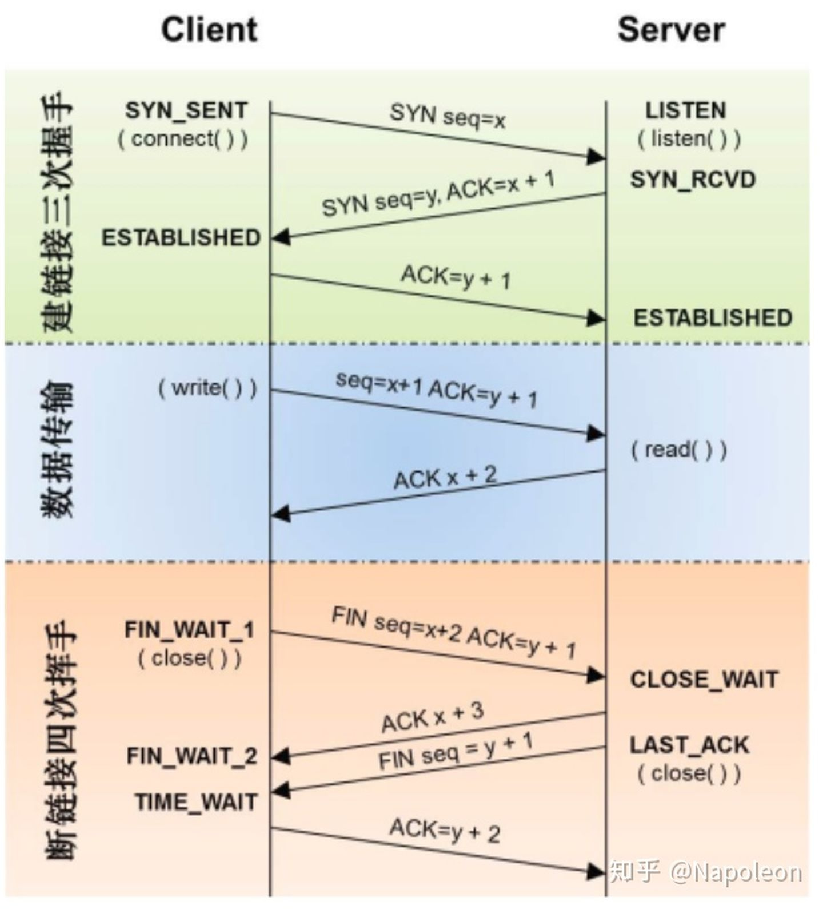
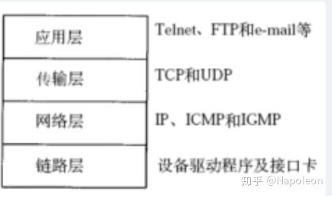
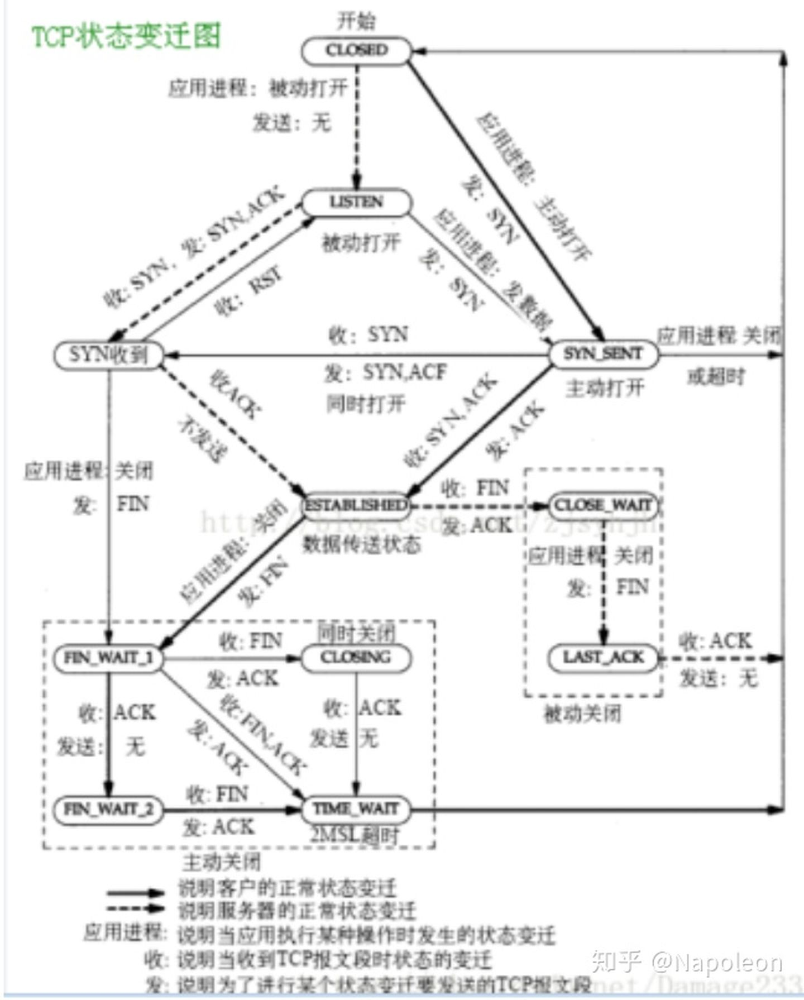
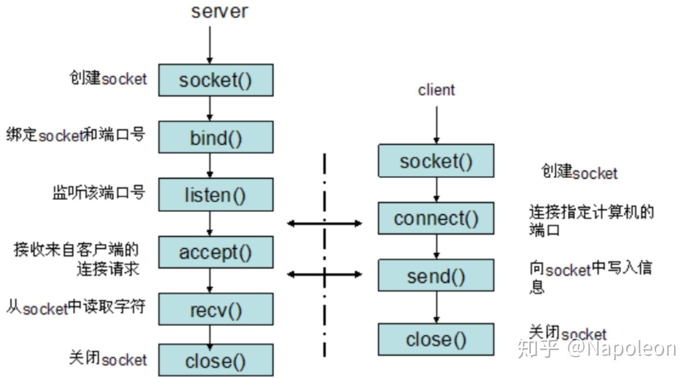

[TOC]

## TCP 的三次握手和四次挥手的过程及原因

- **TCP 的三次握手过程如下：**
  C-> SYN -> S
  S->SYN/ACK->C
  C->ACK->S
- **TCP 的四次挥手过程如下：**
  C->FIN->S
  S->ACK->C
  S->FIN->C
  C->ACK->S

​        **三次握手的原因：** **<u>三次握手可以防止已经失效的连接请求报文突然又传输到服务器端导致的服务器资源浪费</u>**。例如，客户端先发送了一个 SYN，但是由于网络阻塞，该 SYN 数据包在某个节点长期滞留。然后客户端又重传 SYN 数据包并正确建立 TCP 连接，然后传输完数据后关闭该连接。该连接释放后失效的 SYN 数据包才到达服务器端。在二次握手的前提下，服务器端会认为这是客户端发起的又一次请求，然后发送 SYN ，并且在服务器端创建 socket 套接字，一直等待客户端发送数据。但是由于客户端并没有发起新的请求，所以会丢弃服务端的 SYN 。此时服务器会一直等待客户端发送数据从而造成资源浪费。
​        **四次挥手的原因：** **<u>由于连接的关闭控制权在应用层，所以被动关闭的一方在接收到 FIN 包时，TCP 协议栈会直接发送一个 ACK 确认包，优先关闭一端的通信。然后通知应用层，由应用层决定什么时候发送 FIN 包。应用层可以使用系统调用函数 read==0 来判断对端是否关闭连接。</u>**

`位码即 tcp 标志位, 有 6 种标示:`
`SYN( synchronous 建立联机 ) ACK(acknowledgement 确认) PSH(push传送)` 
`FIN(finish结束) RST(reset重置) URG(urgent紧急)`

`Sequence number(顺序号码) Acknowledge number(确认号码)`

## TCP 怎么保证可靠性

**（1）序列号、确认应答、超时重传:**数据到达接收方，接收方需要发出一个确认应答，表示已经收到该数据段，并且确认序号会说明了它下一次需要接收的数据序列号。如果发送发迟迟未收到确认应答，那么可能是发送的数据丢失，也可能是确认应答丢失，这时发送方在等待一定时间后会进行重传。这个时间一般是2 * RTT(报文段往返时间）+ 一个偏差值。*

**（2）窗口控制与高速重发控制/快速重传（重复确认应答）:**TCP 会利用窗口控制来提高传输速度，意思是在一个窗口大小内，不用一定要等到应答才能发送下一段数据，<u>窗口大小就是无需等待确认而可以继续发送数据的最大值</u>。如果不使用窗口控制，每一个没收到确认应答的数据都要重发。使用窗口控制，如果数据段1001-2000丢失，后面数据每次传输，确认应答都会不停地发送序号为1001的应答，表示我要接收1001开始的数据，发送端如果收到 3 次相同应答，就会立刻进行重发；但还有种情况有可能是数据都收到了，但是有的应答丢失了，这种情况不会进行重发，因为发送端知道，如果是数据段丢失，接收端不会放过它的，会疯狂向它提醒……

**（3）拥塞控制:**如果把窗口定的很大，发送端连续发送大量的数据，可能会造成网络的拥堵（大家都在用网，你在这狂发，吞吐量就那么大，当然会堵），甚至造成网络的瘫痪。所以 TCP 在为了防止这种情况而进行了拥塞控制。
			**慢启动**：定义拥塞窗口，一开始将该窗口大小设为1，之后每次收到确认应答（经过一个rtt），将拥塞窗口大小2。
			**拥塞避免**：设置慢启动阈值，一般开始都设为65536。拥塞避免是指当拥塞窗口大小达到这个阈值，拥塞窗口的值不再指数上升，而是加法增加（每次确认应答/每个rtt，拥塞窗口大小+1），以此来避免拥塞。将报文段的超时重传看做拥塞，则一旦发生超时重传，我们需要先将阈值设为当前窗口大小的一半，并且将窗口大小设为初值1，然后重新进入慢启动过程。
			**快速重传**：在遇到3次重复确认应答（高速重发控制）时，代表收到了3个报文段，但是这之前的1个段丢失了，便对它进行立即重传。然后，先将阈值设为当前窗口大小的一半，然后将拥塞窗口大小设为慢启动阈值+3的大小。这样可以达到：**在TCP通信时，网络吞吐量呈现逐渐的上升，并且随着拥堵来降低吞吐量，再进入慢慢上升的过程，网络不会轻易的发生瘫痪。**

## 简述一下 TCP 建立连接和断开连接的过程

- **三次握手：**

1. Client 将标志位 SYN 置为 1，随机产生一个值 seq=J，并将该数据包发送给Server，Client进入SYN_SENT状态，等待Server确认。
2. Server收到数据包后由标志位SYN=1知道Client请求建立连接，Server将标志位SYN和ACK都置为1，ack=J+1，随机产生一个值seq=K，并将该数据包发送给Client以确认连接请求，Server进入SYN_RCVD状态。
3. Client收到确认后，检查ack是否为J+1，ACK是否为1，如果正确则将标志位ACK置为1，ack=K+1，并将该数据包发送给Server，Server检查ack是否为K+1，ACK是否为1，如果正确则连接建立成功，Client和Server进入ESTABLISHED状态，完成三次握手，随后Client与Server之间可以开始传输数据了。

- **四次挥手：**
  由于TCP连接时全双工的，因此，每个方向都必须要单独进行关闭，这一原则是当一方完成数据发送任务后，发送一个FIN来终止这一方向的连接，收到一个FIN只是意味着这一方向上没有数据流动了，即不会再收到数据了，但是在这个TCP连接上仍然能够发送数据，直到这一方向也发送了FIN。首先进行关闭的一方将执行主动关闭，而另一方则执行被动关闭。
  1.数据传输结束后，客户端的应用进程发出连接释放报文段，并停止发送数据，客户端进入FIN_WAIT_1状态，此时客户端依然可以接收服务器发送来的数据。
  2.服务器接收到FIN后，发送一个ACK给客户端，确认序号为收到的序号+1，服务器进入CLOSE_WAIT状态。客户端收到后进入FIN_WAIT_2状态。
  3.当服务器没有数据要发送时，服务器发送一个FIN报文，此时服务器进入LAST_ACK状态，等待客户端的确认
  4.客户端收到服务器的FIN报文后，给服务器发送一个ACK报文，确认序列号为收到的序号+1。此时客户端进入TIME_WAIT状态，等待2MSL（MSL：报文段最大生存时间），然后关闭连接。

## TIME-WAIT 为什么是 2MSL

​		当客户端发出最后的 ACK 确认报文时，并不能确定服务器端能够收到该段报文。所以客户端在发送完 ACK 确认报文之后，会设置一个时长为 2 MSL 的计时器。MSL（Maximum Segment Lifetime），指一段 TCP 报文在传输过程中的最大生命周期。2 MSL 即是服务器端发出 FIN 报文和客户端发出的 ACK 确认报文所能保持有效的最大时长。

​		若服务器在 1 MSL 内没有收到客户端发出的 ACK 确认报文，再次向客户端发出 FIN 报文。如果客户端在 2 MSL 内收到了服务器再次发来的 FIN 报文，说明服务器由于一些原因并没有收到客户端发出的 ACK 确认报文。客户端将再次向服务器发出 ACK 确认报文，并重新开始 2 MSL 的计时。

​		若客户端在 2MSL 内没有再次收到服务器发送的 FIN 报文，则说明服务器正常接收到客户端 ACK 确认报文，客户端可以进入 CLOSE 阶段，即完成四次挥手。

​		所以客户端要经历 2 MSL 时长的 TIME-WAIT 阶段，为的是确认服务器能否接收到客户端发出的 ACK 确认报文。

## TCP 拥塞控制？以及达到什么情况的时候开始减慢增长的速度？

​		拥塞控制是防止过多的数据注入网络，使得网络中的路由器或者链路过载。流量控制是点对点的通信量控制，而拥塞控制是全局的网络流量整体性的控制。发送双方都有一个拥塞窗口——cwnd。
**1、慢开始：** 最开始发送方的拥塞窗口为1，由小到大逐渐增大发送窗口和拥塞窗口。每经过一个传输轮次，拥塞窗口cwnd加倍。当cwnd超过慢开始门限，则使用拥塞避免算法，避免cwnd增长过大。
**2、拥塞避免：** 每经过一个往返时间RTT，cwnd就增长1。另外在慢开始和拥塞避免的过程中，一旦发现网络拥塞，就把慢开始门限设为当前值的一半，并且重新设置cwnd为1，重新慢启动。（乘法减小，加法增大）
**3、快重传：** 接收方每次收到一个失序的报文段后就立即发出重复确认，发送方只要连续收到三个重复确认就立即重传（尽早重传未被确认的报文段）。
**4、快恢复：** 当发送方连续收到了三个重复确认，就乘法减半（慢开始门限减半），将当前的cwnd设置为慢开始门限，并且采用拥塞避免算法（连续收到了三个重复请求，说明当前网络可能没有拥塞）。
采用快恢复算法时，慢开始只在建立连接和网络超时才使用。

- 采用慢开始和拥塞避免算法的时候

1. 一旦cwnd>慢开始门限，就采用拥塞避免算法，减慢增长速度
2. 一旦出现丢包的情况，就重新进行慢开始，减慢增长速度

- 采用快恢复和快重传算法的时候

1. 一旦cwnd>慢开始门限，就采用拥塞避免算法，减慢增长速度
2. 一旦发送方连续收到了三个重复确认，就采用拥塞避免算法，减慢增长速度

## TCP的流量控制

**滑动窗口机制：**
		滑动窗口协议的基本原理就是在任意时刻，发送方都维持了一个连续的允许发送的帧的序号，称为发送窗口；同时，接收方也维持了一个连续的允许接收的帧的序号，称为接收窗口。发送窗口和接收窗口的序号的上下界不一定要一样，甚至大小也可以不同。不同的滑动窗口协议窗口大小一般不同。发送方窗口内的序列号代表了那些已经被发送，但是还没有被确认的帧，或者是那些可以被发送的帧。

## tcp 握手为什么两次不可以？为什么不用四次？

- **两次不可以：**
  tcp 是全双工通信，两次握手只能确定单向数据链路是可以通信的，并不能保证反向的通信正常。
- **不用四次：**
  本来握手应该和挥手一样都是需要确认两个方向都能联通的，本来模型应该是：
  1.客户端发送syn0给服务器
  2.服务器收到syn0，回复ack(syn0+1)
  3.服务器发送syn1
  4.客户端收到syn1，回复ack(syn1+1)
  因为**tcp是全双工**的，上边的四部确认了数据在两个方向上都是可以正确到达的，但是2，3步没有没有上下的联系，可以将其合并，加快握手效率，所有就变成了3步握手。

## 阻塞，非阻塞，同步，异步

- **阻塞和非阻塞**：调用者在事件没有发生的时候，一直在等待事件发生，不能去处理别的任务这是阻塞。调用者在事件没有发生的时候，可以去处理别的任务这是非阻塞。
- **同步和异步**：调用者必须循环自去查看事件有没有发生，这种情况是同步。调用者不用自己去查看事件有没有发生，而是等待着注册在事件上的回调函数通知自己，这种情况是异步

##  tcp拆包组装包是如何实现的

**拆包**
对于拆包目前常用的是以下两种方式：
1、动态缓冲区暂存方式。之所以说缓冲区是动态的是因为当需要缓冲的数据长度超出缓冲区的长度时会增大缓冲区长度。
**大概过程描述如下：**
A 为每一个连接动态分配一个缓冲区，同时把此缓冲区和 SOCKET 关联，常用的是通过结构体关联。
B 当接收到数据时首先把此段数据存放在缓冲区中。
C 判断缓存区中的数据长度是否够一个包头的长度，如不够，则不进行拆包操作。
D 根据包头数据解析出里面代表包体长度的变量。
E 判断缓存区中除包头外的数据长度是否够一个包体的长度，如不够，则不进行拆包操作。
F 取出整个数据包，这里的"取"的意思是不光从缓冲区中拷贝出数据包，而且要把此数据包从缓存区中删除掉。删除的办法就是把此包后面的数据移动到缓冲区的起始地址。
**这种方法有两个缺点：**
1）为每个连接动态分配一个缓冲区增大了内存的使用；
2）有三个地方需要拷贝数据，一个地方是把数据存放在缓冲区，一个地方是把完整的数据包从缓冲区取出来，一个地方是把数据包从缓冲区中删除。这种拆包的改进方法会解决和完善部分缺点。
2、利用底层的缓冲区来进行拆包
由于TCP也维护了一个缓冲区，所以我们完全可以利用TCP的缓冲区来缓存我们的数据，这样一来就不需要为每一个连接分配一个缓冲区了。另一方面我们知道 recv 或者 wsarecv 都有一个参数，用来表示我们要接收多长长度的数据。利用这两个条件我们就可以对第一种方法进行优化了。
对于阻塞 SOCKET 来说，我们可以利用一个循环来接收包头长度的数据，然后解析出代表包体长度的那个变量，再用一个循环来接收包体长度的数据。

## TCP的模型，状态转移

首先四层TCP/IP模型如下：

其状态转移图如下：

## HTTP 和 HTTPS 的区别

**HTTP 协议和 HTTPS 协议区别如下：**
1）HTTP 协议是以<u>明文</u>的方式在网络中传输数据，而HTTPS协议传输的数据则是经过<u>TLS加密</u>后的，HTTPS 具有更高的安全性
2）HTTPS 在 TCP 三次握手阶段之后，还需要进行 SSL 的 handshake，协商加密使用的对称加密密钥
3）HTTPS 协议需要服务端申请证书，浏览器端安装对应的根证书
4）HTTP 协议端口是 80 ，HTTPS 协议端口是 443 

## HTTPS 有什么缺点？

- **HTTPS优点：**
  ①、HTTPS传输数据过程中使用密钥进行加密，所以安全性更高
  ②、HTTPS协议可以认证用户和服务器，确保数据发送到正确的用户和服务器
- **HTTPS缺点：**

1. **HTTPS握手阶段延时较高**：由于在进行HTTP会话之前还需要进行SSL握手，因此HTTPS协议握手阶段延时增加
2. **HTTPS部署成本高**：一方面HTTPS协议需要使用证书来验证自身的安全性，所以需要购买CA证书；另一方面由于采用HTTPS协议需要进行加解密的计算，占用CPU资源较多，需要的服务器配置或数目高

## 说一下GET和POST的区别

**		对于GET方式的请求**，浏览器会把 http header 和 data 一并发送出去，服务器响应200（返回数据）；**而对于POST**，浏览器先发送 header，服务器响应100 continue，浏览器再发送 data，服务器响应 200 ok（返回数据）。

## IP地址作用，以及MAC地址作用

MAC地址是一个硬件地址，用来定义网络设备的位置，主要由数据链路层负责。而IP 地址是 IP 协议提供的一种统一的地址格式，为互联网上的每一个网络和每一台主机分配一个逻辑地址，以此来屏蔽物理地址的差异。

## OSI 七层模型和 TCP/IP 四层模型，每层列举 2 个协议

- **OSI七层模型及其包含的协议如下:**
  1、**物理层:** 通过媒介传输比特,确定机械及电气规范,传输单位为bit，主要包括的协议为：IEE802.3 CLOCK RJ45
  2、**数据链路层:** 将比特组装成帧和点到点的传递,传输单位为帧,主要包括的协议为MAC VLAN PPP
  3、**网络层：** 负责数据包从源到宿的传递和网际互连，传输单位为包,主要包括的协议为IP ARP ICMP
  4、**传输层：** 提供端到端的可靠报文传递和错误恢复，传输单位为报文,主要包括的协议为TCP UDP
  5、**会话层：** 建立、管理和终止会话，传输单位为SPDU，主要包括的协议为RPC NFS
  6、**表示层:** 对数据进行翻译、加密和压缩,传输单位为PPDU，主要包括的协议为JPEG ASII
  7、 **应用层:** 允许访问OSI环境的手段,传输单位为APDU，主要包括的协议为FTP HTTP DNS
- **TCP/IP 4层模型包括：**
  **网络接口层：** MAC VLAN
  **网络层:** IP ARP ICMP
  **传输层:** TCP UDP
  **应用层:** HTTP DNS SMTP

## 两个机器之间的通讯过程？

PC1 首先判断目标ip是否和自己在同一网段，是就进行ARP广播，解析出MAC地址。不是，则将网关的MAC地址作为MAC地址。

PC1封装的数据包括目标、源的端口号、IP、MAC地址。

交换机收到数据后，对比MAC地址表，知道从哪个口发出数据。

路由收到数据后根据路由表将数据发往下一个目标地。

最后一个路由通过ARP解析出PC2的MAC地址。

路由封装的数据包括目标、源的端口号、IP、MAC地址。

## 以及计算机网络为什么有七层？

建立七层模型的主要目的是为解决异种网络互连时所遇到的兼容性问题。它的最大优点是将服务、接口和协议这三个概念明确地区分开来：服务说明某一层为上一层提供一些什么功能，接口说明上一层如何使用下层的服务，而协议涉及如何实现本层的服务；这样各层之间具有很强的独立性，互连网络中各实体采用什么样的协议是没有限制的，只要向上提供相同的服务并且不改变相邻层的接口就可以了。网络七层的划分也是为了使网络的不同功能模块（不同层次）分担起不同的职责，从而带来如下好处：

● 减轻问题的复杂程度，一旦网络发生故障，可迅速定位故障所处层次，便于查找和纠错；

● 在各层分别定义标准接口，使具备相同对等层的不同网络设备能实现互操作，各层之间则相对独立，一种高层协议可放在多种低层协议上运行；

● 能有效刺激网络技术革新，因为每次更新都可以在小范围内进行，不需对整个网络动大手术；

## 搜索 baidu ，会用到计算机网络中的什么层？每层是干什么的

- **浏览器中输入URL：** 浏览器要将 URL 解析为 IP 地址，解析域名就要用到DNS 协议，首先主机会查询 DNS 的缓存，如果没有就给本地 DNS 发送查询请求。DNS查 询分为两种方式，**一种是递归查询，一种是迭代查询**。如果是**迭代查询**，本地的 **DNS 服务器**，向根域名服务器发送查询请求，根域名服务器告知该域名的一级域名服务器，然后本地服务器给该一级域名服务器发送查询请求，然后依次类推直到查询到该域名的IP地址。**DNS服务器是基于 UDP 的**，因此会用到 **UDP协议**。
  		得到 IP 地址后，**浏览器就要与服务器建立一个 http 连接**。因此要用到**http 协议**，http 协议报文格式上面已经提到。http 生成一个 get 请求报文，将该报文传给 TCP 层处理，所以还会用到**TCP 协议**。如果采用https 还会使用 https 协议先对 http 数据进行加密。TCP 层如果有需要先将 HTTP 数据包分片，分片依据路径 MTU 和 MSS。TCP 的数据包然后会发送给 IP 层，用到**IP 协议**。IP 层通过路由选路，一跳一跳发送到目的地址。当然在一个网段内的寻址是通过以太网协议实现(也可以是其他物理层协议，比如 PPP，SLIP)，以太网协议需要直到目的 IP 地址的物理地址，又需要**ARP 协议**。
- **其中：**
  1、DNS 协议，http 协议，https 协议属于应用层
  2、TCP/UDP属于传输层
  3、IP协议，ARP协议属于网络层
  4、数据链路层
  5、物理层
- **作用**
  **应用层是体系结构中的最高层。** 应用层确定进程之间通信的性质以满足用户的需要。这里的进程就是指正在运行的程序。应用层不仅要提供应用进程所需要的信息交换和远地操作，而且还要作为互相作用的应用进程的用户代理，来完成一些为进行语义上有意义的信息交换所必须的功能。应用层直接为用户的应用进程提供服务。
  **传输层的任务就是负责主机中两个进程之间的通信。** 因特网的传输层可使用两种不同协议：即面向连接的传输控制协议TCP，和无连接的用户数据报协议UDP。面向连接的服务能够提供可靠的交付，但无连接服务则不保证提供可靠的交付，它只是“尽最大努力交付”。这两种服务方式都很有用，备有其优缺点。在分组交换网内的各个交换结点机都没有传输层。
  **网络层负责为分组交换网上的不同主机提供通信。** 在发送数据时，网络层将运输层产生的报文段或用户数据报封装成分组或包进行传送。在TCP/IP体系中，分组也叫作IP数据报，或简称为数据报。网络层的另一个任务就是要选择合适的路由，使源主机运输层所传下来的分组能够交付到目的主机。
  当发送数据时，**数据链路层的任务是将在网络层交下来的IP数据报组装成帧，在两个相邻结点间的链路上传送以帧为单位的数据**。每一帧包括数据和必要的控制信息（如同步信息、地址信息、差错控制、以及流量控制信息等）。控制信息使接收端能够知道—个帧从哪个比特开始和到哪个比特结束。控制信息还使接收端能够检测到所收到的帧中有无差错。
  **物理层的任务就是透明地传送比特流。** 在物理层上所传数据的单位是比特。传递信息所利用的一些物理媒体，如双绞线、同轴电缆、光缆等，并不在物理层之内而是在物理层的下面。因此也有人把物理媒体当做第0层。

## TCP/IP数据链路层的交互过程

​		网络层等到数据链层用 mac 地址作为通信目标，数据包到达网络等准备往数据链层发送的时候，首先会去自己的 arp 缓存表(存着 ip-mac 对应关系)去查找改目标 ip 的 mac 地址，如果查到了，就讲目标 ip 的 mac 地址封装到链路层数据包的包头。如果缓存中没有找到，会发起一个广播：who is ip XXX tell ip XXX,所有收到的广播的机器看这个ip是不是自己的，如果是自己的，则以单拨的形式将自己的mac地址回复给请求的机器

## 传递到 IP 层怎么知道报文该给哪个应用程序，它怎么区分UDP 报文还是 TCP 报文

**根据端口区分：**看 ip 头中的协议标识字段，17 是 udp，6 是 tcp

## socket 的开发具体网络层的操作该怎么做？

**服务端：**socket-bind-listen-accept
**客户端：**socket-connect

## 说一下 socket 编程中服务器端和客户端主要用到哪些函数

**基于 TCP 的 socket：**
**1、服务器端程序：**
	a、创建一个 socket，用函数 socket()
	b、绑定 IP 地址、端口等信息到 socket 上，用函数 bind()
	c、设置允许的最大连接数，用函数 listen()
	d、接收客户端上来的连接，用函数 accept()
	f、收发数据，用函数 send() 和 recv()，或者 read() 和 write()
	g、关闭网络连接
**2、客户端程序：**
	(1)、创建一个 socket，用函数 socket()
	(2)、设置要连接的对方的 IP 地址和端口等属性
	(3)、连接服务器，用函数 connect()
	(4)、收发数据，用函数 send() 和 recv()，或 read() 和 write()
	(5)、关闭网络连接

## 说一下数字证书是什么，里面都包含那些内容

- **概念：**
  数字证书是数字证书在一个身份和该身份的持有者所拥有的公/私钥对之间建立了一种联系，由认证中心（CA）或者认证中心的下级认证中心颁发的。根证书是认证中心与用户建立信任关系的基础。在用户使用数字证书之前必须首先下载和安装。认证中心是一家能向用户签发数字证书以确认用户身份的管理机构。为了防止数字凭证的伪造，认证中心的公共密钥必须是可靠的，认证中心必须公布其公共密钥或由更高级别的认证中心提供一个电子凭证来证明其公共密钥的有效性，后一种方法导致了多级别认证中心的出现。
- **数字证书颁发过程：**
  数字证书颁发过程如下：用户产生了自己的密钥对，并将公共密钥及部分个人身份信息传送给一家认证中心。认证中心在核实身份后，将执行一些必要的步骤，以确信请求确实由用户发送而来，然后，认证中心将发给用户一个数字证书，该证书内附了用户和他的密钥等信息，同时还附有对认证中心公共密钥加以确认的数字证书。当用户想证明其公开密钥的合法性时，就可以提供这一数字证书。
- **内容：**
  数字证书的格式普遍采用的是X.509V3国际标准，一个标准的X.509数字证书包含以下一些内容：
  1、证书的版本信息；
  2、证书的序列号，每个证书都有一个唯一的证书序列号；
  3、证书所使用的签名算法；
  4、证书的发行机构名称，命名规则一般采用X.500格式；
  5、证书的有效期，通用的证书一般采用UTC时间格式；
  6、证书所有人的名称，命名规则一般采用X.500格式；
  7、证书所有人的公开密钥；
  8、证书发行者对证书的签名。

## ❤其他重要问题

Udp穿墙问题、cdn、dns

